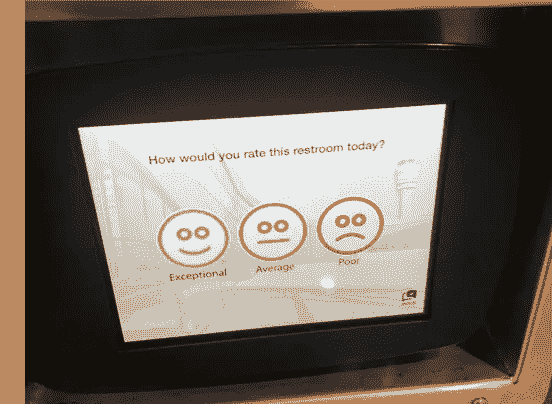
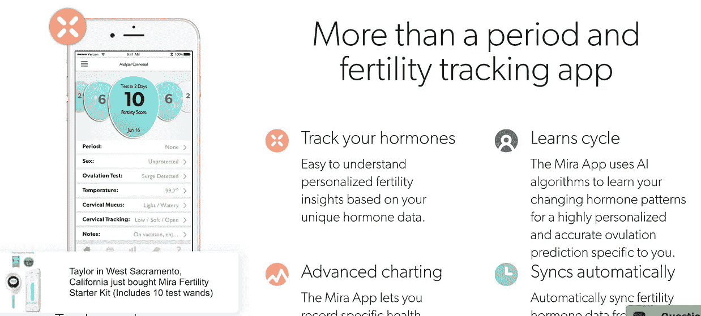
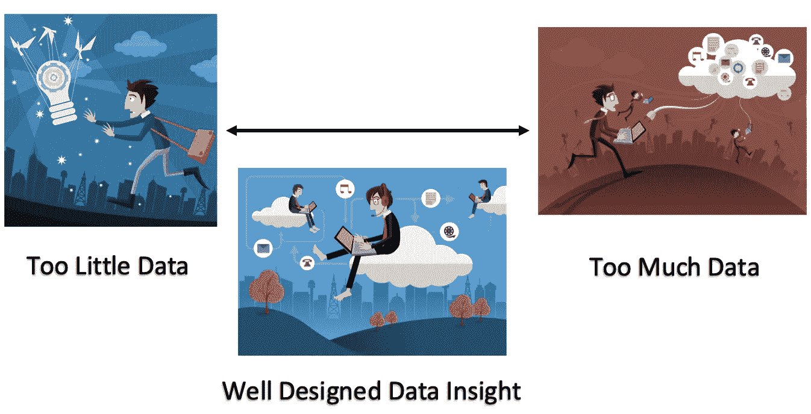
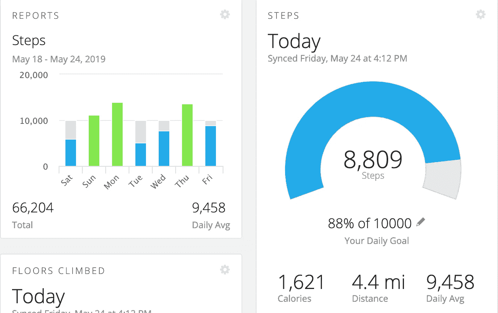
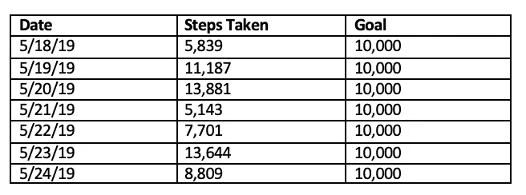
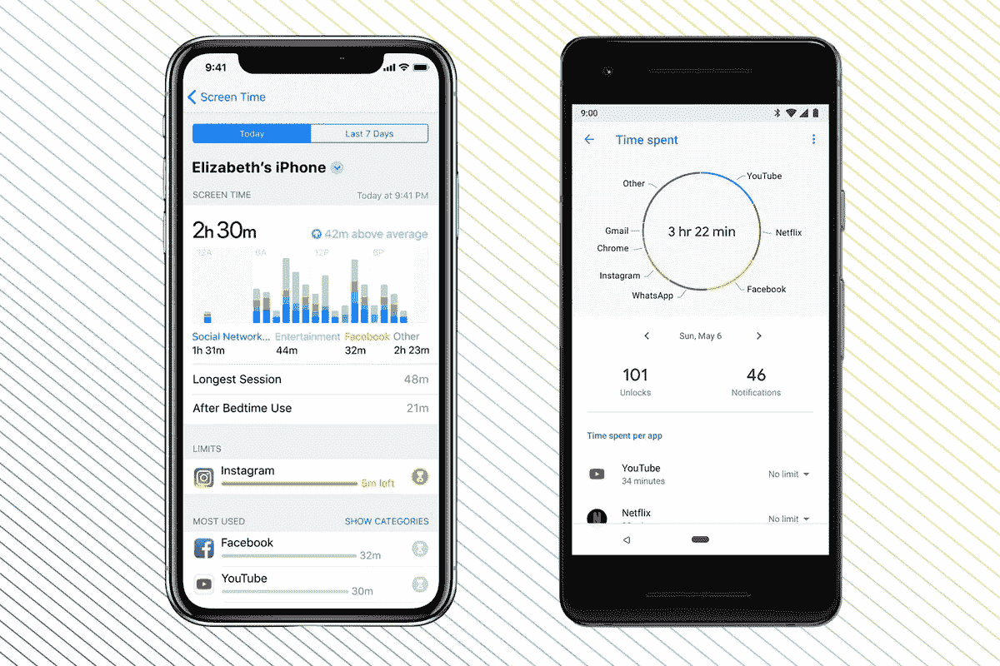

# 如果你要拿走我们的数据，用它做些有用的事情。

> 原文：<https://medium.datadriveninvestor.com/if-youre-going-to-take-our-data-do-something-useful-with-it-cbb1de0e8407?source=collection_archive---------0----------------------->

Photo by [Alice Achterhof](https://unsplash.com/photos/FwF_fKj5tBo?utm_source=unsplash&utm_medium=referral&utm_content=creditCopyText) on [Unsplash](https://unsplash.com/collections/314517/art?utm_source=unsplash&utm_medium=referral&utm_content=creditCopyText)

在过去的十年里，作为一个社会，我们已经进入了信息技术时代。慢慢地，悄无声息地，数据捕捉实体已经进入了我们生活的所有环境。从浴室到卧室，信息收集对我们提供最佳体验的能力至关重要。

Restroom Rating Interface @ MIA Airport // Mira App

如果你参加任何技术会议或阅读一篇关于“insert-industry-here”未来的文章，就会有很多关于“大数据”以及所有这些信息生成将如何应用于现实世界的辩论。

 [## 为什么数据将改变投资管理——数据驱动的投资者

### 有人称之为“新石油”虽然它与黑金没有什么相似之处，但它的不断商品化…

www.datadriveninvestor.com](https://www.datadriveninvestor.com/2019/01/25/why-data-will-transform-investment-management/) 

当我最近走过一个机场时，我也有过类似的口头辩论，当时我想知道洗手间的反馈数据是否会实时传达给洗手间的服务员。当我看到一个接一个的人从洗手间出来时(大多数人完全忽略了反馈界面，但也有少数人偶尔会点击😕)就反应而言，我无法实时检测到任何事情的发生。我看了一下洗手间服务员推车和工作人员，虽然他们都有手机(谁知道里面可能有什么应用程序/程序)，但推车本身没有内置任何技术，也没有携带任何外部技术，如 iPad 或对讲机。

这个“机场洗手间的秘密生活”咆哮的要点是证明，虽然数据是从我们的个人设备到我们所处的公共环境的数百个不同接触点收集的，但这些数据在大多数时间都没有以最佳方式(甚至是有益的方式)使用。

## 信息过载问题

洗手间反馈/服务员的情况是缺乏数据的一个例子，这些数据用于在需要的地方提供见解。同样，当涉及到提供太多数据时，也存在一个问题。

有趣的是，数据太多和数据太少的距离并不是很远。虽然它们在光谱的两端，但它们相对来说靠得很近。分隔这一鸿沟的是数据表示设计和洞察力。

## 数据表示:设计

在提交任何数据之前，必须先收集数据，这本身就是一个问题。这个话题得到了大量的关注，因此，就本文的目的而言，我将假设收集工作已经完成，得到了各方的同意，并且是准确的。

**数据演示应该回答问题。如果没有，就不要显示。**

My Garmin Connect Fitness Data (May 2019)

让我们以我的健身追踪器的数据为例。通过查看这些数据，我们可以回答哪些问题？

*   我今天走了多远？ **4.4 英里**
*   我通常走多远？**大约 5 英里**
*   我是如何实现我的步行目标的？可以做得更好。

回答这些问题时，我不需要猜测、计算或思考超过 1-2 秒钟。显示我一周内每天总步数的条形图是一个完美的数据交付工具，因为它使用视觉提示(更高级别的条形图=采取更多的步骤)和颜色提示(亮绿色=完成的目标)来获取我关心的数据和我需要的快速洞察力。

如果数据是以如上所述的表格形式呈现的，那就不那么直观了，而且我还必须做更多的提问来弄清楚我是否达到了目标，或者我在哪些方面取得了进步。

## 数据有用性:洞察力

大数据被认为是我们信息时代的一个革命性转折点，在这个时代，所有数据源汇集在一起，可以创建一个关于一个人的“360 度视图”，从他们醒来时做什么，到他们的健身习惯，到他们的工作效率，到他们的购物习惯和娱乐偏好。如果是这样，大数据能告诉我周四为什么走了这么多步吗？

实际上，它应该可以。

为什么？

因为我留下了书面记录。

为什么我周四走了这么多步？我知道答案是因为我不得不步行去一家很难开车去的商店买化妆品(那里没有停车场)，因此周四我的步数比我的平均步数增加了大约 1000 步。这是一种应该通过大数据获得的洞察力，但却没有。

就我个人而言，我不知道谁在使用大数据(我感觉实际使用大数据的公司比声称使用大数据的公司少得多)，但我不太在乎——我只是想知道是否有任何公司或公司集团能够聚合所有这些数据，从可穿戴设备到购物收据，到在线搜索活动，到线下的亲身体验，以一种有用和有效的方式给每个人提供关于自己的独特见解。

这似乎离我们今天所处的位置还有很长的路要走。我的最佳猜测是，如果消费者希望他们的问题得到回答，他们将不得不接受数据的统治，并制定自己的路线。当然，这首先需要努力和好奇心来提出问题。

我认为数据收集者，如可穿戴健身设备和社交媒体巨头，可以真正帮助消费者的地方是通过以一种让用户容易开始为自己提出正确问题的方式呈现数据。

Apple Screen Time Screenshot

无论是苹果的屏幕时间数据输出还是其他类似的生产力评估，数据收集者都可以通过使用智能设计工具(适当且可识别的图表/图形/图标/和颜色)简单地呈现数据，并通过提供像苹果在上面的截图中所做的“高于平均水平 42 米”那样的洞察力，来极大地增强用户的能力

## 最后:背景和行动

数据之谜的最后一个边界，至少目前是上下文。我的意思是，回答这个问题: ***什么时候发生了什么？***

因此，在我使用健身手表上的计步器的例子中，Garmin 数据仪表板做了一件漂亮的工作，告诉我周四我比正常情况多走了很多步，但当我比平均水平多走了这么多步时，发生了什么呢？当时的情况是，我不得不步行去一家我不常去的商店。我做了一些不寻常的事。

了解了这一点，也了解了我自己(我希望看到我的步数增加)，我打算计划一次额外的徒步旅行，去一个我通常不会每周都去的地方。也许当我到达那里时，我会去购物，也许我会去海滩，但关键是我会根据我从数据中学到的东西和从数据背后的上下文中理解的东西来改变我的行为。

为了构建我们不断听到的“大数据”未来，需要考虑数据捕获、呈现、设计、洞察力、背景和行动的正确组合。我承认，消费者有部分责任主动提出正确的问题，但其余的责任在于大型科技公司以正确的方式展示见解。

