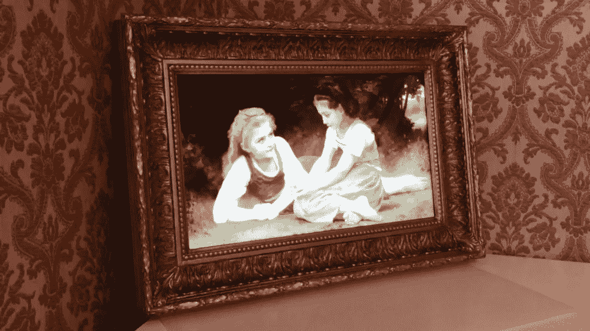

# iFrame，艺术走进生活

> 原文：<https://medium.datadriveninvestor.com/iframe-art-comes-to-life-30f0eb6aedef?source=collection_archive---------28----------------------->

你和一幅画交谈过吗？

这很容易看起来是一个疯狂或愚蠢的问题，但你知道吗？现在，多亏了 iFrame，这才成为可能。

iFrame 是由语音控制激活的智能绘画，结合了艺术、意大利画框师的技能和技术。有了 iFrame，您现在可以与眼前栩栩如生的艺术作品进行互动。iFrame 将在几秒钟内为您展示众多艺术杰作。

如今，iFrame 是由以下公司制造的独特产品:

*   可以个性化定制的精美相框
*   数字画布:高分辨率显示器
*   可以单独购买或通过订阅购买的虚拟艺术画廊。

iFrame 是由 Kinoa 和一个在我们公司接受了一年培训的年轻学生团队共同开发的。

去年 10 月，iFrame 与鸡尾酒分配器 Calinda 一起在罗马的欧洲版 Maker Faire 展会上亮相。数十名参观者站在画布前，简单地问了一些问题，比如:

“嗨，iFrame，给我看看列奥纳多·达·芬奇最后的晚餐”

iFrame:“当然，这是最后的晚餐，非常棒”

在视频中检查 iFrame 是如何工作的