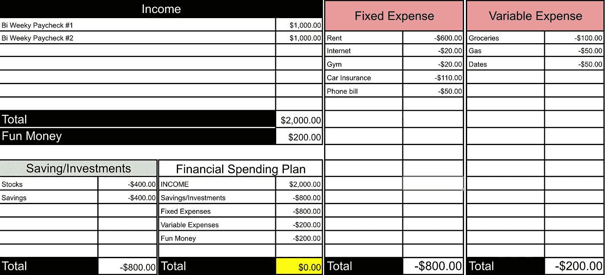
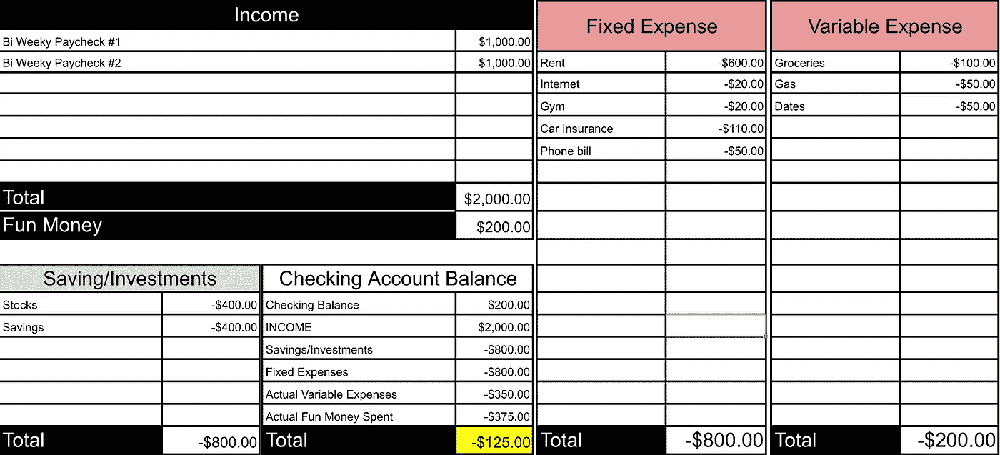
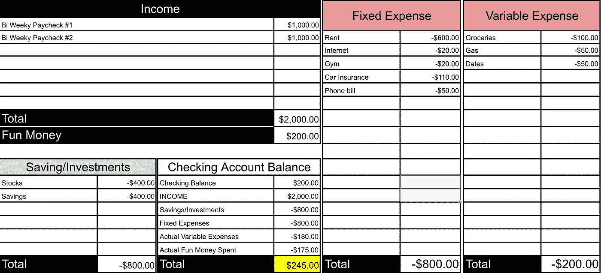

# 我总是身无分文——但这是游戏的一部分

> 原文：<https://medium.datadriveninvestor.com/im-always-broke-but-it-s-part-of-the-game-83cbea9d46f6?source=collection_archive---------51----------------------->

> 我没有足够的钱来偿还我的信用卡。

我经常研究我的财务状况。可能比我应该的还要多。然而，有时我还是会失去控制，买一些我不需要的东西。我不期望自己是完美的，你也不应该。

## 我和你一样。

我也不太擅长遵循严格的预算或记录每一笔支出。我试过各种预算，它们从来不会持续太久。对我来说，越简单越好。

## 五五法则

*   *固定&可变费用* : 50%
*   *投资* : 20%
*   *储蓄/贷款* : 20%
*   *零花钱* : 10%

**Example: 50/20/20/10 Rule in action.**

**固定费用:**这些通常是每月花费相同的经常性费用。这包括:房租、健身房会员、电话费等。

**可变费用:**这些通常是你每个月预算的费用，因为它每个月都不一样。这包括:汽油，食物，甚至和你重要的另一半的约会(如果你不做预算，这可能会失去控制！).

**投资:**把钱存起来开始投资。一个好的开始方式是开一个经纪账户，在那里你可以投资股票或共同基金。

**储蓄/贷款:**将这笔钱用于贷款或存入储蓄账户。你甚至可以选择在两者之间分配，或者全部集中到一个地方。

**好玩的钱:**尽情享受，花在自己想要的东西上！为退休做准备很酷，但是不要忘记在年轻的时候享受生活。

这也是一个为你“想要”但“不需要”的东西存钱的机会。

**Example: Actual Expenses exceeds projected expenses 😨**

**Example: Actual Expenses below projected expenses. 😃**

## 自动化流程。

你的固定支出通常是一成不变的。让你的生活尽可能简单，并自动支付这些款项。这包括:

*   电话账单/互联网/保险/健身房的自动支付。有比担心你的电话账单是否已付更重要的事情要担心。
*   当你拿到工资时，自动转账到你的储蓄/投资账户。这将阻止你说“我这个月没有足够的钱来投资”，因为这不是一个选项。

> 为你的信用卡设置最后一天的自动付款。

也就是说，如果你的信用卡账单是在每月的 1 号发布的，而支付是在 30 号，那么就把自动支付设置在 29 号或者 30 号。

所有这些都很重要，让我告诉你为什么。

您需要手动支付每份对账单。这是一个月中唯一一次你需要坐下来 10 分钟，看一遍报表，然后用鼠标点击支付按钮。这是当你弄清楚你在每月预算和财务计划中的位置。

自动支付是你的备份，以防你忘记手动支付。你最不想做的事就是错过信用卡付款！

## 回到无法还清信用卡的问题。

当你的支出超过收入时，就会出现这种情况。因为现在所有的东西都用信用卡支付，所以这样做并不难。当这种情况发生时，我知道我这个月的花费很糟糕，这是我需要在下个月纠正或调整的事情。

在我的场景中，我可能会把一些钱从我的储蓄账户转移到支票账户上来偿还信用卡。但我没有。除非是一次性的昂贵开支(例如:电脑、电视、沙发)。

这是因为这是游戏的一部分。

你总是感觉破产的游戏。直到你厌倦了破产并为此做些什么。这意味着把连续几个月过得好的月份放在一起，这样你可以少花钱，多存钱。当你的支票账户从 200 美元变成 5000 美元时。

当我遇到这种情况时，我知道我赢了，我不喜欢玩简单模式，所以我把大部分钱转移到其他地方(股票/储蓄)并重新开始。

你可能会输掉一些战斗，但这没关系。只要知道你正在为赢得这场战争做准备。

记住——个人理财是**个人**。所以找到适合你的东西，享受旅程吧！