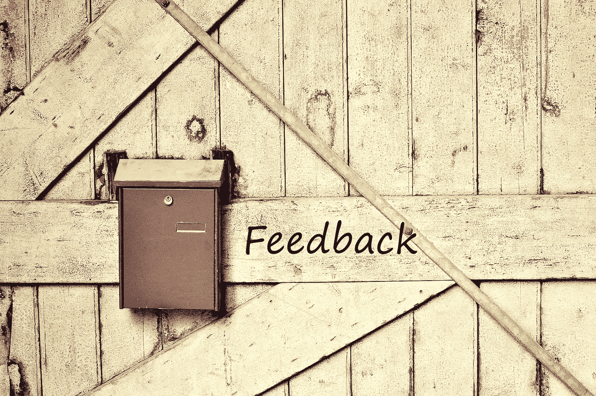

# 我不擅长我的工作，所以我被告知

> 原文：<https://medium.datadriveninvestor.com/im-bad-at-my-job-so-i-ve-been-told-c63febcf9dd?source=collection_archive---------5----------------------->

Giving Effective Feedback

在业余时间，我真的很喜欢为我当地的教堂混合现场音频。混音是一门相当技术性的艺术，需要高超的听力技巧和极大的耐心。在没有任何引导的情况下，让你的手接触现场制作有点像试图让一束水通过一个小洞。这份工作最困难的方面之一是管理你发现自己所处的不断变化的情况。有时麦克风会在舞台上失灵。有时候一个歌手会吮吸一些糟糕的东西，你不得不扔掉它。有时候你觉得一切都很棒，而其他人都讨厌它。最重要的是，这项工作最困难的部分是沟通，但不要过度概括。

# 沟通的危机

总的来说，沟通在整个人类生活中一直是困难的。甚至在时间之初，当上帝创造亚当和夏娃的时候，当第三方被引入时，水就被搅浑了。清晰有效的沟通是低于平均水平的领导者和高效领导者之间的关键区别。在这个故事中——很明显，我和我的老板之间缺乏清晰的沟通导致了很多紧张，并使问题对每个人都变得更糟。虽然我得到了恩典，但犯错的余地很小。我们提升得越高，权力阶梯就定义了我们在沟通方面必须有多好。在我看来，让有效沟通变得极其困难的一个原因是，我们每个人的观点都是如此不同。我们来到会议桌前，误以为与会的每一方都和我们一样理解这个话题。甚至在这篇文章中，你可能会准备给我写恐吓信，认为这一切都是毫无价值的。虽然组织沟通很难做到正确，但更多的时候，领导者需要进行一种非常不同的沟通。

 [## 想知道领导是谁？请他决定。数据驱动的投资者

### 一个有效的领导者能为组织提供的最有价值的东西之一是决策能力…

www.datadriveninvestor.com](https://www.datadriveninvestor.com/2019/01/25/want-to-know-who-the-leader-is-ask-him-to-decide/) 

几年前，当我在做一份引人注目的高薪工作时，我的老板找到我，给了我一些反馈。首先——描述一件事情听起来是相当具有挑战性的。试着描述一下相对于产生的频率，你自己的声音听起来是什么样的。挺难的。为了解决这个问题，音频工程师想出了一种图表，对我们听到的常见声音进行文字描述。我的老板是一个伟大的领导者，他试图用我自己的语言和我交流。他将他听到的声音描述为“honkey ”,这有点像用手捂住嘴，试图说话并听声音。几个星期以来，我没有注意到他的反馈，这让他越来越沮丧。他没有意识到的是——每次他说什么，我都在做调整，但情况并没有好转。最后，我只是让他描述一下他所听到的。他告诉我，这是伤害他的耳朵，它听起来非常“响亮”。就在这时，一个突破。我意识到，由于不理解他的反馈，我实际上使问题变得更糟。我做的和他要求的完全相反。幸运的是，我离开了我的工作。

# 反馈至关重要

作为一名领导者，提供反馈是你能做的最重要的事情之一。它为你提供了一个让你的团队负起责任、指导不良行为和改进工作成果的机会。提供有效的反馈可以建立健康的团队并改善您的组织。想想看，如果每个人都在四处寻找让事情变得更好的方法，那么它将自下而上地改善，而不是自上而下地改善。令我困扰的是，大多数领导不知道如何给出有效的反馈。这里有一个例子:

假设你正在为你的老板写一份报告。三天后，你骄傲地走进他们的办公室，你的老板强迫你修改整个报告。不是因为这是错的，而是因为这不是他们的方式。具体来说，想象你的老板告诉你，他们希望看到“这样”的报告，但没有提供具体的指导，说明为什么应该这样，或者改变报告的目的，而不是让它成为“他们的方式”。这种情况经常发生。想象一下重做报告会浪费多少公司资源。大多数领导没有意识到的是，这种行为也会挫伤员工的士气，最终会导致他们在得出最终结果之前问成千上万的问题。更糟糕的是，它建立了一种权威文化，导致员工永远不能自己做出自由决定。

> 不要试图让某样东西成为你的，而是让它变得更好。

最重要的心态转变之一是在提供反馈时改变方法。不要试图让某样东西成为你的，而是让它变得更好。这是什么意思？想想在前面的故事中，老板给出反馈的方式。老板完全改了报告。这可能是因为老板担心他们的老板可能不喜欢所展示的东西，或者可能老板更像是一个专制的领导者，希望改变它，只是因为他们是负责人。通常，作为一种防御机制，我们倾向于尝试和合理化这种类型的行为，可能是因为我们没有时间这样做。也许这只是质量不好的工作。退一步，意识到有时候你的方式并不是最好的方式。相反，抓住机会向你的同事提出观点。帮助他们理解最终产品如何变得更好，但最终这是他们的决定。你可能会很快指出，如果产品不好，你可能会遇到老板的麻烦。太好了！这意味着你指导和提供反馈的机会来了。

更重要的是，不要忘记作为一名领导者，倾听团队的声音是多么重要。作为领导者，你所能做的最糟糕的事情就是通过降低团队的决策能力来削弱他们的权威。告诉人们做任务培养追随者，放弃权威培养领导者。再深一层，作为领导，你应该放弃完全的自主权。一个强大而有能力的领导者应该为自己被赋予的权力而斗争。实事求是地说，避免使用“感觉像”或“我认为”或“我想要”这样的词。作为领导者，你的目标应该是让决策点掌握在你的团队手中。

# 我是老板，但谁在乎呢

当你需要让每个人都在同一页上，并负责？给出反馈时，询问和指示之间的区别是一个重要的界限。作为一名领导者，当权力扩大时，你不再负责决策。最终出现的是一个完全认同的领导者，他现在领导着一个完全认同的领导者。作为高层领导，您可能需要将组织引向特定的方向。在这些时刻，重要的是描述你在告诉某人做某事。否则，每一个要求都会变成一个指令。你曾经建议过什么，而你的团队立刻把它当成了指示吗？

> 如果你在下达指令时没有遇到阻力，你就没有扩大足够的权力。

如果你擅长提供反馈，你的团队会变得更好。显然，提供良好的反馈也意味着同样有责任接受良好的反馈。无论是看门人还是 CEO 给出反馈，我们都有责任从中学习。你为你的组织定下基调，最终你如何回应和提供反馈将影响你的组织。不是每一条反馈都是真实的或有价值的。如果你从多人那里收到同样的反馈，你应该立即做出反应，好像很多人都注意到了这种行为，这显然是不对的。强大的反馈文化造就了一个自我完善的组织。有时反馈可能会被理解为批评。我带领我的团队给我提供解决方案，而不仅仅是问题。不要成为你的组织的主要问题解决者。在[佩恩集团](http://www.thepenn.group)，我是公司的总裁& CEO。我们根据我在这里提出的这些原则生存和死亡。如果没有有效的反馈，作为一家公司，我们将一事无成。

*奥斯哈曼是* [*宾集团*](https://thepenn.group/about/) *的总裁& CEO。他目前拥有梦寐以求的 CISSP 认证，以及分别来自 ISC2 和 CompTIA 的 CCSP、CAP 和 Security+认证。他住在俄亥俄州的哥伦布市。*