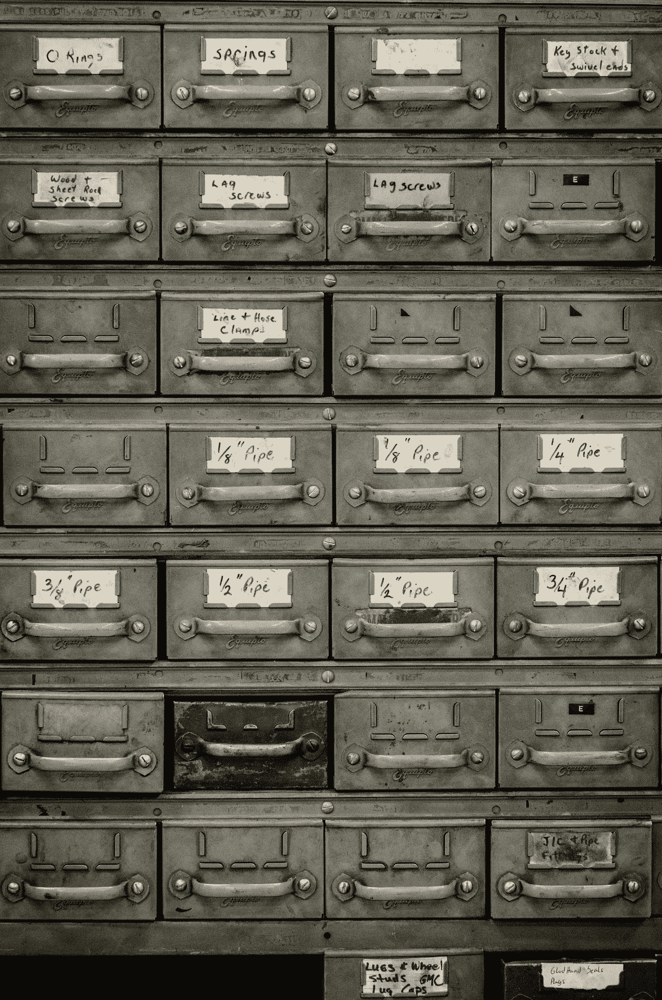
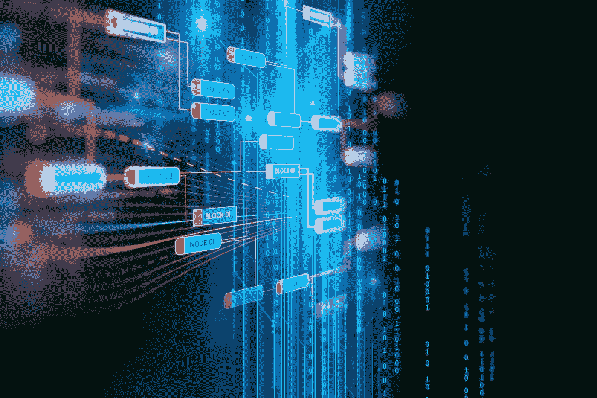

# 我只是一个生活在过时的中央集权的菲亚特世界里的破坏性分散加密小鸡

> 原文：<https://medium.datadriveninvestor.com/im-just-a-disruptive-decentralized-crypto-chick-living-in-an-antiquated-centralized-fiat-world-d059e2377a7a?source=collection_archive---------16----------------------->

当你接触新兴技术时，你知道我们的工作和生活方式将会发生什么变化。

最近，我越来越感到沮丧，因为我觉得我的日常生活中每天都在使用过时的技术。我不得不在医生的办公室填写一式三份的纸质表格——这些信息是在同一个办公室反复询问的相同信息。然后我被告知，我需要从一个医生那里购买我的个人医疗记录，然后交给另一个医生。为什么我没有自己的医疗记录？为什么在我的医疗网络中无法通过指纹扫描来访问它们，或者在我允许的情况下，任何医生最多只能通过我的医疗保险号来访问它们？

 [## 大笔资金和尖端技术:人工智能/人工智能投资将如何革新医疗保健…

### 在过去几年人工智能(AI)和机器学习(ML)的显著发展中…

www.datadriveninvestor.com](https://www.datadriveninvestor.com/2018/03/22/big-money-and-cutting-edge-technology-how-investment-in-ai-ml-will-revolutionize-the-healthcare-industry/) 

Photo by [jesse orrico](https://unsplash.com/photos/h6xNSDlgciU?utm_source=unsplash&utm_medium=referral&utm_content=creditCopyText) on [Unsplash](https://unsplash.com/search/photos/file-storage?utm_source=unsplash&utm_medium=referral&utm_content=creditCopyText)

然后，为了出国旅行，我需要取美元，尽管我有一个美国账户(我在加拿大)，但我不仅不能从自动取款机上取钱，还不得不在朝九晚五的时间里去一家实体银行(这太可怕了)。为什么我们还没有拥抱一个可以通过我手机上的数字钱包进入的去中心化的全球代币经济？

你知道谁在从我的浏览历史、社交媒体行为、购买行为等中赚钱吗？不是我。

Disruptive Technolgy — Blockchain

**颠覆性技术**

身处初创企业区块链的加密空间，我被难以置信的创新思想家、企业家和颠覆性技术所包围；显著改变现有产业运作方式的创新，完全取代现有技术或创造全新产业的技术。我们今天所拥抱的很多东西都曾经是颠覆性创新——汽车、制冷、电话、电视、电脑到电子邮件、数码摄影、智能手机等等。

我们生活在信息时代。距离第一台现代计算机的诞生只有 80 年多一点的时间，就在这一突破的 30 年后，我们把人送上了月球。五十年后，你口袋里的智能手机的速度和计算能力比美国宇航局所有阿波罗电脑加起来还要快[。你能想象 50 年后我们的技术会有多先进吗？甚至 30 岁？对那些知道往哪里看的人来说，对明天的一瞥会产生一些迷人的可能性。](https://www.popularmechanics.com/space/moon-mars/a25655/nasa-computer-iphone-comparison/)

**医疗技术**

医疗保健初创公司 Babylon Health 声称，其人工智能(AI)聊天机器人能够像医生一样准确地诊断医疗状况。中国人工智能机器人小艺最近参加了全国医疗执照考试，并通过了考试，成为第一个这样做的机器人。

AI-powered robot Xiaoyi passes medical exam.

最初的诊断最终可以在家里准确地完成，也许可以使用像 Fitbit 这样不显眼的设备。转诊到真正的医生将根据需要进行，你和你的医生都可以从记录的那一刻起访问所有的数据。你需要的任何处方都将被安全地传输，减少欺诈并有助于保持低价。最重要的是，如果需要的话，你可以随时查阅自己的医疗记录。

已经有人工智能支持的血液测试正在开发中，以加快实验室处理速度，中国的一项令人鼓舞的研究发现，人工智能模型在诊断儿童疾病方面比研究中的儿科医生更准确。

最重要的是，[也正在研究将区块链技术用于病历和处方授权。医生、药剂师甚至病人自己都可以轻松访问所有相关数据，而不是混乱和不安全的记录传输，这种方式将限制其他任何人的访问，并防止欺诈企图。](https://www.wired.com/2017/02/moving-patient-data-messy-blockchain-help/)

众所周知，我们尚未解决医疗保健互操作性的问题，区块链技术可能有助于解决这一问题，并使患者能够控制个人记录。

Antique Adding Machine

**银行业**

虽然比特币和其他加密货币被一些人视为时尚，但它们在千禧一代和知情人士中的受欢迎程度凸显了对安全、全球化、去中心化金融选择的真实需求。银行业知道这一点；他们看到了加密货币和区块链衍生会计的潜力，但也承认该技术既是一种有用的工具，也是金融业的竞争对手。

然而，一些公司能够看到未来，并且已经在尝试打破传统的银行模式。例如， [Capital One 的一项重大举措是](https://www.bizjournals.com/washington/news/2018/10/19/first-look-d-c-s-new-capital-one-cafe-is-a-bank.html)宣扬其希望通过更多地转向分散的“咖啡馆”和基于互联网的银行业务，使银行业务更容易获得。如果这一举措被证明是成功的，更多的银行将寻求分散的银行解决方案…其中一些可能依赖于区块链技术。

**自动驾驶车辆**

我们已经看到了自动驾驶汽车的例子，包括特斯拉自动驾驶功能和谷歌的自动驾驶智能汽车。这是一项令人印象深刻的技术，但迄今为止，人们采用这项技术的速度很慢。未来的智能汽车将远远领先于我们今天在测试中看到的汽车。这些车辆将使用 NovAtel 即将推出的高精度[全球导航卫星系统(GNSS)](https://www.novatel.com/industries/autonomous-vehicles/#overview) 等技术来释放自主系统的真正潜力，而不是使用一些半自动功能和传感器结合大量用户输入。这将为车辆提供几英寸内的精确位置，使其能够对交通状况和即将到来的危险做出实时反应，比目前使用机器视觉的车辆更快。他们甚至可以根据语音识别的目的地实时绘制您的路线，无需进一步输入即可处理所有导航任务。

**智能合约的出现**

目前困扰区块链理工大学的一大挑战是，它往往只与一种引人注目的产品相关:加密货币。奇怪的是，房地产市场可能会改变这种看法。最近几年，人们一直在谈论区块链的“[智能合同](https://samsungnext.com/whats-next/smart-contracts-blockchain-real-estate/)”或自动执行的房地产交易合同的可能性，这个概念最近不再只是“说说而已”。区块链房产交易平台 Blockkimo Ltd 刚刚完成了瑞士区块链上的“第一笔”房产交易。Blockimmo 于 2019 年 3 月 1 日宣布了这项开发。Blockimmo，Elea Labs Ltd .和数字资产服务公司 Swiss Crypto Tokens Ltd .进行了这笔位于区块链的房地产交易——包括 18 套公寓和一家餐厅——耗资 300 万瑞士法郎(298 万美元)。

智能合同可以通过创建一个不可变的交易登记册来消除房地产通常需要的中介，从而节省大量处理房地产交易的时间和成本。

**物联网与人工智能**

在过去几年中，我们已经看到许多“智能”消费者连接设备进入市场，包括从汽车、电视、可穿戴设备、电器到智能城市技术的一切。从最广泛的意义上来说，物联网一词涵盖了所有与互联网相连的事物。这个市场刚刚起步，在安全性、学习曲线和互操作性方面还有一些问题需要解决，但这些设备只会继续改进。

未来的人工智能将允许与智能设备进行更多的交互，并将允许不同的设备更直观地协同工作。当人工智能比较兼容的服务并进行必要的连接以确保功能时，没有被设计成一起工作的设备仍然能够配对。物联网开发商也可以将区块链技术集成到下一代设备中，消除导致一些人不愿购买智能设备的安全风险。随着物联网的发展和变得更加智能，天空是我们所能实现的极限。

**拥有自己的数据**

公司通过出售我们的数据赚了数十亿美元。想象一下，有一天你不仅拥有自己的数字版本，还能控制与谁分享，并从中赚钱。区块链技术可能会提供这种解决方案。

区块链技术被视为一种将数据民主化并将所有权重新放回用户手中的方式，有几家初创公司正在研究这个问题，希望让消费者能够控制他们的数据，而不是社交网络。

与此同时，我会喝完我的咖啡，哀叹网上未经我允许、没有任何报酬的广告，等待银行 9 点开门，这样我就可以购买外币，然后去医生那里购买我的病历。

Yabba dabba doo！

Photo by [Vitor Fontes](https://unsplash.com/photos/w-bvhqRJFe0?utm_source=unsplash&utm_medium=referral&utm_content=creditCopyText) on [Unsplash](https://unsplash.com/search/photos/dinosaur?utm_source=unsplash&utm_medium=referral&utm_content=creditCopyText)

[奥黛丽·奈斯比特](http://www.spinspirational.com/)

[奥黛丽·奈斯比特在 Linkedin 上](https://www.linkedin.com/in/audrey-nesbitt-0388a52a/)

[@ audreynesbit 11 在推特上](https://twitter.com/AudreyNesbitt11)