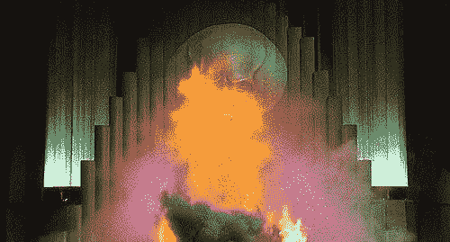

# 我在抗议技术的神秘化

> 原文：<https://medium.datadriveninvestor.com/im-picketing-the-mystification-of-technology-ad2072f8700e?source=collection_archive---------12----------------------->

Image: Flickr

围绕技术的封闭帷幕是不必要的，也是有害的。

随着我们的设备变得越来越强大，它们也变得越来越复杂。不幸的是，对它们如何工作的不熟悉使许多人误解了新的技术发展，这导致他们得出不正确的结论，并且几乎不可避免地害怕进步。现代生活的分割和条块分割的一个副作用是脱离了我们周围各种系统的基本原则——农业、政治、气象、金融、生态和技术系统等等。我们中的许多人没有试图弥合这一差距，而是用科幻小说来交换知识。

**对科技巨头的领导者来说，他们的所作所为很神秘**；这确保了我们去他们送我们去的地方，并继续购买他们的产品。蒂姆库克(Tim Cook)、埃隆马斯克(Elon Musk)或马克扎克伯格(Mark Zuckerberg)的话很好地预示了未来，因为它们表明了他们自己将努力引领行业走向何方。甚至博主、YouTubers 用户、有影响力的人和推特用户也能提供有趣和信息丰富的观点。但同时也要对任何煽情的说法持半信半疑的态度。就像《绿野仙踪》一样，紧闭的窗帘给人一种无所不能的错觉，通常最终只是信使的一种营销工具。

我们看到，除了关于技术用途的阴谋论，**忽视技术真正含义的倾向夺走了我们在世界上的影响力**。对技术进步的恐惧提出了一个虚假的困境，在这个困境中，一个人要么 1)盲目地跳上新设备的跑步机，要么 2)扔掉一切，住在没有电和自来水的树林里。它没有让我们选择欣赏技术的本来面目，并利用它来改善我们的个人和职业生活。

这种疯狂的解药是教育。对于我们大多数人来说，坐下来研究计算机程序设计的细节或为了使用它而进行的计算既不可行也没有必要——就像为了过桥而学习三角学或物理学一样不可行也没有必要。但人们可以通过搜索引擎或基础课程，在线了解大数据、人工智能、区块链、物联网或未来将变得至关重要的其他技术之一。这样他们就可以自己做出明智的决定，而不是依赖那些依赖他们注意力的人。通过同样的技术，我们拥有了人类所有的知识。权力在我们手中。