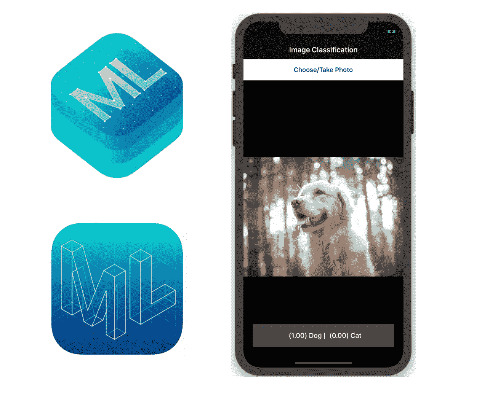
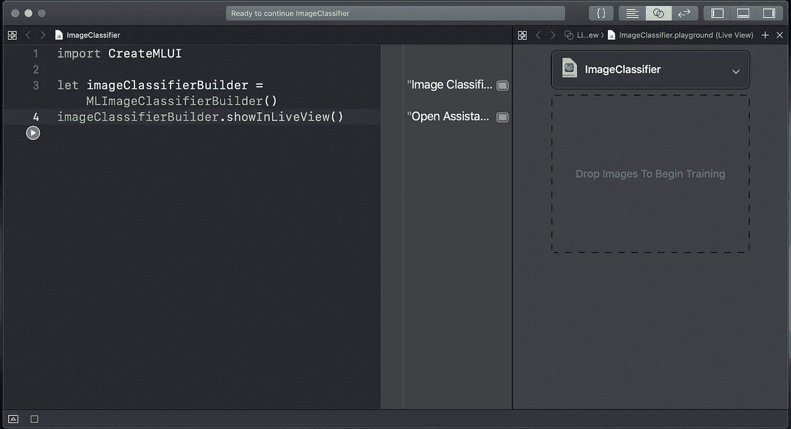
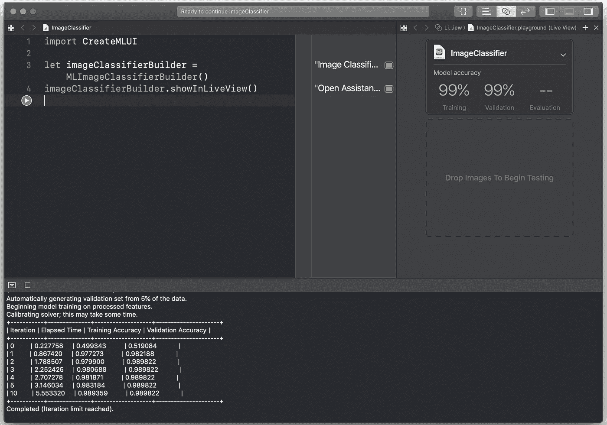
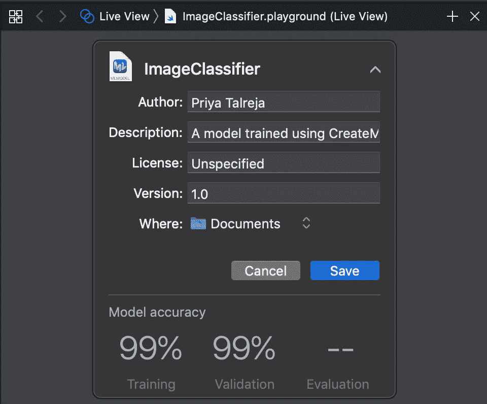

# 使用 Swift 中的 Create ML、Core ML 和 Vision 框架进行图像分类

> 原文：<https://medium.datadriveninvestor.com/image-classifier-using-create-ml-core-ml-and-vision-framework-in-swift-345557960786?source=collection_archive---------2----------------------->



**Create ML** 让你无需机器学习专业知识就能构建、训练和部署机器学习模型。

**Core ML** 型号被捆绑到应用程序中，以帮助驱动智能功能，如搜索或照片中的物体识别。

[](https://www.datadriveninvestor.com/2019/03/03/editors-pick-5-machine-learning-books/) [## DDI 编辑推荐:5 本让你从新手变成专家的机器学习书籍|数据驱动…

### 机器学习行业的蓬勃发展重新引起了人们对人工智能的兴趣

www.datadriveninvestor.com](https://www.datadriveninvestor.com/2019/03/03/editors-pick-5-machine-learning-books/) 

**视觉框架**执行人脸检测、文本检测、条形码识别、图像配准和一般特征跟踪。

我们将建立一个演示应用程序，使用核心 ML 识别动物是猫还是狗。

# 训练模型

我们将在 Xcode 中训练图像分类器。使用基于目录结构的格式。用于训练的图像需要按文件夹分组。

需要的东西，

1.  培训用数据

*   名为“训练数据”的顶层文件夹。
*   按内容标记的子文件夹。(例如:-文件夹名为狗)
*   在每个子文件夹中复制尽可能多的图像。
*   形象名字不重要，重要的是形象的内容。
*   使用 300 x 300 像素的图像或更高分辨率的图像。
*   多样的形象。
*   平衡子文件夹中图像的数量。

2.测试数据

*   名为“测试数据”的顶层文件夹。
*   随机图像来评估模型。
*   避免重叠“测试数据”文件夹中的图像和“训练数据”中的图像集之间不应有重叠。

现在，一旦数据准备就绪，我们需要在 Swift Playground 中训练模型。
创建 ML 在移动设备上不起作用，我们需要创建 macOS playground

1.  创造一个游乐场。

打开 Xcode，*文件→新建→游乐场→ macOS →空白*。
点击*“下一步”。
给出一个合适的名称并点击创建。*

2.在操场上输入下面的代码。

```
import CreateMLUIlet imageClassifierBuilder = MLImageClassifierBuilder()
imageClassifierBuilder.showInLiveView()
```

3.运行代码，如果助手编辑器没有打开，您将看不到任何内容。
所以让我们通过按 option + command + enter 来实现。

4.现在您将能够看到屏幕下方，



5.我们需要将训练数据模型拖动到 ImageClassifier 窗口中的区域，以开始训练模型。处理训练数据需要一定的时间，这取决于数据的大小和计算机的性能。

6.处理完成后，实时视图显示模型精度。您可以通过将测试数据拖动到名为“拖动图像开始测试”的区域来测试模型。



7.我们可以通过单击向下箭头并单击 save 来保存我们的训练模型。您可以更改模型的名称。



> 注意:保存模型后，可以查看尺寸。经过训练的模型非常小(以 KB 为单位)。我们使用了将近 250 MB 的图像来训练这个模型。

现在，我们将在 iOS 应用程序中使用生成的模型，该应用程序可以识别相机或画廊拍摄的图像中的猫或狗。

# **iOS 演示应用**

让我们开始在 Swift 中开发 iOS 应用程序的 Xcode 项目。

1.  在 Xcode 项目中拖动 ImageClassifier.mlmodel。
2.  在故事板中，用 UIImageView 创建一个视图，拍照按钮和显示结果的标签。
3.  在 ViewController 类中，编写 UIImagePickerController 及其委托的代码。
4.  现在，我们需要做 **MLModelSetup** 。
    **`ImageClassifier`** 类是为相应的模型自动生成的。
    用你的模型生成的 Swift 类替换` **ImageClassifier** `。

```
lazy var classificationRequest: VNCoreMLRequest = {
do {
   let model = try VNCoreMLModel(for: **ImageClassifier**().model)
   let request = VNCoreMLRequest(model: model, completionHandler: {   [weak self] request, error in
         self?.processClassifications(for: request, error: error)
})
   request.imageCropAndScaleOption = .centerCrop
   return request
} catch {
   fatalError("Failed to load Vision ML model: \(error)")
}}()
```

*   classificationRequest 属性是使用核心 ML 模型处理图像的图像分析请求。VNCoreMLModel 被实例化。
*   **VNCoreMLRequest** 使用基于 CoreML MLModel 对象的 **VNCoreMLModel** ，使用该模型运行预测。根据模型的不同，返回的观察值可以是分类器模型的**VNClassificationObservation**，图像到图像模型的 VNPixelBufferObservations，或者其他所有的 VNMLFeatureValueObservation。
*   **请求的结果属性**包含执行请求的结果。
*   **完成处理器**调用**流程分类**方法评估结果并更新 UI。

在**过程分类之前，**我们需要执行**分类请求**

5.执行分类请求。

*   UIImage 从 UIImage 转换为 CIImage，这是一种与核心图像过滤器兼容的图像表示。
*   如果 UIImage 到 CIImage 的转换失败，将抛出致命错误，并且无法进行进一步的分类。
*   VNImageRequestHandler 是使用一个映像创建的，该映像用于客户端可能想要调度的请求。
*   图像处理任务很重，所以我们应该阻塞主线程。

```
func createClassificationsRequest(for image: UIImage) {predictionLabel.text = "Classifying..."let orientation = CGImagePropertyOrientation(image.imageOrientation)guard let ciImage = CIImage(image: image) 
else { 
  fatalError("Unable to create \(CIImage.self) from \(image).")
}DispatchQueue.global(qos: .userInitiated).async { let handler = VNImageRequestHandler(ciImage: ciImage, orientation: orientation)
   do {
    try handler.perform([self.classificationRequest])
   }catch {
    print("Failed to perform \n\(error.localizedDescription)")
   }
  }
}
```

6.过程分类

*   这个函数用分类的结果更新用户界面。
*   UI 更新在主线程上执行。
*   VNClassificationObservation 是使用分类器模型的 VNCoreMLRequests 返回的观察结果。分类器产生一组分类，这些分类是标签和置信度得分。

```
func processClassifications(for request: VNRequest, error: Error?) {DispatchQueue.main.async {
   guard let results = request.results 
   else {
     self.predictionLabel.text = "Unable to classify image.\n\(error!.localizedDescription)"
     return
   } let classifications = results as! [VNClassificationObservation] if classifications.isEmpty {
     self.predictionLabel.text = "Nothing recognized."
   } else {
     let topClassifications = classifications.prefix(2)
     let descriptions = topClassifications.map { classification in
       return String(format: "(%.2f) %@", classification.confidence, classification.identifier)
   }
   self.predictionLabel.text = descriptions.joined(separator: " |")
  }
}
```

7.在 didFinishPickingMediaWithInfo 委托方法中或任何获取图像的地方。使用输入参数 UIImage 调用函数 createClassificationsRequest

```
createClassificationsRequest(for: image)
```

现在识别动物的 iOS App 完成了！

谢谢你。希望这对你有帮助。