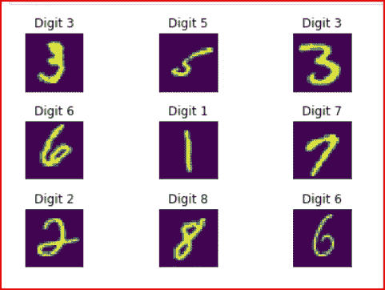
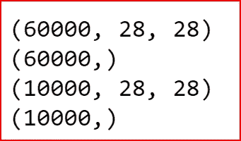
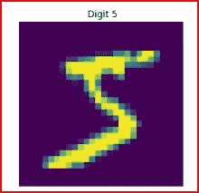
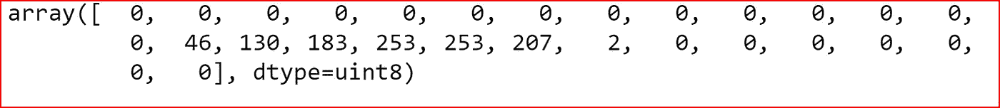
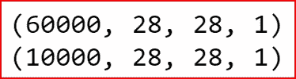
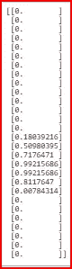
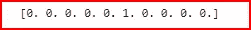
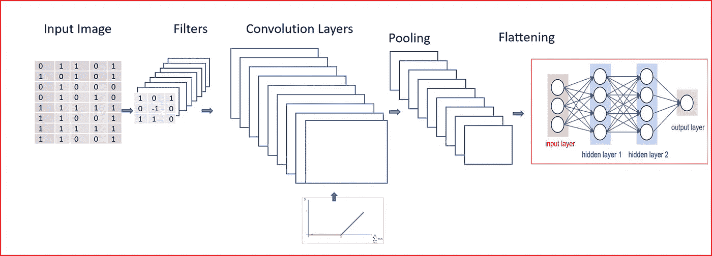
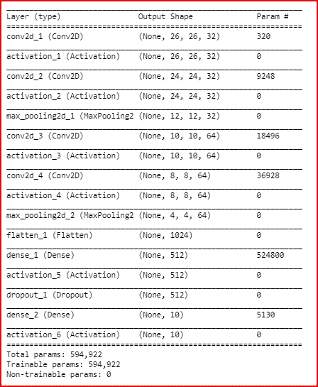
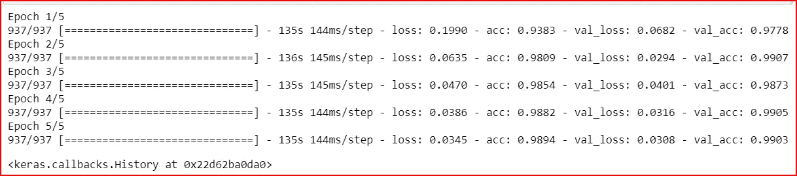

# 基于 Keras 的 MNIST 图像处理

> 原文：<https://medium.datadriveninvestor.com/image-processing-for-mnist-using-keras-f9a1021f6ef0?source=collection_archive---------1----------------------->

[](http://www.track.datadriveninvestor.com/1B9E)

在本帖中，我们将使用 CNN 深度神经网络来处理由手写数字图像组成的 MNIST 数据集。我们还将了解批量标准化



**先决条件:**

[卷积神经网络基础知识](https://medium.com/datadriveninvestor/convolutional-neural-network-cnn-simplified-ecafd4ee52c5)，

[使用 Keras 建立一个人工神经网络](https://medium.com/datadriveninvestor/building-neural-network-using-keras-for-classification-3a3656c726c1)

[使用 Keras 构建 CNN](https://medium.com/datadriveninvestor/building-powerful-image-classification-convolutional-neural-network-using-keras-a1839d0ff298)

[神经网络中的辍学](https://medium.com/datadriveninvestor/neural-network-and-dropouts-b6690c869a18)

MNIST 数据集在 keras 的内置数据集库中可用。

```
import numpy as np
import pandas as pd
from keras.datasets import mnist
```

我们加载训练和测试数据集

```
(X_train, y_train) , (X_test, y_test) = mnist.load_data()
```

我们打印训练和测试数据集中数据的形状，以找出图像的数量和形状

```
print(X_train.shape)
print(y_train.shape)
print(X_test.shape)
print(y_test.shape) 
```



Shape of training and test data for input feature and target variable

我们绘制数据以查看图像和目标变量。

我们使用 matplotlib 库来绘制数据。我们使用%matplotlib 内联，因为我们希望在 Jupyter 笔记本内联绘图

```
import matplotlib.pyplot as plt
%matplotlib inlineplt.imshow(X_train[0] )
plt.title(" Digit " + str(y_train[0]) )
plt.xticks([])
plt.yticks([])
```



如果我们取任何输入特征数据，我们看到值的范围从 0 到 255

```
X_train[0][18]
```



Raw sample input data

我们需要对数据进行归一化以更好地进行训练，从而使所有输入要素都处于相同的范围内

```
# Normalizing the input
X_train= X_train.reshape(X_train.shape[0], 28, 28, 1)
X_train = X_train.astype('float32')
X_train/=255X_test = X_test.reshape(X_test.shape[0],28,28,1)
X_test = X_test.astype('float32')
X_test/=255print(X_train.shape)
print(X_test.shape)
```



现在我们已经对数据进行了规范化，让我们打印相同的输入要素数据

```
X_train[0][18]
```



Normalized input data

我们看到数据被规范化，值现在介于 0 和 1 之间。

由于这是一个数字分类问题，我们的目标变量是一个分类变量。我们使用来自 **keras.utils** 的 **np_utils** 库将目标变量转换为多个列，根据值的不同，这些列的值为 0 或 1

```
from  keras.utils import np_utils
y_train = np_utils.to_categorical(y_train)
y_test= np_utils.to_categorical(y_test)
print(y_train[0])
```



构建 CNN 对图像进行分类的高级步骤是

1.  通过应用内核或特征映射创建卷积层
2.  为平移不变性应用最大池
3.  拉平输入
4.  创建一个完全连接的神经网络
5.  训练模型
6.  预测产量



首先，我们初始化用于构建 CNN 的神经网络

```
from keras.models import Sequential
classifier = Sequential()
```

我们现在建立了 CNN

```
from keras.layers import Dense, Dropout, Activation, Flatten, MaxPool2D
from keras.layers import Conv2D, BatchNormalizationclassifier.add(Conv2D(32, (3,3), input_shape=(28,28,1)))
BatchNormalization(axis=-1) #Axis -1 is always the features axis
classifier.add(Activation('relu'))

classifier.add(Conv2D(32, (3,3)))
BatchNormalization(axis=-1)
classifier.add(Activation('relu'))
classifier.add(MaxPool2D(pool_size=(2,2)))BatchNormalization(axis=-1)classifier.add(Conv2D(64, (3,3)))
BatchNormalization(axis=-1)
classifier.add(Activation('relu'))classifier.add(Conv2D(64, (3,3)))
classifier.add(Activation('relu'))
classifier.add(MaxPool2D(pool_size=(2,2)))classifier.add(Flatten())
BatchNormalization()classifier.add(Dense(512))
BatchNormalization()
classifier.add(Activation('relu'))classifier.add(Dropout(0.2))
classifier.add(Dense(10))
classifier.add(Activation('softmax'))
```

让我们来看看我们神经网络的总结

```
classifier.summary()
```



让我们首先了解每一层输出的维数以及参数是如何计算的。

**卷积层输出形状的尺寸**

w =输入图像尺寸

F=特征检测器尺寸

S=步幅，图像(P)上的零填充为

**((伍尔夫+2P)/S)+1**

对于我们的第一层，图像的输入形状(W)是 28。特征检测器(F)的大小是 3，步幅是 1。

输出 conv2d_2 的维数将为[(28–3+2 * 0)/1]+1，即 26。我们将有 32 个特征地图生成。

因此，conv2d_2 层的输出形状将是(26，26，32)

**最大汇集层的输出形状的尺寸**

w =输入图像的大小

P =池大小

S =步幅

**[(W-P)/S ] + 1**

最大池图层的输入图像大小(W)的最大池 max_pooling2d_1 的输出尺寸为 24，池大小(P)为 2，池图层的跨距为 2，因此输出尺寸为[(24–2)/2]+1 = 12

max_pooling2d_1 的输出形状将是(12，12，32)。

**神经网络层中的参数数量**

W=层中权重的数量。

B=层中偏差的数量。

K =层中使用的内核的大小。

N=内核数量。

C=输入图像的通道数。

**参数个数= (K* K * C) * N + B**

对于输入图像通道(C)为 1 且具有 32 个特征图(N)的大小为(K) 3 的核，conv2d_1 的参数数量为(3 * 3 *1 ) * 32，对于 32 个特征图，我们将有 32 个偏差。

conv2d_1 的参数个数= (3* 3* 1) *32 + 32 = 320

这里我们加了一个东西**批量归一化和剔除**

*什么是批量归一化？*

*   在批量标准化中，我们对隐藏层的输入进行标准化。就像我们归一化输入层一样。这可确保隐藏图层的数据比例相同。这有助于加快学习。
*   我们通过将输入值乘以重量来对小批量进行标准化。
*   在应用激活函数之前计算批量标准化。
*   批量归一化在训练过程中对每个特征的均值和方差进行归一化

*为什么我们需要批量规范化？*

层输入分布的变化导致层不断适应新的分布。**当一个学习系统的输入分布发生变化时，称之为经历协变量移位**。在这种情况下，我们需要重新训练模型以适应新的分布。

例如，当我们在数字的黑白图像上训练模型时。然后，我们试图预测数字的彩色图像，那么我们的模型将不会工作得很好，即使我们仍然在处理数字，我们将不得不重新训练模型。

**在深度神经网络中，对隐藏层的输入始终保持变化，并导致协方差偏移。**

*批量规范化有什么帮助？*

**批量规格化减少了隐藏层分布的偏移量。这样做是为了保持隐藏层的平均值和方差不变。这有助于输入值更加稳定，并允许隐藏层自行学习。因此，批量标准化有助于加速深度神经网络的训练**

既然我们知道批处理规范化将加快训练，我们现在编译模型。

```
classifier.compile(optimizer='adam', loss='categorical_crossentropy', metrics=['accuracy'])
```

我们通过应用不同的变换来执行图像增强，如旋转图像、剪切图像、移动图像的宽度和高度以及应用缩放。

```
from keras.preprocessing.image import ImageDataGenerator# applying transformation to imagetrain_gen = ImageDataGenerator(rotation_range=8, 
                               width_shift_range=0.08, 
                               shear_range=0.3, 
                               height_shift_range=0.08, 
                               zoom_range=0.08 )
test_gen = ImageDataGenerator()
```

我们将图像增强应用于训练和测试集

```
training_set= train_gen.flow(X_train, y_train, batch_size=64)
test_set= train_gen.flow(X_test, y_test, batch_size=64) 
```

我们最终使用 **fit_genator** 将数据拟合到我们上面创建的 CNN 模型。

```
classifier.fit_generator(training_set, 
                         steps_per_epoch=60000//64, 
                         validation_data= test_set, 
                         validation_steps=10000//64, 
                         epochs=5)
```

我们在测试数据上获得了 99%的准确率



# 如果你喜欢这个帖子，请鼓掌！

参考资料:

[批量归一化 C2W3L06](https://www.youtube.com/watch?v=nUUqwaxLnWs)

【https://arxiv.org/pdf/1502.03167.pdf 