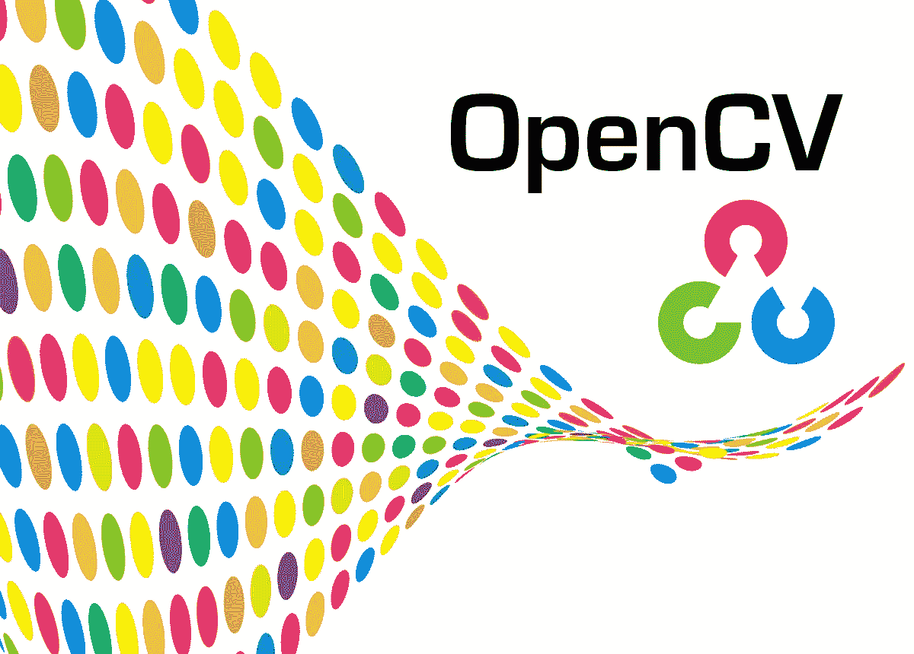

# 用 Python 和 Open-CV 进行图像处理第一部分

> 原文：<https://medium.datadriveninvestor.com/image-processing-using-python-open-cv-part-1-b5e83b5c2398?source=collection_archive---------6----------------------->



Image source: Google.com/images

你好，欢迎来到“用 Python & Open-CV 进行图像处理教程系列”。本系列旨在提供 Open-CV 库、其功能、应用和能力的概述，并让您能够熟练使用它。

乍一看，“图像处理”这个词似乎有点像巫师的东西。顾名思义，图像处理基本上就是借助软件对图像进行处理。对图像应用平滑、锐化、对比、拉伸等处理的目的可以是增加图像的可读性或提高图像质量，甚至是改变图像。也就是说，图像处理是计算机视觉的一部分。计算机视觉是人工智能领域中一个非常强大的领域，它在实时领域有大量的应用。这些包括检测车牌、扫描白板内容、检测静态图像中的文本、缩放图像、检测图像中的模板、图像识别、图像检索、图像恢复等等。

Open-CV 是英特尔开发的开源计算机视觉库，用于实时图像和视频分析和处理。这个库主要用 C++编写，绑定了 Python、Java、Matlab、Octave 等。Open-CV 结合 python 使得图像/视频分析和处理惊人地简单，对于许多人来说，它也可以成为计算机视觉世界的第一步。

教程的这一部分将向我们展示在 Python 中使用 open-CV 的基础，以及开始图像处理是多么简单。让我们开始动手吧。

第一个程序将是把视频转换成灰度形式。视频是从网络摄像头捕捉的。

```
**#BASIC GREY-SCALING**
import cv2cap = cv2.VideoCapture(0)while True:
    frame, ret = cap.read()
    gray = cv2.cvtColor(frame, cv2.COLOR_BGR2GRAY) cv2.imshow('frame', frame)
    cv2.imshow('gray_frame', gray)if cv2.waitKey(20) and 0xFF == ord('q'):
    breakcap.release()
cv2.destroyAllWindows()
```

逐步分解代码:

1.  我们导入必要的库。
2.  然后是 cv2。' VideoCapture(0)'从默认摄像机开始捕获(此处 0 表示默认摄像机)。
3.  下一步将是在无限循环中捕获帧。之后，我们通过 cv2 将捕获的视频转换成灰度。“COLOR_BGR2GRAY”命令(Open -CV 以蓝-绿-红捕获，而不是红-绿-蓝)。
4.  我们通过“cv2.imshow”命令输出两个帧(原始视频和灰度视频)
5.  要退出设置，我们需要定义一个键。在我们的例子中,“q”是我们定义的打破循环的关键。
6.  最后，我们从 open-CV 中释放所有的摄像机，并破坏所有在后台打开的窗口。这样做是为了在退出设置后释放所有后台进程。

理解这一阶段至关重要，因为这里以后的所有计划都将基于这一特定的设置。大多数程序都将基于此代码构建。此外，所有视频分析应用程序背后的逻辑都非常相似。首先，我们需要捕获视频/图像，然后对它们进行各种处理，最后将图像/视频处理成所需的输出。

第二个程序是将视频重新缩放到原始帧的某个百分比。重新缩放不是在视频/捕获上完成，而是在帧输出本身上完成。

```
**#RE-SCALING**
import cv2cap = cv2.VideoCapture(0)def rescale_frame(frame, percentage = 75):
    width = int(frame.shape[1] * percent / 100)
    height = int(frame.shape[0] * percent / 100)
    dim = (width, height)
    return cv2.resize(frame, dim, interpolation = cv2.INTER_AREA)while True:
    frame, ret = cap.read()
    frame75 = rescale_frame(frame, percentage = 75)
    cv2.imshow('frame75', frame75)
    frame150 = rescale_frame(frame, percentage = 150)
    cv2.imshow('frame150', frame150)if cv2.waitKey(0) and 0xFF == ord('q'):
    breakcap.release()
cv2.destroyAllWindows()
```

正如我们所看到的，所有的代码都与第一个灰度程序非常相似，唯一的不同是函数 re-scale。这个函数所做的就是获取框架的尺寸并将这些尺寸缩放到我们想要的百分比值。

在重新缩放主题之后，我们将转向实际改变视频的分辨率，而不仅仅是将帧缩放到某个百分比值。

```
**#CHANGING RESOLUTION**
import cv2cap = cv2.VideoCapture(0)def make_1080():
 cap.set(3, 1920)
 cap.set(4, 1080)def make_720():
 cap.set(3, 1280)
 cap.set(4, 720)def make_480():
 cap.set(3, 640)
 cap.set(3, 480)def change_resolution(width, height):
 cap.set(3, width)
 cap.set(4, height)make_720()while True:
 ret, frame = cap.read()
 cv2.imshow('frame', frame)

 if cv2.waitKey(20) and 0xFF == ord('q'):
  breakcap.release()cv2.destroyAllWindows()
```

这段代码相当简单明了。我们创建一个函数，将视频捕获“cap”的宽度和高度设置为所需的分辨率值。对于 480p 的分辨率，高度将等于 480，宽度将等于 640。类似地，对于 720p 和 1080p 的分辨率，高度和宽度将分别等于 720 和 1280 以及 1080 和 1920。这里需要注意的一点是，随着视频分辨率的增加，视频的大小也会增加。在某些情况下，你可以设置一个比相机硬件支持的更大的分辨率，但这只会导致非常滞后和不连贯的视频。

平滑和模糊技术帮助我们消除图像中的噪声。open-cv 提供了各种类型的平滑和模糊技术。让我们探索其中的一些，以便熟练掌握它们。请记住，每种技术都有自己的优点和缺点。

```
**#SMOOTHING AND BLURRING** import numpy as np
import cv2cap = cv2.VideoCapture(0)while True:
    _, frame = cap.read()

    hsv = cv2.cvtColor(frame, cv2.COLOR_BGR2HSV)
    color_value_1 = np.arrays([0, 0, 0])
    color_value_2 = np.arrays([255, 255, 255]) mask = cv2.inRange(hsv, color_value_1, color_value_2) result = cv2.bitwise_and(frame, frame, mask = mask) kernel = np.ones((10,10), np.float32)/100 smooth_result = cv2.filter2D(result, -1, kernel)

    gaussian_blur = cv2.GaussianBlur(result, (10,10), 0)
    median_blur = cv2.medianBlur(result, 10)
    bilateral_blur = cv2.bilateralFilter(result, 10, 75, 75)

    cv2.imshow('frame', frame) cv2.imshow('mask', mask)
    cv2.imshow('result', result)
    cv2.imshow('smooth_result', smooth_result) cv2.imshow('median_blur', median_blur)
    cv2.imshow('gaussian_blur', gaussian_blur)
    cv2.imshow('bilateral_blur', bilateral_blur) if waitKey(20) and 0xFF == ord('q'):
    breakcv2.destroyAllWindows()cap.release()
```

1.  像往常一样，我们首先从主摄像机捕捉视频帧，读取帧，将其从 BGR(蓝、绿、红)颜色格式转换为 HSV(色调、饱和度、值)颜色格式
2.  然后，我们定义一系列 numpy 数组作为参数来创建新的掩码帧。
3.  在原始帧和屏蔽帧之间执行“按位与”运算
4.  接下来，我们创建一个内核窗口，一个平均 10 * 10 像素(即 100 像素)的块，并应用所有平均。
5.  最后，我们看看不同的结果，应用不同的模糊技术，如高斯模糊，中值模糊等。因此，我们可以选择最适合我们特定需求的风格。

在对平滑和模糊的概念有了清晰的概念后，我们进入下一个话题。精明的边缘检测确实如其名。它基本上检测任何给定图像的边缘。我们将从主网络摄像头的实时视频输入中检测边缘。

```
**#CANNY EDGE DETECTION** import cv2cap = cv2.VideoCapture(0)while True:
    _, frame = cap.read()
    hsv = cv2.cvtColor(frame, cv2.COLOR_BGR2HSV)

    lower_threshold = int(max(0, (1.0 - 0.33) * median))
    upper_threshold = int(min(255, (1.0 + 0.33) * median))

    edges = cv2.Canny(frame,lower_threshold,upper_threshold)
    cv2.imshow('Original',frame)

    cv2.imshow('Edges',edges)

    if cv2.waitKey(20) and 0xFF == ord('q'):
        breakcap.release()cv2.destroyAllWindows()
```

和上面所有的代码一样，这个代码也很简单。

1.  我们首先从主摄像机捕捉视频输入。
2.  将捕获的 BGR(蓝、绿、红)视频转换为 HSV(色调、饱和度、值)颜色格式。
3.  定义边缘检测的上限和下限，并将其传入 cv2。Canny()函数将是下一步。
4.  然后，我们显示原始图像以及处理后的图像

我们将在这里结束这一部分。Open-CV 系列的这一介绍性部分将足以让读者对 OPEN-CV 库如何与 python 结合起来工作有一个基本的了解，它还将为理解计算机视觉领域本身提供基础。我有一个 [Github 库](https://github.com/Ishan3333/Open_CV_basics)，它在一个非常好的注释结构中包含了上述所有代码。该存储库还包含我使用过的所有资源。

敬请关注。下次见…！