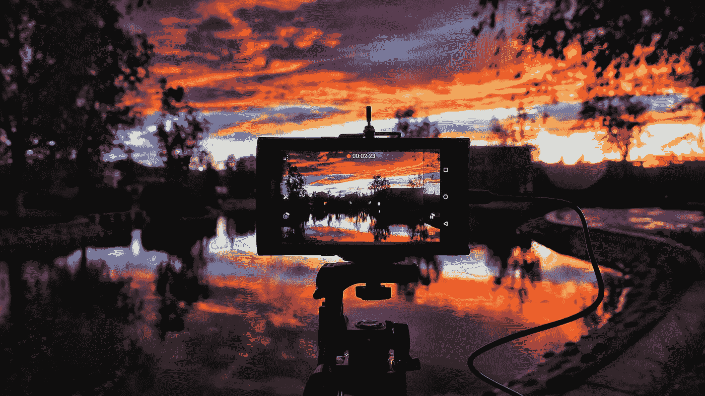

# 使用 Python 和 Open-CV 进行图像处理第 2 部分

> 原文：<https://medium.datadriveninvestor.com/image-processing-using-python-open-cv-part-2-72f2b75918e7?source=collection_archive---------6----------------------->

[](http://www.track.datadriveninvestor.com/1B9E)

Photo by [Jimmy Chang](https://unsplash.com/@photohunter?utm_source=medium&utm_medium=referral) on [Unsplash](https://unsplash.com?utm_source=medium&utm_medium=referral)

大家好，欢迎再次来到 OPEN-CV with Python 教程系列的另一部分，在上一部分中，我们看到了计算机视觉的一些应用，以及如何开始使用英特尔的 OPEN-CV 库并对图像帧执行一些基本操作。

在教程的这一部分，我们将学习 Open-CV 提供给我们的一些更具挑战性的功能。

先说**角点检测**方法。顾名思义，这种技术可以检测任何给定图像中的所有角点。

```
**#CORNER DETECTION**
import numpy as np
import cv2img = cv2.imread('heregoesyouramazingimage')
gray = cv2.cvtColor(img,cv2.COLOR_BGR2GRAY)
gray = np.float32(gray)corners_to_detect = 100
minimum_quality_score = 0.01
minimum_distance = 10ST_corners = cv2.goodFeaturesToTrack(gray, corners_to_detect, minimum_quality_score, minimum_distance)
ST_corners = np.float32(corners)for corner in corners:
    x,y = corner.ravel()
    cv2.circle(img,(x,y),3,255,-1)cv2.imshow('ST_corners', ST_corners)
```

1.  我们首先加载图像，将其转换为灰色，然后转换为 float32。
2.  然后我们定义一些参数，传递给我们的“goodFeaturesToTrack”函数。
3.  这些参数包括 1)我们想要检测的角的数量，2)检测到的角的质量，以及 3)每个检测到的角之间的最小距离。**继续摆弄这些数字**。
4.  接下来，我们迭代每个角，在我们认为是角的每个点上画一个圆。从而检测图像中的所有角

这不是 Open-CV 库中检测角点的唯一方法。实现类似结果的另一种方法是 [**哈里斯角点检测**](https://docs.opencv.org/3.0-beta/doc/py_tutorials/py_feature2d/py_features_harris/py_features_harris.html) **方法**。

在理解了角点检测的概念之后，我们现在继续学习什么是**前景提取**。前景提取的思想是找到前景，去除背景。听起来一样。这很像绿屏所做的，除了这里我们不需要任何绿屏！

```
**#FOREGROUND EXTRACTION**
import numpy as np
import cv2
from matplotlib import pyplot as pltimg = cv2.imread('heregoesyouamazingimage')mask = np.zeros(img.shape[:2],np.uint8)background_model = np.zeros((1,65),np.float64)
foreground_model = np.zeros((1,65),np.float64)rectangle = (161,79,150,150)cv2.grabCut(img,mask,rectangle,background_model,foreground_model,5,cv2.GC_INIT_WITH_RECT)mask2 = np.where((mask==2)|(mask==0),0,1).astype('uint8')img = img*mask2[:,:,np.newaxis]plt.imshow(img)
plt.colorbar()
plt.show()
```

一点一点地分解代码，我们得到:

1.  导入所有必需的库。
2.  正在加载图像。
3.  创建特定形状的遮罩。
4.  指定背景和前景模型。
5.  真正重要的部分是定义矩形。这里的矩形是(start_x，start_y，width，height)。
6.  然后，我们从 Open-CV 库中调用我们的主“grabCut”函数，并传入所有必要的参数。如果你想修改参数，你可以去看官方文档。
7.  最后，我们乘以输入图像，我们得到我们的最终结果

**注意:为你的图像找到合适的坐标。**

前景提取很酷，对吧？类似的还有**背景还原**。无非是通过检测运动把背景降到最低。这将需要我们使用一个视频，或者有两个图像(一个没有你想要跟踪的物体，另一个有相同的物体)。

```
**#BACKGROUND REDUCTION**
import numpy as np
import cv2cap = cv2.VideoCapture(0)
foreground_model = cv2.createBackgroundSubtractorMOG2()while(1):

    ret, frame = cap.read()
    foregroundmask = foreground_model.apply(frame)

    cv2.imshow('frame',frame)

    cv2.imshow('foreground',foregroundmask)if cv2.waitKey(20) and 0xFF == ord('q'):
        breakcap.release()
cv2.destroyAllWindows()
```

实现这一点的代码非常简单易懂。我们所做的就是调用内置的“createBackgroundSubtractorMOG2()”函数，并传入我们想要减少背景的帧。

**形态变换**是根据图像的形状对其进行的简单操作。它需要两个输入，一个是我们的原始图像，第二个是决定操作性质的内核。两种基本的形态学算子是腐蚀和膨胀。然后它的变体形式如开、关等也开始发挥作用。我们将一个一个地看到他们。

```
**#MORPHOLOGICAL TRANSFORMATION**
import cv2
import numpy as npcap = cv2.VideoCapture(0)while True:

    _, frame = cap.read()

    hsv = cv2.cvtColor(frame, cv2.COLOR_BGR2HSV)color_value_1 = np.arrays([0, 0, 0])
    color_value_2 = np.arrays([255, 255, 255])

    mask = cv2.inRange(hsv, color_value_1, color_value_2)
    result = cv2.bitwise_and(frame, frame, mask = mask)
    kernel = np.ones((5,5), np.uint8)

    eroded_img = cv2.erode(mask, kernel, iterations = 1)

    dilated_img = cv2.dilate(mask, kernel, iterations = 1)

    opening = cv2.morphologyEx(mask, cv2.MORPH_OPEN, kernel)

    closing = cv2.morphologyEx(mask, cv2.MORPH_CLOSE, kernel)cv2.imshow('frame', frame)
    cv2.imshow('result', result)
    cv2.imshow('eroded_img', eroded_img)
    cv2.imshow('dilated_img', dilated_img)
    cv2.imshow('opening', opening)
    cv2.imshow('closing', closing)if waitKey(20) and 0xFF == ord('q'):
        breakcv2.destroyAllWindows()
cap.release()
```

侵蚀是通过“侵蚀”边缘来完成的。我们首先创建一个滑块，并为它提供一个窗口(5 x 5 像素)。现在，当滑块在图像上滑动时，如果所有的像素都是白色的，那么我们得到白色，否则黑色。这有助于消除图像中的一些白噪声。另一方面，膨胀与侵蚀正好相反。

接下来是“打开”和“关闭”。有了 open，我们所做的就是去除“误报”。“结束”的想法与“开放”正好相反，即消除“错误否定”。

***嗯嗯嗯！*** 恭喜你走到这里。现在，您已经对 Open-CV 的工作原理有了很好的理解和概述。下一个话题(也是这篇文章的最后一个话题)是关于录制视频。是的，通过 Open-CV 录制视频起初看起来似乎是一项微不足道的任务，但不幸的是，事实并非如此。所以…让我们开始吧。

```
**#RECORDING VIDEOS**
import os
import numpy as numpy
import cv2filename = 'video.avi'frames_per_seconds = 24.0my_res = '720p'cap = VideoCapture(0)def change_resolution(cap, width, height):
    cap.set(3, width)
    cap.set(4, height)STD_DIM = {
"480p" : (640, 480),
"720p" : (1280, 720),
"1080p" : (1920, 1080),
"4k" : (3840, 2160),
}def set_dimensions(cap, res = '1080p'):
    width, height = STD_DIM['480p'] 
    if res in STD_DIM:
        width, height = STD_DIM[res]
    change_resolution(cap, width, height)
    return width, height'''
Video Encoding, might require additional installs
Types of Codes: [http://www.fourcc.org/codecs.php](http://www.fourcc.org/codecs.php)
also OpenCV 2 doesn't support cv2.VideoWriter_fourcc. Instead use cv2.cv.CV_FOURCC(*'XVID')
'''VIDEO_TYPE = {
'avi' : cv2.VideoWriter_fourcc(*'XVID')
'mp4' : cv2.VideoWriter_fourcc(*'XVID')
'mp4' : cv2.VideoWriter_fourcc(*'H264')
}def set_videotype(filename):
    filename, ext = os.path.splitext(filename)
    if ext in VIDEO_TYPE:
        return VIDEO_TYPE[ext]
    return (VIDEO_TYPE['avi'])dims = set_dimensions(cap, res = my_res)
video_type_cv2 = set_videotype(filename)out = cv2.VideoWriter(filename, video_type_cv2, frames_per_seconds, dims)while True:
    ret, frame = cap.read()
    out.write(frame)
    cv2.imshow('frame', frame)if cv2.waitKey(20) and 0xFF == ord('q'):
        breakcap.release()
out.release()
cv2.destroyAllWindows()
```

一段一段地分解代码，我们得到:

1.  代码的第一部分是定义所有必要的参数，即分辨率、文件名、每秒帧数(FPS)等，同时导入所有必要的库
2.  在代码的下一部分，我们定义了一个字典，包含所有可能的分辨率及其各自的高度和宽度。创建一个设置这些分辨率的函数，并将其默认为 1080p。
3.  我们定义了另一个包含不同视频类型值的字典，并定义了一个返回视频文件格式类型的“set_videotype”函数。
4.  最后一步是调用我们的主函数(' cv2。并传入所有必要的参数。
5.  最后但同样重要的是，我们编写 cv2 的输出。' VideoWriter '函数添加到循环中的新帧。

乡亲们，这篇博文就到这里吧！！！恭喜你走到这一步。

我有一个 [Github 库](https://github.com/Ishan3333/Open_CV_basics)，它在一个非常好的注释结构中包含了上述所有代码。这个资源库还包含了我用来学习 Open-CV 的所有资源。

敬请关注。下次见…！