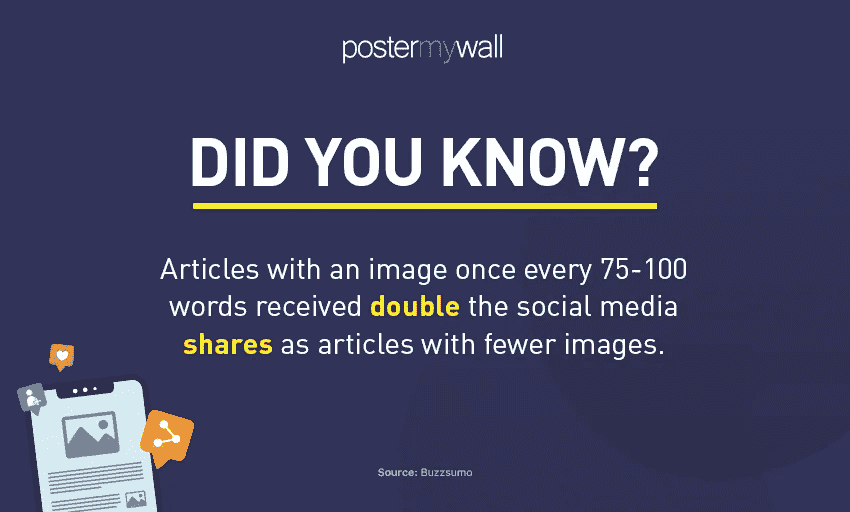
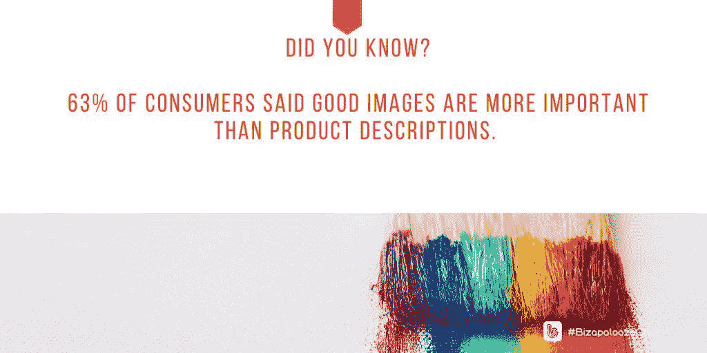
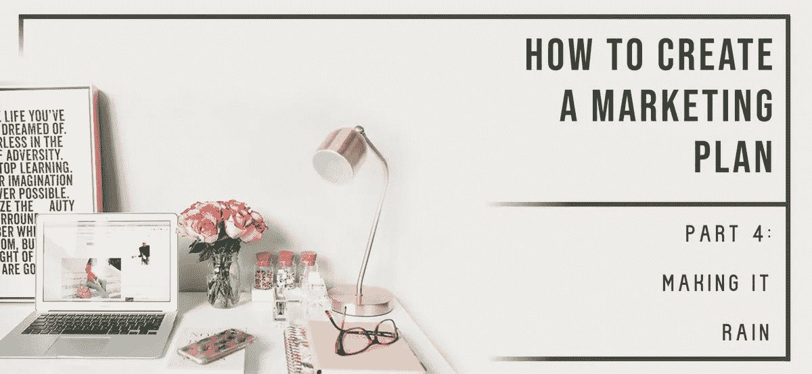
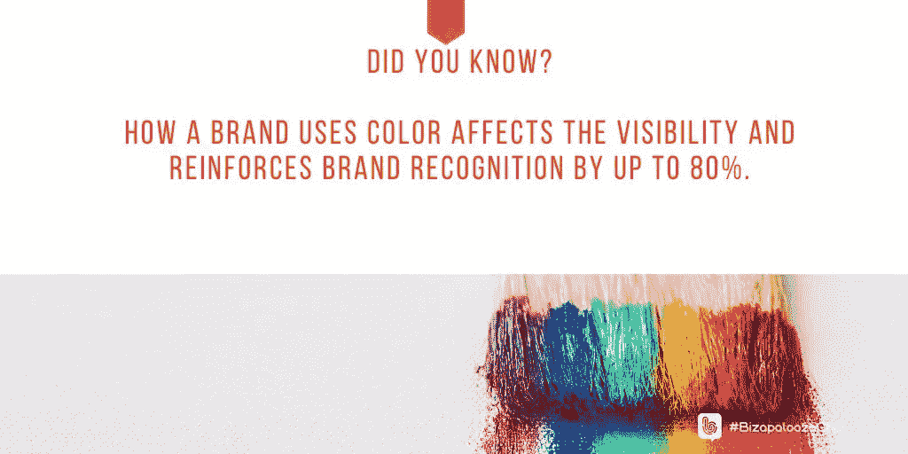
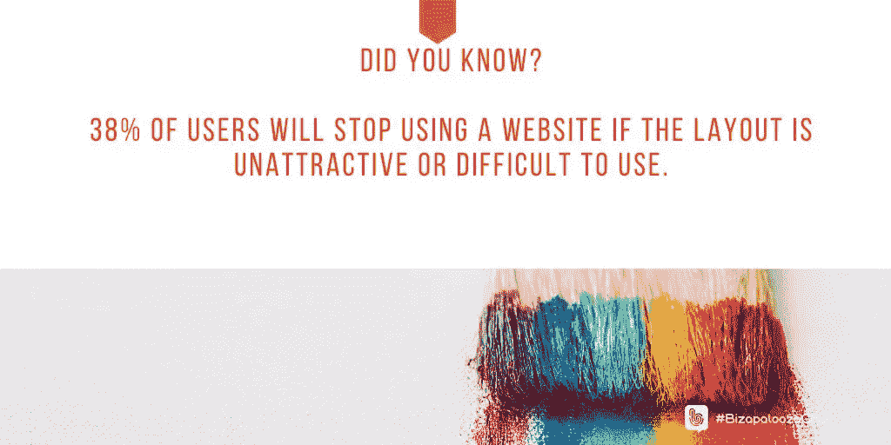
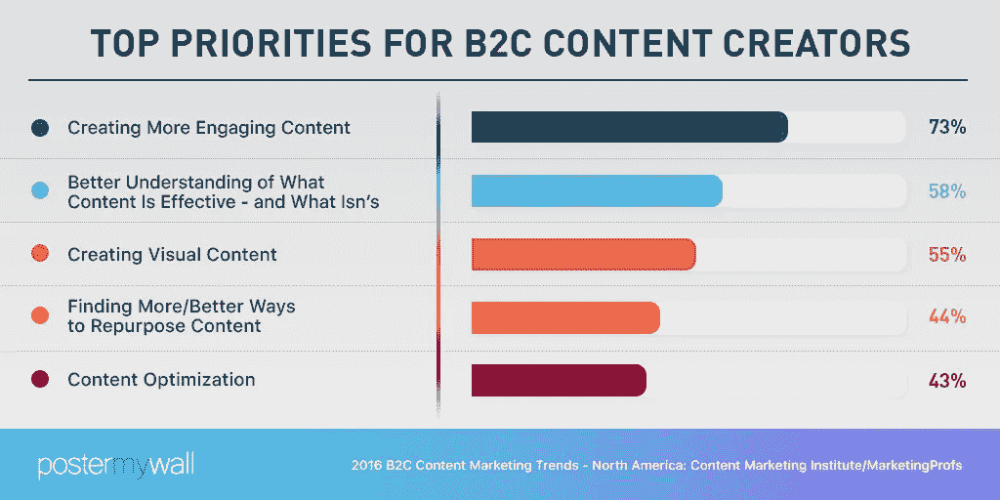
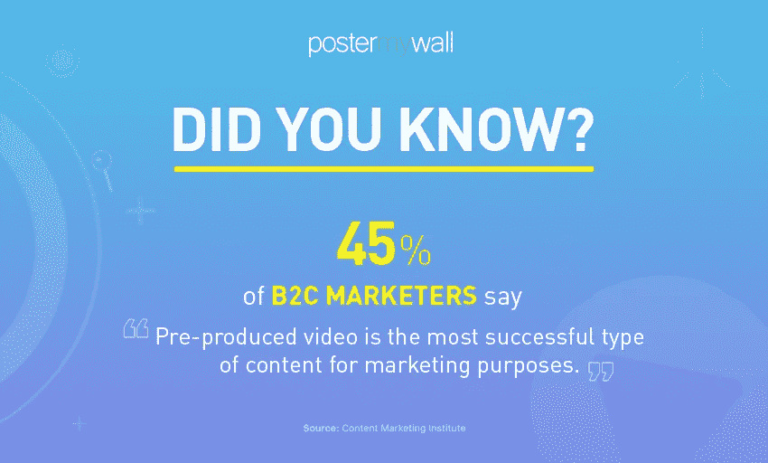

# 图像以图形方式赋予内容以生命

> 原文：<https://medium.datadriveninvestor.com/images-graphically-bring-content-to-life-5cc21a8e59bd?source=collection_archive---------7----------------------->

## 个人和企业创建自己的专业视觉效果

Much-maligned stock images are effective if they have high quality.

小企业主希望他们的公司脱颖而出。最好的方法之一是通过视觉营销。这也为资金紧张的企业家敲响了收款机的警钟。

推广公司[海报我的墙](https://twitter.com/postermywall/)认为它有一个解决方案。这项业务“使个人和企业能够创建自己的专业图形和视频。”

代表 Zuraiz Niazi 与 [Ivana Taylor](https://twitter.com/DIYMarketers) 和 [Iva Ignjatovic](https://twitter.com/IvaIgnjatovic) 讨论了小型企业的视觉营销。Ignjatovic 是一名营销、战略、领导力和商业顾问。她与泰勒密切合作，泰勒拥有 DIY 营销公司，该公司“致力于帮助小企业主摆脱困境”

 [## 品牌在生活色彩中脱颖而出

### 一致的视觉风格增强了解、喜欢和信任

blog.markgrowth.com](https://blog.markgrowth.com/brands-stand-out-in-living-color-566ac6044168) 

当消费视觉营销时，明亮的颜色或不合时宜的图像会引起注意。是“什么？”因素。

“没有加载文本的图像——智能地使用负空间——通过视觉上吸引人的颜色组合，对眼睛和心灵都很容易，”Niazi 说，引用了一个艺术海报模板的极简设计。

“社交媒体营销的一个聪明方法是为每个平台定制你的内容，以最大限度地提高参与度，”他说。“举例来说，Instagram 的观众对于那些包含任何信息图或过多矢量的帖子有点犹豫。”

也要认识到仅仅好并不是好。

“根据你的品牌身份[个性化的图像](https://blog.markgrowth.com/your-visual-style-repeatedly-builds-trust-9b0f530c5fde)比一般的图像更能吸引眼球，”Niazi 说。“定制和品牌化你的视觉效果让人们知道他们在和一个真实的人互动，而不是一个没有人情味的营销机器人。

“图像应该把信息分解成易于消费的块，”他说。其中包括总结关键要点的信息图、强调个别重要提示和要点的引用图像等等

Ignjatovic 喜欢将动作和图像结合在一起的好的 GIF。

“对我来说，这是关于图像的一些有趣的东西，”泰勒说。“这可能是一个标题或图像本身。每个平台都有自己的个性。说出每个平台的语言很重要，图像在这方面做得很好。”

# 更紧密的联系

视觉营销有助于信息和业务从混乱中跳出来。

“使用视觉内容会让我们的观众更加投入，”Niazi 说。“研究表明，包含图片的帖子比纯文本帖子的参与度高 650%。

“视觉内容也有助于我们的观众记住更多的信息，”他说。“如果一个相关的图像与你想要传达的信息配对，人们会在三天后记住 65%的信息，相比之下，如果没有使用图像，则只有 10%。”

在对超过 100 万篇文章的分析中发现，与图片较少的文章相比，每 75 到 100 个单词有一张图片的文章获得了两倍的社交媒体份额。

泰勒认为视觉内容会引发观众的情绪。

“好的视觉内容传达了关于产品或服务的信息，”Ignjatovic 说。"你使用的视觉营销材料是潜在客户对你的企业的第一印象."

DIY 营销人员贴出了 [*视觉营销创意:脱颖而出的 6 种方法*](https://diymarketers.com/visual-marketing-ideas-6-ways-to-stand-out/) 。

虽然视觉营销应该引人注目，但它必须适合企业的背景。

 [## 管理一个品牌可以让你汇集许多丰富多彩的线索

### 每一个元素增加的力量都大于其组成部分的总和

medium.datadriveninvestor.com](/managing-a-brand-lets-you-bring-together-many-colorful-threads-6b4d406e9c22) 

“我不是设计师，”泰勒说。“虽然我可以欣赏美丽的图像，但我不能创造一个——有时甚至用模板也不行。

“颜色的选择至关重要，”她说。“这就是我喜欢使用预先设计好的模板的原因。他们已经创建了调色板。”

自己做可能会令人生畏。

“对于企业来说，缺乏设计技能可能是一个大问题，”尼亚齐说。“雇佣外部设计师意味着你对自己的设计过程和审美没有你理想中的那么大的控制力。

“更不用说，这对你的预算是一个巨大的消耗，”他说。“与你的设计师不断迭代以得到你想要的结果*,这意味着你浪费了很多宝贵的时间。对于每个小企业主来说，时间就是金钱。”*

*情况不一定如此。*

*“作为一个小企业主，你已经有很多事情要做了，”尼亚齐说。“你自己在管理一个产品。试图在此基础上为其创建营销内容可能会让人不知所措。此外，营销技巧可能不是你的专长。”*

# *存储能力*

*视觉外观对记忆很重要。根据搜索引擎人员的说法，80%的人记得他们看到的东西，相比之下，10%的人记得他们听到的东西，而 20%的人记得他们读过的东西。*

*“这是关于头条新闻和行动呼吁，”Ignjatovic 说。“这些必须与你的形象相协调。据 [CrowdRiff](https://twitter.com/CrowdRiff) 称，63%的消费者认为良好的形象比产品描述更重要*

**

*小企业在创建视觉内容时面临挑战，仅仅因为所有者是企业家，而不是视觉专家。然而，他们可能没有[聘请专家的预算。](https://blog.markgrowth.com/get-your-2-cents-worth-marketing-on-a-budget-801786370414)*

*“这完全是关于拥有资源、时间和金钱，”泰勒说。“视觉内容需要资源，小企业主已经在努力了。所以，它没有完成。*

*“专业知识至关重要，”她说。“我花了时间和金钱，创造了一些可怕的东西。投资有经验的人是有意义的。”*

* [## 吸引人的视觉风格可以建立对你的品牌的熟悉和信任

### 人们在任何人开口之前就知道你是谁

blog.markgrowth.com](https://blog.markgrowth.com/your-visual-style-repeatedly-builds-trust-9b0f530c5fde) 

尼亚齐也遇到过类似的情况。

他说:“大多数小企业主没有合适的技能来独立创作专业的视觉内容。”“鉴于资源稀缺，他们负担不起昂贵的平面设计师来为他们做这件事。

“小企业只能分配这么多的预算用于营销，”Niazi 说。“以专业方式制作视觉内容意味着您的大量资源(时间和金钱)将不复存在。剩下的钱不够支付你的其他费用。”

还有创业公司不熟悉的细节层次。

“一个坚实的视觉内容战略需要一个过程，”Ignjatovic 说。"小企业主倾向于*而不是*拥有复杂的流程和指导方针."

她推荐了海报我的墙网页，[如何创建营销计划:获得销售](https://blog.postermywall.com/design-studio/2019/6/how-to-create-a-marketing-plan-part-4)。

预算紧张是首要考虑的问题，看看那些提供免费或低价视觉创作工具的网站。他们可以给内容带来专业的感觉。

“我也建议用 photoshop，但学习基础知识需要时间，”Ignjatovic 说。"海报我的墙有非常酷的东西，模板和建议."

# 一站式回答

尼亚孜自然答应了。

“海报我的墙是一个在线图形设计工具，可以成为您快速、轻松、经济地创建和分发令人惊叹的宣传图像和视频的一站式解决方案，”他说。“它可以让你免费创建和分享令人惊叹的社交媒体图片。您还可以使用易于使用的编辑器设计任何其他类型的营销图形。

“使用这个工具，你可以根据自己的需要为*免费的*调整不同平台的视觉效果，并在复制设计上节省大量资金，”Niazi 说。

最重要的是，如果使用非你自己创作的视觉——或任何其他内容，即使来自免费来源，也要确保给出正确的归属。

“是的，我今天在飞机上坐在一个家伙旁边，他告诉我他的妻子——一名摄影师——花了大量的时间来确保她的照片不被盗，”泰勒说。

“*为你将要发布的内容类型制定一个简单的指导方针或策略，”她说。"*不要*发布不一致的品牌形象。比如，要么选插图，要么选照片，但不能两者都选。”*

 [## 常青树发芽新生命|数据驱动投资者

### 对艾米·伍兹来说，“老歌但好歌”不仅仅是一句怀旧的话。这是她一生的工作，捕捉到伍兹的内容…

www.datadriveninvestor.com](https://www.datadriveninvestor.com/2019/02/01/evergreens-sprout-new-life/) 

曾经使用过的内容可以再次使用。

“再利用，再利用，再利用，”尼亚齐说。“通过在所有平台上共享内容，让内容发挥最大潜力。确保你的信息被重复足够的次数，让你的听众记住它。

“在活动开始前几个月就计划好你的帖子，”他说。“提前准备好你的圣诞销售海报。永远不要忘记添加个人风格，比如表情符号或 GIF，向你的观众展示他们听到的是真人。”

Niazi 建议不要给图形添加太多信息。保持内容简单易懂。

“不要在你的社交媒体上发布错误的图片尺寸，”他说。“Twitter 使用 1200px x 675px 的图像尺寸，Instagram 使用正方形图像。使用错误的尺寸可以通过只显示图像的一部分作为预览来减少影响。

对此，Ignjatovic 说不要在一张图表中传达太多的信息。此外，在所有视觉材料中使用一致的品牌。

# 暂停刷新

每隔几个月休息一下，回顾一下内容。看看你是否陷入了一个常规。对你重复，对消费者来说就是无聊。

“你必须把注意力放在你的大部分资产上——网上或营销材料上，”泰勒说。“关注拥有 80%注意力的 20%。

“这就是有一个风格指南可能会有所帮助的地方，”她说。"这使得创建可重复使用的模板变得更加容易."

 [## 如果你做得对，有一个标签

### 了解标签的基本知识来推销你的业务

medium.datadriveninvestor.com](/theres-a-hashtag-for-that-if-you-do-it-right-79b9d167c86a) 

Ignjatovic 提倡制定一个计划，比如使用每日标签来推动内容。

“企业应该定义他们的品牌指导方针，并遵循他们的所有营销图形，以保持一致性，”尼亚齐说。“这样，无论帖子的内容是什么，整体营销努力都会显得统一。

“选择你的品牌颜色，字体风格，甚至字体大小，并在所有图像中使用它们，”他说。"对于类似的帖子，使用相同的布局，并在所有营销材料中添加您的徽标."

营销人员可以从科学家那里得到提示。

“多样化和尝试不同的技术是好的，但你应该始终跟踪什么对你有用或没用，并从实验中收集有意义的见解，”Niazi 说。

“谈论所有营销图形都是独特的，并且在保留品牌的同时针对手头的活动进行个性化是多么重要，”他说。"然后说明如何通过在我的墙上张贴海报来轻松实现这一目标."

股票图片是可以的，只要它们看起来不太股票——人们在一剂笑气后过度眩晕。也要瞄准图像中人物的多样性。

“股票图片可以让你在帖子中加入专业元素，有时甚至是人性化元素，尤其是如果你还没有建立自己的品牌组合的话，”Niazi 说。“然而，只使用股票图片或在没有上下文的情况下使用它们会给人留下懒惰和不专业的印象。

“你可以使用高质量的库存图片作为定制和品牌营销图形的一部分，而不是作为独立的图片，”他说。“这向你的观众展示了你付出的努力，并让你成为一个更值得信赖的品牌。”

# 联系是现实

Niazi 将吸引人的内容列为 73%的企业对消费者内容创作者的首要任务。

“创造能激发参与的内容意味着你的观众不仅仅把你看作一个非个人的商业实体，”他说。“他们觉得自己在和一个真实的人交流。尝试不同的事情来建立和保持这种联系。

“我们知道制作视频既困难又昂贵，但我们可以帮助你，”尼亚齐说。“你可以使用海报墙上的数千个[可定制视频模板](https://www.youtube.com/watch?v=ZVoXrOwrDpU&utm_source=twitter&utm_campaign=bizapaloozachat&utm_content=videoinstagrampost)来填补你的内容营销空白。”

他指出，视频是“一个必然的赢家”43%的 B2C 内容创作者认为预先制作的视频是最成功的营销内容类型。

“在 2018 年的 HubSpot 调查中，54%的消费者希望看到他们支持的品牌或企业的更多视频内容，”尼亚齐说。“是什么阻止了你利用这一趋势？

“吸引你的观众的一个方法是创造更多个性化的内容，”他说。“让你的业务的语气和内容与众不同。使用我们高度可定制的模板，您可以非常轻松地制作出您想要的图形。"

一些常用的方法会激发参与。

“询问你的观众的意见是非常有效的，”尼亚齐说。“为此，使用 Twitter 和脸书民意调查、Instagram 故事民意调查等等。你的极限就是你的创造力。”

 [## 伟大的个人品牌帮助你脱颖而出

### 创造你想让别人看到的形象

medium.com](https://medium.com/an-idea/great-personal-branding-helps-you-stand-out-7ea6152dfc1) 

泰勒认为，股票形象已经变得更好了。

“免费图像可以工作，”她说。“有些普通图片就像剪贴画一样俗气。我喜欢视觉上有趣、看起来自然的图片。

“我绝不会使用股票图片作为我的品牌元素，”泰勒说。“然而，我生活在库存图片上，这些图片看起来像是自己做的，像是网站的图片一样自然。”

Ignjatovic 喜欢有机图像:“你拍的或者你的顾客或观众贡献的照片。”

# 季节性诱惑

假日视觉营销的好处是它与季节性节日联系在一起。缺点是“常青”内容在七月并不常青。

泰勒倾向于不太偏离她全年的工作。尼亚齐把脚趾深深地浸入水中。

“如果你不使用假日内容，你应该，”他说。“利用季节性流量可以让你抓住不断变化的假日购物潮，最大限度地提高销售额和增加客流量。”

 [## 迎接最佳假日活动的到来

### 活跃在社交媒体上是成功的关键

medium.datadriveninvestor.com](/ring-in-the-season-for-the-best-holiday-campaign-97b5b87ef755) 

尼亚兹引用了[有效假日营销的策略](https://blog.postermywall.com/design-studio/2019/10/retail-holiday-marketing-guide?utm_source=twitter&utm_campaign=bizapaloozachat&utm_content=holidaymarketingblog)。

他说:“有图片的推文比没有图片的推文收到的转发量多 150%。”“有图片的脸书帖子获得的关注度是没有图片的帖子的 2.3 倍。此外，带有视频的脸书帖子比纯文本帖子获得的有机接触多 1.5 倍。

“一旦你创造了正确的视觉内容，你应该尽量扩大你在所有社交媒体平台上的影响力，无论是脸书、推特还是 Instagram，”尼亚齐说。"在任何平台上，只需点击一下鼠标，就可以免费调整你的设计."

特殊岗位加强与客户的联系。

“定制你的网站、Instagram feed 或博客以适应特殊的节日和季节，让你的现有客户以真实的方式和你联系，”Niazi 说。

“社交媒体是小企业营销人员工具包中最重要的工具，”他说。“它不仅是免费的，而且有巨大的影响力——但前提是你要正确使用它。当你的帖子配有相关且吸引人的图片时，它最有力量。”

# 过多的选择

海报我的墙有数千个可定制的社交媒体模板。

“快速、轻松地为您的业务创建完美的图像，”Niazi 说。“然后免费下载所有社交媒体图片。

“如果你不知道如何在节日期间吸引你的观众，我们可以帮你，”他说。"社交媒体有万圣节和圣诞节[日历."](https://www.postermywall.com/index.php/resources/halloween-social-media-calendar-2019?utm_source=twitter&utm_campaign=bizapaloozachat&utm_content=halloweencalendar)

 [## 在为时已晚之前计划好假日营销

### 成功的活动来自全年的项目

blog.markgrowth.com](https://blog.markgrowth.com/plan-holiday-marketing-before-its-too-late-e3c619948470) 

企业主应该确保包括他们的劳动力在行动中的图像。这为消费者提供了幕后的观点，并促使员工推广他们的业务。结果是有动机的免费广告，这是经济上的极致。你的员工是[公司最伟大的啦啦队长](https://blog.markgrowth.com/company-cheerleaders-shout-your-praises-b0b24ca1014c)。

“聪明地工作，而不是努力地工作，”尼亚兹说。“使用“我的海报墙”可以快速、轻松、经济地创建专业内容，从而推动您的视觉内容营销。

“使用更吸引眼球的视觉类型，如视频、信息图、报价模板等，”他说。"这是很容易做到的海报我的墙数以千计的专业设计的模板."

Taylor 热衷于对视觉内容进行头脑风暴和创建清单。

“这使得创建内容或分配或外包变得更容易，而不是为自己考虑一切，”她说。

**关于作者**

吉姆·卡扎曼是拉戈金融服务公司的经理，曾在空军和联邦政府的公共事务部门工作。你可以在[推特](https://twitter.com/JKatzaman)、[脸书](https://www.facebook.com/jim.katzaman)和[领英](https://www.linkedin.com/in/jim-katzaman-33641b21/)上和他联系。*