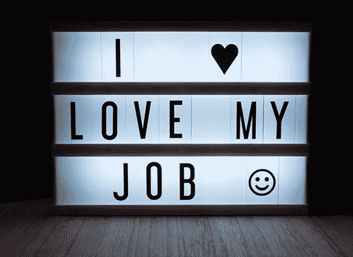

# 想象一个每个人都做自己喜欢的工作的世界？

> 原文：<https://medium.datadriveninvestor.com/imagine-a-world-where-everyone-did-a-job-they-loved-5f94e5720686?source=collection_archive---------5----------------------->

Do you really?

一 **一*我和自动化可以解放世界，解决不平等和贫困。如果我们真的想的话。但是，我们是否有足够的勇气去掌控自己的命运，拥抱机遇？***

迁就我一会儿。拿一杯清爽的夏敦埃酒或一杯公平贸易咖啡。找个舒服的地方坐下。最好是能给你灵感的风景。允许自己进入思考状态，开始想象一个每个人都做自己真正热爱的工作的世界。满足他们情感、创造力和心理需求的工作。

 [## 今年值得关注的 5 大人工智能趋势|数据驱动的投资者

### 预计 2019 年人工智能将取得广泛的重大进展。从谷歌搜索到处理复杂的工作，如…

www.datadriveninvestor.com](https://www.datadriveninvestor.com/2019/02/19/artificial-intelligence-trends-to-watch-this-year/) 

只要想一想那会是什么感觉；如果每个人的工作都超越了维持生计、提供食物和支付抵押贷款的需要，我们周围的世界会有什么样的感受。想象一下，如果你、你所有的家人和朋友都有让你感到鼓舞和兴奋的工作，你会怎么样？

想象一下，在一次社交聚会上，你问了一个问题:

> “那你是做什么工作的？”

无论你是在火车上与一个随机的陌生人交谈，还是在婚宴上与一屋子的客人交谈，想象一下，如果每次你问这个问题时，你都真诚地想知道答案，因为你知道每个回答都会有启发性。每次你提出这个问题时，对方的脸上都会放光，他们的眼睛会发光，他们的回答会照亮整个对话。

# 这难道不应该是常态吗？

这难道不是我们作为一个物种应该努力达到的工作世界吗？作为人类，难道我们不应该向往这样一个社会吗？在这个社会里，醒着的每一个宝贵时刻都是一种享受；一种享受？难道我们不应该拥有神圣而无可争议的权利去做一些我们热爱和珍惜的事情，让我们的心歌唱吗？

从博物学家到摄影师；一个服装设计师对一个哲学家来说，我们的一生应该是一条学习和滋养的道路，获取知识、经验和技能，成为我们真正想成为的人。

那么为什么不是呢？

# 在跑步机上作为一个奴隶从摇篮到坟墓

我们的世界充满了快速致富、熙熙攘攘、激励人心的废话。从马云到加里·维纳查克的所有人，以及介于两者之间的数百人。办公室的墙上挂满了激励性的名言，告诉我们要更加努力工作以获得我们需要的东西。

LinkedIn 上充斥着坚持认为我们生活的主要焦点应该是工作的人。我们需要早起，从黎明前忙碌到黄昏后。

为什么？装饰在私人封闭车道上的是五居室的房子、路虎揽胜还是玛莎拉蒂？

我对朋友和家人做了一个快速调查，问了 30 多人他们是否可以做一份不同的工作，一份他们喜欢的工作，会是什么样的工作？只有一个人回答说他们喜欢成为解决方案架构师。我喜欢并尊重这一点。这才是重点。我们都爱不同的东西。一个在马耳他开了近 20 年酒吧的朋友梦想在南美的小农场种植作物，另一个朋友想成为帮助儿童的治疗师，所有这些都很重要。然而他们没有这样做。

# 为什么不呢？

有很多原因可以解释为什么绝大多数人做他们真正热爱的工作只是一个乌托邦式的梦想。许多是社会工程的直接结果。商业的车轮必须不停转动，收银机必须不停运转。我们无意中创造了一个经济和社会强迫我们的世界；事实上，迫切需要我们为 GDP 做出贡献，支付我们的税收，为我们生活的世界提供资金，这远远超出了我们自己的福祉和个人生活方式的需求。

从梦想成为作家的医院清洁工，到想写歌词的会计师，再到幻想成为插花师的律师，几乎所有人都被奉献给了他们工作生活中无情、无休止的单调工作。

他们保持谎言的时间越长，谎言就变得越深，越难被揭穿。当然也有例外，但很少。对于大多数人来说，没完没了的清晨通勤、乏味的谈话和琐碎的办公室政治，加上那些在追求更大利益的幌子下实施永无止境政策的狗屎老板，让我们的鼻子紧紧压在磨刀石上。

我们坚持支付越来越多的账单。我们用我们的劳动、我们的心和我们的灵魂来支付税款，支付救济，向失去自由的神圣的上帝，资本主义机器表示敬意。

好消息是，一切很快就要结束了。或者至少技术进化为我们提供了改正错误和重新发现自我的机会，如果我们允许的话。我们正迅速接近一个岔路口，朝着一个机器可以做工作的不太遥远的未来飞奔。

# 工作的未来

在 2017 年的[世界政府峰会上，](https://www.teslarati.com/video-elon-musk-dubai-world-government-summit-2017/)埃隆·马斯克表示，在不久的将来，由于人工智能(A.I)和自动化，世界将不得不应对大规模失业问题。

> **我们很快就要到达一个点，在这个点上，几乎没有什么工作是机器人不能比人类做得更有效、更快、更准确的；成本低得多。**

马斯克并不孤单。他的想法与耐克首席财务官唐·布莱尔 2013 年的回应不谋而合。在回应股东对亚洲劳动力成本上升的大肆宣传的批评时，他解释说，他们正在非常努力地“设计”生产设施的劳动力。

牛津大学的经济学家[卡尔·弗雷和迈克尔·奥斯本](https://www.researchgate.net/publication/271523899_The_Future_of_Employment_How_Susceptible_Are_Jobs_to_Computerisation)在 2013 年进行了一项研究，该研究表明，由于技术创新和自动化，美国将在未来二十年失去 47%的工作岗位。

物联网(IoT)、人工智能和所有各种各样的发展为我们提供了前所未有的自由时间甚至自由的机会。当政府为人民无所事事、国家从资本主义的枷锁中解放出来而颤抖的时候；许多哲学家和社会观察家看到了新时代的曙光。

在这个时代，休闲和快乐是下一代的主要目标和主要议程。在未来，你可以做你喜欢的事情，过你应得的生活，花时间去成长和培养那些激励你、给你快乐的事情。

# 普遍基本收入

理查德·布兰森也展望了人工智能和自动化显著影响就业机会的未来。布兰森和马斯克相信，最终人工智能和自动化将带来我们所需的大量负担得起的东西。由此产生的收入应该得到相应的重新分配。一个乌托邦式的概念！一个能让我们所有人做自己喜欢的事情的平台。

未来是我们的，有一些挑战需要聪明的解决方案，例如经过多次试验和经常辩论的普遍基本收入概念。作为一个物种，我们需要进化。我们可能需要识别并关闭那个促进物质主义和消费主义咒语的基因。

# 物种和社会的进化

我们的生活和思想需要专注于真正让我们快乐的东西，这很少是新的平板电视、智能手机或汽车。全人类都需要接受这一事实:为了拯救这个世界，拯救我们的生命，我们需要回到一个注重事物的必要性，而不是需求和欲望的肤浅幻想的社会。未来也为我们提供了一个前所未有的机会来结束全球的贫困和不平等。如果我们真的想，我们真的可以改变，甚至拯救世界和我们的灵魂。

最终，拥有更多的可用时间和更少的压力并不意味着更多的零售疗法、更大更好的白色商品、棕色商品和无生命的东西。它应该导致一个更干净，更少混乱，更有经验的人类群体。

# 但是不会！