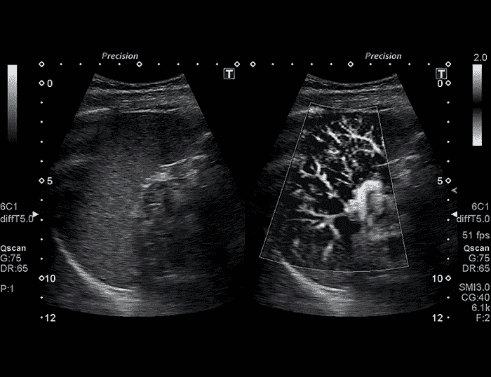

# 成像技术深入胚胎寻求启示

> 原文：<https://medium.datadriveninvestor.com/imaging-technology-reaches-into-embryos-for-enlightenment-55269a3a982f?source=collection_archive---------8----------------------->

## 这一创新确实令人惊叹。想想超声波，只会更好。

几十年来，我们接受了这样一个事实:我们不能仅仅用超声波看到这么多的胚胎。那些小婴儿太小了。另外，甚至没有什么理由让*想让*看到它们。我们知道他们“长什么样”我们了解它们背后的生物科学，我们知道当精子和卵子相遇时，T2 立即开始了生命。一个胚胎诞生了。人类婴儿开始成长。

然而，谁知道成像技术不仅能让**看到**胚胎，还能从内部确定大量问题？

 [## 准备在 2019 年改变世界的技术-数据驱动的投资者

### 很难想象一项技术会像去年的区块链一样受到如此多的关注，但是……

www.datadriveninvestor.com](https://www.datadriveninvestor.com/2019/01/17/the-technologies-poised-to-change-the-world-in-2019/) 

# 休斯顿大学和贝勒医学院的研究人员发现了这一点:一种新的成像技术

这是多年来胚胎发育面临的挑战——涉及到两个因素，结构和分子。在结构上，我们可以看到胚胎在那里，以正常生长的速度生长。我们*没有*看到的是在**分子水平**可能发生的事情。

在*实时观察*的能力可以预防甚至治疗各种通常在怀孕阶段出现的问题:*先天缺陷、流产、*和其他*长期慢性疾病。*

在分子水平上，由休斯顿大学电子和计算机工程助理教授 David Mayerich 领导的那些研究人员开发的成像技术，对于这个 370 万美元的项目，我们将能够看到发育中的循环系统的颗粒基础，找到关于我们在早期发展阶段经常遇到的非常不完美的新线索。

这是我们健康的核心开始。这就是为什么母亲保持最佳健康状态总是至关重要，也是为什么流产在这个阶段经常发生。这个过程很微妙。

令人欣慰的是，成像方法涉及光学相干断层扫描(OCT)，这一过程通常涉及随着器官继续生长和变化对眼睛的研究。有了 3D 荧光成像，就有可能真正观察细胞……*生长*！

然而，真正的挑战并不在于实现这一突破，而是用微观发现来把握时机。同样，将结构和分子这两个因素联系在一起。研究人员已经找到了一种方法，将数据科学与显微镜结合起来，在巨大的尺度上进行高分辨率成像

利用 3D 作为同步所有数据收集的方式，可以使结构生长与实际的连续细胞进化相匹配。目标是通过对多个样本的研究和检查，为可能被定性为“出生缺陷”的异常找到特定的生物学基准。

实质上，如果他们真的发现了某些**独特**的东西，他们就有可能发现这种“异常”实际上可能是某种先天缺陷。

# 虽然这需要长期的研究和分析，但是妈妈们还是很高兴的！

胎儿死亡可能很快就会成为过去。提供一点安慰和稳定会有很大帮助，尤其是在发现自己怀孕的喜悦之后。你对新兴技术有什么看法？ [**马上注册一个 VIGYAA 账户，写下你的想法**。](https://vigyaa.com/accounts/login/)一定要去 [**看看《数据驱动的投资者》，了解更多关于技术的见解**](http://datadriveninvestor.com) **！**