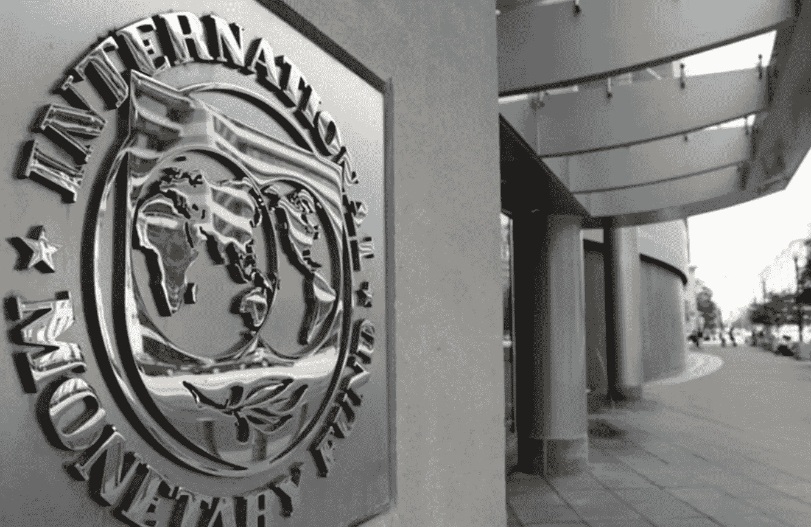
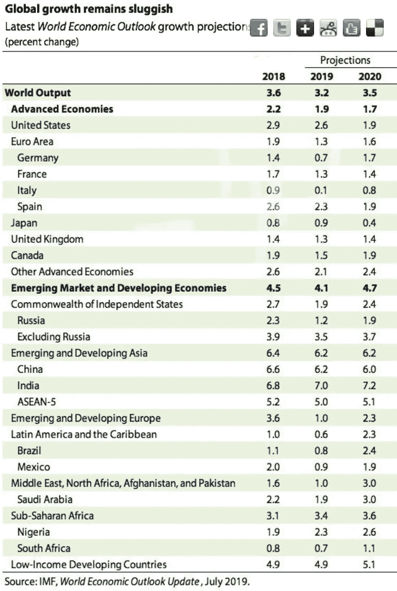

# 国际货币基金组织的《世界经济展望》指出全球经济更加脆弱。

> 原文：<https://medium.datadriveninvestor.com/imf-world-economic-outlook-points-to-increased-fragility-in-the-global-economy-c957cca556a8?source=collection_archive---------9----------------------->

Economic Times

国际货币基金组织最近的经济展望是一个大杂烩。市场似乎仍对美中贸易战的影响感到不安，但一系列政策和地缘政治不确定性促使今年上半年进行了务实的扩张。

令人担忧的不是全球经济正在放缓，因为美国经济正处于扩张的第十年，顺周期财政刺激的效果似乎正在减弱；相反，当前收支平衡的倾斜可能会迅速引发衰退，因为供需双方的风险都在上升。

 [## 为什么包容性财富指数比 GDP 更能衡量社会进步？|数据驱动…

### 你不需要成为一个经济奇才或金融大师就能知道 GDP 的定义。即使你从未拿过 ECON 奖…

www.datadriveninvestor.com](https://www.datadriveninvestor.com/2019/03/08/why-inclusive-wealth-index-is-a-better-measure-of-societal-progress-than-gdp/) 

***全球经济受风险困扰，但前景依然良性。***

全球经济仍然受到美中贸易和技术战争、英国退出欧盟的不确定性、地缘政治的不确定性和对伊朗和委内瑞拉的制裁以及高杠杆企业和家庭部门相对于低利率的困扰。国际货币基金组织在 7 月份的《世界经济展望》中将全球经济增长预测下调至 3.2%和 3.5%，下调 0.1%。这是继 4 月份之前的修订后，全球经济将继续陷入困境。

此外，商业投资似乎正在减弱，原因是商业信心下降，再加上人口老龄化和生产率低下等结构性问题。紧缩的劳动力市场和低通胀继续支撑着消费者需求，尤其是在中欧和东欧国家。

***库存支撑 2019 年 H1 全球经济，但全球贸易正在放缓。***

最常见的线索是美国和英国的库存增加。前者的生产商试图抢先应对关税战的影响。与此同时，英国生产商增加库存，以应对混乱的英国退出欧盟。尽管将 2018 年和 2018 年全球经济前景下调至 3.2%和 3.5%，但预计美国经济将表现强劲。尽管全球贸易政策的不确定性表明 GDP 将受到 0.5%的拖累，但 2.6%的增长率被上调了 0.3%。更令人担忧的是机械和消费品交易在 2018 年下降到 2.0%以下，今年上半年下降了 0.5%。尽管有英国退出欧盟，英国躲过了一场衰退，但英国退出欧盟无协议的风险给经济度过难关的能力带来了巨大的不确定性。坚实的经济基本面表明，尽管英国退出欧盟遭受重创，但美国经济目前还不太可能进入衰退。随着失业率处于创纪录低位，通胀略低于目标，收入逐渐上升，需求面将弥补企业推迟招聘和投资决定的影响。

***美国经济似乎对贸易不确定性具有弹性，但新兴市场遭遇降级。***

无论对全球贸易流动多么担忧，美国似乎不太容易受到贸易战的不利影响。与此同时，中国和新兴市场的 GDP 下调 0.1%，将分别对 GDP 造成 0.3%和 0.1%的冲击，增幅则分别为 4.1%和 4.7%。这并不奇怪，因为美国对亚洲和北美的贸易分别占 31.4%和 33.9%。与此同时，出口大宗商品的新兴市场可能会首当其冲受到关税困扰和结构性放缓的中国经济的冲击。这表明，新兴市场贸易与中国的联系可能比此前预期的更紧密。国际货币基金组织似乎比目前正在为美联储降息定价的市场参与者更看好美国经济，以减少与中国的关税战的不利影响。

国际货币基金组织的预测可能已经合理地解释了更宽松的立场，但对于美国经济可能受到制裁的影响，人们的看法可能略有不同。商业信心和投资的下降与美国经济增长的向上修正在一定程度上描绘了美国经济的矛盾前景。第二个原因是，根据 IMF 的预测，美国和中国之间休战的预期似乎更有可能，这与市场参与者预测 2019 年和 2020 年的增长率为 2.1%和 2.3%不同，经合组织更看好 2.8%和 2.3%。

这一点在 IMF 的预测中尤为明显，该预测称，由于贸易战，新兴市场增长将下降 0.5%，随后将出现更明显的修正。与此同时，巴西养老金改革的不确定性、南非对委内瑞拉罢工的制裁、采矿业的能源供应问题以及农业产量低下，对这个非洲第二大国家来说都是不祥之兆。

该基金仍然看好欧洲。

欧洲的情况似乎更加复杂，法国经济可能会因财政支出增加而得到提振，与此同时，德国经济可能会因其主要进口市场的外部需求放缓而受到不利影响。美国对欧洲汽车的关税威胁对德国经济没有什么好处。相反，由于投资增加和进口减少，预计西班牙将以更快的速度增长。相反，意大利的公共财政继续给欧元区经济增长带来下行风险。总而言之，政策不确定性的新常态和创纪录的低利率表明，政策制定者应该谨慎行事。他们会吗？

全球贸易言论的降级将对欧元区产生净正面影响，因为失败的中国政策将支撑外部需求。然而，这取决于美国和中国达成协议。尽管 20 国集团(G20)峰会后谈判得以恢复，但仍需采取具体措施，确保中国实现经济自由化，并停止不公平的做法，如窃取知识产权、强制技术转让、针对全球企业的非关税和监管壁垒。它最近购买高粱和计划购买大豆是否会进一步平息美国的紧张局势，还有待观察。与此同时，一个更相关的问题仍然没有答案。美国和中国将如何执行由此达成的任何协议？

***其他问题浮出水面***

基于规则的全球秩序急需改革，成员国终于意识到，对于一些寻求保护本国农民或能源企业的国家来说，补贴是不可或缺的。美国和大多数富裕国家不太可能停止补贴化石燃料，因此呼吁印度和中国停止补贴农业或国有补贴的呼声不太可能进一步高涨。与此同时，随着 IMF 呼吁成员国共同努力减少碳排放，降低气候灾难对金融稳定的风险，气候变化也像往常一样出现了。

***未雨绸缪***

现在人们普遍认为，财政和货币政策都将被用来应对下一轮衰退。政府不再像 2008 年危机后那样收紧银根。这种适得其反的反应为下一场危机提供了重要的教训。全球经济正处于一个微妙的位置，一系列风险可能很容易构成一个成熟的复苏，政策不确定性似乎是新常态。