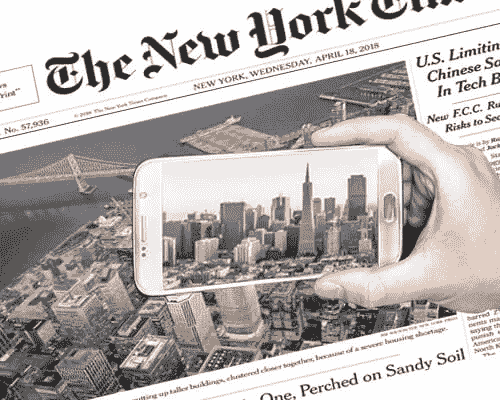
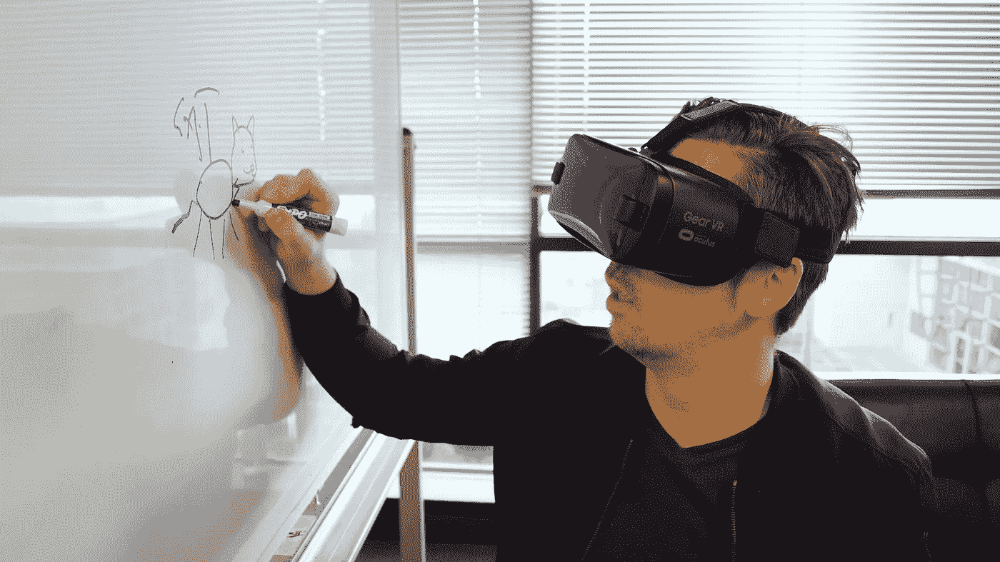
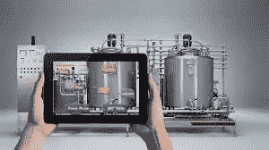

# 沉浸式技术:企业如何创造回报

> 原文：<https://medium.datadriveninvestor.com/immersive-tech-how-businesses-are-generating-returns-500b2bbf8c51?source=collection_archive---------21----------------------->

纽约 2018 年 11 月 28 日电/美通社/ —自 2016 年推出 HTC Vive 和 2017 年 6 月推出 ARKit 以来，很多公司都尝试了沉浸式技术。许多行业一直在使用它，并在获得投资回报(ROI)方面相当成功。Quytech 认为需求来自各行各业。但是有些行业的投资回报率是显而易见的。

一些行业已经尝到了成功的滋味，并在使用沉浸式技术获得竞争优势方面拥有先发优势。

**出版商:**

据报道，出版商在增强现实方面的投资获得了不错的回报。出版商报告说，参与率上升了 30%，参与时间上升了 100%。大多数沉浸式内容都是为广告制作的。品牌愿意为基于 AR 的广告支付更多费用。此外，当消费者在 AR 或 VR 中看到产品或品牌时，他们会找到一种更好的方式来了解产品或品牌。

**电子商务**:

这可能是 AR 的最大市场，并且正在经历 AR 投资的大繁荣。电子商务公司报告转化率增加了 2-3 %,而退货率下降了 25%。消费者正在接受各种选择，他们可以在下订单之前尝试虚拟购买。使用 AR，消费者可以在购买之前在自己身上试用产品，看看它看起来怎么样。

**宜家的** **Place 应用**引起了消费者的巨大反响。它托管了 2000 种产品，并为最终用户提供了一种非常准确的方式来可视化家具并确定其尺寸。

**CPG(消费品):**消费品主要使用 AR 来推动品牌识别，并与现成产品建立联系。产品包装是与消费者联系的理想方式，并以完全不同的方式讲述品牌故事。品牌经理和营销人员喜欢这种体验带来的参与，以及他们可以收集的额外数据，这在以前是不可能的。

《19 宗犯罪》是一个很大的案例研究。相对来说是一个小品牌，他们的 AR 活动在全球范围内引起了巨大的关注。这将品牌故事带给了普通人，他们甚至可能没有接触过真正的瓶子。

**训练:**

生产车间和服务部门对 AR 进行了大量投资。培训项目是获得投资最多的项目。公司报告称，在使用基于 AR 或 VR 的培训计划时，保留率增加了 60%。成本降低幅度从 40%到 90%不等，取决于实际培训的成本。

伦敦交通局(TFL)已经受益于使用虚拟现实来降低培训成本。

**维护和修理:**

这是企业投入沉浸式技术的最大领域。对于设备制造商和服务部门来说，最大的开销是派遣他们宝贵的高级技术人员到现场进行故障分析和维修。支持 AR 的系统正在帮助这些公司将高级技术人员的生产率提高 60%，并将维护成本降低 70%，只需让他们能够远程维修设备。它降低了成本，减少了解决问题所需的时间。

波音公司报告称，通过使用沉浸式技术，花费的时间增加了 30%，首次质量提高了 90%。

**房地产:**房地产是第一个投资沉浸式技术的部门。每个开发商或经纪人的办公室都能看到 VR 头戴设备。从 360°视角到 3D 扫描房屋，这个领域已经从沉浸式技术中获得了巨大的回报。开发商发现让客户虚拟参观房产更容易、更便宜。

沉浸式技术在其他行业也取得了突破。用不了多久，这将成为企业数字化转型的主要投资重点。

**关于 Quytech:**

[Quy Technology Pvt Ltd](http://www.quytech.com/company-overview.php)成立于 2010 年，提供定制的增强现实和虚拟现实开发服务。

我们的端到端增强和虚拟现实开发服务包括从 3D 建模/动画/渲染图像到空间音频和前端/后端开发的所有内容。

该公司在多个垂直领域交付复杂的 AR/VR 项目，包括出版、制造、房地产、零售、营销、教育等。

我们的客户来自世界各地，主要来自美国、英国、欧洲、澳大利亚和印度。我们已经为全球客户交付了 250 多个项目**。**

[联系 Quytech](http://www.quytech.com/contactus.php)
[info@quytech.com](mailto:info@quytech.com)

**相关链接**

[AR 品牌营销](http://www.quytech.com/blog/engage-your-customers-with-ar-brand-marketing/)

[出版领域的增强现实](http://www.quytech.com/blog/ar-in-publishing-and-printing-sector/)

来源 Quytech

## 相关链接

【http://www.quytech.com】

*原载于 2018 年 11 月 28 日*[*【www.prnewswire.com】*](https://www.prnewswire.com/news-releases/immersive-tech-how-businesses-are-generating-returns-300756181.html)*。*