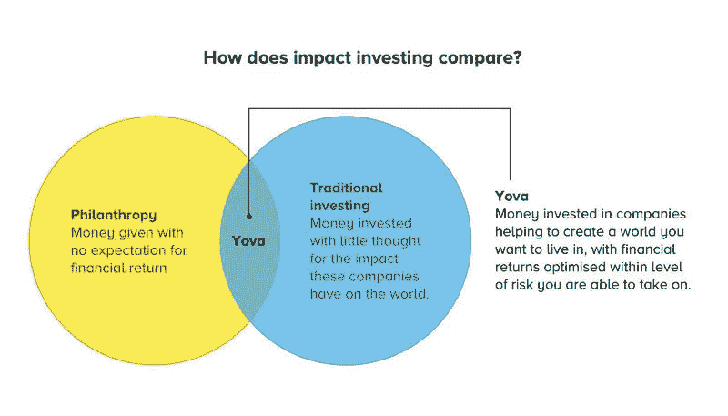

# 影响力投资:我们的定义

> 原文：<https://medium.datadriveninvestor.com/impact-investing-our-definition-d673cfb1a84a?source=collection_archive---------6----------------------->

传统上，慈善是为了改变世界，而增加你的财富是一个独立的、几乎截然相反的活动。但这种传统的投资方法忽略了一个事实，即公司是变革的巨大催化剂(不管是好是坏)。这就是[影响力投资](https://www.google.com/url?q=https://www.hbs.edu/faculty/Pages/item.aspx?research%3D7332&sa=D&ust=1527684640457000&usg=AFQjCNHHxvE7mN_ppgF9x3NSxsHt7-Mckg)出现的原因。

想想吧。二氧化碳排放、平等机会、人权、腐败……在这些问题上，公司处于主导地位。当你[成为 Yova](https://www.google.com/url?q=http://invest.yova.ch&sa=D&ust=1527684640453000&usg=AFQjCNF0MbQyuCH01CnX0Vm1oTntH2RJYA) 的影响力投资者时，你可以避开最坏的违规者，选择投资那些积极创造你希望看到的变化的公司。

听起来很简单，对吧？嗯，在金融行业，影响力投资的[定义变化很大](https://yova.ch/en/investment-insights/socially-responsible-investing-esg)。让我们来看看…

# 什么是影响力投资？

*“新一波投资者正在利用影响力投资来应对我们这个时代的一些最大挑战——从气候变化和水资源短缺到缺乏医疗保健、教育和经济适用房——他们还打算创造财务回报。”*

*–*朱迪思·罗丹在她的《影响力投资的力量

*Yova 如何定义影响力投资？我们采用了全球影响力投资网络的定义，它是全球影响力投资的权威机构。*

**“影响投资是指旨在产生社会和环境影响以及财务回报的投资。”**

*我们为日常投资者开发了一种方法，通过投资组合来增加他们的财富，旨在为整个世界的美好贡献力量。与此同时，我们的客户获得的投资是根据他们的兴趣和价值定制的，风险优化和多样化，旨在产生市场利率回报。你直接拥有他们名下的每一只股票(你和你的钱之间没有复杂的金融产品)。*

# *影响力投资是如何运作的？*

*当你选择影响力投资而不是传统投资时，财务回报必须被牺牲，这是一个常见的误解。虽然有许多影响力投资者确实将“影响力”看得比财务收益更重要，但投资有影响力的项目是可能的。而不影响回报。*

*我们的方法是帮助客户投资股票市场。你的个性化策略是围绕你所关心的公司设计的，但我们也确保它是充分多样化的，以便其表现尽可能接近股市。*

*我们关注的是大公司，它们天生就是强有力的游戏规则改变者。同时，它们也是可靠的投资。*

***我们有严格的标准来评估一家公司在你的投资组合中的合适性:***

***影响区域***

*可再生能源、电动汽车、物联网设备和医疗技术只是你投资的几个主题。我们总是问:这家公司通过它创造的产品让世界变得更美好了吗？*

***从摇篮到坟墓的影响***

*我们分析公司产品的整个生命周期:从原材料提取、制造、分销、使用、维修和维护，以及处置或回收。*

***排除标准***

*我们允许人们排除在核能、烟草、酒精、武器和战争领域有利益的公司。通过这种方式，你可以确保你的储蓄不会贡献给这些行业。这是你的投资，你的选择。*

***ESG 得分***

*我们正在考察一家公司的 ESG 分数与对你来说很重要的价值观(如污染、避税和人权)是否相符。更多关于我们如何打破公司的公关旋转[在这里](https://yova.ch/en/investment-insights/greenwashing)。*

***风险***

*您对 Yova 的投资是在您能接受的风险水平范围内设计的。你投资于在主要股票市场上市的大公司。这使你的长期回报更可预测，也意味着如果你需要，你可以很容易地收回投资。*

# *影响力投资:我能期待什么回报？*

*越来越多的证据表明[影响力投资可以比传统投资组合带来更高的回报](https://yova.ch/en/investment-insights/ethical-socially-responsible-investing-performance)。*

*–加拿大皇家银行[对 40 多项主要研究的审查](http://funds.rbcgam.com/_assets-custom/pdf/RBC-GAM-does-SRI-hurt-investment-returns.pdf)发现，没有证据表明社会责任投资会导致投资回报降低。*

*–GIIN 的 [2017 年度影响力投资者调查](https://thegiin.org/research/publication/annualsurvey2017)发现，大多数受访者实现了市场回报率，91%的人实现了达到或超过其专业预期的财务回报。*

*–哈佛大学的一项[荟萃分析](https://hbswk.hbs.edu/item/the-impact-of-corporate-sustainability-on-organizational-process-and-performance)(一项结合多项研究结果的统计分析)确定，应用社会责任标准评估基金对风险回报率没有负面影响。*

*一种理论认为，当股票投资组合围绕强大的环境和社会实践构建时，与环境罚款、油价波动、腐败和人权丑闻等相关的金融风险就会降低。*

# *应该投资什么公司？*

*首先，我们在我们的 [5 分钟问卷](https://yova.ch/en/create-profile)中找出对你来说什么是重要的。*

*也许你担心二氧化碳排放和全球变暖的影响。也许你对主要服装品牌的人权丑闻感到震惊。你可能会热衷于支持那些倡导机会均等的公司，或者那些在特定领域创新的公司——比如医疗技术、可再生能源或电动汽车。*

*然后，我们根据你的兴趣、激情、价值观和对未来的希望，为你定制投资策略。我们还会考虑您的风险状况和财务目标。*

*这个策略是免费的，没有约束力，但它充满了价值。您将看到我们推荐您投资的股票和债券的准确列表，以及货币分割和预期回报。*

***您可以用 Yova 投资的公司示例***

***英飞凌***

*一家德国半导体制造商，为世界上第一辆“eyes off”无人驾驶汽车提供零部件。在量子计算机时代，它还开辟了新的领域来抵御网络攻击者。*

***木质部***

*这家公司开发净化水和输送水的技术。不干净的水是发展中国家疾病和死亡的主要原因之一，而 Xylem 的生命精华项目帮助世界上最贫穷的人获得清洁的水。*

***潘多拉***

*这个珠宝品牌在青少年中非常受欢迎，致力于道德制造。它的泰国员工享受有竞争力的薪水、双倍加班费、免费餐、保险和育儿假。*

***Orsted***

*一家丹麦电力公司，已经将其业务从化石燃料转变为可再生能源。它的目标是到 2023 年只提供绿色能源，这意味着减排 96%。*

*这只是瑞士约瓦影响力投资宇宙中数百家公司中的一小部分。我们推荐的公司将根据你的个人兴趣和价值观量身定制。*

# *我的钱真的能有所作为吗？*

*你可能想知道你的钱是否能对一家价值数十亿的公司产生影响。但是真的可以。事实上，有一些影响投资的趋势，很多人投资一家公司，他们的具体目标是对公司的运营方式做出巨大的改变。*

*例如，一群[枪支安全活动家收购了武器制造商](https://www.google.com/url?q=https://www.nytimes.com/2018/05/09/business/sturm-ruger-shareholders-activists.html&sa=D&ust=1527686873559000&usg=AFQjCNGEEDdRcxUJda_1ZEd1-a7LYpiqCg) [Ruger](https://www.google.com/url?q=https://en.wikipedia.org/wiki/Sturm,_Ruger_%2526_Co&sa=D&ust=1527686873561000&usg=AFQjCNFdBNC6NnCI0hfS-O09DHx28KxLjA) 的大量股份，以便向该公司施加压力，监控与他们的枪支相关的暴力，并开发更安全的产品。*

*同样，看看[特斯拉](https://en.wikipedia.org/wiki/Tesla,_Inc.):它只有 14 岁，却引领电动汽车领域。没有投资者的信任，特斯拉不可能发展成现在的样子。也有可能，如果没有特斯拉的创新，其他汽车品牌不会感到发展其产品的压力。*

*当你用 Yova 投资你的钱时，你也在直接购买每家公司的股票。作为这些公司的部分所有者，你有权参加他们的股东大会，并对重大战略决策进行投票。由于许多投资者没有行使这一权利，这给了你真正的潜力去影响你所投资公司的方向。*

*我们还致力于让您可以在自己家中舒适地进行在线投票(敬请关注！).*

# *怎样才能成为影响力投资人？*

*如果你在瑞士，用 Yova 开始影响力投资很容易。第一步是参加我们的[调查问卷](https://yova.ch/en/create-profile)。这将让您深入了解我们为您量身定制的投资组合，以及您对世界的愿景。*

*大约需要 5 分钟，完全免费。在进行下一步之前，你可以根据自己的需要调整投资组合。*

*如果你已经有了 Yova 策略，请在这里登录查看[。](https://yova.ch/customers/login)*

*如果你接受了你的策略，那么恭喜你！通过投资，你不仅支持了公司的成功，你也成为了成功的一部分…增加你的储蓄，同时对世界产生积极的影响。*

*还有问题吗？查看我们的[常见问题](https://yova.ch/en/faq)或[联系我们的团队](https://yova.ch/en/contact)。*

**最初发表于*[*yova . ch*](https://yova.ch/en/investment-insights/impact-investing-definition)*。在 Yova，我们帮助人们通过符合他们价值观的投资组合来积累财富。**