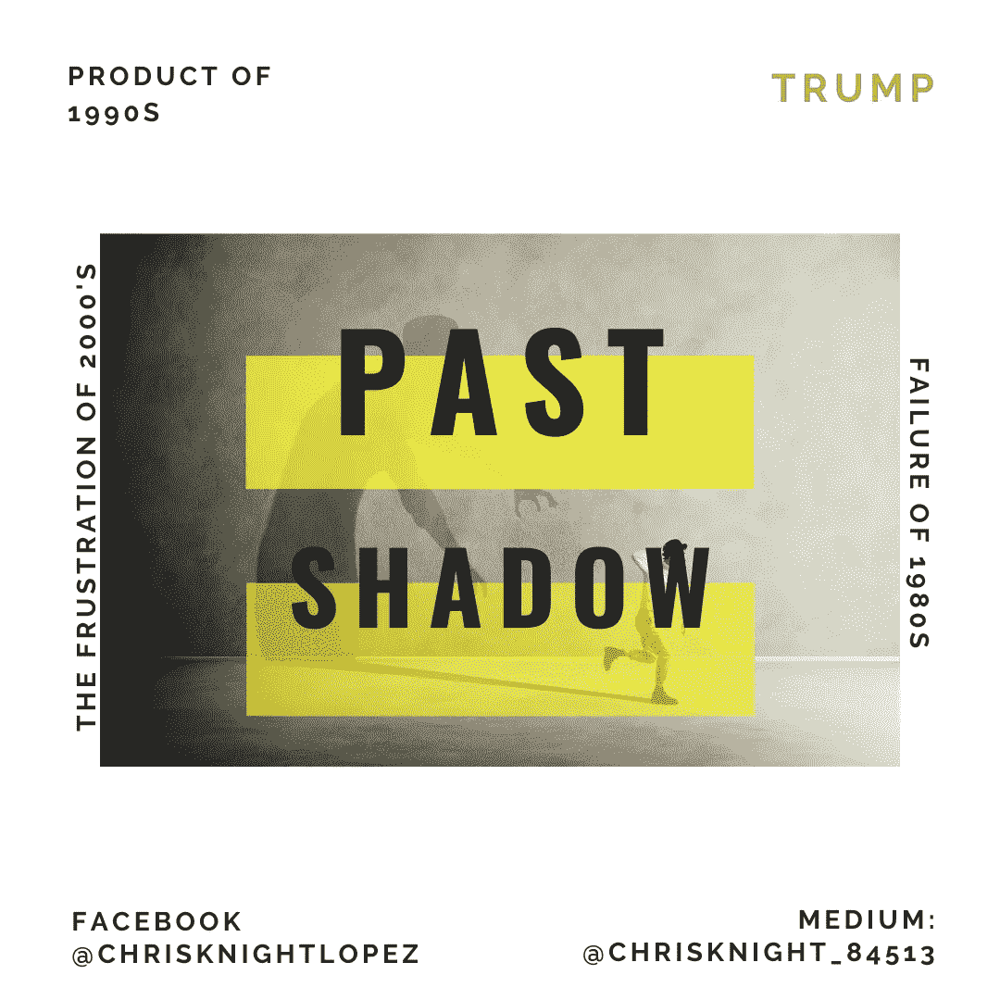

# 弹劾和特朗普政治是过去总统经济阴影的结果

> 原文：<https://medium.datadriveninvestor.com/impeachment-and-trump-politics-are-the-result-of-economic-shadows-cast-from-presidents-of-the-past-1c385eee6d89?source=collection_archive---------15----------------------->

Source: Self Created Image with Canva

我们现在的处境是别人的产物。唐纳德·特朗普不是解决方案，也不是问题。唐纳德·特朗普是挫折、想法和错误希望的顶峰。这些高潮被引向一个对自己的选择感到困惑的国家。

关于特朗普之前 20 年阴影的简要概述

比尔·克林顿卸任后留下了财政盈余和丑闻。他的政策遭到共和党的嘲笑。政治创造了一个基于议程和实质的弹劾程序。比尔·克林顿任期内道德受到伪君子质疑。

乔治·布什继承其父成为“民选寡头”。乔治·布什推出了过时的战争议程，这些议程在历史上对美国经济有利，但在 9/11 后不再适用。银行纾困是布什颁布的，因为他忽视了技术进步对制造业和企业自动化的影响。乔治·布什发表了缺乏魅力的演讲，寻求超级政治行动委员会的支持者，并展示了家族传统的偏见。

 [## 保护主义、政治和经济动荡|数据驱动的投资者

### 美国股市昨日出现 400 多点的大幅反转，为未来的事情发出了警告信号。市场…

www.datadriveninvestor.com](https://www.datadriveninvestor.com/2018/06/28/protectionism-politics-economic-turmoil/) 

巴拉克·奥巴马在竞选中倡导系统内的积极变革。作为一个在内部工作的局外人，巴拉克带来了希望。巴拉克发表了富有魅力的演讲，嘲笑超级政治行动委员会的支持者，并展示了每一个破碎家庭的美国人的家庭传统。那时，巴拉克被石墙围住，被权势集团削弱，政策处处遭到拒绝。巴拉克的政策本应取得的效果被政治爆炸吹走了。车轮开动了，堵塞了每个政治关节。由于共和党占多数，巴拉克获得了美国历史上最低的法案通过率。

战胜挫败感的爆发

特朗普是失败的制度和改变制度的失败尝试的产物。特朗普的情况没有什么复杂的。特朗普是巴拉克承诺的变革失败的结果，是 20 世纪 80 年代垂死一代仍然想要的家族遗产，也是民主党在克林顿弹劾调查中让共和党回来的结果。

> 唐纳德·特朗普是美国人民渴望看到变革和阻止变革的冲突的升级。

*想点事*。*为什么在唐纳德·川普第一个总统任期的最后几天发起弹劾调查*？**简单的回答是“连任竞选”**。如果特朗普没有公开宣布他希望寻求第二个任期，我强烈倾向于特朗普的弹劾调查可能会在委员会中夭折。

世卫组织将来要支持

唐纳德·特朗普所做的不过是在他之前的至少 10 位总统。合法吗？也许吧。特朗普是否利用他的办公室来影响外国势力？我认为每一位总统都需要用国家的资源来换取顺从。我看不出乌克兰发生的任何事情是非法的。我确实看到它瞄准了一个政治对手。

滥用权力指控的讽刺之处在于，如果拜登不竞选公职，可能就没有弹劾调查的理由。

仔细考虑一下。

我不是特朗普的支持者。我个人喜欢乔·拜登。我不知道我是否会投票给乔·拜登。我还没有下定决心。我不是特朗普的支持者，因为在我看来，他不代表今天的美国。道德至上也值得怀疑。我们需要一个和所有社区都有联系的人，而不仅仅是一个。

> 美国不再是盎格鲁-撒克逊了。美国是多元化的，我们的总统需要反映我们国家的多元化。

我认为特朗普是有目的的。特朗普导致无政府状态，以解决人们在过去 20 年里一直回避的问题。这些问题围绕着 1)不负责任的货币政策，2)消除现状政治，3)取消糟糕的贸易协定，4)解决不尊重美国边界的问题。

20 年来没有解决的核心问题

货币政策问题很简单。停止印钞和增加赤字。货币贬值不是答案。

现状政治需要停止。需要消灭权力掮客和国王创造者。金钱不应该成为政客当选的理由。令人作呕的是，一亿美元被花在一个候选人身上来谈论如何帮助我们。法律应强制新闻媒体、报纸和所有媒体机构允许候选人免费向公众发表讲话，以维护他们开展活动的国家。

经济政策研究所 2011 年的一份报告估计，北美自由贸易协定将导致 682，900 人失业。公司[威胁要搬到墨西哥](http://digitalcommons.ilr.cornell.edu/cgi/viewcontent.cgi?article=1002&context=reports)到[阻止工人加入工会](https://www.epi.org/blog/naftas-impact-workers/)。没有工会，工人们就无法争取更高的工资。这一策略非常成功，成为了标准操作程序。在 1993 年到 1995 年间，一半的公司使用它。到 1999 年，这一比例已经上升到 65%。北美自由贸易协定糟透了，我们都知道。没有人对此采取任何措施，特朗普撕毁了它。

我认为移民比在这里出生的人工作努力一百倍。总的来说，我们这一代人懒惰，缺乏职业道德。我写过千禧一代的财务状况，它并不好。尽管我渴望看到移民，但我们需要停止允许那些没有合法入境的人留在一个国家。对不起，我没有同情心。这不公平。人们需要尊重我们的公共支持系统是为公民和那些合法进入。我认为不管情况如何，非法移民都应该被当场驱逐出境。糟透了。没有好的选择，但如果不尊重正当程序，一切都会崩溃。我的选择糟透了，让他们留下的选择也糟透了。这就像选择两个坏苹果。它们都变质了，没有人想吃。

最后

记住，没有什么事情是一夜之间发生的，但它会一蹴而就。每一个现状都是过去行为的产物。关注今天发生的事情，但永远不要忘记它是如何开始的。永远不要忘记今天造就明天。在 [Medium](https://medium.com/@chrisknight_84513) 上关注我，或者订阅我的[时事通讯](http://www.christopherklopez.com/)，了解更多关于为什么我的结束策略有效的有见地的建议。

祝你知识成功！

****

关于 Christopher:Christopher Knight Lopez 是一名职业骗子，在他的职业生涯中，他与职业企业家进行了广泛的合作。在他 14 年的职业生涯中，Christopher 已经开了超过 7 家公司。克里斯托弗的目的是利用各种市场驱动的机会。Christopher 是注册项目经理(MPM)和认证财务分析师(AFA)。Christopher 之前通过了 65 系列证券执照考试。克里斯托弗也有他的总路线——人寿、意外、健康和健康维护组织。Christopher 已经管理了总计 2 . 86 亿美元的报告管理资产和建议资产。Christopher 在 29 个国家有工作经验，为各种业务筹集了超过 5000 万美元，在他的个人职业生涯中总收入超过 1300 万美元。Christopher 曾在高科技行业工作:生物技术、金融、证券、制造、房地产和住房抵押贷款。克里斯托弗是一名美国空军老兵。克里斯托弗热爱家庭、竞技体育、钓鱼、武术，并倡导企业家精神。克里斯托弗为崭露头角的企业家提供自助课程。克里斯托弗对导师的热情来自于企业家和骗子需要指导的信念。这个世界充满了关于企业家身份的相互矛盾的信息。在 www.christopherklopez.com[看更多。](http://www.christopherklopez.com.)