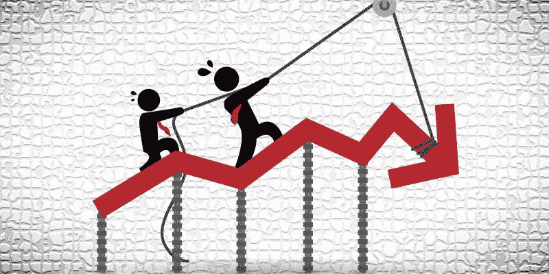
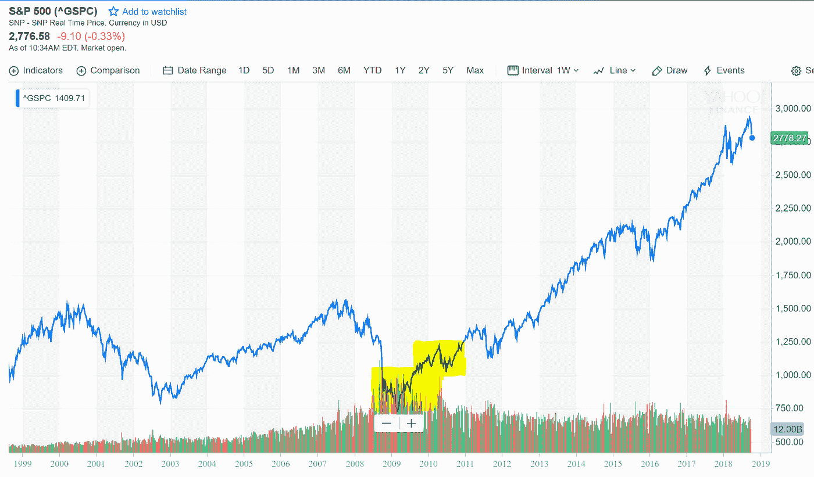
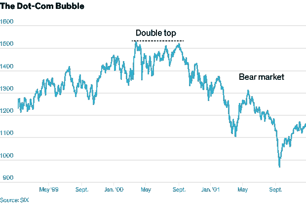
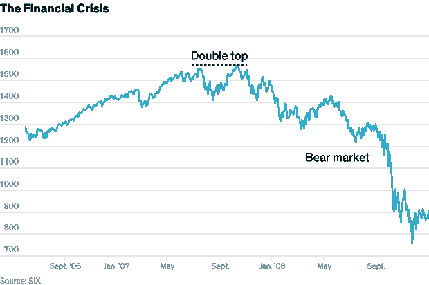
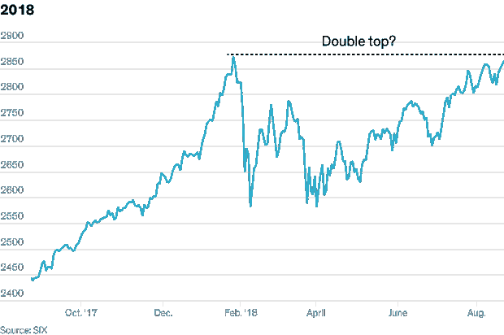

# 迫在眉睫的衰退:害怕吗？你应该害怕

> 原文：<https://medium.datadriveninvestor.com/impending-recession-scared-you-should-be-8605180104c?source=collection_archive---------16----------------------->

P/S:为了简单和方便公众理解，将尽可能避免夸张的词语和指标，以确保最大限度的理解

# 背景

衰退已经并将永远是许多市场精明的投资者甚至普通大众挥之不去的想法，因为它几乎影响到与他们的经济福利有关的所有方面。问题不在于“是否”会发生衰退，而在于“何时”会发生。

自从 2008 年的原子弹像雪崩一样袭来的十年前的新闻以来，时间过得真快。此后，房价下跌了三分之一左右，美国失业率徘徊在 9%左右，许多人直到今天仍在复苏。

现在不要去“谷歌”下一次衰退是什么时候。谷歌唯一会让你失望的时候是在你搜索诸如生命的意义或者时钟发明的确切时间以及这个特定话题的时候。好好想一想，如果所谓的专家经济学家和金融机构知道什么时候会发生，为什么还会有这么多同样的想法、恐慌和遭受重大损失呢？如果每个人都期待经济衰退，那么它永远不会发生，我再重复一遍，永远不会发生。

# 描述

正如人们所料，世界上最大的经济体(不会很久了……)仍然是美国。因此，有理由假设美国市场将受到影响，并可以作为全球经济任何潜在变化的主要指标。让我们看看自上次衰退以来，标准普尔 500 迄今为止的表现，除了“棒极了”之外，没有别的词。我的意思是你能看看那张唱片吗…

如果你在黄色方框中的价位买入，你会赚到一大笔钱。这种价格趋势的增长似乎是乐观的，就像没有明天一样。或者在加密货币圈，我们称之为“蓝宝月亮”。问题是，上升的必然下降，对吗？也可以有把握地说，无论何时一个企业扩张过快，通常都会以灾难性的灾难而告终。

> *“Pfftt……不可能是崩溃，只是小修正。大多数指标预计它将反弹，这是胡说八道，因为新闻没有说任何关于它的事情。*

又..如果预测如此容易，那么每当经济衰退出现时，就不会有如此多的伤亡。它总是在最意想不到的时候出现。

我们来看一个叫双顶的东西，它基本上是在价格在一个上升趋势内制造高点，然后回调时形成的。在下一轮反弹中，价格在前期高点附近见顶，然后跌破回调低点。它被称为双顶，因为价格在同一区域两次见顶，无法移动到该阻力区域上方。

借鉴 21 世纪初网络泡沫的经验。在刚刚超过 1520 美元的水平形成了一个双顶，市场随后跌入熊市。对许多人来说预示着衰退。还不服气？让我们看另一幅插图

这是每个人都可以联想到的事情，因为有些人可能没有出生，也没有老到足以理解 2000 年代经济低迷的灾难性影响。2008 年的金融危机见证了双顶的形成，接下来发生的事情被写进了历史书。随之而来的是……整个市场在最低点下跌了 50%。

交叉引用我们当前的标准普尔 500 指数图表？

时间旅行到今天，10 月 10 日的 S&P 见证了所有主要科技股进入调整阶段，该指数在一天内下跌超过 4%，当你阅读这篇文章时，可能仍然如此。

这是否意味着衰退即将来临？非常主观，但你可以看到模式正在形成，这是不容忽视的。这可能会在下个月甚至一年后发生。所有已知的是，迹象就在那里，明智的做法是更加关注。