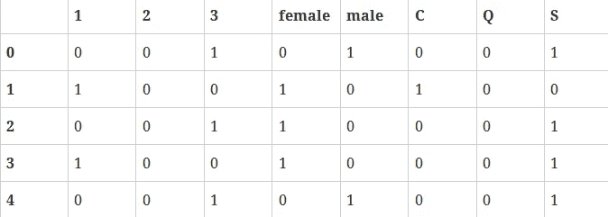

# 海量数据预处理的实现

> 原文：<https://medium.datadriveninvestor.com/implementation-of-data-preprocessing-on-titanic-dataset-6c553bef0bc6?source=collection_archive---------2----------------------->

## 通过逐步实施


# 需要什么？

1.  Python，Numpy，熊猫
2.  Kaggle 泰坦尼克号数据集:[https://www.kaggle.com/c/titanic-gettingStarted/data](https://www.kaggle.com/c/titanic-gettingStarted/data)

# 目标

机器学习模型应该能够预测泰坦尼克号沉船事故中的幸存者。

在这里，我将向您展示如何在 Titanic 数据集上应用预处理技术。

# 为什么需要做预处理？

为了让机器学习算法工作，需要将**原始数据**转换为**干净的** **数据集**，数据集必须转换为**数值数据**。您必须将所有的**分类标签**编码成具有二进制值的列向量。**数据集中缺少值**或 NaNs 是一个恼人的问题。您必须丢弃丢失的行，或者用平均值或插值来填充它们..

注:Kaggle 提供 2 个数据集:分别是训练和结果数据。两者必须具有相同的模型尺寸。

## **在熊猫中加载数据**

要处理数据，您可以在 excel 软件或 pandas 中加载 CSV。让我们在 pandas 中加载 csv 数据。

```
df = pd.read_csv('train.csv')
```

让我们看看下面的数据格式

```
>>> df.info()
 <class 'pandas.core.frame.DataFrame'>
 Int64Index: 891 entries, 0 to 890
 Data columns (total 12 columns):
 PassengerId 891 non-null int64
 Survived 891 non-null int64
 Pclass 891 non-null int64
 Name 891 non-null object
 Sex 891 non-null object
 Age 714 non-null float64
 SibSp 891 non-null int64
 Parch 891 non-null int64
 Ticket 891 non-null object
 Fare 891 non-null float64
 Cabin 204 non-null object
 Embarked 889 non-null object
```

如果你仔细观察熊猫的上述总结，总共有 891 行，年龄显示只有 714(意味着失踪)，登船(2 失踪)和客舱失踪了很多。对象数据类型是非数字的，所以我们必须找到一种方法将它们编码成数字值。

## **删除无用的列**

让我们尝试删除一些对我们的机器学习模型没有太大贡献的列，如姓名、机票、客舱等。

```
cols = ['Name', 'Ticket', 'Cabin']
df = df.drop(cols, axis=1)
```

我们删除了 3 列:

```
>>>df.info()
 PassengerId 891 non-null int64
 Survived 891 non-null int64
 Pclass 891 non-null int64
 Sex 891 non-null object
 Age 714 non-null float64
 SibSp 891 non-null int64
 Parch 891 non-null int64
 Fare 891 non-null float64
 Embarked 889 non-null object
```

## **删除缺少值的行**

接下来，如果需要，我们可以删除数据中有缺失值(NaN)的所有行。你可以这样做

```
df = df.dropna()>>>df.info()
 Int64Index: 712 entries, 0 to 890
 Data columns (total 9 columns):
 PassengerId 712 non-null int64
 Survived 712 non-null int64
 Pclass 712 non-null int64
 Sex 712 non-null object
 Age 712 non-null float64
 SibSp 712 non-null int64
 Parch 712 non-null int64
 Fare 712 non-null float64
 Embarked 712 non-null object
```

## **删除缺少值的行的问题**

在删除缺少值的行后，我们发现数据集从 891 行减少到 712 行，这意味着我们在浪费数据。机器学习模型需要数据进行训练才能表现良好。所以我们保存数据并尽可能地利用它。我们稍后会看到它。

## **创建虚拟变量**

现在我们将 Pclass，Sex，apollowed 转换为 pandas 中的列，并在转换后删除它们。

```
dummies = []
cols = ['Pclass', 'Sex', 'Embarked']
for col in cols:
    dummies.append(pd.get_dummies(df[col]))
```

然后

```
titanic_dummies = pd.concat(dummies, axis=1)
```

我们将 8 列转换为 1，2，3 代表乘客级别的列。



最后，我们逐列连接到原始数据帧

```
df = pd.concat((df,titanic_dummies), axis=1)
```

既然我们已经将 Pclass，Sex，apollowed 值转换为列，那么我们就从数据帧中删除多余的相同列

```
df = df.drop(['Pclass', 'Sex', 'Embarked'], axis=1)
```

让我们看看新的数据框架

```
>>>df.info()
 PassengerId 891 non-null int64
 Survived 891 non-null int64
 Age 714 non-null float64
 SibSp 891 non-null int64
 Parch 891 non-null int64
 Fare 891 non-null float64
 1 891 non-null float64
 2 891 non-null float64
 3 891 non-null float64
 female 891 non-null float64
 male 891 non-null float64
 C 891 non-null float64
 Q 891 non-null float64
 S 891 non-null float64
```

## **处理丢失的数据**

一切都是好的，除了年龄，它有许多缺失的价值。让我们计算所有年龄的中值或插值()并填充那些缺失的年龄值。Pandas 有一个 interpolate()函数，将所有缺失的 nan 替换为插值。

```
df['Age'] = df['Age'].interpolate()
```

现在让我们观察数据列。请注意年龄现在是用新的估算值插入的。

```
>>>df.info()
 Data columns (total 14 columns):
 PassengerId 891 non-null int64
 Survived 891 non-null int64
 Age 891 non-null float64
 SibSp 891 non-null int64
 Parch 891 non-null int64
 Fare 891 non-null float64
 1 891 non-null float64
 2 891 non-null float64
 3 891 non-null float64
 female 891 non-null float64
 male 891 non-null float64
 C 891 non-null float64
 Q 891 non-null float64
```

# 将数据帧转换为 numpy

现在，我们已经将所有数据转换为数字，是时候为机器学习模型准备数据了。这就是 scikit 和 numpy 发挥作用的地方:

> *X =具有 14 个属性的输入集
> y =小 y 输出，在这种情况下“幸存”*

现在，我们将数据帧从 pandas 转换为 numpy，并分配输入和输出

```
X = df.values
y = df['Survived'].values
```

x 仍然保留了一些不应该存在的值。所以我们放入 numpy 列，这是第一列。

```
X = np.delete(X, 1, axis=1)
```

## **将数据集分为训练集和测试集**

现在我们已经准备好 X 和 y，让我们使用 scikit model_selection 将数据集分为 70%的训练集和 30%的测试集

```
from sklearn.model_selection import train_test_split
X_train, X_test, y_train, y_test = train_test_split(X, y, test_size=0.3, random_state=0)
```

就这些了，伙计们。

您已经学习了如何预处理 titanic 数据集中的数据。所以继续吧，自己试试，开始做自己的预测。