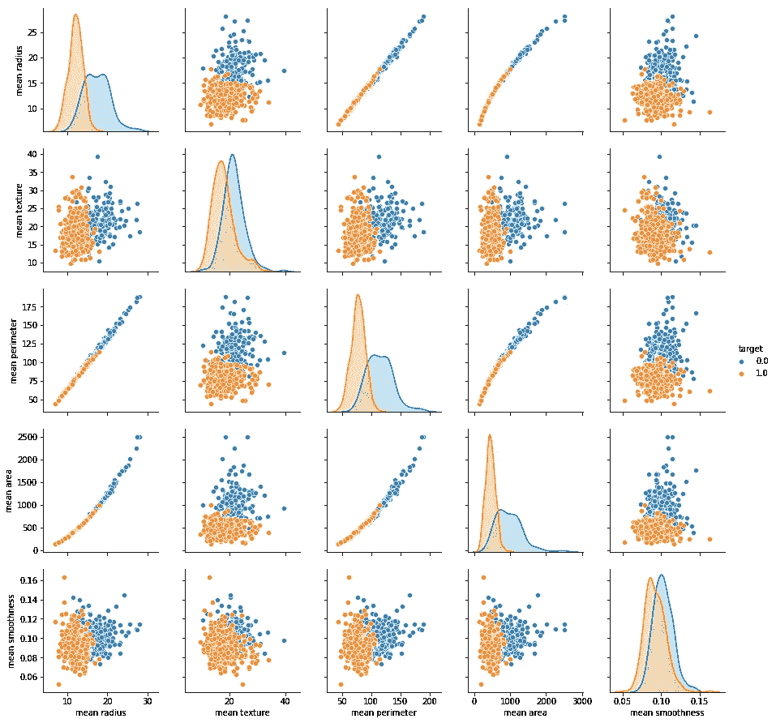
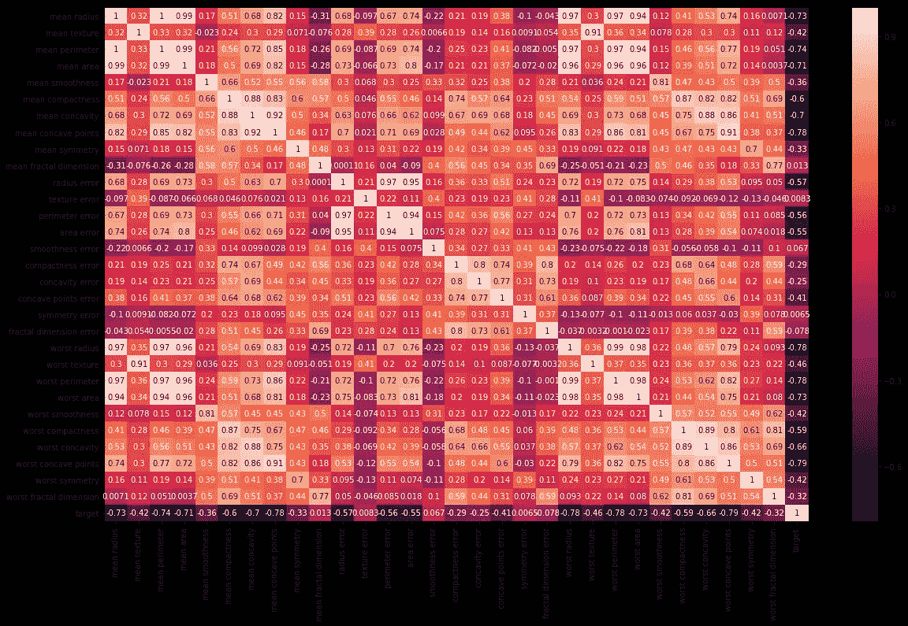
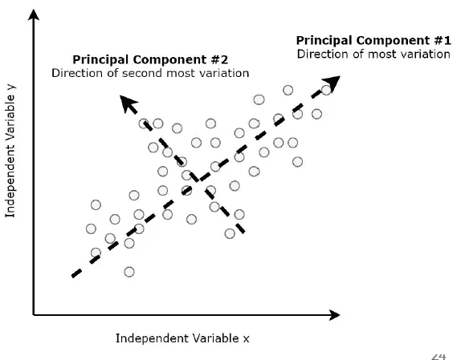
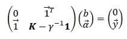
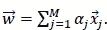
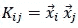
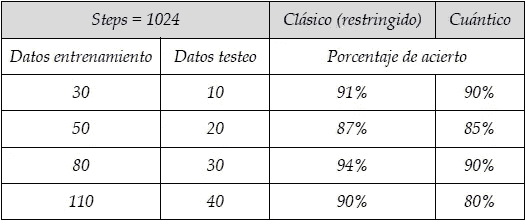

# 使用 Qiskit 库实现量子 SVM

> 原文：<https://medium.datadriveninvestor.com/implementation-of-quantum-svm-using-the-qiskit-library-9eabb6a6270a?source=collection_archive---------1----------------------->

在本节中，我们将研究用 Python(3.5 版)完成的三个模拟。两个使用来自 Python 库 Scikit learn (0.20.0)的传统机器学习进行，另一个使用 IBM cloud 及其量子机器学习库 Qiskit (0.10.1)中的量子计算机模拟器。这三个模拟是在同一个数据集上进行的:从 Python 的 Scikit learn (0.20.0)库([https://scikit-learn.org/stable/datasets/](https://scikit-learn.org/stable/datasets/))获得的乳腺癌。该数据集收集表征肿瘤的 31 个参数的信息，其中包括:平均半径、平均周长、平均纹理(灰度颜色)等。

这篇文章属于涵盖我关于量子机器学习的最终论文的系列文章。[这里是第一个](http://medium.com/@agus.bignu97/quantum-machine-learning-a7d8d135bc58)的链接。

 [## 2019 年即将改变世界的技术|数据驱动的投资者

### 很难想象一项技术会像去年的区块链一样受到如此多的关注，但是……

www.datadriveninvestor.com](https://www.datadriveninvestor.com/2019/01/17/the-technologies-poised-to-change-the-world-in-2019/) 

为了能够相互比较，进行了三次模拟，它们都是自己精心制作的。由于篇幅的原因，每一个的代码都没有写下来，但是它们都在这个库中:【https://github.com/abignu/TFG。

我们将开始讨论两个经典的模拟。其中一个模拟覆盖了完整的数据集，是三个模拟中最精确的。另一个是用与量子模拟相同数量的参数进行的，因为用来编码输入信息的量子位只允许有限的一组信息。因此，为了使比较尽可能可靠，就这样做了。

在所有的模拟中，为了使数据适应我们将要使用的模型，进行了先前的数据处理。进行分析是为了了解变量之间的关系，以及哪些数据对最终结果的影响最大。使用 Python 3.5 进行分析。具体来说，它是用库 Matplotlib (2.2.2)、Pandas (0.20.3)、Seaborn (0.9.0)和 NumPy (1.16.3 + mkl)实现的。

获得的图像如下:

Figure 1: relationships between the main parameters. In blue the malignant predictions and in orange the benign ones.

Figure 2: Correlation between all the parameters of the dataset. It is useful at the time of seeing which parameter influences more in the result.

如我们所见，该模型执行二元分类:恶性或良性。在使用完整数据集的模拟中，我们获得了 99%的成功概率。我们说它是完整的，因为使用了 31 个参数和总共 500 个数据来执行分类。另一方面，我们只有 2 个参数，因为我们应用了一种称为主成分分析的算法，该算法告诉我们在面对预测时哪些参数最有影响。

Figure 3: PCA for a binary dataset [1]

至于量子算法，就从我们用的库说起:Qiskit。它是一个高级库，允许我们通过编程实现量子电路。因为它面向量子计算，所以它有多种形式(化学物理、人工智能、金融和优化)。欲了解更多信息，请访问[2]。

具体来说，Qiskit 已经实现了一些机器学习算法，其中我们发现 QSVM。这是在下面的[文章](https://medium.com/@agus.bignu97/svm-and-neural-networks-d8f1ea0df8f)中介绍的算法的量子版本，用于其他两个模拟[3]。在这个量子版本中，我们使用 SVM 的一个版本，称为 SVM 最小二乘(LS-SVM，最小二乘支持向量机的缩写)[4]。我们通过求解下列线性方程组找到 SVM 过程来优化超平面:

(1)

其中 ***K*** 是维数为 M×M 的核矩阵，γ是调整参数，并且 ***α*** 形成由下式给出的法向量 ***w***

(2)

其中 *x* 表示数据集， ***w*** 表示权重，参见下面的[文章](https://medium.com/@agus.bignu97/svm-and-neural-networks-d8f1ea0df8f)。

在[3]中，他们考虑了下面的 ansatz

(3)

这个 ansatz 建立了超平面的形式。在这种情况下，我们希望它是一条线。然而，我们可以选择另一个 ansatz，它给出了另一种形式的超平面。在量子计算机中，使用量子算法求解直积[5]并获得核，然后使用量子算法求解线性方程组[3]，然后用训练的量子位进行预测。用于求解线性方程组的算法称为 HHL 算法。

使用的算法如下:

*   获取内核 ***K.***
*   解决①和获得|𝑏， **𝛼** ⟩.
*   使用数据 ***x*** 和先前训练|𝑏、 **𝛼** ⟩.的结果执行分类

第一步和第二步是在量子计算机内部完成的。第三个是在量子计算机之外完成的。这给出了该算法的变分算法(VA)的结构。

VA 是介于经典计算和量子计算之间的混合算法。这意味着一部分工作在量子计算机中完成，另一部分在经典计算机中完成。

对于这个模拟，一个受限的数据集被用作第二个经典模拟的数据集。也就是说，我们从与其他两个数据集相同的数据集开始，执行与第二次模拟相同的程序。我们只剩下对预测贡献最大的两个参数。

遵循这项工作的主要目标(看看人工智能和量子计算是否可以一起工作)，对 QSVM 和经典受限 SVM 进行了几次模拟。通过这种方式，我们可以看到两种算法如何以相同的迭代次数攻击同一个数据集(以便比较尽可能准确)。

表 1 显示了模拟的结果:

Table 1: results obtained from the simulations.

总而言之，在相同的训练条件下，经典版本的 SVM 比量子版本的算法执行更好的分类。但是，这让我们看到，今天的量子计算在许多任务上等同于常规计算机(参见之前的文章:[应用量子退火来训练深度神经网络](https://medium.com/@agus.bignu97/application-of-quantum-annealing-to-training-deep-neural-networks-6e91ccf201ec)，[利用量子退火的贝叶斯网络结构学习](https://medium.com/@agus.bignu97/bayesian-network-structure-learning-using-quantum-annealing-1de6c849e7fd)，[利用量子玻尔兹曼机器的强化学习](https://medium.com/datadriveninvestor/reinforcement-learning-using-quantum-boltzmann-machines-7949855d3dd))，能够完成机器学习覆盖的许多任务。事实上，鉴于量子计算的潜力，它可以解决经典计算无法解决的问题。

在这种情况下，值得注意的是量子算法解决问题的速度更快。量子计算的能力允许我们解决对数级的复杂优化问题，而传统上是多项式级的。

# 结论

我们已经介绍了三个模拟，你可以在我的 [GitHub repo](https://github.com/abignu/TFG) 中找到。其中两个是经典，第三个是量子。

在下一篇文章中，我们将涵盖本系列所有文章中获得的全局结论。此外，我们将进一步解释变分算法。

希望你们都喜欢我的论文，并开始在 QML 寻求新的挑战。

保持下去！

# 参考

[1]图 3:[https://hacker noon . com/principal-component-analysis-unsupervised-learning-model-8 f18 c 7683262](https://hackernoon.com/principal-component-analysis-unsupervised-learning-model-8f18c7683262)

[2]Qiskit.org

[3]Patrick J. Coles 等人，量子算法初学者实现，arXiv:1804.03719v1 [cs .ET]，2018。

[4]Patrick Rebentrost、M . Mohseni 和 Seth Lloyd。用于大数据分类的量子支持向量机。113:130503, 2013.

[5]S. Lloyd、M. Mohseni 和 P. Rebentrost,《有监督和无监督机器学习的量子算法》。ArXive-prints，2013 年 7 月。