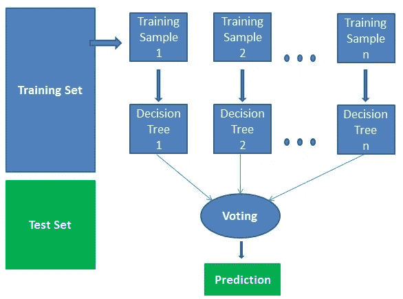
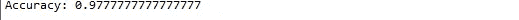

# 随机森林的实现

> 原文：<https://medium.datadriveninvestor.com/implementation-of-random-forest-7bd04ceedeb2?source=collection_archive---------6----------------------->

因此，现在我们将借助 python 的 **scikit learn** 库下的一些预定义模型来研究随机森林算法的实现部分。

首先让我们谈谈这个算法的工作原理。

*   从数据集中选择随机样本。
*   为每个样本构建决策树，并从每个决策树中获取预测结果。
*   获得每个预测结果的投票。
*   选择票数最多的预测结果作为我们的最终预测。



Source : [DataCamp](http://www.datacamp.com)

现在，在继续实现之前，让我们检查一下使用随机森林有什么好处。

## 优势

*   由于参与该过程的决策树的数量，它被认为是一种非常准确和稳健的方法。
*   它可用于分类和回归问题。
*   这种算法不会出现过拟合的问题，因为它考虑了抵消偏差的预测平均值。
*   它还可以处理丢失的值。这有两种方法，一种是用中值代替连续变量，另一种是计算缺失值的近似加权平均值。
*   我们可以获得关于相对重要的特征的信息，这有助于以更好的方式计算精度。

## 履行

```
from sklearn import datasets
import pandas as pd
from sklearn.model_selection import train_test_split
from sklearn.ensemble import RandomForestClassifier
from sklearn import metrics
iris = datasets.load_iris()
data=pd.DataFrame({
    'sepal length':iris.data[:,0],
    'sepal width':iris.data[:,1],
    'petal length':iris.data[:,2],
    'petal width':iris.data[:,3],
    'species':iris.target
})
X=data[['sepal length', 'sepal width', 'petal length', 'petal width']]  # Features
y=data['species']  # Labels
X_train, X_test, y_train, y_test = train_test_split(X, y, test_size=0.3, random_state=17)
clf=RandomForestClassifier(n_estimators=100) #creating a gaussian classifier
clf.fit(X_train,y_train)
y_pred=clf.predict(X_test) #prediction on test set
print("Accuracy:",metrics.accuracy_score(y_test, y_pred))
clf.predict([[3, 5, 4, 2]])
```



这是准确性的结果。

因此，我们着眼于实现随机森林分类器。

***快乐编码！！！***