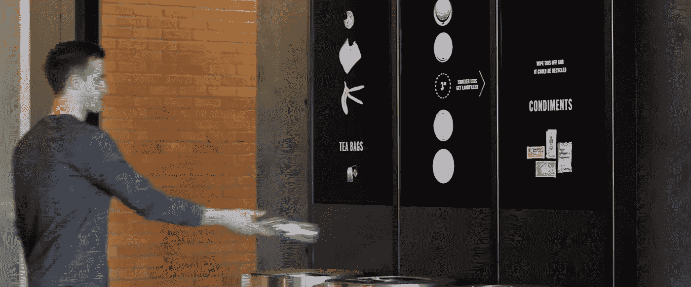

# 实现废物处理的最佳算法

> 原文：<https://medium.datadriveninvestor.com/implementing-a-best-algorithm-to-wastage-disposal-f5626106c2bc?source=collection_archive---------8----------------------->

巨大的增加是 ***城市化*** 垃圾产量的增加。现在许多国家使用传统的方法来收集垃圾，因此市政委员会/市政委员会越来越努力，花费更多的时间和金钱来收集和处理垃圾。这里我介绍收集损耗的最佳算法。这是我在 Medium 的第 12 篇文章。

垃圾给日常生活带来了更多的不便。收集那些废物对生活非常重要。在传统方法中，废物收集车随机前来收集。所以我们想管理废物处理。许多发展中国家推出了 ***智能垃圾箱*** 但大多数都没有实现收集算法。

 [## 投资算法快速指南|数据驱动投资者

### 让我们想象一下 30 年前的股票市场:让我们想象一下现在:像现在的许多其他领域一样，投资市场已经…

www.datadriveninvestor.com](https://www.datadriveninvestor.com/2019/01/31/a-quick-guide-to-investment-algorithms/) 

我想你们很多人都不知道什么是智能垃圾箱。智能垃圾桶是垃圾桶的高级版本。智能垃圾箱有废物收集容器、传感器和发射器。 ***容器*** 用于收集废弃物。 ***传感器*** 用于采集所需数据。 ***发送器*** 用于将采集的数据发送到损耗管理系统。

如果我们实现了智能垃圾箱，却没有收集垃圾的算法，那么这种实现是没有效率的。废物收集车辆路线将提高效率。这里我们要用一个类似**T21 优步**公司的算法。当智能箱中的发射器发送数据时，废物收集车辆驾驶员必须获得更好的收集废物的路径。接收数据会随时间变化。这里我用带时间窗的取货和送货问题( ***PDPTW*** )带 ***距离矩阵算法。***

在 PDPTW 中，每个请求都由一个提货地点、一个交货地点以及要在这两个地点之间运输的货物来指定。这是多次取货和一次掉货的问题。所以司机得到了最有效的方法，他将节省时间。

距离矩阵算法，距离矩阵是一个包含距离的二维数组。谷歌地图平台也提供距离矩阵实现的 API，但我们想为此付费。[链接](https://cloud.google.com/maps-platform/?__utma=102347093.720389262.1535980918.1535980935.1535980935.1&__utmb=102347093.0.10.1535980935&__utmc=102347093&__utmx=-&__utmz=102347093.1535980935.1.1.utmcsr=(direct)|utmccn=(direct)|utmcmd=(none)&__utmv=-&__utmk=157494714&_ga=2.33988129.1238007477.1535980918-720389262.1535980918#get-started)

PDPTW 来源[链接](https://www.google.com/url?sa=t&rct=j&q=&esrc=s&source=web&cd=2&cad=rja&uact=8&ved=2ahUKEwiQh8qC6Z7dAhUKfCsKHcOuBT4QFjABegQICRAC&url=https%3A%2F%2Fwww.springer.com%2Fcda%2Fcontent%2Fdocument%2Fcda_downloaddocument%2F9783658068684-c1.pdf%3FSGWID%3D0-0-45-1472206-p176890452&usg=AOvVaw0xWj9BOlOHPvpZQLWQKNty):

***感谢您阅读至此。如果你喜欢这篇文章，请分享、评论并发表👏几次(最多 50 次)。。。也许会对某个人有帮助。***

***关注我的***[***Twitter***](https://twitter.com/TheSabesan)***和 Medium 如果你将来对这些更深入、更翔实的文章感兴趣的话！***