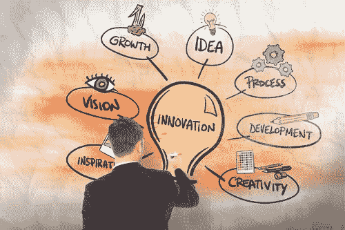

# 实施人工智能#1:战略层面的观点

> 原文：<https://medium.datadriveninvestor.com/implementing-ai-1-perspectives-from-a-strategic-level-27d3ffab3eea?source=collection_archive---------17----------------------->

在我之前的[博客](https://medium.com/voice-tech-podcast/a-simple-way-to-explain-the-recommendation-engine-in-ai-d1a609f59d97)中，它讨论了推荐引擎以及为什么它在商业环境中是必不可少的。

在这篇博客和随后的三篇文章中，我们将超越单个 AI 组件及其相关功能。我们将评估在企业层面成功实现人工智能的前景，可以说是四个关键支柱。四个关键支柱是(1)战略框架，(2)基础设施蓝图，(3)人的“更新”角色，以及(4)风险管理和道德。

 [## 人工智能与创意:作为创意引擎的 BigGAN |数据驱动的投资者

### 的确，2018 年可以被视为人工智能创造的创造力全盛时期的开始。当然可以…

www.datadriveninvestor.com](https://www.datadriveninvestor.com/2019/02/13/ai-creativity-biggan-as-a-creative-engine/) 

在本文中，我们将从战略框架开始。同样，我们不会深入技术细节，因为这个博客的目的是为基础理解服务。

Source: inpdcenter.com

# 战略框架

战略上有两种创新，**制度创新，**和**竞争创新**。下面的例子说明了这两种类型的创新。

区块链技术是一种系统创新，协作至关重要。只有在整个行业都参与的情况下，骑在区块链上的市场参与者才会收获利益(无论是利润还是储蓄)*。在这种情况下，率先营销和开发区块链没有什么价值，因为如果你独自一人，没有其他利益相关者愿意与区块链交易或定居。*

人工智能属于系统创新的另一个领域——竞争性创新。尽管基础研究是高度协作的，但基于人工智能的自动交易算法等应用被严格视为行业机密。一个优秀的基于人工智能的算法为竞争对手提供了竞争优势，如在实施人工智能技术时降低成本或风险。

## 系统创新方法

对于系统创新来说，与关键利益相关者的合作至关重要，持续的参与和沟通有助于社区朝着正确的方向前进。通常，对于与机构群体进行公开讨论和分享结果/成果没有或很少保留。从经济上来说，将一些资金投入到实际发展中是有意义的，但不要超过推动社区发展所必需的。[因此，尽管有这么多新闻报道，但作为一个整体的市场努力，对区块链技术的实际投资可能被高估了。](https://www2.deloitte.com/content/dam/Deloitte/uk/Documents/Innovation/deloitte-uk-blockchain-full-report.pdf)

## 竞争创新方法

竞争性创新完全不同，需要更高的投资。各自的玩家高度保护有价值的开发[，有些甚至申请了知识产权(IP)权利](https://www.wipo.int/wipo_magazine/en/2019/01/article_0001.html)。因此，竞争性创新方法通常将寻求开发的知识产权作为高度优先战略的一部分。这意味着行业参与者应该关注核心技术公司如何正确管理基于人工智能的技术等竞争性创新。

说明各自创新方法的广泛背景解释了为什么有这么多关于区块链的报道，但关于人工智能实际应用的细节却少得多。

# 战略目标

一般来说，大多数公司都有三个可能相互矛盾的战略目标。它希望**发展**业务，**管理风险** **更好****提高** **效率**。

## 1.增长

聊天机器人、推荐引擎和其他自然语言用户界面是基于人工智能的工具，可以改善数字频道的用户体验。有了更好的用户体验，客户忠诚度就会提高。维护客户是增长战略不可或缺的一部分，尤其是在成熟市场很难找到新客户的时候。

为了说明这一点，[美国银行的‘Erica’聊天机器人](https://promo.bankofamerica.com/erica/)是人工智能如何改善用户体验的绝佳例子。它通过短信与客户互动，类似于 WhatsApp 和其他聊天服务。[据报道，截至 3 月 19 日，虚拟财务助理 Erica 的用户已经超过 600 万，完成了超过 3500 万次客户请求](https://www.finextra.com/newsarticle/33579/bank-of-americas-erica-chatbot-wins-over-customers)。

## 2.管理风险

随着越来越多的人利用数据来推动增长，运营和法律风险已成为过去几年中大多数公司盈利能力的关键考虑因素。[基于机器学习的贸易和交易监控可以显著降低这种风险](https://www.fintechnews.org/artificial-intelligence-for-risk-monitoring-in-banking/)。先进的自然语言功能使机构能够监控电子邮件和语音通信，以检测有风险甚至犯罪的员工行为。最先进的欺诈检测解决方案通常基于人工智能异常检测技术。网络安全工具已将重点从事件保护转移到检测和快速应对威胁。异常检测通常是这些解决方案的核心，人工智能是当今网络安全市场的一个大话题。

> 像 [ZestFinance](https://www.zestfinance.com/) 这样的公司为银行提供了改善风险缓解的方法，通过允许每个客户更完整的资料，表明该客户违约的可能性。人工智能软件可以帮助自动化这一过程，并帮助信贷人员评估和监控更多的客户贷款申请，而不会增加与增加新客户相关的风险。

## 3.效率

法规和低利润使得效率优化成为许多公司的重中之重。自动化流程或启用机器人流程自动化(RPA)是实现更高效率系数的关键。通过监控用户如何参与他们的 IT 系统，机器可以学习用户在流程环境中的行为，然后部分或完全取代用户。RPA 的优势在于，自动化流程的固定成本远低于开发传统 IT 解决方案的成本。自动化程序通过实例学习，其操作不必严格标准化，因为它可以在一定程度上适应。

总之，这篇文章解释了在企业层面实施人工智能时需要考虑的问题，以及公司如何决定选择哪种方法。

**参考文献**:

1.  "*区块链谜。悖论。机会*。”由德勤。链接[此处](https://www2.deloitte.com/content/dam/Deloitte/uk/Documents/Innovation/deloitte-uk-blockchain-full-report.pdf)。
2.  "*AI 热潮背后的 IP*"知识产权组织。此处链接[。](https://www.wipo.int/wipo_magazine/en/2019/01/article_0001.html)
3.  "*金融服务中的人工智能和机器学习*。"金融稳定委员会。链接[此处](https://www.fsb.org/wp-content/uploads/P011117.pdf)。

来自作者:我欢迎你的想法和反应，并期待在未来几年里一起关注这一令人兴奋的人工智能景观。请随意为我喜欢的博客鼓掌。这是我继续写博客的巨大鼓舞！