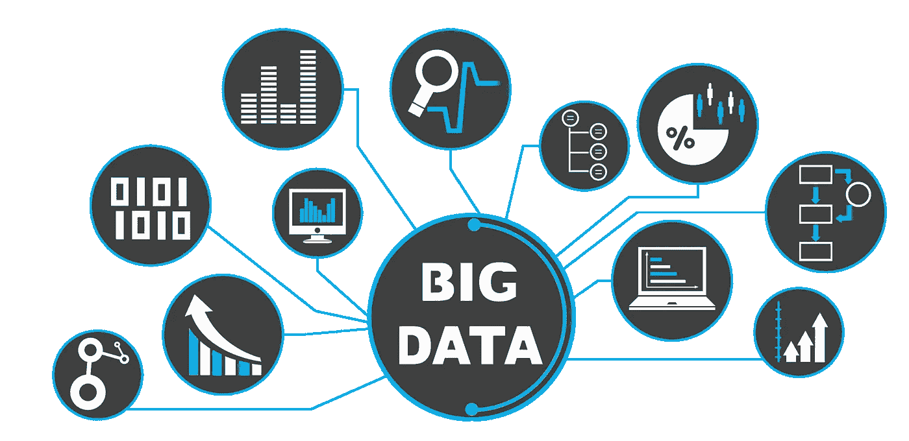

# 实施人工智能#2:人工智能基础设施的观点

> 原文：<https://medium.datadriveninvestor.com/implementing-ai-2-perspectives-from-ai-infrastructure-cc9a3f49569c?source=collection_archive---------6----------------------->

在之前的[博客](https://medium.com/@rogerchuakt/adopting-ai-at-a-strategic-level-50a86217f849)中，我们从战略的角度讨论了大型组织中的人工智能(AI)。在这篇文章中，实施人工智能系列的一部分，我们将讨论使人工智能实施战略成功的数据和基础设施先决条件，以及为什么人工智能基础设施的规模不同于典型的 IT。

同样，我们不会深入技术细节，因为这个博客的目的是为基础理解服务。

Source: nimble.com

# 不是典型的 IT 基础设施

为了理解人工智能(AI)的基础设施与传统 IT 有何不同，让我们以美国公司 [White Ops](https://www.whiteops.com/company) 为例，该公司是检测和系统防御 bot 和恶意软件欺诈的先驱。他们声称分析了数万亿次交易中收集的数千个数据点，以预测恶意行为，使他们能够提供高水平的准确性，即使在技术证据不足的情况下。通常，数据被发送到识别欺诈的机器学习模型。每个新的事务进一步调整模型，尽管构建初始模型的训练数据大小通常不为公众所知，但不同输入参数的数量表明需要数百万条记录。

 [## 人工智能与创意:作为创意引擎的 BigGAN |数据驱动的投资者

### 的确，2018 年可以被视为人工智能创造的创造力全盛时期的开始。当然可以…

www.datadriveninvestor.com](https://www.datadriveninvestor.com/2019/02/13/ai-creativity-biggan-as-a-creative-engine/) 

因此，人们可能会认为，训练这种规模的数据集的模型超出了典型组织的 it 基础设施的*。除了技术基础设施，还有另外两个领域对在一个组织中成功实施人工智能至关重要。(1)数据，尤其是训练数据；(2)技术基础设施。*

# 数据，但有意义的数据

数据是机器学习的核心，因为复杂的模型需要*大量的训练数据*。即使您可以监控点击流、网络数据包、语音记录、聊天协议或电子邮件对话，大多数数据也是没有意义的，并且定位到带有恶意软件的单个数据包或带有不适当内容的电子邮件。因此，机器学习不仅需要大量的数据。 [*数据质量和可访问性事关从机器学习中获取商业价值*](https://www.thinkmind.org/download.php?articleid=soft_v10_n12_2017_1) 。缺乏内部数据通常是小型组织的第一个障碍。不过，有各种方法可以克服这个障碍。

Source: digitaldhara.com

## 增强方法

一种方法是购买一个已经训练好的模型，并随着时间的推移用内部数据扩充它。在训练数据格式被标准化的情况下，增强方法工作得很好。一个这样的例子是在标准化的 [ISO 20022 报文](https://www.iso20022.org/payments_messages.page)中涉嫌洗钱的交易中，或者在网络上发现可疑的 IP 数据包时。

## 浓缩方法

另一种方法是使用外部数据源(如来自互联网或商业数据供应商的数据源)来丰富训练数据。例如，在大多数国家，您可以购买将家庭地址映射到购买力或房地产价格的数据集。然而，这取决于要实现的目标和要解决的问题。这种方法通常适用于营销或风险应用。

## 现成的方法

另一种方法是购买完全训练过的模型。这种现成的方法通常是自然语言应用程序的选择。与传统的管理信息系统相比，机器学习可以处理相当嘈杂和非结构化的数据。

一般的机器学习，特别是深度学习，需要大量的训练数据。虽然内部数据可能不够庞大或丰富，不足以成功训练复杂的模型，但组织可以购买预先训练的模型，或者用外部数据扩充其内部数据。

# 技术基础设施

在训练阶段，机器学习需要大量的数据和计算能力密集型应用。成功应对这一挑战的一个唾手可得的成果是利用云服务，它提供了所需的技术基础架构需求。

## 定制的人工智能即服务(AIaaS)

一个例子是 [Google Cloud TensorFlow](https://www.tensorflow.org/) 架构，它具有一些人工智能任务所需的专门、优化的硬件，例如基于 GPU 的密集型工作负载处理等。通常，这种专用硬件对于小公司来说过于昂贵，但对于大型组织来说却是如此。因此，*支持小公司的机器学习应用通常最好由公共云*来支持。

然而，对于大多数组织来说，公共云是一个棘手的话题。争论最激烈的话题之一是关于将敏感信息输出到管辖边界之外。这一问题已被认识到，但在解决之前将限制公共云的使用。

## 完整的人工智能即服务(AIaaS)

大型组织，尤其是银行，也是公共云服务的缓慢采用者，因为他们认为重大云中断会带来*运营风险*。他们更喜欢直接控制他们的关键系统基础设施。然而，我认为风险矩阵应该与实施阶段联系起来。例如，机器学习应用程序的训练阶段不应该是一个必要的功能；因此，停机不会造成重大中断。尽管如此，如果大型组织出于各种战略原因坚持不使用公共云，他们可能会考虑集成人工智能服务提供商提供的*完整服务*。

## AIaaS 的优势

*   **公司不需要开发自己的 AI 应用。人工智能在后台运行，使软件对最终用户更有价值。**
*   **终端用户无需任何专业知识**即可使用嵌入企业应用的 AI。
*   **公司不需要开发直观的新用户界面。对于从零开始开发的人工智能应用程序来说，这可能是一个挑战。事实上，软件公司正在使用人工智能技术，如自然语言处理，使他们的解决方案更容易使用。**

## 并非没有挑战

在现代系统设计中，外部应用服务的集成是常用的。然而，它并非没有挑战。这通常意味着将敏感数据发送给第三方进行处理。如果应用程序服务被用作关键应用程序的一部分，所使用的外部服务的可用性可能会限制整个系统的可用性。

**参考**:

1.  "*人工智能:从专家专用到无处不在*"，由德勤洞察，链接[此处](https://www2.deloitte.com/insights/us/en/industry/technology/technology-media-and-telecom-predictions/cloud-based-artificial-intelligence.html)。
2.  thinkmind.org 的《*大数据和机器学习的数据质量考虑:超越数据清理和转换*》，在这里链接。

来自作者**:我欢迎你的想法和反应，并期待在未来几年里一起关注这一令人兴奋的人工智能景观。请随意为我喜欢的博客鼓掌。这是我继续写博客的巨大鼓舞！**