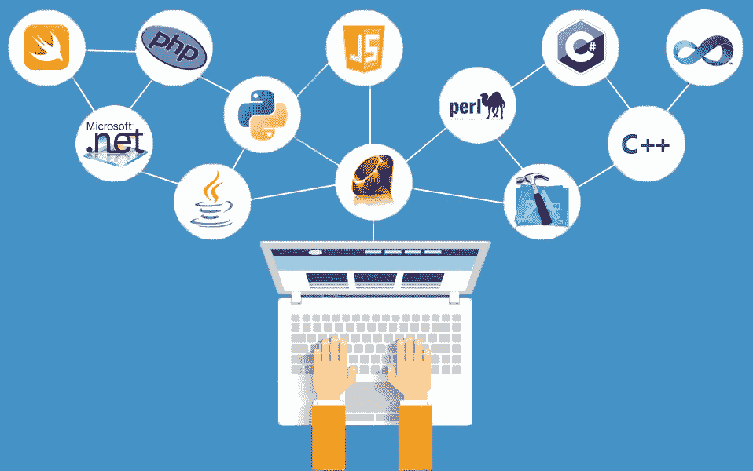
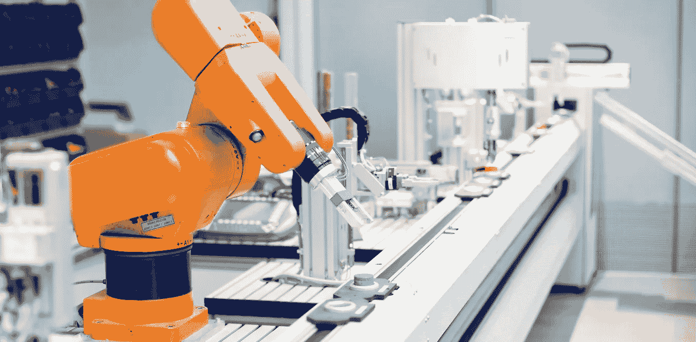

# 实施人工智能#3:人工智能世界中人的视角

> 原文：<https://medium.datadriveninvestor.com/implementing-ai-3-perspectives-on-the-people-for-ai-world-d66bec1b1562?source=collection_archive---------12----------------------->

在之前的[博客](https://medium.com/@rogerchuakt/implementing-ai-2-perspectives-from-ai-infrastructure-cc9a3f49569c)中，它提供了一个关于数据方法和基础设施的广阔视角，以使人工智能(AI)实施战略取得成功。在这个博客中，博客系列的一部分，我们将关注最关键的成功因素，**人**。

# 人工智能正在改变就业市场(纵向和横向)

虽然很明显人工智能将影响许多工作，但受这种变化影响的人会发生什么就不太清楚了。没有水晶球，历史可能是收集未来信息的最佳指示工具。19 世纪，农民转向工业。20 世纪由自动化驱动的工业劳动力的下降被服务业的新工作岗位过度补偿了。人们可能会预计同样的事情会发生在人工智能上。

 [## 人工智能与创造力:梦想成真|数据驱动的投资者

### 人工智能总是让我着迷。不仅作为一套有用的工具，不断发展，而且作为一个…

www.datadriveninvestor.com](https://www.datadriveninvestor.com/2019/01/28/ai-creativity-deep-dream-comes-true/) 

毫无疑问，基于人工智能的解决方案有可能从根本上改变许多行业的就业市场，特别是金融服务。让我们用一个最近的真实商业案例来说明我们的主张。

Credit: ETHNew.com

JP 摩根于 2017 年开始实施一项名为 COIN 的计划，这是 Contract Intelligence 的缩写。它使用自然语言处理(NLP)来理解和审查商业贷款协议。COIN 是该银行推动自动申报任务和为其银行家和客户创造新工具的一部分。[据报道](https://futurism.com/an-ai-completed-360000-hours-of-finance-work-in-just-seconds)，它声称 COIN 只需几秒钟就可以审查文件，过去每年要花费 360，000 小时的法律工作，并且帮助 JP 摩根减少了贷款服务错误的数量。更令人印象深刻的是，它以同样的勤奋程度分析了每份合同的每一页。

## 人工智能也在执行复杂的任务！

从这个特殊的商业案例中，我们可以看到，人工智能现在正在处理一项曾经是高薪人类专家领域的任务。更具体地说，人工智能可以执行用自然语言编写的非结构化文档的任务。

Source: BitDegree.com

# 你的预测和我的一样好

对于乐观主义者的阵营来说，他们期望在管理新技术方面创造大量的就业机会。其中一个小组是 [Gartner 研究团队，该团队在 2017 年发表了一份报告](https://www.gartner.com/en/newsroom/press-releases/2017-12-13-gartner-says-by-2020-artificial-intelligence-will-create-more-jobs-than-it-eliminates)，称到 2020 年，人工智能将创造 230 万个工作岗位，比相同技术造成的 180 万个工作岗位多出 50 万个。到 2025 年，净新增就业岗位将增加到 200 万个。

然而，人工智能可能会创造更多的就业机会，而不是多余的，许多经济学家和行业专家预计[数字革命可能会扩大贫富差距](https://futurism.com/tech-may-widen-the-gap-between-rich-and-poor)，这可能类似于银行在最初开始时只为精英服务的情况。另一方面，[埃隆·马斯克预言人工智能的使用将导致第三次世界大战](https://www.theguardian.com/technology/2017/sep/04/elon-musk-ai-third-world-war-vladimir-putin)。在就业市场上，风险投资公司 Sinoventure 的创始人李开复表示，人工智能最终将削减 50%的工作岗位。

正如你所看到的，关于人工智能对劳动力市场的影响的预测差异很大，但没有人不同意这种影响可能非常显著的观点。

# 既然如此，下一步是什么？

越来越依赖技术的行业需要更多能够开发和运行人工智能系统的人。想想数据科学家和软件工程师。人工智能革命不仅仅是产生更多的人工智能和计算机专家；这也是关于建立 AI 无法模仿的**软技能**，比如**创造力**和**团队合作**。如果过去的技术发展有任何指示性的话，它指向人工智能工具将变得更容易使用，并且对技术专家的需求将在某一点达到峰值。它可能会像 Excel 一样成为人工智能的一种工具，领域专家和数据科学家可以在没有技术支持的情况下处理大量数据。

随着人工智能进入越来越多的领域，分析能力强的领域专家将成为成功的关键因素。2018 年，[普华永道的报告](https://www.pwc.com/us/en/advisory-services/assets/ai-predictions-2018-report.pdf)预测，功能专家*而非技术专家*将成为人工智能人才竞争的核心。这些人可以训练和塑造机器学习模型，在实践中模仿工作场所。这些领域专家将确保机器学习的结果符合所有法律和道德要求。从端到端，他们将与机器学习的模型进行交互，以做出最终决定，并与技术专家进行交互，以找到正确的解决方案。简而言之，他们将对人工智能自动化流程的业务结果负责。

Source: Pradosoft.com

## 那么，硬技能在未来是强制性的吗？

绝对不行。根据普华永道的《劳动力的未来》报告，39%的首席执行官认为人工智能对运营未来企业所需技能的影响是**解决问题、适应性、协作、领导力、创造力**和**创新**(名列榜首)。换句话说，创造力、情感、社交智能的重要性正变得越来越明显，因为在可预见的未来，机器无法取代它们。

> 哈佛大学教育和经济学教授大卫·戴明建议，只需要数学技能的工作可以自动化，而那些结合专业和社交技能的工作将得到更多保护。

让我们看看与上述预测相呼应的几个类比。

1.  虽然人工智能可以自动执行任务，但更迫切的是让人们能够向机器提出正确的问题，并了解所选解决方案的风险和局限性。更重要的是，往往不是，现有流程自动化并不意味着达到理想状态。公司需要能够不断改进产品和服务并创造性地推动创新的人。
2.  人工智能可以在一定程度上极大地改善客户的体验，例如提供即时的虚拟助理，并为客户提供量身定制的推荐。然而，机器无法引起共鸣，无法真正理解真正的客户需求，因此无法设计端到端的客户旅程。

**简单来说，你不一定需要学习如何编码。**

Credit: CSIROscope

## 自动化将我们带向何方？

自动化任务并不总是意味着裁员。我们以销售为例。目前，销售人员花费大量时间做一些可以自动化的事情，例如确认潜在客户、发送跟进电子邮件、更新 CRM 等等。一旦他们可以依靠自动化来处理所有这些任务，他们就可以专注于建立关系，并为客户提供更具创新性的解决方案。从这个例子中，看待人工智能的一种方式是，它将人们从重复和无聊的任务中解放出来，让他们专注于满足创造性任务和社交互动的需求。

因此，人工智能企业中的员工需要重新装备自己，以拥抱不断发展的技术，并与转型战略保持一致。为了减少转型可能带来的不确定性和不必要的阻力，领导层必须对目标和路线图保持透明，即使事实并非对所有人都是好消息。

# 结论

总之，人工智能和自动化将深刻影响劳动力市场。目前还不清楚我们最终会得到更多还是更少的工作，但很明显我们会得到不同的工作。在受这些变化影响的地区，雇主有责任让他们的员工重新掌握自己的技能，以便在新角色中取得成功。最后，人工智能世界仍然非常需要人类的智力、社交技能和创造力。如果您将您的经验和专业知识与出色的分析技能相结合，您将能够帮助领导这一转变。

来自作者:我欢迎你的想法和反应，并期待在未来几年里一起关注这一令人兴奋的人工智能景观。请随意为我喜欢的博客鼓掌。这是我继续写博客的巨大鼓舞！