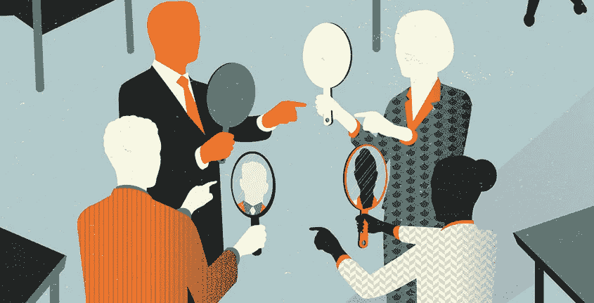
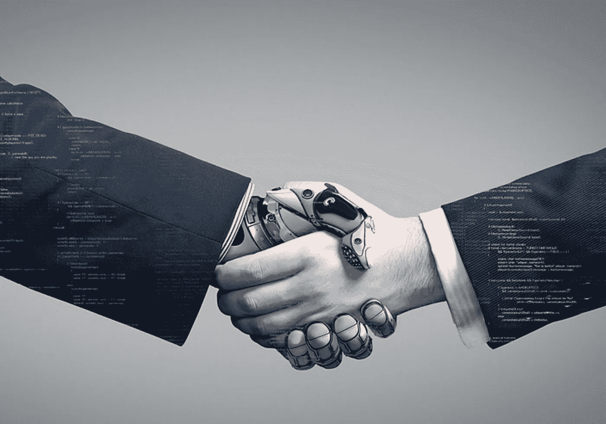

# 实施人工智能#4:道德和风险视角

> 原文：<https://medium.datadriveninvestor.com/implementing-ai-4-perspectives-on-ethics-and-risks-7e94112b8e73?source=collection_archive---------12----------------------->

在之前的[博客](https://medium.com/@rogerchuakt/implementing-ai-3-perspectives-on-the-people-for-ai-world-d66bec1b1562)中，它对人工智能世界中人们的新角色提供了一个广阔的视角。这篇博客是实现人工智能系列的最后一篇，我们将讨论关于**伦理**和**风险**的观点。

我们希望看到 AI 是一个使能者，而不是威胁。我们希望 AI 在这种转变中让我们的生活变得更好。因此，仔细检查人工智能可能带来的所有可能的副作用是至关重要的。

 [## 艾预测:“颠覆，然后是生产力”|数据驱动的投资者

### 人们越来越担心，随着机器学习和互联网的普及，所有白领工作都将消失

www.datadriveninvestor.com](https://www.datadriveninvestor.com/2018/08/06/ai-forecast-disruption-then-productivity/) 

# 良好的意图，意想不到的后果

人工智能带来的意外副作用的一个很好的例子是**感知偏差**。脸书就是这样一个例子。它使用自动算法将用户分组，以进行有针对性的广告。然后，聚类组被馈送到广告平台。然后，广告客户可以选择他们想要的目标群体。这种设计理念向往良好的商业意图；然而，它带来了意想不到的社会弊病。2016 年， [ProPublica 发现，企业可以根据脸书平台上的种族](https://www.propublica.org/article/facebook-lets-advertisers-exclude-users-by-race)等特征，阻止人们查看房屋广告。从技术上来说，该算法做了它应该做的事情，并确定了一个庞大而独特的群体，他们拥有相似的观点，并可以被营销。但显然，这一结果是不可接受的。这一集过后，脸书受到了很多负面报道。

事后看来，如果有人在将营销类别发布到互联网上之前对其进行审查，那将是明智之举。这只是机器学习模型产生不想要的、非法的或不道德的结果的许多例子之一。

# 我们将何去何从

机器学习模型应该进行一定程度的测试，根据业务期望的结果而有所不同。这些检查包括验证训练数据，验证所选机器学习方法的稳健性，并进行测试以确保在关键条件下没有不希望的结果。如有必要，专家会首先手动调整已学习的模型，以避免不良结果。

模型验证应由独立于初始设计者的数据科学家执行，以维护“四只眼”原则。这些都是很多流程中屡试不爽的原则，尤其是法律和金融行业。

*Image Source: Insigniam Quarterly*

# 新背景下的问责制

正如我们在脸书的例子中看到的那样，机器学习可能会导致意想不到或不想要的结果。在没有正确理解发生了什么的情况下，要求某人对一个模型负责是不可接受的。

理想情况下，机器学习的模型批准过程会给负责人留下必要的信息，并愿意承担责任。此外，监管机构将不得不理解使用人工智能的含义。监管机构可能必须建立自己的数据科学专业知识，才能最终批准机器学习模型。换句话说，监管者需要反思他们的责任在新环境下意味着什么。

# 当心不平等的竞争环境

在未来，访问引人注目但昂贵的数据和技术平台将比今天更有价值。这可能会导致市场参与者的集中。规模较小的参与者可能会处于这样一种境地:他们无法再以同样的信息获取方式在市场中竞争。

这个话题并不新鲜，但昂贵的人工智能技术和访问海量数据的需求可能会加剧这种影响。我们还可能看到运营风险转移到非传统参与者身上。

目前还不清楚这一切会在哪里结束。如果拥有准垄断地位的互联网行业是数据密集型和技术驱动型科技行业的发展方向，那么集中风险和信息不对称可能会成为真正的问题。监管者应该开始思考，在这个新的现实中，公平的竞争环境意味着什么。此外，当市场参与者开始将公共云用于关键应用时，监管机构必须了解整个系统的运营风险。

# 拥抱人机合作

例如，在贷款申请或欺诈检测模型的场景中，机器不会直接拒绝或批准贷款。它很可能会计算申请的分数，并向信贷官员提出是否批准贷款的建议。最后的决定由负责官员作出。同样，如果模型识别出潜在的欺诈交易，它不会立即直接重新检查交易，甚至不会直接立案。

目前，这种解决方案通过由单独的技术渠道或类似渠道向客户发送确认码来寻求额外的交易确认。或者，如果不可能让客户确认交易，则由调查人员检查交易并做出最终决定。

## Model = Blackbox，no？

然而，对于这样一个精确的模型来说，一个巨大的挑战是它不善于从逻辑上解释它们的输出。模型是一个黑匣子。你给他们输入数据，他们给出分数或决策建议。这是人类使用模型/机器的输出来做出决定的问题。

## 可解释性带来透明度

当这种模型被用于推动关键决策时，*解释就变成了强制性的*。没有充分的理由，你不能拒绝向某人贷款或指控某人欺诈。因此，对机器学习模型的结果进行合理的**解释将是使它们被决策者广泛采用**并被受决策影响的人接受的基础。

## 包容性扩大了采用范围

在这方面，政府发挥着至关重要的作用。想象一下，如果很大一部分人口在转型中被抛在后面，这预示着社会动荡。政府需要提供持续的教育，以重新装备和提高人们的技能，为迎接人工智能技术所带来的即将到来的变化做好准备。

# 人类 vs 机器？

关于智能机器是否可能变得邪恶并与我们作对，机器人是否应该拥有类似于人权的权利，或者机器智能何时可能超越人类智能，有很多猜测。

这些推测有点牵强。然而，我们可以想象一个场景，其中机器学习的模型显示出意外的(如果不是危险的话)行为，这是因为糟糕的实现或错误的模型。尽管在模型批准过程中做了适当的努力，这种情况还是会发生。

对于基于人工智能的解决方案来说，这个问题并不新鲜。编程错误可能会立即导致，而且实际上已经导致了意想不到的后果。对于像这样的关键应用，我们需要**实现终止开关来停止自动过程**。必须明确谁有责任监督这一过程，并在必要时启动开关。

如果事情发生得很快，基于规则的自动终止开关可能是必要的。

# 结论

人工智能和机器学习伴随着特定的风险。当你使用人工智能技术时，这些风险是真实的。这些风险中有许多并不是人工智能所特有的，而是更多的*自主自动化*、*半透明决策标准*，以及数据的广泛使用*会加剧其他技术已经知道的一些风险。*

*好消息是，许多行业的专家已经意识到这个问题，并正在开发好的方法来解决这些问题。银行通常有明确定义的流程来批准风险模型。*

*来自作者:我欢迎你的想法和反应，并期待在未来几年里一起关注这一令人兴奋的人工智能景观。请随意为我喜欢的博客鼓掌。这是我继续写博客的巨大鼓舞！*