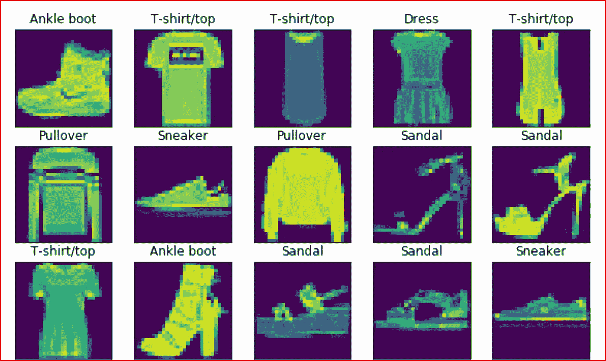
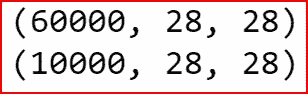
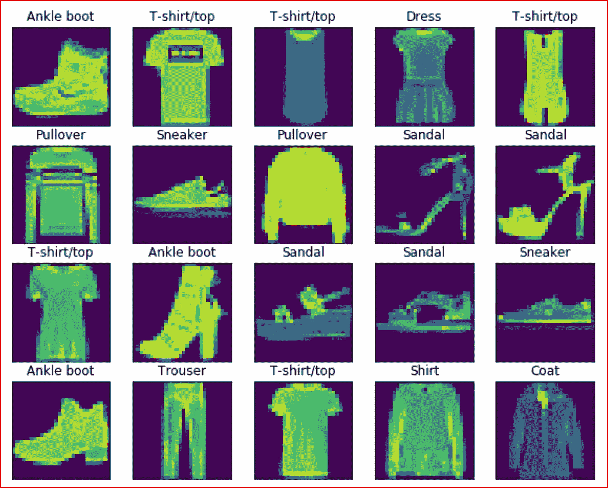
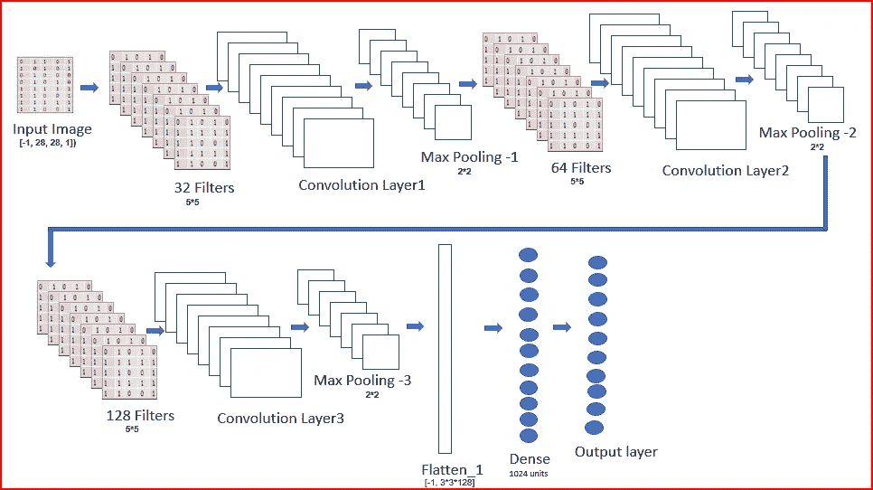
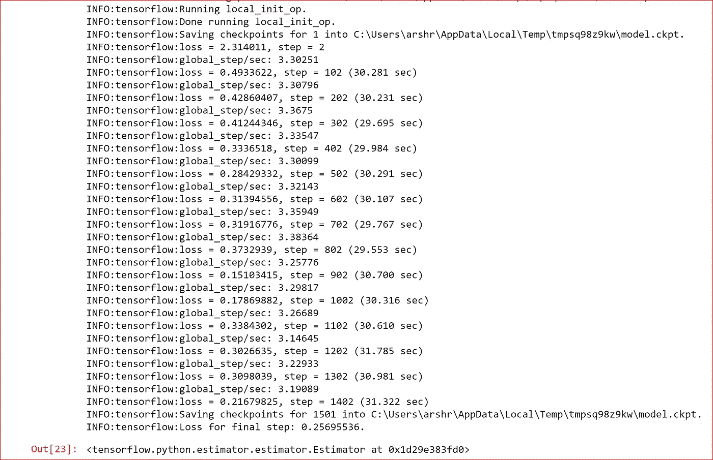
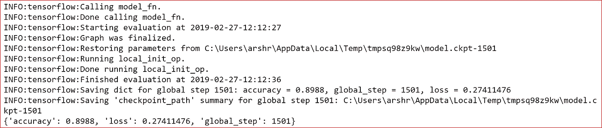

# 用 TensorFlow 实现时尚 MNIST 的卷积神经网络

> 原文：<https://medium.datadriveninvestor.com/implementing-convolutional-neural-network-using-tensorflow-for-fashion-mnist-caa99e423371?source=collection_archive---------0----------------------->

[](http://www.track.datadriveninvestor.com/1B9E)

在本帖中，我们将使用时尚 MNIST 数据集，通过 TensorFlow 构建一个 CNN 模型。我还会提到我如何改进模型，将模型的准确性从 29%提高到 90%

## 先决条件:

[CNN 基础知识](https://medium.com/datadriveninvestor/convolutional-neural-network-cnn-simplified-ecafd4ee52c5)

[张量流基础知识](https://medium.com/datadriveninvestor/tensorflow-basics-6377a6043d93)

[](http://go.datadriveninvestor.com/5ML1) [## DDI 编辑推荐:5 本机器学习书籍，让你从新手变成数据驱动专家…

### 机器学习行业的蓬勃发展重新引起了人们对人工智能的兴趣

go.datadriveninvestor.com](http://go.datadriveninvestor.com/5ML1) 

使用 TensorFlow 构建 CNN 的步骤

1.  导入所需的库
2.  加载数据集进行训练和评估
3.  分析数据集
4.  标准化数据集以输入到 CNN
5.  建立 CNN 模型
6.  创建评估者
7.  训练模型
8.  评估模型
9.  提高模型的准确性

## 导入所需的库

```
import tensorflow as tf
import keras
import numpy as np
import pandas as pd
import matplotlib.pyplot as plt
%matplotlib inline
```

## 加载时尚 MNIST 数据集

我们从 keras 数据集中加载数据集。数据集包含服装和配饰的时尚图像。从数据集，我们创建训练和评估数据集

```
((train_data, train_labels),
 (eval_data, eval_labels)) = tf.keras.datasets.fashion_mnist.load_data()
```

时尚图片是输入，目标变量是 10 类不同的服装，包括配饰

```
target_dict = {
 0: 'T-shirt/top',
 1: 'Trouser',
 2: 'Pullover',
 3: 'Dress',
 4: 'Coat',
 5: 'Sandal',
 6: 'Shirt',
 7: 'Sneaker',
 8: 'Bag',
 9: 'Ankle boot',
}
```

## 分析数据集

让我们检查一下训练和评估图像的形状

```
print(train_data.shape)
print(eval_data.shape)
```



训练数据集包含 60，000 幅图像，测试或评估数据集包含 10，000 幅图像

让我们绘制前 20 幅图像及其标签

```
plt.figure(figsize=(10,10))
for i in range(0,20):
    plt.subplot(5,5, i+1)
    plt.imshow(train_data[i] )
    plt.title( target_dict[(train_labels[i]) ])
    plt.xticks([])
    plt.yticks([])
```



## 标准化数据集

我们对输入数据进行归一化处理，使它们都处于相同的范围内

```
train_data = train_data/np.float32(255)
train_labels = train_labels.astype(np.int32)eval_data = eval_data/np.float32(255)
eval_labels = eval_labels.astype(np.int32)
```

## 构建 CNN 模型

我们现在建立 CNN 模型，这是最有趣的部分。

***重塑输入***

我们需要重塑输入，它应该是大小

**[batch_size，image_height，image_width，channels]**
-1 表示批量大小，表示应根据特征中输入值的数量动态计算尺寸，保持所有其他尺寸的大小不变。

***车型概述***

第一卷积层具有 32 个 5 乘 5 的特征检测器，我们对其应用最大池。

最大池层 1 是第二卷积层的输入，我们对其应用 64 个过滤器或特征检测器，然后应用最大池。这里我们采用 25%的退学率。

最大池层 2 充当具有 128 个特征检测器的第三卷积层的输入，然后我们再次应用最大池。这里我们采用 25%的退学率。

我们将结构扁平化，以创建一个 1024 个单元的密集层，我们对其应用 40%的退出率。

最后，我们有 10 个单元的输出层来对 10 件衣服和配饰进行分类。由于这是一个多类分类问题，我们使用 Softmax 激活函数。输出图层将返回预测的原始值。为了预测类，我们将使用 ***tf.argmax()*** 从输出层 tensord 中找到最大值

我们使用 Adam optimizer 进行训练，学习率为 0.001

基于可以训练、预测或评估的模式，我们打印不同的指标



Architecture of the CNN

```
**def cnn_model**(features, labels, mode):
    #Reshapinng the input
    **input_layer = tf.reshape(features["x"], [-1, 28, 28, 1])**

     # Convolutional Layer #1 and Pooling Layer #1
    **conv1 = tf.layers.conv2d(
        inputs=input_layer,
        filters=32,
        kernel_size=[5, 5],
        padding="same",
        activation=tf.nn.relu)

    pool1 = tf.layers.max_pooling2d(inputs=conv1, pool_size=[2, 2], strides=2)**

    # Convolutional Layer #2 and Pooling Layer #2
    **conv2 = tf.layers.conv2d(
          inputs=pool1,
          filters=64,
          kernel_size=[5, 5],
          padding="same",
          activation=tf.nn.relu)

    pool2 = tf.layers.max_pooling2d(inputs=conv2, pool_size=[2, 2], strides=2)**

    **dropout_1 = tf.layers.dropout(inputs=pool2, rate=0.25,training=mode == tf.estimator.ModeKeys.TRAIN )**

    # Convolutional Layer #2 and Pooling Layer #2
    **conv3 = tf.layers.conv2d(
          inputs=dropout_1,
          filters=128,
          kernel_size=[5, 5],

          padding="same",
          activation=tf.nn.relu)

    pool3 = tf.layers.max_pooling2d(inputs=conv3, pool_size=[2, 2], strides=2)

    dropout_2 = tf.layers.dropout(inputs=pool3, rate=0.25,training=mode == tf.estimator.ModeKeys.TRAIN )

    flatten_1= tf.reshape(dropout_2, [-1, 3*3*128])

    dense = tf.layers.dense(inputs= flatten_1,units=1024,activation=tf.nn.relu)

    dropout= tf.layers.dropout(inputs=dense, rate=0.4, training=mode == tf.estimator.ModeKeys.TRAIN)

    output_layer = tf.layers.dense(inputs= dropout, units=10)
    predictions={
    "classes":tf.argmax(input=output_layer, axis=1),
    "probabilities":tf.nn.softmax(output_layer,name='softmax_tensor')
    }**
    if mode==tf.estimator.ModeKeys.PREDICT:
        return tf.estimator.EstimatorSpec(mode=mode, predictions=predictions)

    loss= tf.losses.sparse_softmax_cross_entropy(labels=labels, logits= output_layer, scope='loss')

    if mode== tf.estimator.ModeKeys.TRAIN:
        optimizer= tf.train.AdamOptimizer(learning_rate=0.001)
        train_op= optimizer.minimize(loss=loss, global_step=tf.train.get_global_step())
        return tf.estimator.EstimatorSpec(mode=mode, loss=loss,train_op=train_op )

    eval_metrics_op={ "accuracy":tf.metrics.accuracy(labels=labels,predictions=predictions["classes"])}
    return tf.estimator.EstimatorSpec(mode=mode, loss=loss, eval_metric_ops=eval_metrics_op)
```

## 创建评估者

我们创建一个评估器，我们把上面创建的 CNN 模型传递给它。我们将使用这个模型进行训练、预测和评估

```
fashion_classifier = tf.estimator.Estimator(model_fn = cnn_model)
```

## 训练模型

为了训练模型，我们将创建 ***train_input_fn*** ，然后我们调用 ***train*** 方法来对时尚 mnist 数据集进行分类

对于输入，我们使用***numpy _ input _ fn***的方法，我们将训练输入的特征数据分别传递给***【x】***和标签， ***train_labels*** 。

我们使用 100 的 ***batch_size*** ，这意味着我们将在每一步对 100 个样本的小批量进行训练。

***num _ epochs = None***表示模型将进行训练，直到达到指定的步数。在我们的例子中，我们将其设置为 1500 步。

我们还想打乱训练数据。

```
# Train the model
train_input_fn = tf.estimator.inputs.numpy_input_fn(
    x={"x": train_data},
    y=train_labels,
    batch_size=100,
    num_epochs=None,
    shuffle=True)fashion_classifier.train(input_fn=train_input_fn, steps=1500)
```



## 评估模型

一旦模型完成训练，我们将使用之前使用 ***评估*** 函数创建的 ***评估数据和评估标签*** 评估模型。这将有助于我们确定模型在时尚 mnist 数据集上的准确性。

我们希望仅使用一个历元来评估模型，并且我们不会打乱数据，因为我们希望按顺序迭代数据。

```
eval_input_fn = tf.estimator.inputs.numpy_input_fn(
    x={"x": eval_data},
    y=eval_labels,
    num_epochs=1,
    shuffle=False)eval_results = fashion_classifier.evaluate(input_fn=eval_input_fn)
print(eval_results)
```



我们看到准确率接近 90%。

## 达到这种精确度的步骤

我最初从梯度下降优化器开始，我的初始精度是 29%。

当我把优化器改成 Adam 时，准确率从 29 %变成了 69%。

当增加一个卷积层和池层时，我得到了 73%的准确率

然后我把步数从 1000 增加到 1500，准确率从 1000 增加到 82%。

我添加了额外的 dropout_1 和 dropout_2，然后我的准确率从 89%到 90%不等。

## 参考资料:

[https://www . tensor flow . org/tutorials/estimators/CNN # evaluate _ the _ model](https://www.tensorflow.org/tutorials/estimators/cnn#evaluate_the_model)