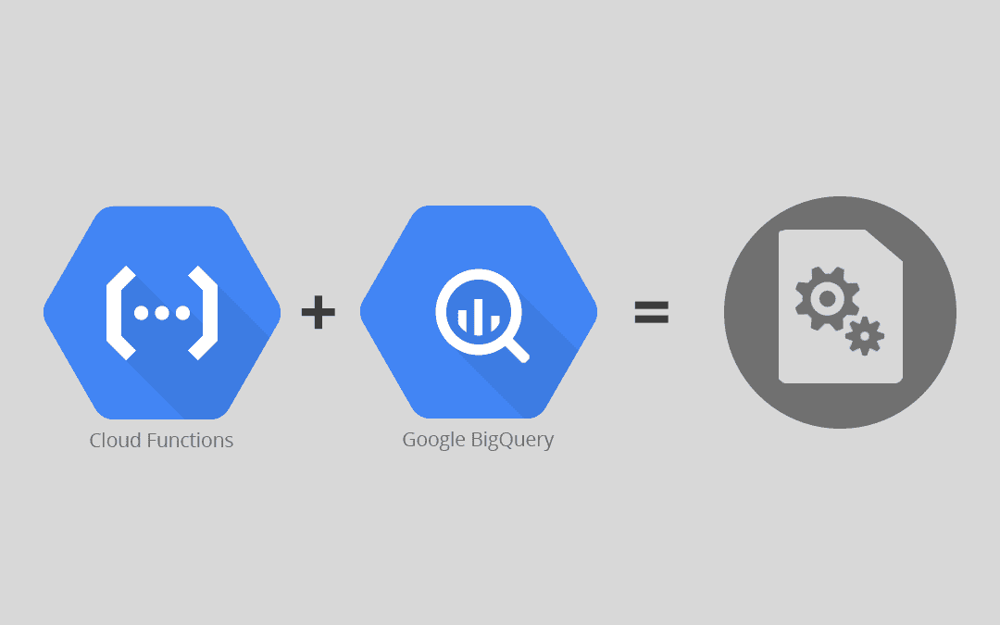
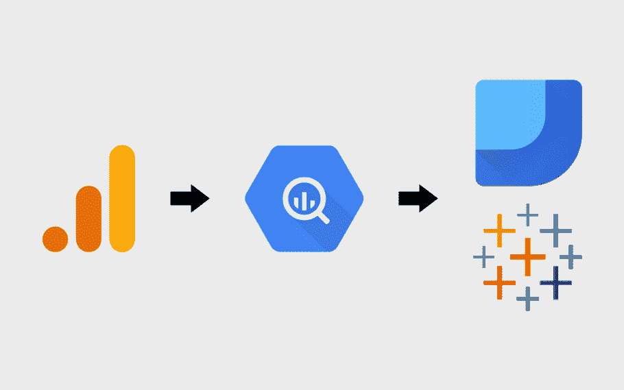
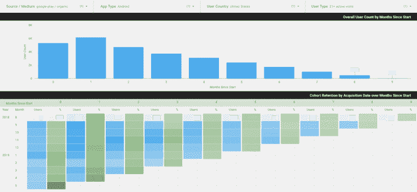

# 使用谷歌分析数据实现谷歌大查询自动化

> 原文：<https://medium.datadriveninvestor.com/implementing-google-bigquery-automation-using-google-analytics-data-f9ae098f4085?source=collection_archive---------2----------------------->

作为谷歌云平台(或 GCP)不可或缺的一部分， [Google BigQuery](https://cloud.google.com/bigquery/) 正被部署为一个面向各种行业应用的综合数据仓库解决方案。通过与谷歌分析(Google Analytics)的无缝集成，BigQuery(或 BQ)使数据分析师和开发人员能够通过其标准接口和 API 存储、集成和分析大数据。

在当今市场上广泛使用的分析工具中， [Google Analytics](https://analytics.google.com/analytics/web/) 正被部署来监控网站流量，从客户会话中获取有用的商业见解，等等。作为商业智能(或 BI)的合适平台，GA 可以与 BQ 工具集成，以传输业务数据并实现更深入和更丰富的分析。

 [## 为什么数据将改变投资管理|数据驱动的投资者

### 有人称之为“新石油”虽然它与黑金没有什么相似之处，但它的不断商品化…

www.datadriveninvestor.com](https://www.datadriveninvestor.com/2019/01/25/why-data-will-transform-investment-management/) 

通过这篇文章，我们将探索 Google Analytics 给 BigQuery 自动化带来的商业好处，以及如何配置这种设置。首先，让我们理解什么是谷歌分析大查询自动化。

# Google Analytics 对 BigQuery Automation 来说是什么？

简单地说，Google Analytics to BigQuery 自动化过程是一个自动化的 BigQuery 作业，它消除了任何手动查询任务。这通常包括将 Google Analytics 数据导入 BigQuery 或执行任何 SQL 查询等任务。

这个自动化过程可以用来连接 Google Analytics 和 BigQuery，并在这两个工具之间建立无缝集成。熟悉 SQL 语法的开发人员应该能够使用这个连接轻松地自动化 BigQuery 作业。

在下一节中，让我们看看如何设置 Google Analytics 到 BigQuery 的自动化配置(借助一个行业案例研究)。

# 如何配置 Google Analytics 到 BigQuery 的自动化流程

借助以下任何数据源，您可以自动将 Google Analytics 的数据加载到 BigQuery:

## 谷歌云存储

BigQuery 支持从云存储中加载各种格式的数据，包括 Avro、CSV(默认)、JSON 和 ORC。您可以直接使用 Google 控制台来执行加载。

## 发布请求

另一种选择是使用 JSON APIs 直接发布数据。Google Analytics API 在向 BQ 数据仓库加载和提取数据的过程中扮演着至关重要的角色。例如，您可以使用 CURL 或 Postman 工具执行 HTTP POST 请求。

您可以使用任何查询编辑器工具，通过以下几个步骤来配置整个自动化过程:

1.  在编辑器工具中创建查询(例如，如下所示)。

1.  使用上面显示的“计划查询”选项创建新的计划查询。
2.  下一步是使用“新的预定查询”选项来预定新的查询。除了计划查询名称之外，请确保指定了目标表名称。除此之外，您还可以指定以下配置设置:

*   重复频率:何时必须重复查询(每天、每周或每月)以及开始和结束日期和时间
*   表写入首选项:您可以在其中指定查询是应该覆盖数据还是将数据追加到目标表中。
*   电子邮件通知:您可以在此选择是否希望在成功执行查询时收到电子邮件通知。

1.  最后，单击“Schedule”以使用上述设置安排您的查询。

接下来，让我们来看一个将 Google Analytics 应用于 BigQuery 自动化的行业案例研究，它是由 Countants 促成的:

该客户在使用 Supermetrics 营销报告附加工具将他们的营销数据(从脸书平台)直接下载到 Google BigQuery 时遇到了问题。由于不推荐使用的数据库表列，用于合并已分区表的 SQL 查询不起作用。因此，客户端无法将数据追加到主数据库表中。作为一个解决方案，客户正在寻找可以定期执行数据追加的自动化。

下面是我们为解决这个客户端问题而执行的步骤:

1.  检查用于定期向主表追加数据的 SQL 查询。我们仍然可以追加数据，即使脸书数据库表中的一些表列已经过时。
2.  为了使用 Google Analytics API 将数据连接到 Google Analytics，我们使用 GA 授权密钥(如服务帐户)构建了自动化。
3.  在授权过程之后，我们可以从 Google Analytics 导入数据。
4.  使用 [Google ETL](https://www.alooma.com/integrations/google-cloud-storage) 调度工具，我们调度了一个 Cronjob 作业(间隔 10 分钟),该作业可以将 GA 数据从客户机-服务器导入到仪表板中。

为了执行这一步，使用了一个 [Python API](https://realpython.com/tutorials/api/) 脚本从电子表格中读取 ViewID 参数，并以每 10 分钟的间隔将 Google Analytics 数据拉至 BigQuery。

在下一节中，我们将看看 Google Analytics 给 BigQuery 自动化带来的一些商业好处。

# Google Analytics 给 BigQuery 自动化带来的商业利益

BQ 自动化有多种好处，包括使用自动化的 BigQuery 作业直接填充业务仪表板(如案例研究中所讨论的)。

# 让我们看看更多的好处:

## 高级队列分析

使用 Google Analytics，企业可以使用群组分析，根据客户的购买日期来估计客户保持率。但是，使用 Google Analytics，群组分析报告仅限于最多 3 个月的客户数据。

BigQuery automation 可以使用 [Google Data Studio](https://datastudio.google.com/) 扩展群组分析的功能。可以自动执行 BQ 作业来处理 GA 数据，将它们存储在 staging 表中，并最终每月用新的和更新的数据填充群组分析报告。这里有一个 Google Data Studio 中的群组分析报告的例子，它是由 BigQuery automation 实现的。

## 数据预处理和清洗

当涉及到预处理和清理 Google Analytics 数据时，自动化的 BigQuery 作业会很有用。

例如，Google Analytics 中的预处理数据显示了多个页面方面的指标，如页面浏览量、平均页面时间和跳出率。当这个数据被导出到 BigQuery 时，它不再被聚合，这会使 BigQuery 分析过程变得复杂。但是，使用 BigQuery，您可以计算相同的 GA 指标，并在每天从 GA 向 BQ 导出新数据时自动更新查询。

此外，BigQuery 自动化可用于清理 GA 数据。例如，可以编写一个 BQ 查询来删除页面标题上的任何附加字符，然后自动运行以生成带有干净页面标题的 BQ 报告。

## 与其他数据源的集成

BigQuery automation 允许您将 Google Analytics 数据与其他外部数据源集成。例如，传统的离线数据(如实体商店中的交易)可以与 BigQuery 无缝集成。

无缝集成的另一个例子是使用 Google Apps 脚本任何基于云的工具将 BQ 数据移动到 Google 云存储的能力。

## 数据科学

最后，BigQuery 作业自动化对于数据科学家和分析师在新数据的基础上更新他们的数据模型非常有用。例如，可以安排 BQ 作业来创建一个管道，该管道可以根据用户的在线行为自动将新用户添加到特定的用户群中。

这种类型的自动用户分配通常由数字营销人员使用，他们希望根据共同的兴趣来识别和分组用户。

# 结论

商业大数据分析的价值越来越大，这为 BigQuery 技术提供了许多用例。通过谷歌分析到 BigQuery 自动化，数据分析师可以节省时间，并从最新的[谷歌分析](https://www.countants.com/blogs/conversion-analysis-in-datalab-with-google-analytics-data/?utm_medium=social&utm_source=medium&utm_campaign=Traffic&utm_medium=social&utm_source=Medium&utm_campaign=Traffic)数据中提取更深入的见解。

凭借最先进的分析技术，Countants 最有能力为希望利用 BQ 自动化的全球客户提供价值。我们在云驱动的[分析](https://www.countants.com/blogs/business-benefits-of-cross-domain-tracking-using-google-analytics/?utm_medium=social&utm_source=medium&utm_campaign=Traffic&utm_medium=social&utm_source=Medium&utm_campaign=Traffic)和[可视化](https://www.countants.com/blogs/data-visualization-how-it-is-going-to-evolve-into-the-future/?utm_medium=social&utm_source=medium&utm_campaign=Traffic&utm_medium=social&utm_source=Medium&utm_campaign=Traffic)方面的技术技能正在推动客户更快、更准确地做出决策，从而在当今市场中寻求竞争优势。

您想探索自动化 BigQuery 分析为您的业务数据带来的好处吗？请访问我们的网站并[给我们留言](https://www.countants.com/contact-us/?utm_medium=social&utm_source=Medium&utm_campaign=Traffic)。