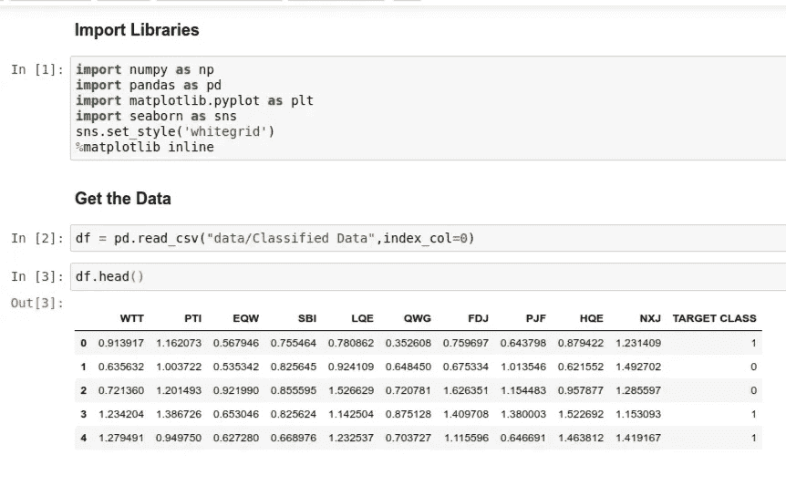
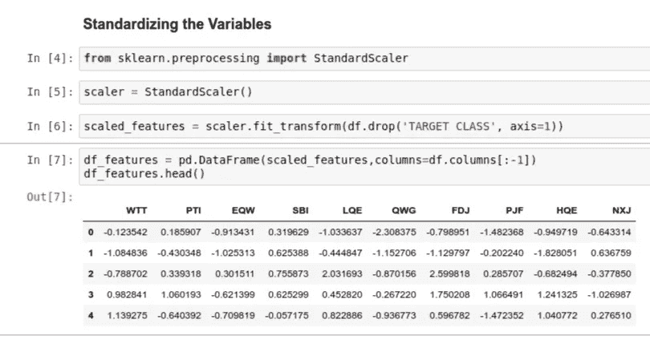
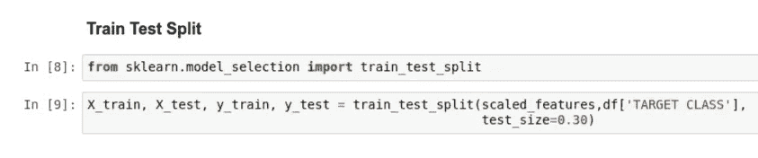
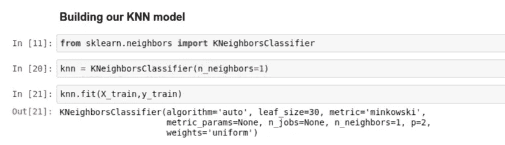
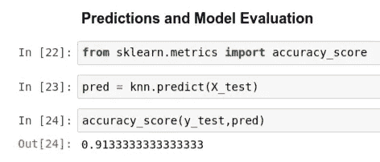
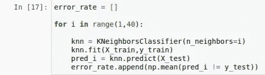
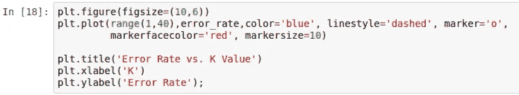
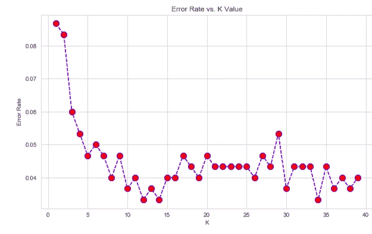
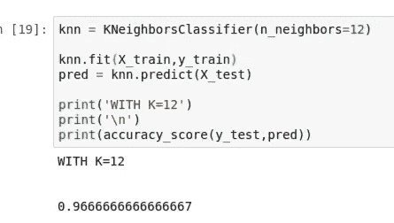

# 用 Python 实现 K 近邻

> 原文：<https://medium.datadriveninvestor.com/implementing-k-nearest-neighbors-with-python-1c0b7cdf85f2?source=collection_archive---------4----------------------->

当你开始面试某些公司的数据科学家职位时，大多数时候他们会给你一个分类数据集作为项目的参考。他们隐藏特性名，然后给你一个目标类。这里您不知道这些列代表什么。这样做主要是为了保护他们的客户数据，或者只是为了给你一个匿名数据。

然后你应该分析它或者建立某种 ML 算法来分类新的数据点。我们将使用此场景来演示如何使用 KNN 来创建一个模型，该模型可以根据特征直接预测新数据点的类别。我希望你已经看完了这个系列的第一部分[这里](https://medium.com/datadriveninvestor/getting-started-with-k-nearest-neighbors-algorithm-77e4936a120)虽然如果你对 KNN 理论很好，我们可以继续这一部分。

 [## 金融中的机器学习|数据驱动的投资者

### 在我们讲述一些机器学习金融应用之前，我们先来了解一下什么是机器学习。机器…

www.datadriveninvestor.com](https://www.datadriveninvestor.com/2019/02/08/machine-learning-in-finance/) 

我们开始吧。

# 导入库和加载数据

我们将主要使用 Numpy 进行数值计算(平均值)。Pandas DataFrame 将用于加载我们的数据并对其进行探索。导入后，我们将数据加载到名为 df 的数据框中，并将 index_col 设置为零，以使用第一列作为索引。从[这里](https://github.com/antonnifo/classification-octo-potato/tree/master/K-nearest%20neighbors/data)可以下载数据，从[这里](https://nbviewer.jupyter.org/github/antonnifo/classification-octo-potato/blob/master/K-nearest%20neighbors/K%20Nearest%20Neighbors%20with%20Python%20tutorial.ipynb)可以查看整个笔记本。使用 head 方法检查数据帧，我们可以看到列名没有任何意义。我们将目标类作为最后一列。请记住，我们试图提出一个模型来预测一个新的数据点是否会在目标类中。

# 预处理:标准化值

我们希望我们的特征独立于单位，也就是说，不依赖于所涉及的测量比例:例如，您可以用米来表示测量的特征，而我可以用厘米来表示相同的特征。如果我们都扩展各自的数据，这个特性对我们每个人来说都是一样的。此外，我们的预测变量可能具有显著不同的范围，并且在某些情况下，例如在实现 KNN 时，需要减轻这种情况，以便某些特征不会支配算法。

这里我们导入 StandardScaler 并将其实例化为变量 Scaler。接下来，我们使用 fit_transform 方法来拟合我们的数据(没有目标类),然后转换它。最后，我们创建一个新的具有缩放特征的数据框架，并从原始 df 中提取列。我们使用切片来获取所有的列名，不包括最后一个“目标类”。

# 火车测试分裂

我们不想使用所有的数据来训练我们的模型，以便我们可以有一些来衡量我们的模型的性能。如果我们在数据集 *D* 上训练我们的模型，在相同的数据 *D* 上报告模型的准确性可能会使它看起来比实际表现得更好。这就是所谓的**过拟合**。为了处理这个问题，我们将在数据的子集上训练模型，称为**训练集**，并评估其在其余数据上的性能，称为**测试集**。这正是我们在这里要做的！我们将使用大约 70%的定标数据进行训练，30%用于测试。

train test split

# KNN 模式的建立

我们现在要建立我们的模型。我们将 KNeighborsClassifier 实例化为一个变量 knn。我们传递 n_neighbors 作为参数，1 个邻居作为我们的起点。也可以指定距离度量，但我们将使用默认度量 *Minkowski。*其他值包括*汉明*和*曼哈顿等。* n-jobs 表示为邻居搜索而运行的并行作业的数量。无表示 1，-1 表示使用所有处理器。然后，我们用训练数据拟合我们的模型。

# 预测和模型评估

在这里，我们将预测之前分割的测试数据集，并将这些预测与实际情况进行比较，以获得模型性能的度量:

91%的准确率并不差，但我们可以尝试用 k 来玩，看看这个数字是否可以提高。

# 选择 K 值

我们将使用肘方法来选择 k 的最佳值。我们从一个空列表开始，以保持我们的错误率。然后我们有一个循环，我们将允许我们用 k 的值 1 到 39 来训练 knn 模型 39 次。我们将最终得到 39 个 knn 模型。如果你愿意，你可以选择更少的型号，这里没有规定。我们的误差率是预测值和实际测试值不相等的平均值。

现在，我们将使用 Matplotlib 来绘制不同模型的 k 值与误差率的关系，并查看在哪个 k 值下误差最小。

运行上面的单元后，我们得到下图。

看起来，当我们使用较低的 k 值时，我们开始有较高的错误率，最终上下波动，我们开始降低错误率。对于其他数据集，这可能会稍微平滑一些。我们的剧情之所以看起来坑坑洼洼，是因为错误率已经很低了。我将 k 等于 12 作为最佳值，并查看我得到的准确度分数。下面我们再次建立模型。

万岁，我们的准确率从 91%提高到 97%左右，正如你所看到的，我们能够通过调整到更好的 K 值来提高模型的性能！这里需要注意的重要一点是，在 scikit-learn 中制作一个机器学习模型并不需要很多工作。我希望这篇文章对你正在做的事情有所帮助。如果你对本教程有任何问题或想法，欢迎在下面的评论中提出。