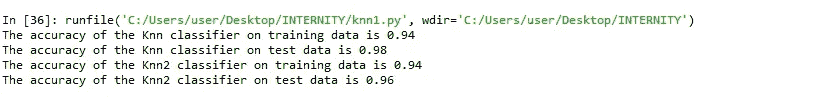
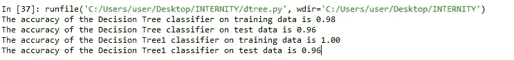

# 实施 KNN 和决策树

> 原文：<https://medium.datadriveninvestor.com/implementing-knn-and-decision-tree-3d10bb694ec4?source=collection_archive---------3----------------------->

[](http://www.track.datadriveninvestor.com/1B9E)

www.internity.[in](http://www.internity.in)

这次我们将学习一些 KNN 和决策树的实际实现。

在进入这一部分之前，每个人都需要一些关于这两方面的理论知识。它已经在以前的帖子中讨论过，所以如果有人有任何疑问，也请检查以前的帖子。

```
#This is the implementation of KNN
#There are some pre-defined libraries in python that has been used here.import pandas as pd
import numpy as np
from sklearn.model_selection import train_test_split
from sklearn.neighbors import KNeighborsClassifierfrom sklearn.metrics import accuracy_score
#Scaling data
from sklearn.preprocessing import StandardScaler
from sklearn.model_selection import cross_val_score
#Now this is a dataset provided by sklearn library
from sklearn.datasets import load_irisiris = load_iris()
x = iris.data
y = iris.target
X_train, X_test, y_train, y_test = train_test_split(x, y, test_size=0.3, random_state=1)
sc = StandardScaler() #for scaling the data
sc.fit(X_train)
X_train_std = sc.transform(X_train)
X_test_std = sc.transform(X_test)knn = KNeighborsClassifier(n_neighbors = 7, p = 2, metric='minkowski')
knn1 = KNeighborsClassifier(n_neighbors = 5, p = 3, metric='minkowski')
knn.fit(X_train_std, y_train)
knn1.fit(X_train_std, y_train)
print('The accuracy of the Knn classifier on training data is {:.2f}'.format(knn.score(X_train_std, y_train)))
print('The accuracy of the Knn classifier on test data is {:.2f}'.format(knn.score(X_test_std, y_test)))
print('The accuracy of the Knn2 classifier on training data is {:.2f}'.format(knn1.score(X_train_std, y_train)))
print('The accuracy of the Knn2 classifier on test data is {:.2f}'.format(knn1.score(X_test_std, y_test)))
```



这是出现的输出。因此，很明显，改变参数值肯定会给输出带来变化。

现在属性 ***【公制】*** 在决定精度上起着关键作用。距离度量类为快速距离度量函数提供了统一的接口。并且在设置参数 p=2 的情况下，metric = minkowski 的值用作欧几里得距离。

现在让我们看看距离树。

```
import pandas as pd
import numpy as np
from sklearn.model_selection import train_test_split
from sklearn import tree
#Scaling data
from sklearn.preprocessing import StandardScaler
from sklearn.model_selection import cross_val_score
#NOw this is a dataset provided by sklearn library
from sklearn.datasets import load_irisiris = load_iris()
x = iris.data
y = iris.target
#Here if we take different value of random state, then also accuracy shows a change.
X_train, X_test, y_train, y_test = train_test_split(x, y, test_size=0.3, random_state=1)
sc = StandardScaler() #for scaling the data
sc.fit(X_train)
X_train_std = sc.transform(X_train)
X_test_std = sc.transform(X_test)#Create tree object
decision_tree = tree.DecisionTreeClassifier(criterion='entropy', min_samples_split=2, min_samples_leaf=2)
decision_tree1 = tree.DecisionTreeClassifier(criterion='entropy')#Train DT based on scaled training set
decision_tree.fit(X_train_std, y_train)
decision_tree1.fit(X_train_std, y_train)#Print performance
print('The accuracy of the Decision Tree classifier on training data is {:.2f}'.format(decision_tree.score(X_train_std, y_train)))
print('The accuracy of the Decision Tree classifier on test data is {:.2f}'.format(decision_tree.score(X_test_std, y_test)))print('The accuracy of the Decision Tree1 classifier on training data is {:.2f}'.format(decision_tree1.score(X_train_std, y_train)))
print('The accuracy of the Decision Tree1 classifier on test data is {:.2f}'.format(decision_tree1.score(X_test_std, y_test)))
```



显而易见，如果调整随机状态等参数，引入最小样本分割等因素，会改变决策树的精度水平。

因此，改变参数会改变精度，并会产生一些影响。

编码快乐！！！