# 用 Python 实现朴素贝叶斯情感分析

> 原文：<https://medium.datadriveninvestor.com/implementing-naive-bayes-for-sentiment-analysis-in-python-951fa8dcd928?source=collection_archive---------1----------------------->

[](http://www.track.datadriveninvestor.com/1B9E)

朴素贝叶斯分类器是一种众所周知的机器学习分类器，应用于自然语言处理(NLP)和其他领域。尽管它很简单，但它能够在不同的任务(如情感分析)中实现高于平均水平的性能。今天我们将详细阐述这个模型的核心原理，然后用 Python 实现它。最后，我们将看到我们在 2000 个电影评论的数据集上做得有多好。我们开始吧！


# **核心**

如果你熟悉一些数学符号，这个模型背后的数学并不难理解。对于那些不是的人，我会尽力解释清楚。让我们从我们的目标开始，正确地将评论分类为**正面**或**负面**。这是每个文档所属的两个**类**。

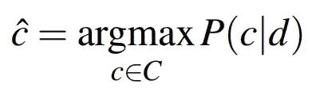

用更数学的术语来说，我们希望找到给定文档的**最可能的类，这正是上面的公式所传达的内容。 **C** 是所有可能的类的集合， **c** 是这些类中的一个， **d** 是我们当前正在分类的文档。给定文档 d，我们将 **P(c|d)** 读作 c 类的概率。**

我们可以使用众所周知的贝叶斯规则重写这个等式，贝叶斯规则是机器学习中最基本的规则之一。因为我们想最大化方程，我们可以去掉分母，它不依赖于 c 类。

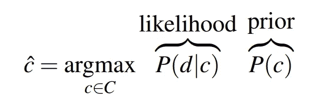

我们的分类器目标的重写形式自然地将它分成两部分，即**可能性**和**先验。**你可以把后者想成“给定一个 c 类，文档 d 属于它的概率”，把前者想成“拥有一个来自 c 类的文档的概率”。为了更进一步，我们需要引入给这个模型命名的假设。

**朴素贝叶斯假设:**给定一个 c 类，我们文档中某个特征的存在是独立于其他特征的。

我们认为文档中的每个单词都是一个特征。如果我们正式地写这个，我们得到:

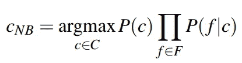

朴素贝叶斯假设让我们用以类为条件的每个特征的概率的乘积来代替 P(d|c ),因为它假设了它们的独立性。

我们可以再做一个改变:改为最大化函数的 log。这样做的原因纯粹是计算性的，因为日志空间不容易下溢，而且更有效。我们得出分类器目标的最终公式。

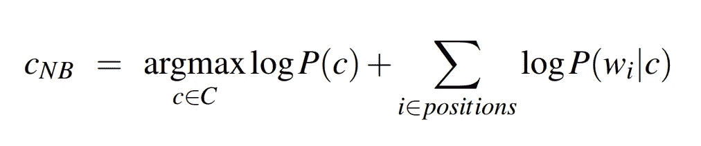

那么这种重新表述到底对我们有什么帮助呢？让我们单独看一下每个术语。

*   **P(c)** 简单来说就是在我们的语料库中遇到某类文档的概率。这很容易通过将 c 类的出现次数除以文档总数来计算。
*   **P(w_** i **|c)** 是单词 w_i 在 c 类文档中出现的概率。同样，我们可以使用语料库中的频率来计算它。这将简单地是单词 w_i 在 c 类文档中出现的次数，除以在 c 类文档中出现的每个单词的总计数

我们可以计算公式中的所有项，这意味着我们可以计算测试文档中最可能的类！我们只需要处理一个问题:零概率。

# **平滑**

假设你正试图对一篇包含单词“惊人”的评论进行分类，而你的分类器以前从未见过这个单词。自然概率 P(w_i|c)会为 0，使得我们方程的第二项走向负无穷大！这是 NLP 中的一个常见问题，但谢天谢地它有一个简单的解决方法:**平滑。**该技术包括在 P(w_i|c)公式中的每个计数上添加一个常数，最基本的平滑类型被称为加一(拉普拉斯)平滑，其中常数仅为 1。

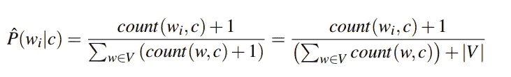

Add-one/Laplace smoothing

这解决了零概率问题，我们稍后会看到它对我们模型的准确性有多大影响。

# **实施**

我们将以 NaiveBayesClassifier 类的形式实现我们的分类器。我们将把算法分成两个基本部分，即**训练**和**分类。**

# **培训**

在这个阶段，我们为我们的分类器提供一个(最好)大的文本语料库，表示为 D，它计算所有必要的计数，以计算重构的两个术语。

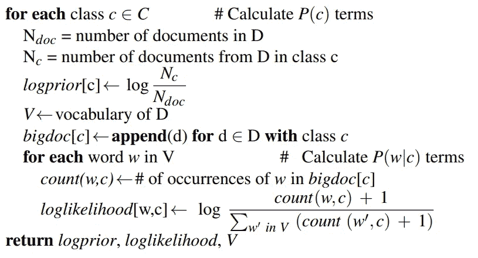

Pseudocode for Naive Bayes training

在实现的时候，虽然伪代码是从所有类的循环开始的，但是在循环之前，我们将从计算所有不依赖于 c 类的东西开始。N_doc、词汇表和所有类的集合就是这种情况。

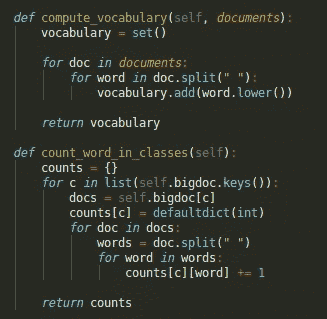

Helper functions

因为在计算字数时需要 bigdoc，所以我们也在循环之前计算它。

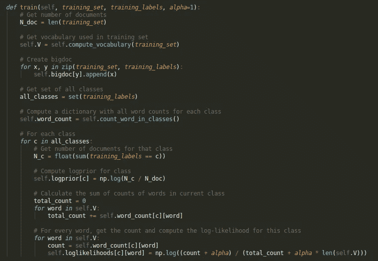

Train function

在循环中，我们只需遵循伪代码中给出的顺序。

1.  首先，我们统计 c 类中从 D 开始的文档数。
2.  然后我们计算这个特定类的对数先验。
3.  接下来，我们对我们的词汇表进行循环，这样我们就可以得到 c 类中单词的总数。
4.  最后，我们使用平滑来计算 c 类的每个单词的对数似然性，以避免被零除的错误。

# **分类**

训练完成后，我们就有了进行预测所需的所有值。这将简单地包括获取一个新的(看不见的)文档，并计算在训练期间观察到的每个类别的概率。

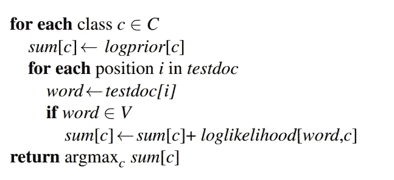

Pseudocode for the classification part

我们初始化 sums 字典，在那里我们将存储每个类的概率。我们总是计算所有类的概率，所以很自然地，函数从对它们进行循环开始。对于每个 c 类，我们首先加上对数先验，这是概率方程的第一项。第二项要求我们循环所有单词，并通过每个单词的对数似然性增加当前概率。

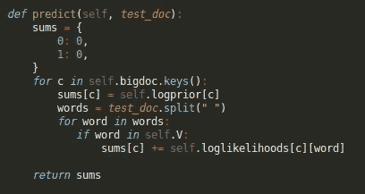

Prediction implementation

一旦完成，我们就可以得到字典中最大值的关键字，瞧，我们有一个预测。我们现在可以看到朴素贝叶斯的实际应用了！

# 数据

我们将在有 1000 条正面和 1000 条负面电影评论的数据集上测试我们的模型。每个**文档**是一个评论，由一个或多个句子组成。

我们将数据分成包含 90%评论的**训练集**和包含剩余 10%评论的**测试集**。顾名思义，前者用于使用我们的 train 函数训练模型，而后者将让我们了解模型对未知数据的推广效果。

一旦完成，我们需要某种基线来比较我们的模型的准确性，否则我们不能真正说出它做得有多好。由于这是一个二进制分类任务，我们至少知道随机猜测平均应该有 50%左右的准确率。任何接近这个数字的东西本质上都是随机猜测。

# 结果

让我们从头到尾看一下算法的完整实现。

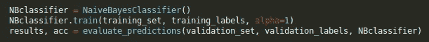

对，就是这样！我们所要做的就是创建分类器，训练它，并使用验证集来检查它的准确性。我省略了 helper 函数来创建用于训练和验证的集合和标签。让我们通过将 alpha 设置为 0 并运行它，来看看我们的模型在没有平滑的情况下做得如何

```
Predicted correctly 101 out of 202 (50.0%)
Ran in 1.016 seconds
```

呃..真令人失望。即使不进行平滑处理，人们也会期望至少比平均水平稍好一点。让我们添加平滑

```
Predicted correctly 167 out of 202 (82.67327%)
Ran in 0.961 seconds
```

现在这是一些准确性！平滑使得我们的模型足够好，可以正确地对 5 个评论中的至少 4 个进行分类，这是一个非常好的结果。我们还看到，训练和预测总共最多需要 1 秒钟，对于有 2000 条评论的数据集来说，这是一个相对较低的运行时间。

# 结论

正如我们所看到的，即使是朴素贝叶斯算法的一个非常基本的实现也可以为情感分析任务带来令人惊讶的好结果。请注意，该模型本质上是一个二元分类器，这意味着它可以应用于任何包含两个类别的数据集。它有各种各样的应用，从垃圾邮件检测到基于情感的比特币交易。有了 82%的准确率，你真的可以做很多事情，你需要的只是一个带标签的数据集，当然，数据集越大越好！

如果你对 AI 感兴趣，可以随时查看我的 github:[https://github.com/filipkny/MediumRare](https://github.com/filipkny/MediumRare)。我将把源代码和数据放在一起，这样您就可以自己测试了。感谢您的阅读:)