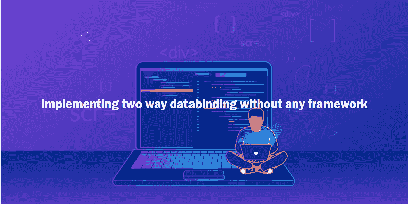
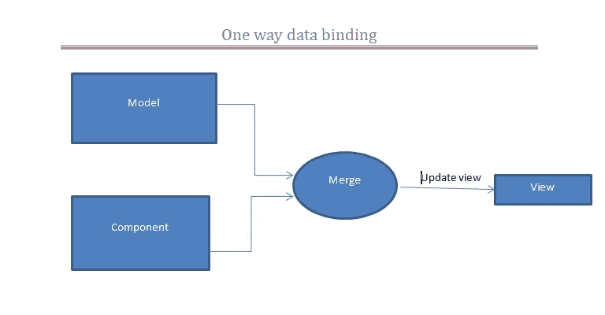
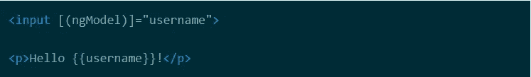
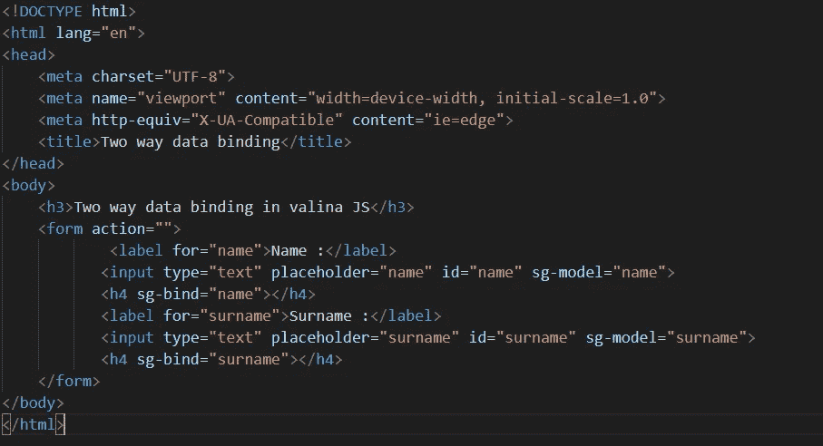

# 不使用任何框架实现双向数据绑定。

> 原文：<https://medium.datadriveninvestor.com/implementing-two-way-data-binding-without-using-any-framework-703963d00a94?source=collection_archive---------2----------------------->

[](http://www.track.datadriveninvestor.com/1B9E)

在任何现代的 web 应用程序中，我们基本上都有两个部分，第一部分是用户与之交互的前端部分，如查看信息、填写表单、单击按钮等，另一部分是后端部分，所有的业务逻辑、数据操作、身份验证、授权、会话处理、文件上传以及许多其他事情都在这里完成。

所以当用户在前端部分做一些数据操作时，源数据要被改变。例如，如果我们在前端有一个员工详细信息的列表，如果有人在前端修改了员工的详细信息，这应该会在数据源中反映出来，反之亦然。

[](https://www.datadriveninvestor.com/2019/02/21/best-coding-languages-to-learn-in-2019/) [## 2019 年最值得学习的编码语言|数据驱动的投资者

### 在我读大学的那几年，我跳过了很多次夜游去学习 Java，希望有一天它能帮助我在…

www.datadriveninvestor.com](https://www.datadriveninvestor.com/2019/02/21/best-coding-languages-to-learn-in-2019/) 

## 数据绑定—

数据绑定是一种将流绑定到用户界面和业务逻辑之间的数据的方法。

基本上有两种类型的数据绑定—

1.  单向数据绑定
2.  双向数据绑定

## 单向数据绑定—

在单向数据绑定上改变业务逻辑，前端会自动改变，但是当我们在前端更新时后端不会自动改变。



one way data binding

## 双向数据绑定—

在双向数据绑定中，修改是在两端进行的，当我们在后端修改数据时，前端部分会自动更新，反之亦然。


Two-way data binding

现在，双向数据绑定是 Angular、React 和 Vue 等现代前端框架的主要功能之一。

例如，在 angular 中，我们使用 *[(ngModel)]* 进行双向数据绑定。



在这里，当我们开始在输入框中输入内容时，用户名将被更新到用户名模型中，并反映回视图。

> 我们可以用普通的 Javascript 来实现吗？？

答案是肯定的，我们可以使用 javascript 和事件处理轻松实现它。

因此，首先创建一个简单的网页，其中包含两个输入框，并将为这些输入框的值实现双向数据绑定。



index.html

1.  在上面的代码中，我使用输入字段中的 *sg-model* 属性来绑定输入字段值。在这里，我将遍历所有的 *sg-model* 属性，获取当前的输入值，并在 javascript 代码中绑定到 *scope* 对象。
2.  我为 h4 标签使用了一个 *sg-bind* 属性，当输入值改变时，它将用于 DOM 操作。

现在首先取所有的输入和 h4 元素—

```
//all the input elements
const inputElements = document.querySelectorAll('[sg-model]');//all the h4 elementconst inputBinds = document.querySelectorAll('[sg-bind]');
```

现在创建一个函数，页面加载后将立即调用该函数，即 *twoWayDataBinding。*

```
let scope = {};  //Initialize a global scope object.function twoWayDataBinding(){
for(let elem of  inputElements) { if(elem.type === 'text'){
           let propName = elem.getAttribute('sg-model'); elem.addEventListener('keyup', e =>{ scope[propName] = elem.value;
      })
     updateDom(propName);
      } }}
```

1.  在上面的函数中，我遍历输入元素，并为每个输入元素附加一个事件监听器 *keyup。*
2.  对于每个输入值，它将设置 scope 对象的适当属性。
3.  最后，我们将调用 *updateDom* 函数来操作视图部分。

```
function updateDom(propName){ if(!scope.hasOwnProperty(propName)){ let value; Object.defineProperty(scope,propName,{ set:(newValue)=>{ value = newValue; for(let e1 of inputElements){ if(e1.getAttribute('sg-model')=== propName){ e1.value=newValue; } } for(let e2 of inputBinds){ if(e2.getAttribute('sg-bind') === propName){ if(!e2.type){ e2.innerHTML=newValue; } }  }}, get(){ return value; } }) }}twoWayDataBinding();scope.name='satyendra';scope.surname='kannaujiya';
```

1.  在这个函数中，我将检查 scope 对象是否具有该属性。
2.  如果属性在范围对象中可用，那么我将使用 *Object.defineProperty()在范围对象上实现 *getter* 和 *setter* 。*
3.  这里 *setter* 方法将在每次 scope 对象的属性值改变时被调用。

现在你可以运行代码，你将得到数据绑定的实现。

我用一种非常简单的方式实现了这个，这也可以通过其他方法来实现。

## 感谢阅读:)