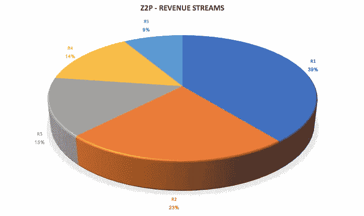

# 多种收入来源对创业的重要性

> 原文：<https://medium.datadriveninvestor.com/importance-of-multiple-revenue-streams-for-a-startup-d3588efcccdd?source=collection_archive---------10----------------------->

*The picture depicts the revenue sharing among different revenue streams for the Z2P Loan Platform for October 2018.*

在我之前的一篇文章([https://medium . com/datadriveninvestor/learning-revenue-growth-101-how-to-visualize-your-startups-growth-from-a-a-revenue-perspective-231709 ff 6 fa 8](https://medium.com/datadriveninvestor/learning-revenue-growth-101-how-to-visualize-your-startups-growth-from-a-revenue-perspective-231709ff6fa8))中，我已经详细描述了创造多种收入流并随后增长每一种收入流的方法。

**我们收入来源形成的时间顺序:R2->R3->R1->R4->R5**
R2 是我们第一个也是主要的收入来源。正如你所看到的，随着时间的推移，R1 开始只是一个非常小的收入来源，后来超过了 R2，成为我们的主要收入来源。我们现在甚至可以看到 R3 & R4 正在接近 R2，向主要收入来源过渡。
此外，由于 R2 是最古老的收入流，因此与其他收入流相比，它也是最稳定且无波动的收入流，而 R5 是最不稳定的。我目前的任务是稳定 R5，然后发展它。因此，对于每个创始人来说，一个非常重要的任务是不断发现新的收入来源，并随后加强它们。

让我来详细说明为什么拥有多种收入来源很重要:

**1)做出激进决策的自由:** 由于你有多种收入来源，你现在可以毫无畏惧地对你的产品进行试验和颠覆，因为你知道即使决策失败，还有其他收入来源支持失败的决策，公司也不会面临生存危机。

**2)** **防坑洼减震器:** 你永远不知道什么时候一个政府。法规的通过使你的一些产品/服务停止或减少利润。或者，竞争对手进来了，您的用户开始以惊人的速度向 it 迁移。在这种情况下，其他收入来源会覆盖你，并减少冲击的影响。

**3)更快的增长** 现在，你可以开始同时增长多个收入流，从而成倍增加总收入增长，而不是将你所有的想法和创意都放在增长一个收入模式上。

因此，永远不要满足于单一的收入模式