# 使用适当的预处理步骤、GridSearchCV 和管道来改进文本分类结果

> 原文：<https://medium.datadriveninvestor.com/improve-the-text-classification-results-with-a-suitable-preprocessing-step-gridsearchcv-and-f19cb3e182a3?source=collection_archive---------1----------------------->

最近，我完成了一个[数据营](https://www.datacamp.com)项目，[谁在发微博？特朗普还是特鲁多？](https://www.datacamp.com/projects/467)，涉及自然语言处理(NLP)和对 Twitter 数据的机器学习(ML)。

我还想推荐给 ML 初学者的[数据营课程](https://www.datacamp.com/courses/)。有几门 R 和 Python 语言的课程，可以帮助你开始这个有前途的领域。

# 项目“谁在发微博？特朗普还是特鲁多？”

[**Figure 1.** Photo Credit: Executive Office of the President of the United States](https://commons.wikimedia.org/wiki/File:President_Donald_Trump_and_Prime_Minister_Justin_Trudeau_Joint_Press_Conference,_February_13,_2017.jpg)

这个项目与挖掘包含唐纳德·川普和贾斯廷·特鲁多的推特帖子的数据集有关，并使用 NLP 和 ML 技术对谁在推特上发布了特定的推特帖子进行分类。

在接下来的部分中，我将介绍 DataCamp 建议的解决方案以及我在这个项目中进行的改进。

## 1.默认解决方案

首先，从数据集 CSV 文件创建一个熊猫数据帧。然后从数据集中获取**目标列** (y)，通过 **train_test_split** 函数创建训练和测试数据(见下图)。

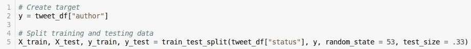

**Figure 2.** Getting the target column and splitting the dataframe

接下来，通过 **CountVectorizer** 和 **TfidfVectorizer** 对象对训练和测试数据进行矢量化(见下图)。这种转换是必要的，因为 ML 算法只处理数字数据。**计数矢量器**创建包含记号的**出现次数**的字典，而**TF IDF 矢量器**使用记号的 **tf-idf** 值生成字典。

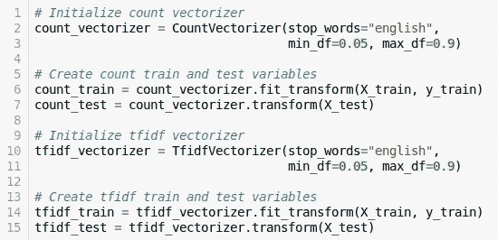

**Figure 3.** Vectorization process

> TF-IDF 度量确定特定令牌的重要性/代表性程度。如果一个令牌在几个文档中是通用的，那么它的 TF-IDF 值就会太低。然而，如果该令牌在文档中很少见，则 TF-IDF 值将非常高。

接下来，对于这两种矢量化方法，**多项式朴素贝叶斯**模型用于从训练数据中学习，并对测试数据进行分类(见下图)。该模型是一种概率学习方法，使用贝叶斯理论对文本数据进行分类。

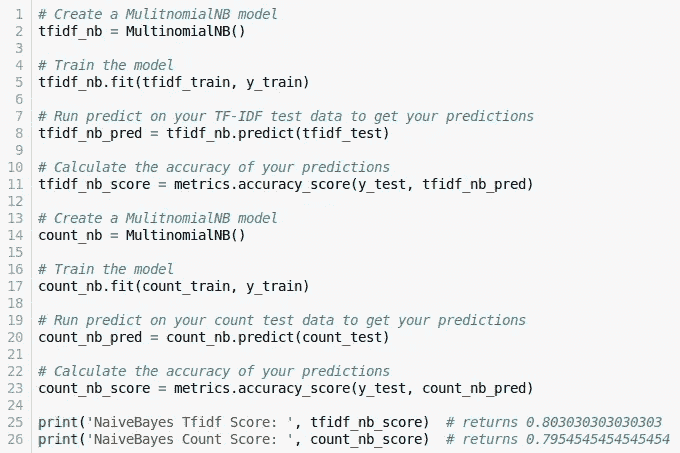

**Figure 4.** Multinomial Naïve Bayes for textual classification

此外，对于两个多项式朴素贝叶斯模型，都生成了混淆矩阵(见下图)。

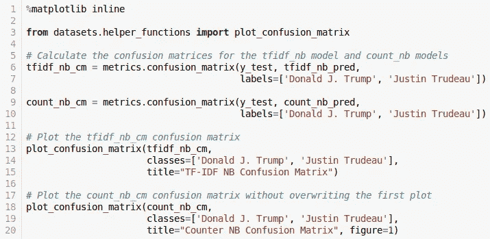

**Figure 5.** Plotting the confusion matrices

**Figure 6.** Confusion matrices for both Multinomial Naïve Bayes

**TF-IDF 矢量化方法**的高性能引人注目，其**精度**约为 **80%** 。为了**改进这个结果**，另一个文本分类器 **LinearSVC** 仅与 TF-IDF 方法一起使用。

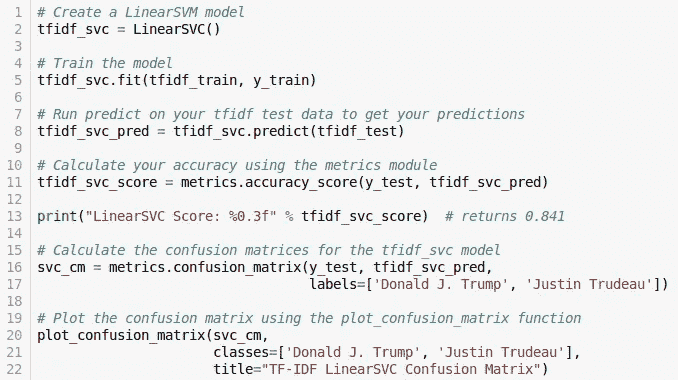

**Figure 7.** Linear Support Vector Classification for textual data

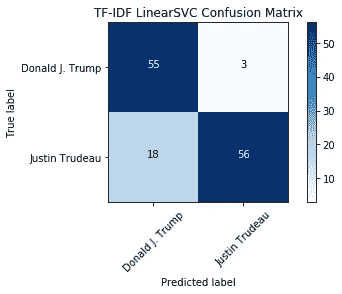

**Figure 8\.** Confusion Matrix for Linear Support Vector Classification

现在，通过使用 **LinearSVC** 模型，结果的改善是显而易见的，精确度为 **84，1%** (见上图)。

在下一节中，我将通过使用管道、GridSearchCV 和适当的预处理步骤来介绍这个解决方案的改进。

## 2.改进的解决方案

本节介绍了 DataCamp 建议的一些改进。它们与预处理活动、模型调整和选择步骤有关。

他们是:

*   额外的预处理(如删除网址、转发和法语停用词)；
*   利用 GridSearchCV 对模型进行改进，寻找最优参数；
*   使用管道来简化分类过程。

## 2.1.额外预处理

创建类 **PreprocessingText** 是为了实现文本的清理(见下图)。这个类是一个自定义的 transformer 类，可以移除英语和法语的 URL、转发、人物标签、标签和停用词。

> 停用词是对描述/区分文本主题几乎没有贡献的标记，它们只是增加了文本的维度。

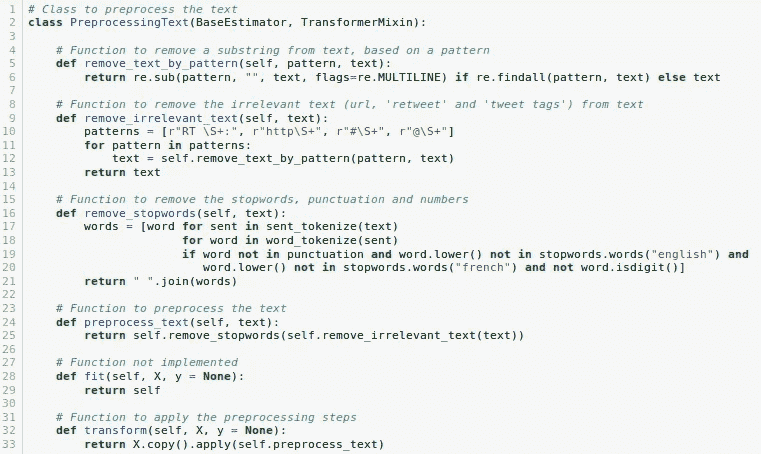

**Figure 9.** PreprocessingText class

接下来，在创建了 PreprocessingText 类之后，它被用来清理文本(见下图)。

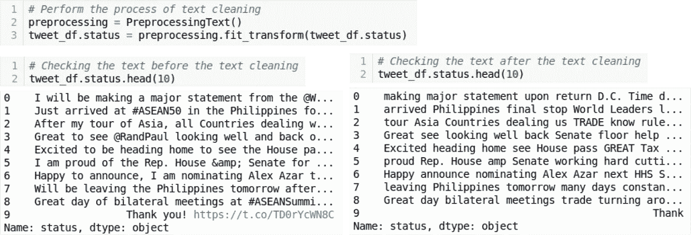

**Figure 10.** Text cleaning process

## 2.2.管道和网格搜索

数据集清理过程结束后，训练和测试数据由 **train_test_split** 函数创建，与图 2 中的[活动相同。](#9348)

接下来，创建 Pipeline 和 GridSearchCV 对象及其超参数(见下图)。**管道**对象包含 **TF-IDF 矢量化过程**和**无参数的多项式朴素贝叶斯分类器**(默认值)。 **search_space** 变量是一个 **Python 字典**，它包含了 **GridSearchCV 对象**要使用的分类器，以便确定对测试数据进行分类的最佳模型。

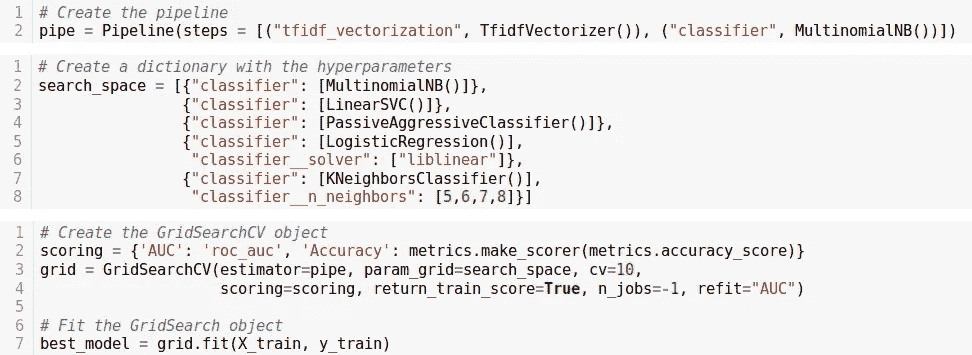

**Figure 11.** Pipeline and GridSearchCV objects

这些模型是:多项式朴素贝叶斯(MultinomialNB)、线性支持向量分类器(LinearSVC)、被动攻击分类器、逻辑回归和 K-最近邻分类器(KNeighborsClassifier)。前三个模型是在没有参数(默认值)的情况下定义的，而后两个模型是用以下参数定义的:

*   **逻辑回归:***解算器*参数是“liblinear ”,它表示在优化问题中使用的算法。
*   **K-最近邻居:***n _ Neighbors*参数表示投票过程要使用的邻居数量。具有可能值的列表已被传递，这些值将由 GridSearchCV 对象测试。

接下来，通过传递**管道对象**(估计器)及其**超参数** (param_grid)来创建 **GridSearchCV 对象**。此外，还定义了将执行一个 **10 重交叉验证**的过程，以及将由**最佳测试准确度**(评分)选择**最佳模型**。此外，从**最佳 ROC AUC** 中，最佳模型将通过使用在整个数据集(改装)上找到的最佳参数**改装**。

最后，用训练数据拟合 GridSearchCV 对象，并定义最佳模型。**冠军分类器**是**多项式朴素贝叶斯**。这个结果和上一个完全不一样。所采用的预处理步骤使得多项式 lNB 模型优于线性 SVC 模型。

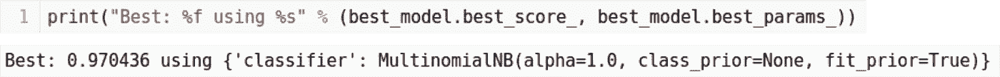

**Figure 12.** Best model and its parameters

在下一节中，我将展示测试数据的最佳模型的结果。

## 2.3.测试最佳模型

一旦定义了最佳模型，就用它来对测试数据进行分类。从图 13 可以看出，**最佳模型**比 **LinearSVC** 模型( **84，1%** )获得了更好的结果( **89，4%** )。为了确认结果，还生成了混淆矩阵(参见图 14)。

**Figure 13.** Testing the model

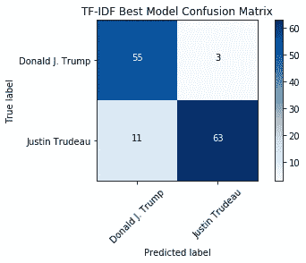

**Figure 14.** Confusion matrix for the best model

# 结论

值得注意的是，流水线和 GridSearchCV 的使用允许简化 ML 模型的构建，并且预处理活动的执行显著地提高了用于文本分类的 ML 模型的性能。

# 参考

Ghosh，Sohom 开枪啊德怀特。**自然语言处理基础**。Packt 出版公司，2019 年。

数据营。适用于:[http://www.datacamp.com。](http://www.datacamp.com.)