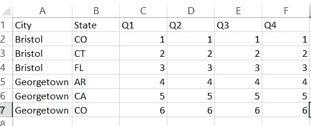
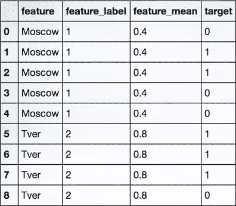
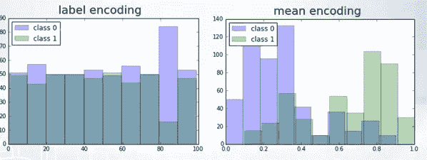

# 使用均值/目标编码改进您的分类模型

> 原文：<https://medium.datadriveninvestor.com/improve-your-classification-models-using-mean-target-encoding-a3d573df31e8?source=collection_archive---------1----------------------->

> 编码是一个预处理步骤，将文本、序列甚至图像和音频转换成机器可理解的形式(通常使用整数或矩阵)

如果你已经在 HackerEarth 或 kaggle 上解决了机器学习问题，那么你肯定会遇到这种类型的问题，其中一些列需要编码



City and State columns need to be encoded

最常见的编码器类型是标签编码器，其中每个唯一的标签被分配一个整数，一旦我们知道唯一标签的数量，我们就可以很容易地实现它。在上面的例子中，唯一标签的数量就是城市的数量。

```
**>>> from** **sklearn** **import** preprocessing
**>>>** le = preprocessing.LabelEncoder()
**>>>** le.fit(["Bristol", "Bristol", "GeorgeTown", "GeorgeTown"])
LabelEncoder()
**>>>** le.transform(["GeorgeTown", "GeorgeTown", "Bristol"]) 
array([2, 2, 1])
```

现在我们来谈谈平均编码，

在均值编码中，我们考虑了标签的数量以及目标变量，以将标签编码为机器可理解的值



让我们考虑上表(一个简单的二元分类),其中我们有两个标签……莫斯科和特维尔。在正常的标签编码中，我们会将莫斯科指定为 1，将特维尔指定为 2，但在均值编码中

莫斯科的编码=[莫斯科标签下的真实目标数/莫斯科标签下的目标总数]是 2/5 = 0.4，类似地，Tver 的编码= 3/4 ~ 0.8(近似值)

除了寻找目标的平均值，我们还可以关注中位数和其他统计相关性。这些被广泛称为目标编码

但是为什么这些编码更好呢？

*   均值编码可以在标签中体现目标，而标签编码与目标无关
*   在大量特征的情况下，均值编码可以被证明是一种简单得多的替代方案
*   使用标签和均值编码的预测直方图显示，均值编码倾向于将类分组在一起，而在标签编码的情况下，分组是随机的



尽管看起来卑鄙的编码是超人……它的氪星石太适合了。我们使用目标类对训练标签进行编码的事实可能会泄露有关预测的数据，从而导致编码变得有偏差。我们可以通过规范化来避免这种情况

一些 Kaggle 竞争对手使用正则化均值编码进行更好的预测，并在排行榜中排名上升。

Github 链接:

[](https://github.com/Sangarshanan/Implementing-basic-concepts-and-algorithms/blob/master/Mean%20Encodings/Mean%20Encodings.ipynb) [## sangarshanan/实现基本概念和算法

### 实现-基本概念和算法-实现概念以获得更深入的洞察力

github.com](https://github.com/Sangarshanan/Implementing-basic-concepts-and-algorithms/blob/master/Mean%20Encodings/Mean%20Encodings.ipynb) 

参考资料:

[](http://www.saedsayad.com/encoding.htm) [## 编码

### 二进制和基于目标的。

www.saedsayad.com](http://www.saedsayad.com/encoding.htm) [](https://www.coursera.org/learn/competitive-data-science/lecture/b5Gxv/concept-of-mean-encoding) [## 均值编码的概念-高级特征工程 I | Coursera

### 国家研究型大学高等经济学院为课程“如何赢得数据科学…

www.coursera.org](https://www.coursera.org/learn/competitive-data-science/lecture/b5Gxv/concept-of-mean-encoding)