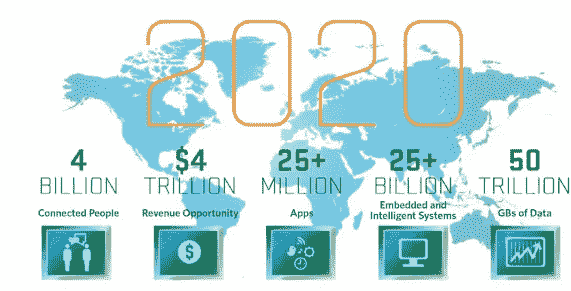
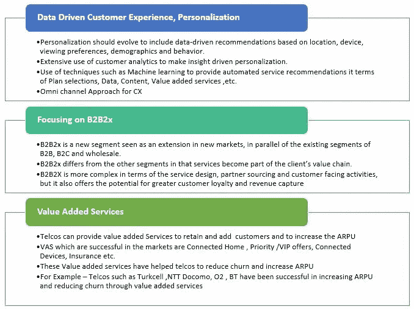
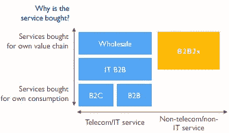
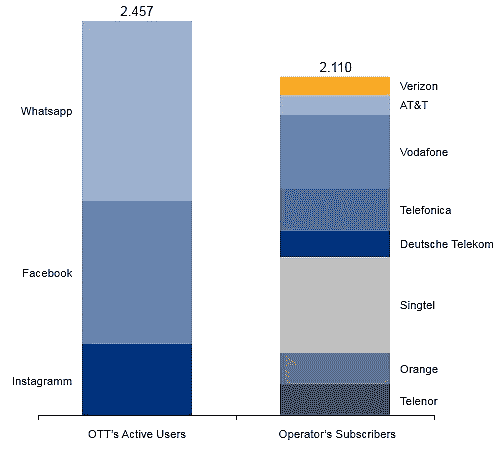
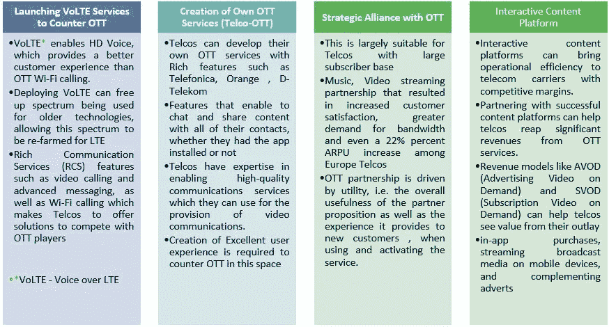

# ARPU 的进步！–电信公司应该怎么做？

> 原文：<https://medium.datadriveninvestor.com/improvement-of-arpu-what-should-the-telcos-do-8f586cc1c879?source=collection_archive---------0----------------------->

**电信行业高级分析师 Ramkumar Manoharan 的两步战略成功改善电信行业的 ARPU**

尽管智能手机、平板电脑和移动网络的使用在全球范围内激增，但电信公司在提高每用户平均收入方面仍面临重大挑战(ARPU)。ARPU 的侵蚀如此严重，以至于数据收入的增长无法抵消语音和文本等核心服务收入的下降。

电信公司必须探索并采用高效的策略来减少客户流失，维持并增加用户群，提高每个用户的收入。基本策略，如在数据计划中提供优惠、降低费率或甚至给予补贴智能手机，可能会产生短期影响，不太可能为电信公司提供可持续的解决方案。

 [## 2019 年即将改变世界的技术|数据驱动的投资者

### 很难想象一项技术会像去年的区块链一样受到如此多的关注，但是……

www.datadriveninvestor.com](https://www.datadriveninvestor.com/2019/01/17/the-technologies-poised-to-change-the-world-in-2019/) 

挑战不局限于电信公司的规模或他们经营的地理位置，而是整个行业。**运营商之间的竞争加剧、服务饱和以及来自 OTT 玩家的蚕食和威胁**在收入实现和减少客户流失方面对电信公司产生了重大影响。OTT 玩家在语音、文本和数据等核心领域与电信公司展开激烈竞争，并不断向市场推出创新、有吸引力的应用和解决方案，轻松征服大众市场。

**、【多元化】、【创新】、【客户体验】、【建立协同效应】、【确定关键合作伙伴】、**、**、【数据洞察】**是电信公司应该整合的一些关键战略重点，作为其 ARPU 战略的一部分。

Source: Mario Morales, IDC

IDC 表示，随着世界各个层面都在经历数字化转型，电信公司将面临巨大的收入机会。机会可以通过支持商业客户的数字价值链、创建智能应用、探索新的市场途径和细分市场、开发大众市场的创新解决方案等形式出现。

本文中解释的策略有两个方面。首先是提高 ARPU 的业务战略，然后是应对挑战的 OTT 和内容战略。本文还探讨了电信公司在提高和维持 ARPU 方面面临的一些关键挑战。

1.  **改善 ARPU 的商业策略**

个性化和改善用户体验对建立和维持用户群有很大的影响。**由于电信公司可以访问每天生成的海量客户数据，他们应该能够从中获得洞察力。整合大数据分析来分析客户数据是朝着这个方向迈出的重要一步。**数据洞察将为电信公司提供客户偏好方面的重要信息。由于市场上的客户有过多的选择，电信公司应该向市场提供解决方案和服务，以提供最佳的客户体验。

电信公司可以向亚马逊和网飞等 OTT 公司学习，因为他们有效地利用消费数据来洞察客户的使用趋势、行为模式和服务偏好。

**B2B2x 正变得越来越重要——它代表了一个新的细分市场和电信公司尚未开发的机会，可以通过利用核心资产和能力以及了解帮助公司数字化需要什么来抓住这一机会。— ADL**

Source: Arthur D Little (ADL)

Arthur D . Little(ADL)估计，到 2020 年，全球 B2B2x 市场的价值将达到 2760 亿美元**。其中 80%** 在传统电信领域之外。B2B2x 服务需要更深入的客户或行业洞察和参与，运营商需要获得系统集成商的一些能力。

欧洲电信运营商正在朝着这个方向迈出第一步，例如德国电信最近与亚马逊的 Alexa 合作推进语音控制智能家居，或将尖端信息技术引入戴姆勒的汽车，这些都是运营商如何超越传统范围进行扩张的例子。

**电信公司应深入了解其经营的客户群，并提供本地相关的增值服务(VAS)。**电信公司需要改进他们的增值服务产品，并建立一个为客户带来价值的产品组合。电信公司应正确选择他们的**服务交付渠道**向消费者提供增值服务，他们应避免通过短信或 IVR 提供增值服务，因为消费者不喜欢这些服务交付渠道。他们需要融入更多能引起消费者共鸣的基于应用的技术。

电信公司应在各自的增值服务产品中与服务提供商建立合作伙伴关系。这将增加服务的可信度和被长期采用的可能性。

Turkcell 已经开发了一套基于消费者偏好的增值服务组合，包括搜索、发票、TL、信息服务、娱乐和应用。

O2 UK 提供的增值服务主要针对核心电话和数字服务、联网家庭以及零售和票务促销。它还提供汽车保险服务。

英国电信的 VAS 战略使其能够在来自 TalkTalk 和随后 Sky 的极端竞争压力下保持和增长其市场份额。

**2。** **OTT 和内容整合策略**

ott 向世界证明了他们能够创新并创造出颠覆性的解决方案，从而极大地影响通信行业。例如， **WhatsApp 已经让通过短信交流变得过时**。网飞、亚马逊 prime 和其他公司已经改变了媒体内容消费的方式。看起来 OTT 设定了条款，而电信公司也跟着设定了条款。这种设置将影响电信公司的收入，他们需要成为这个循环中的主导者，以避免进一步的收入侵蚀。

电信公司应该利用他们的核心竞争力，即网络基础设施和通信领域的整体专业知识。电信运营商应制定战略，推出优于 OTT(如 VoLTE*)解决方案的解决方案，或发展合作伙伴战略，为双方创造双赢局面，或确定他们可以占领市场份额的领域，OTT 玩家预计将在这些领域获得主要收入份额，如视频内容。

根据 detecon research 的数据，就用户数量而言，WhatsApp、脸书和 Instagram 已经超过了包括威瑞森、沃达丰或德国电信在内的八大电信运营商。活跃用户数为 21.10 亿。)

**虽然电信公司和 OTT 看起来可能是相互竞争，但它们仍然可以在共生关系中运营。运营商需要 OTT 来保持通过其网络的数据流量。Argyle Data Insights 表示，OTT 需要运营商不断改进他们的网络**

通过使用来自内容平台的高级元数据，电信公司可以更好地锁定内容并提高客户满意度

一些主要电信公司拥有自己的内部 OTT 平台，如 immr(D-Telekom)、Libon (Orange)、TuGo (Telefonica)、BIP (Turkcell)等。

到 2019 年，视频点播收入将每年增长 25%以上，占 OTT 收入的 70%以上。

**总结**

电信公司面临着来自许多方面的竞争挑战，制定一个成功的路线图来保持和发展他们的用户群是一个挑战。为了提高 ARPU 和减少客户流失，电信公司需要在业务和技术方面采取多管齐下的策略。

**建议包括**

总的来说，行业正朝着拥抱数字的方向发展，现在是时候确定他们的资产、核心竞争力和差异化，并从业务和技术角度为数字生态系统采取策略。

电信公司应利用其网络效率优势，提供优于 OTT 的多媒体内容交付服务，因为目前 OTT 的主要收入来自内容交付。

如果电信公司推出增值服务，他们需要采用市场对市场的部署策略来检查消费者对服务的接受程度，并根据反馈不断修改服务

由于技术颠覆是行业的一个常见方面，电信公司应迅速发展，采用最新技术，并通过采用数据驱动的方法来衡量战略的成功。

电信公司应建立合作伙伴关系，推动互惠互利。与其他运营商建立战略联盟可以提供应对 OTT 玩家所需的强大力量。

**致谢:**

AVP uma Shankar——单位客户解决方案主管，源单位

SOURCE Research 的负责人 Suma Mishra

Jiby Anu George，CME 价值设计负责人，源单位

**参考:**

[**【Csgi】**](http://blog.csgi.com/b2b2x-iot-cx-2017-predictions)**[**techblog . com SOC**](http://techblog.comsoc.org/tag/arpu-x-volume/)**[**Adlittle**](http://www.adlittle.com/downloads/tx_adlreports/ADL_UK_Launch_TelecomMediaFlagshipReport_StrategicChoices.pdf)**[**TM forum**](https://inform.tmforum.org/features-and-analysis/2015/09/the-dilemma-of-how-to-grow-revenue/)**[**Gsma**](https://www.gsma.com/iot/wp-content/uploads/2012/10/GSMA_NewBusinessModels_10_12.pdf)**[**ovumkc**](https://www.ovumkc.com/)**********