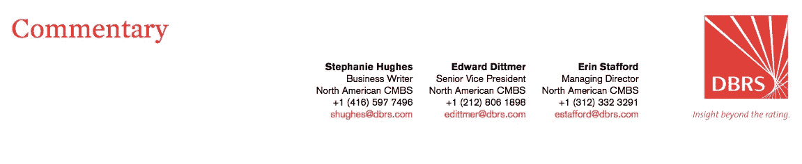
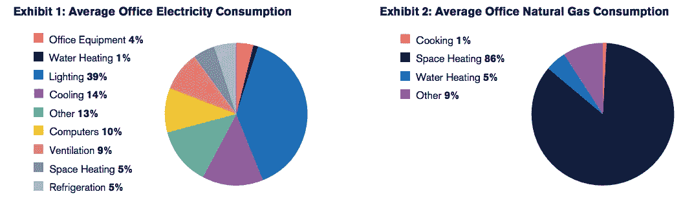
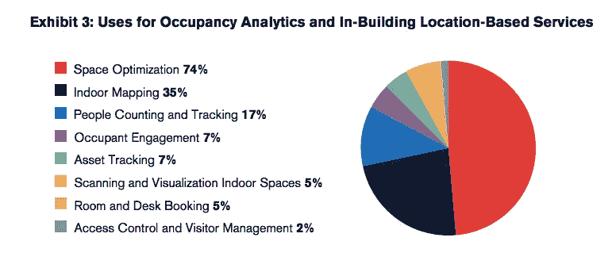

# 提高建筑物的智商:智能技术如何惠及商业地产

> 原文：<https://medium.datadriveninvestor.com/improving-a-buildings-iq-how-smart-technologies-can-benefit-commercial-real-estate-9b2b880e1fa0?source=collection_archive---------2----------------------->

Smart technology and Internet of Things (IoT) software are features that were once “nice to have” may soon become a “have to have.”

自动化和智能建筑技术的使用越来越多，这不仅会对运营费用，还会对资产质量产生重大影响。随着这些技术的激增，DBRS 预计将更多地依赖计算机来执行基本功能，如温度控制、照明、空气质量、卫生，甚至通过物联网技术组织租户名册。物联网技术是一种连接计算和机械设备的系统，可以在没有人类交互的情况下自动传输数据。

智能建筑物联网平台，如日立的 [Lumada](https://www.hitachivantara.com/en-us/products/internet-of-things/lumada.html) 、[思科](https://www.cisco.com/)、[霍尼韦尔](https://www.honeywell.com/)、[智能建筑技术](https://www.smartbuildingtec.com/)、 [IBM 的沃森物联网](https://www.ibm.com/internet-of-things?cm_mmca1=000001AN&cm_mmca2=10001988&|511|83921&Matchtype=e&cm_mmca7=1027028&cm_mmca8=kwd-301843687176&cm_mmca9=f3a5cae6-211d-4bef-945e-bdb2cec416a9&cm_mmca10=259020696665&cm_mmca11=e)和施耐德电气的 [StruxureWare](https://www.schneider-electric.com/en/work/solutions/enterprise-solutions/enterprise-software-suites/) 不断涌现。这些平台为公司和房地产公司提供楼宇自动化系统、能源管理系统、租户服务计量、关键系统监控和智能照明解决方案，显示出租户和员工对该技术的强烈需求。[瑞典斯德哥尔摩的技术市场研究员 Memoori](https://www.memoori.com/) 最近发表了一份名为 [*智能商业建筑中的物联网 2018 年至 2022 年*](https://www.memoori.com/portfolio/internet-things-smart-commercial-buildings-2018-2022/) 的报告，该报告预测，建筑中的物联网的全球市场总额将从 2017 年的 348 亿美元增长到 2022 年的 842 亿美元。

根据 Memoori 的报告，办公物业，特别是人口密集地区的 A 级物业，在采用这项技术方面遥遥领先——截至 2017 年，办公楼中有 13.19 亿台设备集成了物联网技术，超过了零售(2017 年 4.09 亿台设备)、银行和证券(2017 年 2.22 亿台设备)和酒店(2017 年 7200 万台设备)。事实上，Memoori 估计，到 2022 年，所有市场中采用物联网的办公楼设备数量将增加到 33.31 亿台(五年内增长约 153.0%)，鉴于建筑物中采用物联网技术的诸多好处，这一预测并不令人惊讶。随着技术的发展和成本优势变得更加明显，较小的办公市场和其他类型的房地产也可能会增加物联网的使用，因为物联网在建筑管理中不再是奢侈品，而是必需品。

# 物联网和办公物业

随着时间的推移，办公场所的运营费用会不断增加。根据威斯康星州公用事业公司麦迪逊燃气和电力公司的 [*管理办公楼*](https://www.mge.com/images/PDF/Brochures/business/ManagingEnergyCostsInOfficeBuildings.pdf) 的能源成本报告，美国办公楼平均将近 29.0%的运营费用用于公用事业。美国能源信息署积累了电力和天然气使用的数据(参见图表 1 和 2)，这些数据显示，2010 年，制冷、照明和通风等建筑功能占电力使用的 62.0%，空间加热占天然气使用的 86.0%。

Source: Data from the U.S. Energy Information Administration via Madison Gas and Electric Company’s [Managing Energy Costs in Office Buildings](https://www.mge.com/images/PDF/Brochures/business/ManagingEnergyCostsInOfficeBuildings.pdf) research report.

自动化建筑管理可以通过运动传感器实现照明控制，关闭空房间的灯；用智能恒温器调节暖通空调设备，以避免过度消耗；安装自动窗户遮阳系统；并将数据分析用于能源效率、工程报告、住户投诉报告等。根据[美国节能经济委员会](http://aceee.org/) (ACEEE)的一项名为 [*智能建筑:使用智能技术在现有建筑中节能*](http://aceee.org/sites/default/files/publications/researchreports/a1701.pdf) 的研究，一座占地面积约为 50，000 平方英尺(sf)的办公楼，每年消耗约 850，000 千瓦时(kWh)，使用照明控制和远程 HVAC 控制系统，每年可以节省约 200，000 千瓦时—约 23.0%的能源节约。

# 物联网延伸至其他物业类型

虽然办公物业主导了智能技术的需求，但它们并不是唯一的采用者；酒店、研发实验室、教育和医疗保健机构也在使用新技术来降低成本和减少碳足迹。根据 ACEEE 的报告，通过空气质量和占用传感器以及实时通风控制器，实验室可以实现 40.0%的节能，其次是医疗保健 18.0%，学校 11.0%，酒店 6.0%。工业建筑可能会受益于智能气候控制系统、设施操作、水表、水泵和供暖。

除了降低成本，酒店正在使用软件来改善客人体验，允许通过智能手机进入房间和控制气候。据 IHS Markit Ltd .称，酒店业预计将花费超过 5 亿美元用于联网软件设备，花费超过 22 亿美元用于客房装修，以适应这些变化。商业地产的所有者和管理者也在使用新技术来更有效地管理空间。Memoori 发现，当涉及智能建筑分析和建筑内基于位置的服务时，软件最常被用于优化空间(参见图表 3)以增加收入并充分利用每平方英尺的租赁成本。其他用途包括室内绘图以及人数统计和跟踪入住情况。

DBRS 预计，租户在租赁新空间时，也会寻找采用智能技术的建筑。戴尔和英特尔 2016 年 [*未来劳动力研究*](https://www.dell.com/learn/us/en/vn/press-releases/2016-07-18-future-workforce-study-provides-key-insights) 发现，全球 44.0%的受访员工认为他们的办公室不够“智能”，目前的工作环境缺乏功能效率，并希望在未来五年内在智能办公室工作。租户和员工的需求可能会迫使建筑业主采用这些技术，即使成本节约微不足道。

Source: [Occupancy Analytics & In-Building Located Based Services 2017 to 2022](https://www.memoori.com/portfolio/occupancy-analytics-in-building-location-based-services-2017/); Memoori.

# 物联网大规模采用面临的挑战

尽管智能建筑技术有很多好处，但大规模采用智能建筑技术仍然存在障碍。对于不愿意将建筑物的功能委托给单一计算机化系统的传统财产所有人来说，安全可能是一个问题，无论这一问题涉及可能的系统故障还是网络安全风险。还有潜在的隐私问题，比如数据收集、跟踪以及对技术的不熟悉，这些都是该行业仍需克服的问题。而且，虽然采用这项新技术是有成本的，但我们并不认为这些成本很高。根据《Buildings magazine》的报道，1 实施建筑管理系统将普通建筑改造成智能建筑的平均成本约为 2.30 美元/平方英尺，或者 100，000 平方英尺建筑的平均成本为 250，000 美元，这是一笔巨大的初始投资。然而，当业主选择物联网时，安装费用可以在 5000 美元至 50000 美元之间，这要合理得多。随着行业规模的扩大，我们预计成本会降低，使更多的业主能够负担得起这项技术。

智能建筑技术的采用继续获得动力，这可能会使它比以往任何时候都更实惠、更容易获得。凭借成本节约、空间利用率提高和更具吸引力的客户体验等优势，采用这种技术的建筑可能会发现价值增加，因为房地产投资者越来越希望购买已经使用这种新技术并从中获益的房地产。一个曾经“很好拥有”的特性可能很快就会变成“必须拥有”

*这件作品可以在* [*DBRS 网站*](https://www.dbrs.com/research/331943/improving-a-buildings-iq-how-smart-technologies-can-benefit-commercial-real-estate) *上买到。*