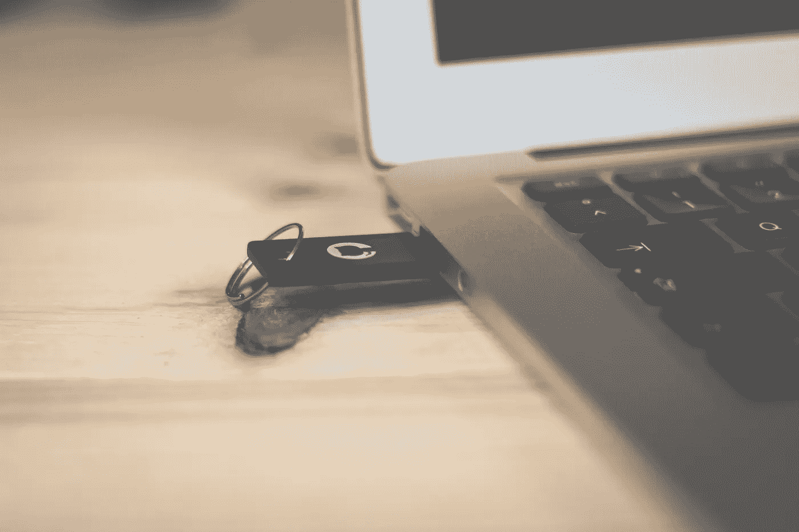

# 改善家庭网络安全

> 原文：<https://medium.datadriveninvestor.com/improving-cybersecurity-at-home-614928aa0c8c?source=collection_archive---------1----------------------->

> **免责声明**:我不像我的同事[布兰登·泰勒](http://www.businessaspect.com.au/page/Our_People/The_Leadership_Team/Brendon_Taylor/)那样是一名经过认证的网络安全专家。

然而，和许多在 IT 行业工作的人一样，当家人、朋友和亲戚的个人电脑、笔记本电脑和设备出现问题时，我实际上是他们的帮助台和技术支持。请将本文视为社区服务公告，以减轻您的家庭技术支持痛苦，并提高您所爱的人的网络安全。

> *毫无疑问，你接到过一个亲戚的电话，询问类似“我的电脑行为异常”或更糟的问题:“我的电脑收到信息，但无法登录——什么是比特币，为什么我要付费解锁电脑？”*

这时，你会有一种沮丧的感觉，觉得自己的周末变得更加忙碌，并希望自己事先花多一点时间教育他们一些网络安全基础知识。俗话说，一盎司的预防抵得上一磅的治疗。

Photo by [Thought Catalog](https://unsplash.com/photos/UK78i6vK3sc?utm_source=unsplash&utm_medium=referral&utm_content=creditCopyText) on [Unsplash](https://unsplash.com/search/photos/cybersecurity?utm_source=unsplash&utm_medium=referral&utm_content=creditCopyText)

## 以下是你可以分享(或自己实施)的 12 条建议，让你在接到电话前做好更好的准备，让每个人的网上生活更安全一点。

1.  想出要保护的东西。起点是计算出你的数字足迹——即你有什么数据，在哪里，谁可以访问它，以及你想保护什么。[盘点你所有的敏感材料](https://www.sans.org/reading-room/whitepapers/critical/cybersecurity-inventory-home-36602)这样你就可以开始整合你的数据——这也是一个虚拟的大扫除的好时机。您可能经常会惊讶于您在 USB、外部硬盘、移动设备、云中、相机 SD 卡、打印机/扫描仪内存、PC 或笔记本电脑上散布了多少信息。
2.  **定期备份。**迟早会出问题，无论是恶意的还是用户错误，都会破坏数据。您需要假设这是不可避免的，并准备一个简单、有效且经常运行的备份解决方案。如果您使用的是物理外部设备，请确保在备份后断开连接，否则它同样容易丢失数据。检查备份是否定期运行也无妨——天知道有多少专业的系统管理员从备份中恢复，却发现备份已损坏或不完整。
3.  **定期更新。**修补或更新您的操作系统、应用程序和(如果您有信心的话)固件对于减少可用于访问您设备的漏洞数量至关重要。就像链条中最薄弱的一环，只要你系统盔甲上的一个小裂缝就能让你站稳脚跟。虽然不是万灵药，但它确实减少了漏洞的攻击面。不过，回到上面的第 2 点，有时你的更新可能无法正确应用，有时如果你刚刚应用的补丁没有按预期工作，家庭技术人员需要恢复到以前的状态。
4.  **使用防病毒/防恶意软件，保持最新的签名。**虽然拥有防病毒解决方案并不是一些用户认为的灵丹妙药，但它们至少提供了一定程度的保护。保持最新的签名，并定期运行扫描，特别是在打开特定文件之前，或者如果您注意到您的系统上有任何异常行为。还有[也考虑在你的浏览器上使用广告拦截器](https://www.technologyreview.com/s/601057/are-ad-blockers-needed-to-stay-safe-online/)。
5.  **对每个钥匙系统使用强(唯一)密码**。更好的是，[使用密码管理器](https://www.csoonline.com/article/3198507/security/the-6-best-password-managers.html)，如 LastPass、Dashlane 或 1Password。重复使用同一个密码不是一个好主意——如果有人发现，他们可能会使用你的密码登录你的社交媒体、工作系统或银行信息，所以最好将它们分开。还有拜托拜托不要用[容易重复使用的](https://www.securitymagazine.com/articles/88626-the-worst-passwords-of-2017-revealed)最差密码。找一些独特的东西，不要太短——每个额外的字符都增加了对它进行暴力破解所需的努力。不言而喻，不要把密码写在便利贴上或放在钱包里。
6.  **使用加密。**这是一个宽泛的建议，但这里最重要的是，无论在哪里，你都可以[保护你的信息，使其更难被访问或拦截](https://www.gizmodo.com.au/2017/09/why-you-should-be-encrypting-your-devices-and-how-to-easily-do-it/)。使用 BitLocker、外部驱动器和 USB 等对硬盘进行加密，这样如果您丢弃它们，它们就不容易被访问，请查找网站的锁定标志(SSL ),并检查您使用的应用程序的加密设置。[考虑使用虚拟专用网络(VPN)](https://au.pcmag.com/privacy/47259/feature/what-is-a-vpn-and-why-you-need-one)在适当的地方实现更安全的通信。
7.  **始终小心点击**。无论你是打开电子邮件中的附件，还是下载并安装一个应用程序，如果你觉得有些事情可疑，你都需要进行某种形式的检查或验证。不言而喻，不要运行来自可疑网站的盗版软件或应用程序。由于网址缩短，很难看清你点击的是什么。你可以通过使用像[CheckShortURL.com](https://www.checkshorturl.com/)或 [Sucuri](https://sitecheck.sucuri.net/) 这样的网站来查看这些缩短的网址，或者如果你想变得真正有趣，可以查看一下[思科的 Talos IP 和域名信誉中心](https://www.talosintelligence.com/reputation_center)。致电电子邮件或业务的原始发件人是一种有用的替代验证方法。
8.  **小心你分享的信息，并检查你的隐私设置。**随着社交媒体隐私标准的不断发展，检查您的设置以了解您是否无意中共享了公共信息非常重要，例如位置数据、出生日期等个人信息或不属于公共领域的照片。在谷歌上快速搜索你的名字或电子邮件地址，可能会发现公众可以获得的信息，以及这些信息是否恰当地代表了你。如果没有，就把它从公众视野中移除。当你这么做的时候，一定要检查一下[Troy Hunt](https://haveibeenpwned.com/)的[haveibenpwned](https://haveibeenpwned.com/)网站，看看你的账户信息是否已经因为各种数据泄露而被泄露。如果您的帐户出现，强烈建议您立即更改密码。
9.  观看无线网络。在家里，确保你已经[采取了保护你的 Wi-Fi](https://www.lifewire.com/wireless-home-network-security-tips-818355) 的基本步骤是很重要的，包括:更改默认网络名称和密码，隐藏信号不被公众看到，将加密级别更新到最高，并确保你定期检查没有未知设备连接。在公共场合，你应该非常小心地接近任何公共 Wi-Fi 网络，因为你不知道谁在拦截你通过的流量，以及流量将流向哪里。如果你需要这方面的任何强化，看看[这篇来自 CSO 的关于为什么你永远不应该连接公共 Wi-Fi](https://www.csoonline.com/article/3246984/wi-fi/why-you-should-never-ever-connect-to-public-wifi.html) 的文章。
10.  **考虑多因素认证。对于更敏感的数据，除了初始系统密码之外，设置第二种方法来验证您的身份是值得的。如果你想了解更多，澳大利亚网络安全中心有一篇关于多因素认证的有用论文。**
11.  不要忘记物理安全。设备容易被盗或被篡改，因此请确保不要将它们解锁或放在户外，以免被小偷发现。当然，移动设备越多，你越有可能丢失它——查看 [2018 年优步丢失&找到索引](https://www.uber.com/newsroom/2018-uber-lost-found-index/)丢失的头号设备是手机。因此，请确保它有一个密码，并设置功能来找到它或远程擦除它(如果可能的话)。最后，当您处置旧设备时，请确保[彻底擦除其中的所有数据](https://www.consumerreports.org/cro/2013/11/remove-personal-data-from-any-device/index.htm)。
12.  **保持消息灵通。**技术在不断变化，隐私标准和可被利用的漏洞也在不断变化，包括通过系统和更复杂的诈骗技术。关注或订阅有用的可靠安全信息来源，如澳大利亚的[保持在线智能](https://www.staysmartonline.gov.au/)和 [Scamwatch](https://www.scamwatch.gov.au/) 。关于网络安全或喜欢听播客的人，可以查看以下内容:[布莱恩·克雷布斯](http://www.krebsonsecurity.com)，布莱恩·约翰逊— [7 分钟安全](https://7ms.us/)播客，[Sans.Org 信息安全资源](http://www.sans.org/security-resources)，[安全周](http://www.securityweek.com)或[黑暗阅读](http://www.darkreading.com)。

我相信这些网络安全基础知识中的大部分同样适用于初创企业、小型企业和企业，只是挑战的规模和复杂性需要适合您所在行业的额外治理和更广泛的控制。正如古老的格言“慈善始于家庭”，网络安全也应该如此，因为这些习惯转化为我们的学校、机构和企业。如今，家庭和工作之间的界限变得越来越模糊，所以在家更安全也可以降低您的业务风险，更不用说节省您在周末的时间，不必在家里处理许多意想不到的技术支持问题！

其他有用的资源:

*   [美国国家安全局保护家庭网络安全的最佳实践](https://www.dni.gov/files/NCSC/documents/campaign/NSA-guide-Keeping-Home-Network-Secure.pdf)
*   [微软关于家庭互联网安全的顶级提示](https://query.prod.cms.rt.microsoft.com/cms/api/am/binary/RE1ImTu)
*   保护你的东西
*   [ATO 针对个人的顶级网络安全提示](https://www.ato.gov.au/General/Online-services/Identity-security/Protecting-your-information/Top-cyber-security-tips-for-individuals/)
*   [旅行时的网络安全提示卡](https://www.dhs.gov/sites/default/files/publications/Cybersecurity%20While%20Traveling_7.pdf)
*   [ACSC 保护:必备八解释](https://acsc.gov.au/publications/protect/essential-eight-explained.htm)
*   [举报网络犯罪——澳大利亚网络犯罪在线举报网络](https://report.acorn.gov.au/)

*你有哪些提高家里网络安全的小技巧？请随意分享你的想法。您的组织在网络安全方面需要帮助吗？* [*联系我们团队*](http://www.businessaspect.com.au/page/Services/Cyber_Security_and_Risk/) *在业务方面聊一聊。*

*作者:* [*彼得·贾勒特*](http://www.businessaspect.com.au/page/Our_People/The_Leadership_Team/Peter_Jarrett/)*[*业务方面*](http://www.businessaspect.com.au) *媒体 2018 年 9 月 17 日。可以关注我的*[*LinkedIn*](https://www.linkedin.com/in/peterjarrett/)*，*[*Twitter*](https://twitter.com/Peter_Jarrett)*或者*[*Quora*](https://www.quora.com/profile/Peter-Jarrett)*。**