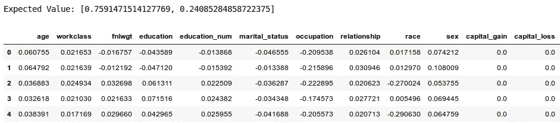
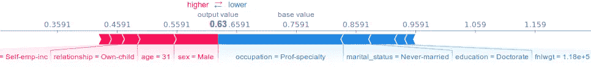
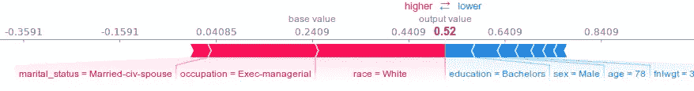
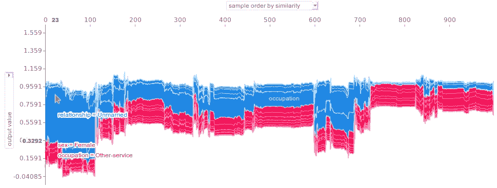
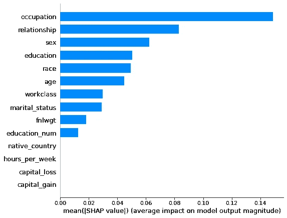

# 通过调整管道和集合模型以及 XAI 改进分类

> 原文：<https://medium.datadriveninvestor.com/improving-the-classification-with-tuning-of-pipelines-and-ensemble-models-and-xai-eb69eb60dbfb?source=collection_archive---------2----------------------->

本文介绍了 UFRN 机器学习课程第 8 课(集合模型)中讨论的分类过程的扩展。这个[链接](https://github.com/ivanovitchm/EEC1509_Machine_Learning_2019_2/blob/master/Lesson%2308/Lesson_08_Ensemble_Learning_I.ipynb)可以获得 Jupyter 的原版笔记本。

这种扩展与定制管道、调整集合模型和使用 XAI(可解释的人工智能)来分析所选数据集的预测有关。

# 原始笔记本

这本笔记本分析了 [1994 年人口普查数据集](http://archive.ics.uci.edu/ml/datasets/Adult)中的美国收入。里面有**婚姻状况**、**年龄**、**工种**、**更多**的信息。目标列 **high_income** 记录年薪小于或等于 50k(0)和年薪大于 50k(1)。

它的作者定义了两条管道:第一条预处理数据集，最后一条对数据集进行分类。在其管道中，定义了一个 GridSearchCV 对象来确定在**决策树**和**随机森林**之间的最佳模型。

最佳模型为随机森林，其训练和测试准确率分别约为 **90.2703%** 和 **86.6267%** 。

因此，本文将介绍其管道的改进和 XAI 的使用。

# 笔记本的改进

首先，执行与原始笔记本相同的步骤:

1.  库的导入；
2.  获取数据；
3.  预处理管道的定义；
4.  通过拆分数据集来定义训练和测试数据。

接下来，实际上，定制是由算法调整管道开始的(参见下面的代码片段)。

```
# The full pipeline as a step in another pipeline with an
# estimator as the final step.
pipe = Pipeline(
   steps = [("full_pipeline", full_pipeline_preprocessing),
            ("fs",SelectKBest()),
            ("clf",RandomForestClassifier())])# Creating a dictionary with the hyperparameters.
search_space = [
     {"clf": [DecisionTreeClassifier()],
      "clf__criterion": ["gini","entropy"],
      "clf__splitter": ["best","random"],
      "clf__random_state": [seed],
      "fs__score_func": [chi2],
      "fs__k": [8, 9, 10]},
     {"clf": [RandomForestClassifier()],
      "clf__n_estimators": [600, 800],
      "clf__criterion": ["gini", "entropy"],
      "clf__max_leaf_nodes": [300, 350, 400],
      "clf__random_state": [seed],
      "clf__oob_score": [True],
      "fs__score_func": [chi2],
      "fs__k": [10]},
     {"clf": [BaggingClassifier(
                DecisionTreeClassifier(
                    max_features="auto",
                    splitter="random",
                    max_leaf_nodes=16,
                    random_state=seed))],
      "clf__n_estimators": [500, 600, 800],
      "clf__bootstrap": [True],
      "clf__max_samples": [1.0],
      "clf__oob_score": [True],  # Only bootstrap == True.
      "clf__random_state": [seed],
      "fs__score_func": [chi2],
      "fs__k": [10, 12]}]# Defining StratifiedKFold object -> 10-StratifiedFolds
kfold = StratifiedKFold(n_splits=num_folds,
                        random_state=seed, shuffle=True)# Creating the GridSearchCV object.
grid = GridSearchCV(estimator=pipe, 
                    param_grid=search_space,
                    cv=kfold,
                    scoring=scoring,  # Accuracy
                    return_train_score=True,
                    n_jobs=-1,
                    refit="AUC",  # AUC == ROC
                    verbose=10)  # progress bar# Fitting the GridSearchCV object.
best_model = grid.fit(X_train,y_train)
```

在上面的代码中，决策树模型特征选择的 **k 值**从**【4，6，8】**改为**【8，9，10】**。此外，为随机森林定义/更改了 **n_estimators** 、 **max_leaf_nodes** 和 **oob_score** 参数，并且还更改了用于其特征选择的 **k 值**。最后，为了探索集合模型(打包和粘贴)，创建了一个 **BaggingClassifier 对象**，其中一些参数等于随机森林对象。这种超参数调整的定制旨在分析过度拟合对随机森林模型的影响。

> **oob_score** 参数允许收集套袋模型**出袋评价**的分数。为了使用这个分数，需要将**自举**参数设置为**真**。出袋评估涉及在训练集的不同随机子集上训练和评估模型。当用替换进行**取样时，这种方法称为**装袋**(在这种情况下)。在不更换**的情况下进行**取样时，称为**粘贴**。**

在拟合 GridSearchCV 对象后，随机森林模型被定义为对数据集进行分类的最佳模型(参见下面的代码片段)，训练精度为 **91.4574%** 。值得注意的是，调整超参数后**增加了 1.1871%** 。此外，对于**打包分类器**，没有使用**粘贴**方法，因为 **oob_score** 参数要求 **bootstrap** 参数的值为 **True** 。

```
print("Best: %f using %s" %
             (best_model.best_score_, best_model.best_params_)
)
############################ Output ############################
Best: 0.914574 using
{'clf': RandomForestClassifier(
             bootstrap=True, class_weight=None,
             criterion='entropy', max_depth=None,
             max_features='auto', max_leaf_nodes=300,
             min_impurity_decrease=0.0, min_impurity_split=None,
             min_samples_leaf=1, min_samples_split=2,
             min_weight_fraction_leaf=0.0, n_estimators=800,
             n_jobs=None, oob_score=True,
             random_state=42, verbose=0, warm_start=False),
 'clf__criterion': 'entropy',
 'clf__max_leaf_nodes': 300,
 'clf__n_estimators': 800,
 'clf__oob_score': True,
 'clf__random_state': 42,
 'fs__k': 10,
 'fs__score_func': <function chi2 at 0x7f5556b5da60>}
```

接下来，确定出袋评价的分数( **86.3060%** )。这个数值和之前的测试精度非常相似/接近( **86.6267%** )。因此，这证明了最佳模型的质量。

```
print("Out-of-Bag of Best model: ",
      best_model.best_params_["clf"].oob_score_)
############################ Output ############################
Out-of-Bag - Best model:  0.8630605036855037
```

此外，最佳模型用于分类/预测测试数据。因此，测试精度大约是 **86.6574%** (参见下面的代码片段)。值得注意的是，由于调整了超参数，随机森林模型没有出现过拟合，因此**略微增加了 0.0307%** 。

```
predict = best_model.predict(X_test)
print("Accuracy of testing: ",
            accuracy_score(y_test, predict), "\n")
print("Confusion Matrix:\n",
            confusion_matrix(y_test,predict), "\n")
print("Classification report:\n",
            classification_report(y_test,predict))
############################ Output ############################
Accuracy of testing:  0.8665745432212498 

Confusion Matrix:
 [[4672  273]
 [ 596  972]] 

Classification report:
               precision    recall  f1-score   support

           0       0.89      0.94      0.91      4945
           1       0.78      0.62      0.69      1568

    accuracy                           0.87      6513
   macro avg       0.83      0.78      0.80      6513
weighted avg       0.86      0.87      0.86      6513
```

# SHAP 的模型解释

**SHAP(SHapley Additive exPlanations)**是解释任何机器学习模型输出的统一方法。在这种情况下，我们将探索 SHAP 资源来分析 GridSearchCV 定义的最佳模型的输出，考虑到所选择的模型是黑盒模型。更多关于 SHAP 和 XAI 的信息，可以阅读文章“[动手机器学习模型解读](https://towardsdatascience.com/explainable-artificial-intelligence-part-3-hands-on-machine-learning-model-interpretation-e8ebe5afc608)”。

首先，对测试数据集进行归一化。接下来，为最佳模型(随机森林)创建了 TreeExplainer 对象。该对象允许解释基于树的模型的测试数据，并估计所选数据集的 SHAP 值。

```
explainer = shap.TreeExplainer(best_model.best_params_["clf"])
shap_values = explainer.shap_values(new_X_test, y_test)
print('Expected Value:', explainer.expected_value)
pd.DataFrame(shap_values[0], columns=X_test.columns).head()
```



**Figure 1:** the results for SHAP values and the Expected Value of TreeExplainer object.

现在，确定了对预测分析最有影响的特征。首先，分析了预测收入少于或等于$50K 的人的决策(见图 2)。将预测值推高的要素显示为红色，将预测值推低的要素显示为蓝色。

```
shap.force_plot(explainer.expected_value[0],
                shap_values[0][0], X_test.iloc[0])
```



**Figure 2:** Explanation for an income of a person below $50K.

接下来，还分析了预测收入超过 5 万美元的人的决策。

```
shap.force_plot(explainer.expected_value[1],
                shap_values[1][2], X_test.iloc[2])
```



**Figure 3:** Explanation for an income of a person greater than $50K.

此外，可视化和解释多种预测也是可能的。在图 4 中，确定了前 1000 条测试数据记录的模型预测决策。

```
shap.force_plot(explainer.expected_value[0],
                shap_values[0][:1000,:], X_test.iloc[:1000,:])
```



**Figure 4:** Model prediction decisions for the first 1000 samples of test dataset.

最后，对于整个数据集，更重要的特征是:

1.  职业
2.  关系
3.  性
4.  教育
5.  人种
6.  年龄

```
shap.summary_plot(shap_values[0],
                  income.drop(labels="high_income",axis=1),
                  plot_type="bar")
```



**Figure 5:** SHAP feature importance plot.

改进后的笔记本可以通过这个[链接](https://bit.ly/2IvsZsF)在 GitHub 上获得。

# 结论

超参数的调整允许模型的改进，并因此减少过拟合对集合模型的影响。此外，XAI 的资源允许理解更多的机器学习模型。

# 参考

迪潘然(DJ)萨卡尔。**动手机器学习模型解读**。可用地点:【http://bit.do/ensamblexai】T4。访问时间:2019 年 10 月 1 日。

伊万诺维奇·席尔瓦。**第 8 课——集成模型 I.** 机器学习类。适用于:[https://bit.ly/2ntWV12](https://bit.ly/2ntWV12)。访问时间:2019 年 9 月 29 日。

斯科特·伦德伯格。**SHAP Github**。适用于:[https://github.com/slundberg/shap](https://github.com/slundberg/shap)。访问时间:2019 年 10 月 2 日。