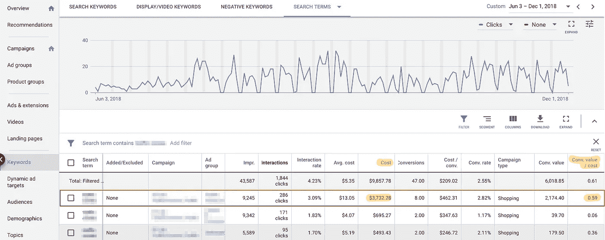
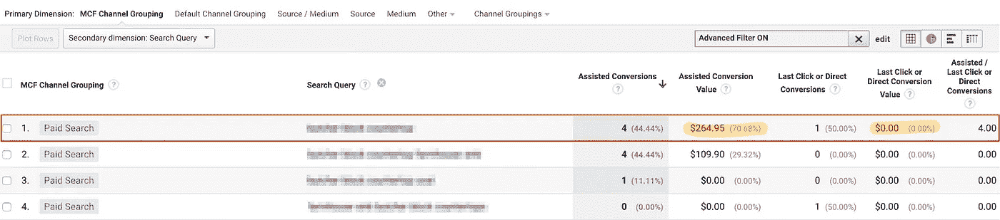

# 提高您的 Google PLA 性能和利润

> 原文：<https://medium.datadriveninvestor.com/improving-your-google-pla-performance-and-profits-5151f911bee0?source=collection_archive---------9----------------------->

全球电子商务行业继续呈现出令人难以置信的年同比增长。与此同时，消费者既需要也渴望视觉参与。因此，当谈到电子商务搜索引擎营销时，谷歌购物广告为王就不足为奇了。2017 年初，[一项针对 4000 万条广告的研究](https://www.digitalcommerce360.com/2018/03/16/google-shopping-ads-account-for-76-of-retail-search-ad-spending/)显示，美国零售商将 76.4%的搜索广告预算用于谷歌购物的产品列表广告(PLAs)。这些 Google PLAs 产生了 85.3%的点击量，而文本广告占了其余 14.7%的点击量。

# Google PLA 基础知识

当消费者搜索相关关键词时，视觉上吸引人的谷歌 PLAs 向他们展示产品图像和链接以及零售商和定价信息。谷歌 PLA 不是对关键词进行竞价，而是根据与你的[商业中心](https://www.google.com/retail/solutions/merchant-center/#?modal_active=none)产品提要中的产品标题和描述相关的搜索词提供给消费者。

> 正因为如此，优化你的产品提要对你的谷歌购物活动的成功至关重要。

在深入分析您当前的 PLA 战役表现之前，从头开始是很重要的。希望您已经掌握了基本知识，我将保持简单:

*   在你的产品标题和描述中使用关键词(记住字符限制)。产品标题是利用关键词的最重要的地方(别忘了包括产品类别)。虽然你可以使用多达 150 个字符，谷歌将截断 70 个字符后的标题。同样，描述中最多允许有 5，000 个字符，但建议在前 160-500 个字符中使用高价值的关键字，以获得最佳优化。
*   当你写下你的头衔和描述时，想想顾客。如果你在销售珠宝或服装等物品，在标题和描述中包含有价值的信息，如尺寸、颜色和性别。同样，如果你销售轮胎，在标题和描述中包含型号和尺寸可能会有所帮助。这里的关键是帮助你的客户(反过来，它也会帮助你)！没人想读 5000 字的行话——紧扣主题，描述产品，为你的客户和谷歌提供有价值的信息。对于额外的描述提交指南，Metricstory 建议参考[谷歌的最佳实践](https://support.google.com/merchants/answer/6324468?hl=en&ref_topic=6324338)。
*   **使用符合谷歌** [**要求**](https://support.google.com/merchants/answer/6324350?hl=en) **的干净图片。**谷歌不会批准任何带走或分散产品本身注意力的图片，因此清晰展示产品并以朴素背景为背景的高质量图片效果最佳！图像与标题准确匹配也很重要…例如，绿鞋的照片应该与描述绿鞋的产品标题相匹配！
*   **确保您的 URL 指向与产品匹配的页面。**虽然这几乎不需要描述，但在上传时仔细检查是很重要的(如果你做了网站重组，还要维护)。把它排除在我的“基本要点”之外感觉不太好。
*   **组织您的产品分组以简化 PLA 管理。**如果没有关键词竞价，您的产品和产品组的组织将帮助您管理您的营销活动。对产品组和单个产品进行投标的能力为您提供了灵活性，但是您的组织层级将在整个过程中为您提供极大的帮助！

# 审核您当前的计划

现在有趣的部分来了！你的活动已经开始了。你正在驱动合格的交通和点击到你的网站。转化正在到来，你感觉很好。

> 但是，你怎么知道什么是无效的呢？你如何决定在哪里收回和重新定向广告支出？

许多团队会关注像广告组和广告活动这样的桶来评估绩效。在 [Metricstory](https://metricstory.com?utm_medium=referral&utm_source=medium.com&utm_campaign=PLA+blog) ，我们喜欢细化并了解单个搜索查询在广告支出回报(ROAS)方面的表现，以此作为我们的主要 KPI。这种对 PLA 性能的深刻理解使电子商务团队能够将精力和预算集中在高性能的搜索查询上，并消除广告中的低效支出，从而提高整体盈利能力！

那么，您如何着手审核您的 PLA 在搜索查询和 ROAS 方面的性能呢？很高兴你问了！不幸的是，这种审计在谷歌广告(和谷歌分析)中可能有点乏味，但看到结果和增加利润是非常值得的。

假设你在一家办公用品公司工作，你对你的中性笔在平板电脑上的表现特别感兴趣。在谷歌广告中，导航到左侧导航中的关键词，然后是顶部的搜索词选项卡。在此窗口中，选择您有兴趣查看的日期范围(为了更好地了解整体性能，我们建议 8 到 26 周)，为“转换价值”和“转换价值/成本”(ROAS)添加两个额外的列，并过滤包含“中性笔”的搜索术语。您可以根据您希望查看这些数据的方式，按广告组或广告活动名称进行组织，而不是过滤搜索词匹配。

在下面的例子中，你会看到三个搜索项的 roa 低于 100%。我们将重点关注最热门的搜索词，因为这段时间的广告成本明显高于其他两个。

现在，我们*可以*停在这里，评估这个特定搜索查询的下一步。但我们会忽略辅助转化和复杂的购买途径，如今许多消费者都采取了这种方式，比如谷歌广告默认只根据首次点击来计算转化。

因此，相反，我们现在进入谷歌分析，导航到转换下的多渠道漏斗下的辅助转换嵌套菜单。在这里，您将添加搜索查询的第二个维度和一个高级过滤器，以缩小与您在 Google 广告中检查的搜索词相匹配的查询(在我们的示例中为:“中性笔”)。因为你的第二个维度，搜索查询，嵌套在谷歌广告下——你现在只能在你的列表中看到付费搜索的 MCF 频道分组。

在这里，您可以更好地了解该搜索词如何影响整个漏斗中的购买(首次点击、最后点击和辅助点击)。只有 264.95 美元的辅助转化价值，我们可以更有信心，我们在谷歌广告中发现的低 roa 搜索词确实不是购买路径不同阶段收入的主要贡献者。

# 对你的计划进行调整

理想情况下，你应该在谷歌广告和谷歌分析中对其他低性能的搜索查询重复这个过程，然后开始调整你的活动。当你开始在你的平台上专注于低 roa 的搜索查询时，下面是你应该考虑做的几件事:

*   查看您的广告内容。当您在谷歌上输入这个搜索词时(使用匿名浏览器)，您的 PLA 与您的竞争对手相比如何？你的创意或产品定价之间有明显的差异吗？你的一个竞争对手在布局方面占优势吗？
*   **重新评估你的投标策略。你应该改变你的出价，增加还是减少？**
*   **审核产品定价。**确保你的价格与搜索查询的竞争广告一致，如果有必要且符合你的整体商业战略，考虑价格调整。
*   **否定关键字搜索词。**如果搜索词与您的产品无关，或者您想将其从您的投标中完全排除，您可以选择否定该搜索词。这为您提供了一个机会，将低效的支出重新分配给具有更高 roa 的广告组或产品。
*   深入挖掘你的竞争对手。使用像 [SEMrush](https://www.semrush.com/features/) 这样的工具，你可以对你的竞争对手获得难以置信的洞察力，这有助于你的 PLA 管理决策。使用他们的 [PLA 研究工具](https://www.semrush.com/features/product-listing-ads/)，你可以搜索域名、关键词等等，以便更好地了解你的竞争格局。
*   **设置时间线和监视器。**如果您担心根据这些搜索查询结果立即采取行动，我们建议设定一个时间表来重新评估。由于季节性、即将到来的营销活动、竞争的变化等原因，你可能会选择推迟调整。

# 观察您的盈利能力增长

如果您对您的计划进行了更改，请设定一个基准目标和跟进日期，同时密切监控绩效。理想情况下，你会看到你的 roa 开始随着你的盈利能力而增加！但是，如果事情没有按预期进行，也没关系(也很重要！)来重新评价。衡量是关键，这样你才能知道你的变化是如何真正影响绩效的。

如果分析看起来势不可挡，像 [Metricstory](https://metricstory.com?utm_medium=referral&utm_source=medium.com&utm_campaign=PLA+blog) 这样的解决方案可以自动完成整个分析过程。[工具](https://metricstory.com/product?utm_medium=referral&utm_source=medium.com&utm_campaign=PLA+blog)快速汇总你的谷歌平台和文本广告中的每个搜索查询，并报告广告成本、收入、ROAS 和点击量。它还允许您根据 ROAS 阈值、日期、属性模型、广告组、关键字等进行过滤。简单，但功能强大。

我希望你能利用这些建议来减少你自己计划中的无效花费。如果你做了，我很想知道你的结果！