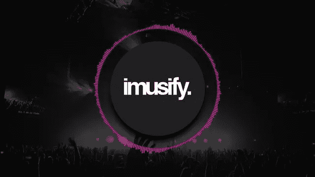
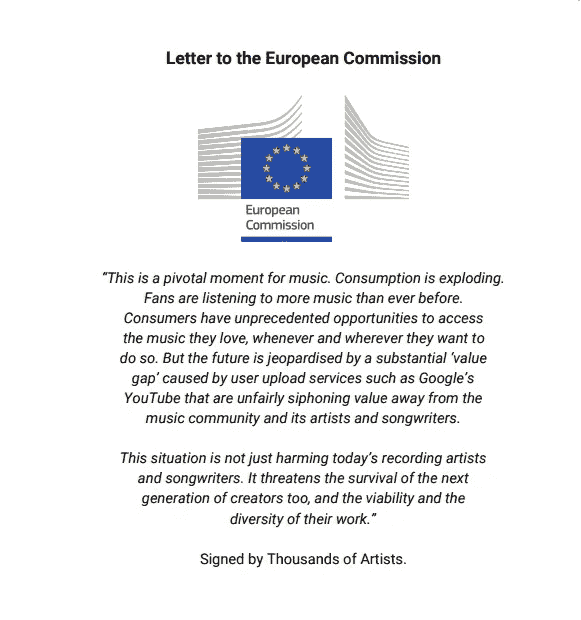
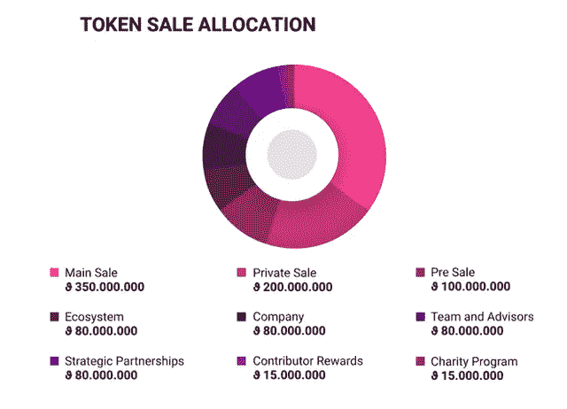
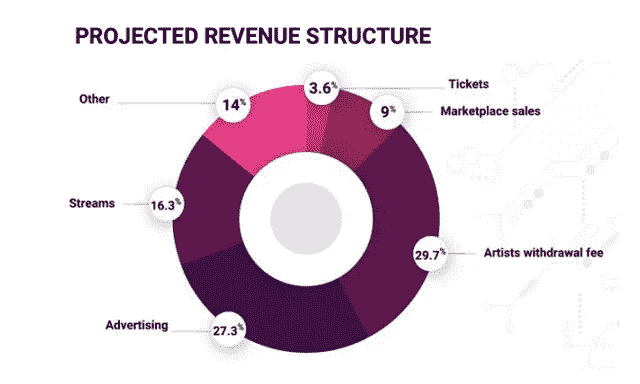
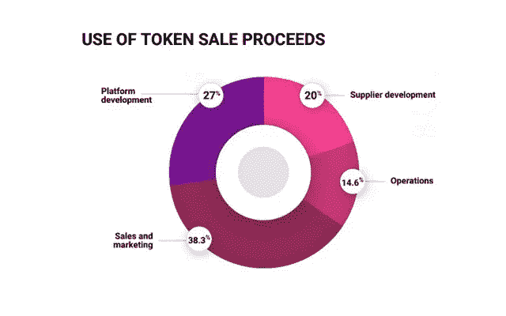
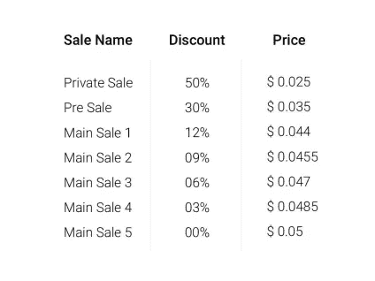
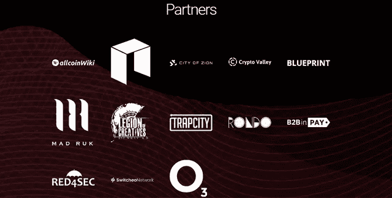

# IMUSIFY:一个点对点的音乐生态系统，为艺术家提供第一手的保证收入流。

> 原文：<https://medium.datadriveninvestor.com/imusify-a-peer-to-peer-music-ecosystem-with-first-hand-features-for-a-guaranteed-income-stream-ece68d7cf405?source=collection_archive---------28----------------------->

# 介绍

你是音乐爱好者吗？你练习音乐是作为爱好还是职业？你在充分利用这一自然天赋方面有什么挑战或障碍吗？有没有哪位艺人或乐队是你希望与之建立一对一交流链的？你是一个艺术家、音乐家还是一个乐队，厌倦了从你的音乐作品中获得的低收入？你是一个有抱负的音乐家，才华横溢，但缺乏最佳的媒体来将你的音乐内容分发给合适的观众吗？如果这些问题符合你的简历，那么 Imusify 智能音乐生态系统是专门为你设计的，如果不是，那么请随意阅读并享受。

Imusify Smart Music Economy 是一家区块链金融科技初创公司，其唯一目的是重振音乐制作和发行领域。Imusify 智能音乐经济建立在新区块链技术的基础上，为全球所有音乐爱好者提供在线服务。该平台是一个由音乐爱好者、艺人和其他行业参与者组成的社区，旨在促进艺人和音乐制作人之间的直接关系，这些艺人有权决定他们的音乐内容的哪一方面需要营销以及他们打算如何营销，而不是相反，音乐制作和发行周期的决定权完全掌握在唱片公司手中。艺人和他们的粉丝也将有机会在这个平台上更加频繁地交流。在没有确定 Imusify 平台的这些显著功能的情况下，它还包括最新的技术(区块链技术)，如智能合同，这是一种标记化机制，通过奖励订户执行简单任务(如对音乐作品(歌词、乐器和管弦乐、专辑、歌曲等)进行投票或投票)以及对这些音乐文章进行评论(评论)的激励机制，大大增加了观众和消费者的参与度。

## 生存挑战

如上所述，Imusify Platform 的主要目标之一是确保平台上的艺术家获得有保证的收入流，以及全球音乐爱好者不受限制地访问这些音乐内容。Imusify Smart Music Economy 旨在解决目前音乐行业面临的一些挑战，包括:

*   **价值差距**
    这是自互联网出现以来音乐产业面临的最显著的挑战，互联网最初被引入音乐领域是为了接触广大听众，帮助实现音乐的主流采纳。但从长远来看，这种解决方案本身又带来了另一个问题，即“价值差距”。音乐行业的价值差距是指音乐社区(艺术家)通过在线流媒体音乐内容产生的收入与这些在线媒体公司(如 Youtube、Spotify、Soundcloud、Itunes、Deezer 和 Pandora)产生的实际收入之间的明显区别。据信，这些媒体流媒体平台为其内容的每个流向这些艺术家和品牌支付 0.1%至 0.5%的微薄百分比。因此，在大多数情况下，每一个流的每一个收益的 0.5%被舍弃，而这些音乐品牌必须在参与创建这样的音乐内容的各种利益相关者(标签、制作人、经理和乐队成员)之间重新分配这一微薄的收入。Imusify Smart Economy 主要关注价值差距问题，这是阻碍未来人才的主要因素之一，因此提出了一个解决方案，通过提供可靠的自动化支付程序来解决这一巨大障碍，确保平台中的每个艺术家都能获得他们真正应得的东西。
*   **安全边际条款**
    音乐集团和大型跨国唱片公司，如环球音乐集团、华纳音乐集团和索尼音乐娱乐公司，都有这个特定的目标，即不惜一切代价获取利润，因此会不择手段地要求第一手的盈利能力，而不是唱片艺术家的创造力。这导致这些唱片公司和音乐分销实体对已经成名的艺术家的需求比新的和即将到来的行为更大，因为“发展才华和创作伟大的音乐需要时间、奉献和资源”。因此，作为一个以金钱为导向的商业实体，这些唱片公司不会冒险支持一个在盈利能力方面不太安全的艺人。一个组织的主要目标是通过提供可靠的和一流的服务来使利润最大化，这种服务要满足所有相关方，而不是损害另一方的利益。这就是为什么 Imusify 音乐平台为即将到来的行为提供了一种媒介，使他们能够自己控制和货币化他们的音乐内容，从而消除了既定唱片公司对这些即将到来的艺术家的质疑压力。
*   不完善的数字版权管理和许可法律
    这种约束艺术家、乐队或任何音乐品牌的数字版权管理的法律在最近缺乏严厉性。音乐行业的许可和费率设置生态系统在流行技术方面已经过时，因此不具备跟踪许可和交付版税所需的足够资源。艺术家对各种类型的在线数字音乐内容(包括广播、点播流、类似广播的流、数字购买等)的所有权和许可证的权利不由这些在线流平台支配，从而在某种程度上破坏了这些音乐品牌的期望收入流。在 Imusify 智能经济中，内容所有权在移动中被跟踪，版税因此被自动分配，因为该系统建立在智能合同的最新技术之上。
*   **不透明的支付媒介**
    由于最近的发现和对艺术家表演权的修改，权利持有人(艺术家)现在开始向一个主要被称为表演权组织的中介组织注册，该组织代表这些艺术家从媒体流媒体公司接收这些付款，并随后按照行业标准版税费率将这些收取的资金分配给艺术家。这些发行条款和条件通常是由中间代收协会而不是权利持有人预先确定的。由于没有足够的信息来了解他们的内容相关支付实际上是如何发行的，权利持有人仍然在另一个层面上受到剥削，因为较小的艺术家缺乏资源来加强对他们的内容和权利的控制，并且最初拥有其作品的任何收入的 25-50%的歌曲作者和音乐作曲家也受到剥削，因为他们实际上将他们的作品版权出售给这些中介，这些中介随后拥有版权并从这些内容中获得中等到大量的收入，而原始作曲家几乎没有任何收入。关于这一点，Imusify 数字内容分发和共享平台已经考虑到这样一个事实，即即使艺术家现在可以完全依靠互联网自己制作、分发和营销他们的内容，权利持有人和他们在整个互联网上对其作品的权利和所有权分配之间仍然存在裂痕。因此，在 Imusify 平台上开发一个分散的解决方案，能够在一个透明和不变的生态系统中记录、跟踪和分配支付，是最终的出路。

## 显著的平台特性

**(一)众筹引擎**

一个众筹活动功能对艺术家开放，以资助音乐产品，如专辑、视频和巡演。在那里，他们还可以奖励社区和参与者，如独家访问他们的内容、门票、商品的某些方面，以及 VIP 粉丝体验。同样存在的是由这些艺术家提供的对活跃粉丝开放的附属许可。拥有这种许可证的粉丝可以通过在艺术家的网络中推广和销售内容来连续赚取一些收益。这一功能有助于增加参与度，促进即将到来的音乐行为，充分暴露以促进可持续发展，也为音乐爱好者提供了以自己微小但重要的方式影响音乐产业发展的机会。

**(二)音乐产业参与者的市场**

Imusify 平台旨在成为所有有抱负的企业家、艺术家和行业关键人物进行交流的市场中心，并随后创建一个社区，使其参与者能够执行与各种音乐内容开发和服务相关的交易，包括录像、制作、广告、内容设计、推广和所有其他媒体相关或创意内容开发。产品广告商和经销商也可以在 imusify market community 上列出他们的产品。

**(三)奖励制度**

除了传统的以版税形式向艺术家开放的创收计划，Imusify 平台还为平台上的社交内容(帖子、播放列表和评论)奖励优质贡献和策展人。这些策展人报酬的分配比例类似于艺术家的版税报酬，并且完全基于策展人分发的内容质量。这些内容的质量取决于这些内容对互联网经济的影响(如分享和评论)。

**(四)分散交换**

区块链技术已经慢慢地记录了从电子商务、房地产、银行和金融等经济的几乎每个方面的无数但微不足道的发展。为另一项与区块链相关的创新铺平了道路，但这一次是在一个非常有前途的经济领域，即音乐产业。Imusify 基于新区块链技术，集成了 NEON Exchange (NEX) API，从而使平台上的用户能够自发地与生态系统进行交互，并通过集成 Switcheo 和 B2Broker 等第三方服务，提供了一种非常合适的方法来将内部 IMU 令牌转换为法定货币和其他加密货币。

**(五)协同进化版权管理**

Imusify Smart Economy 采用区块链技术附带的分散式分类帐的不变功能，以实施多层协议安全模式，来跟踪平台上所有内容创作者(音乐和社交内容创作者)的所有权和许可。以及供平台用户使用的内置工具和图表，这些工具和图表将用户对其内容以及如何管理每个内容所产生的收入的控制权放在用户手中。因此，艺术家可以在上传歌曲时通过分别授予所涉及的所有权来识别他们参与任何音乐作品的歌曲作者、同行艺术家或乐队，使得从这样的作品产生的任何收入可以相应地分配给所涉及的每一方，从而提供对艺术家、乐队或任何音乐品牌的准确的数字权利管理。

Imusify 打算引入一个在线生态系统，新老艺人和听众都可以从中受益，因为它允许参与者之间建立直接的点对点关系，从而消除音乐分销链中敲诈勒索中间商的主导地位。

# 令牌分发

与其他所有加密货币初创项目类似，Imusify Smart Economy 计划进行一系列代币生成活动，称为首次发行硬币(ICO)，以便为初创公司筹集资金，从而在加密货币市场上市。本次 ICO 将于 2019 年第一季度(3 月 1 日-4 月 30 日)举行，预售活动将于 3 月 1 日至 3 月 31 日开始，而众筹活动将于 4 月 1 日至 4 月 30 日举行，共发售 10 亿枚ϑ IMU 代币。

## 象征经济学

如上所述，在三个阶段中调度 Imusify 令牌生成事件。目前正在进行的私人销售活动将以超过 40%的折扣率向符合特定要求的机构和经验丰富的投资者出售 200，000，000 个 IMU 代币。计划于 2019 年在 Q1 举行的公开预售将会有剩余的未出售私人代币以及额外的 100，000，000 枚 IMU 代币以 30%的折扣率出售。这次公开预售之后将进行公开/大众销售，其中 350，000，000 个 IMU 代币连同上次销售中未售出的代币将以不同的折扣价出售。众包销售后所有其他未售出的令牌将被添加到已经预留的 80，000，000 个 IMU 令牌中，这些令牌将被指定用于未来的平台维护和开发。

最大 IMU 供应量:1.000.000.000
出售 IMU:650 . 000 . 000
IMU 价格:0.05 美元
接受货币:美元、欧元、尼奥、比特币(BTC)、以太
(ETH)、莱特币(LTC)、Dash (DASH)、比特币现金(BCH)、系绳
(USDT)、Monero (XMR)、Ripple (XRP)、OmiseGo (OMG)

注意:您可以在 tokensale.imusify.com 注册参加 imusify Token 销售。

**官网:**

[T3【https://imusify.com/】T5](https://imusify.com/)

**白皮书:**

[*https://imusify.com/whitepaper.pdf*](https://imusify.com/whitepaper.pdf)

**安线程:**

[*https://bitcointalk.org/index.php?topic=4327428.0*](https://bitcointalk.org/index.php?topic=4327428.0)

**赏金线程:**

[https://bitcointalk.org/index.php?topic=4805108.0T21](https://bitcointalk.org/index.php?topic=4805108.0)

**电报:**

[*https://t.me/imusify*](https://t.me/imusify)

**中等:**

[*https://medium.com/imusify*](https://medium.com/imusify)

**钢铁材料:**

[*https://steemit.com/@imusify*](https://steemit.com/@imusify)

**作者的 Bitcointalk:**

[*https://bitcointalk.org/index.php?action=profile;u=2187995*](https://bitcointalk.org/index.php?action=profile;u=2187995)

喜欢你看到的吗？想看更多作者的文章？请随时查看我的；[*https://www.linkedin.com/in/sarah-parker-321b10153/*](https://www.linkedin.com/in/sarah-parker-321b10153/)
还有别忘了关注和向上投票。