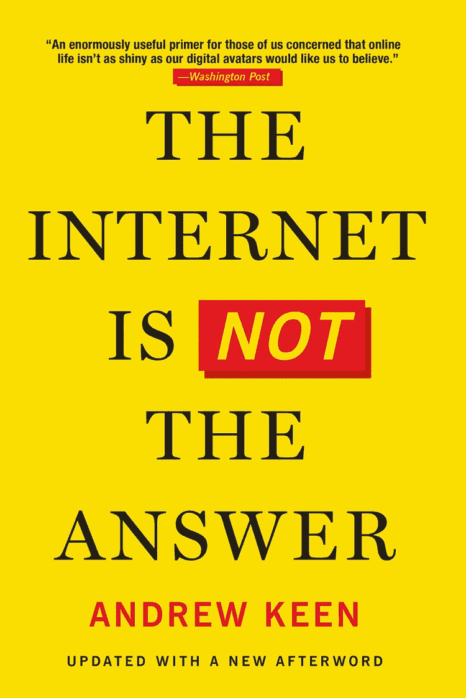
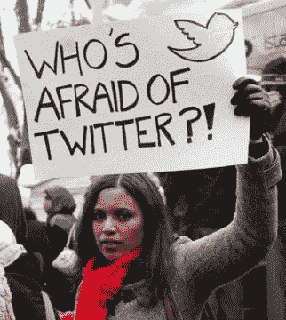

# 2015 年，我采访了安德鲁·基恩(Andrew Keen)，他的书警告了互联网的灾难性影响。他有多正确？

> 原文：<https://medium.datadriveninvestor.com/in-2015-i-interviewed-andrew-keen-whose-book-warned-of-the-internets-disastrous-impact-af837f712a57?source=collection_archive---------15----------------------->

凯瑟琳·马德克斯

当被问到时，作家兼演说家 [Andrew Keen](http://www.ajkeen.com/books/) 说他无法想象没有互联网的生活。

但是在他 2015 年的书*中，互联网不是答案，*他转而认为，数字革命已经——用他的话说——“一场史诗般的失败。”

 [## 我们屏蔽了社交媒体，这引起了公愤。数据驱动的投资者

### 上瘾，我们看不出来。在最近的一项研究中，基于以前的研究成果，我们想…

www.datadriveninvestor.com](https://www.datadriveninvestor.com/2018/12/01/we-blocked-access-to-social-media-it-caused-an-outrage/) 

在我们的采访中，基恩谈到了他的信念，即网络世界中的大玩家——脸书、Twitter 等——向我们兜售了一个平等的数字世界的幻觉，一个促进经济繁荣、政治平等和无数连接和建立在线社区的机会的幻觉。

(Photo courtesy of ajkeen.com)

简而言之，他告诉我:

> “网络世界的现状是允许极少数用户获得巨大的财富和权力。”

以下是我们采访中最相关的部分:

艾德里安科勒:我在书的开始就明确指出互联网也做了很多好事。这不是一本非此即彼的书。我的书是对互联网的历史分析，从第二次世界大战结束后的基础一直到今天。我们已经有了将近 50 年的计算机通信，我们刚刚庆祝了万维网 25 周年。我想做的是把数字革命放在一个整体的历史背景下。

CVM:这本书显然是对数字世界的严厉批判；你在整本书中使用了强烈的语言，描述了互联网对文化的灾难性影响。你到底是什么意思？

艾德里安科勒:数字革命……做了三件困扰我的事情。第一个是:加剧有钱有势者和无权者之间的不平等。其次，它导致了我们的失业，也就是现在一些人所说的“失业型复苏”。

第三，监视经济的问题。我承认有很多事情互联网做得很好:通信，它可以很有趣，我无法想象没有它的生活。当我说互联网不是答案时，这并不意味着我们必须回到别的东西上去。事实上，互联网必须成为答案。但目前情况并非如此。

CVM:在整本书中，你都在谈论我们——人类——在网络巨头眼中仅仅是数据。

艾德里安科勒:在脸书，我们只是告诉他们关于我们自己的一切。所以我们列出我们的兴趣，我们的电影，我们的书籍，我们的网络，所以他们只是把这些汇总起来，在某些方面比我们更了解我们自己，这使他们能够提供他们可能会称为私有化的广告，对我来说这是一种[监视经济](https://www.theverge.com/2019/3/26/18282360/age-of-surveillance-capitalism-shoshana-zuboff-data-collection-economy-privacy-interview-vergecast)。

谷歌的情况略有不同，也稍微复杂一些。谷歌有许多不同的服务，从搜索到 Gmail，再到 YouTube 的地图服务。谷歌正在努力做的是鼓励我们成为谷歌会员，拥有谷歌账户，以便他们知道我们在谷歌网络上做的一切——再次个性化私人广告——广告更加准确。

所以…我们是发布信息的人。我们必须对我们使用的服务更加小心。

CVM:为什么？

艾德里安科勒:我担心的是我所认为的这个经济中相当令人厌恶的本质，在这个经济中，我们发布的信息，特别是在社交媒体上，实际上并不是我们自己的。它成为这些平台公司的财产，然后他们用它来为自己谋利……我不确定有什么是不道德的。但我认为这本书的目的之一是简单地解释这种经济的基础。

CVM:有一些例子表明互联网和通过社交媒体的联系非常有用，比如针对非洲手机用户的埃博拉短信活动。当然，社交媒体在阿拉伯之春中扮演了重要角色。这些都是好东西吧？

艾德里安科勒:哦，当然。显然，我不会反对人们通过手机获取埃博拉病毒的健康新闻。但是阿拉伯之春，我认为这是一个非常无力的论点。阿拉伯之春是一场灾难。我敢肯定，大多数阿拉伯人现在有选择，如果他们可以让历史倒退，他们会回到阿拉伯之春之前的时期，因为它带来了内战和大规模屠杀。

有趣的是，阿拉伯之春和占领运动以及所有其他社交媒体运动都非常擅长破坏，但不太擅长创造或建设。

比如说，占领运动就是“99%”，这一群人的声音都对所谓的剥削“1%”感到愤怒。我们再也听不到占领运动了。那是一次失败。阿拉伯之春是失败的。现在在利比亚的推特上，绑匪用它来广播他们的勒索信息。

这并不意味着推特是邪恶的，也不意味着脸书是邪恶的，但我们从根本上误解了他们在结构性政治变革和专制政权中的中心地位。互联网真的只是个人的一个平台。

CVM:这个等式的哪一部分可以被改变来改善我们的数字世界？

政治运动需要的是责任而不是权利，我认为互联网及其呈现方式的一个问题是它是一个权利而不是责任的地方。

最大的问题是它不太社会化。它被用作个人广播的平台。政治运动需要超越个人，他们需要超越简单的个人声音，就像占领运动，所有人都义愤填膺，所有人都愤怒，也许这是有道理的，但没有人愿意做出妥协来发展一场真正的政治运动。"

CVM:在你看来，社交媒体为什么不是社交媒体？当然，很多很多人可以讲述与老朋友重新联系、在网上找到爱情等故事。

艾德里安科勒:脸书和推特只是一个传播我们自己的平台，我们可以随意进出社区，我们没有真正的义务。消失了。我认为“社交”是我们迷失自我的地方，我认为互联网所做的并没有让我们迷失自我。

互联网的终极文化表现是“[自拍](https://www.imdb.com/title/tt9479138/)”

“自拍”是最典型的、几乎不可避免的结论，我们只剩下自己了。除了我们自己，我们看不到世界上的任何东西。互联网已经把我们置于宇宙的中心。这是一种错觉。

***记者注:这个故事最初是由美国之音*** ***报道并发表的。***