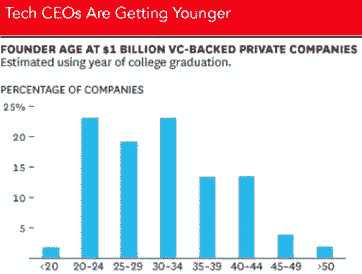
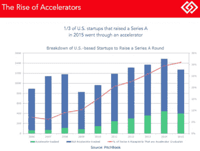

# 3D:达沃斯、戴夫和数据

> 原文：<https://medium.datadriveninvestor.com/in-3d-davos-dave-and-data-385ff55f534c?source=collection_archive---------7----------------------->

*在今年的瑞士达沃斯世界经济论坛上，*[*Link Ventures*](https://www.linkventures.com/)*管理合伙人、*[*Cogo Labs*](https://www.cogolabs.com/)*董事长戴夫·布兰丁(下图为手拿麦克风的人)发表了关于* [*民主化大数据*](https://medium.com/datadriveninvestor/world-economic-forum-blockchain-in-action-with-link-ventures-and-cogo-labs-5d03be558dd6) *的演讲。Dave 的演讲在标志性的 TCS Dome 举行，是* [*区块链活动*](https://connection.mit.edu/news/funny-thing-happened-way-world-economic-forum) *的一部分，该活动聚集了来自商业、政府、学术界和媒体的全球领袖。对于那些不能到场的人，我们提供他的发言摘要。*

戴夫创建并退出了多家科技公司，他描述了自己所有的创业成功都是由数据的可用性推动的。事实上，他的第一个重大流动性事件涉及一家名称中带有“数据”一词的公司。被 Vignette 收购的 DataSage 是建立在 Dave 开发的神经网络算法基础上的，该算法可以读取笔迹，解释 x 射线图像并预测消费品的零售需求。在此后的 20 年里，他参与创办了十几家以数据为中心的公司，包括 Vestmark、CourseAdvisor、Jobcase 和 EverQuote。

 [## 数据科学和软件工程哪个更有前途？-数据驱动型投资者

### 大约一个月前，当我坐在咖啡馆里为一个客户开发网站时，我发现了这个女人…

www.datadriveninvestor.com](https://www.datadriveninvestor.com/2019/01/23/which-is-more-promising-data-science-or-software-engineering/) 

Dave 回顾了他 30 多年的职业生涯，以及企业家、企业和行业受到大数据、区块链和相关技术影响的许多方式。特别是，他举了三个显著的例子，说明日益增长的数据可用性如何在创业领域引起了翻天覆地的变化。

**1。科技公司的首席执行官越来越年轻**

不，不是水里的东西。戴夫观察到，所有的企业家——包括那些仍在读大学或刚刚毕业的企业家——现在能够接触到的数据比他们最有经验的前辈一代人之前积累的数据要多得多。这使得越来越多精通数据的创始人能够以前所未有的速度推动他们的公司和职业发展。戴夫用这张图表说明了这一点。

戴夫讲述了这种人口结构的转变如何帮助他在 2005 年共同创立了 Cogo Labs，该公司致力于“加速”其常驻企业家的生活——以及他们的垂直团队。Cogo Labs 颠覆了传统孵化器的外向脚本，专注于从内部实验中创建新的互联网业务，这些实验利用了该公司每天收集的超过 50 亿行消费者数据。通过工程师、分析师和设计团队成员(其中许多人是新毕业的大学生)的努力，科通实验室利用其新兴的数据资产，帮助其本土初创企业在其生命周期的早期实现盈利。

**2。公司发展得非常非常快**

作为他的下一个数据驱动的巨变的例子，Dave 转向了公司现在可以增长的加速率。他回忆说，当他第一次开始沉浸在“大数据”的世界中时，可用的工具效率非常低，而且非常昂贵。无论是真正构建运行他编写的算法所需的计算机处理器，还是从数千页影印记录中手动转录数据，所涉及的任务都非常耗时，而且缺乏基础设施。

为了对比当时和现在，戴夫在达沃斯与观众分享了这段轶事:“我的职业生涯始于当时世界上最大的非政府数据库，即位于阿肯色州本顿维尔的沃尔玛商业数据仓库。该数据库运行在 Teradata 硬件上，每 TB 的成本为 100 万美元。每个盒子都有冰箱那么大，价值超过 100 万美元，容量高达 1tb。我想指出的是，在那个时候，今天房间里的每台笔记本电脑都价值约 200 万美元。”

如今，由于(真正的)大数据、分布式账本、人工智能和类似技术的流行，企业家可以获得工具，省去通常用于构建最初以数据为中心的企业的基础的数周、数月甚至数年的劳动。戴夫补充说，在当前的创业环境下，首次创业者也可以利用孵化器、加速器和导师项目的兴起，帮助指导年轻创业者创业的各个方面。下图显示，现在超过三分之一的可投资公司来自加速器，而十年前这一比例接近五十分之一！

**3。民主化的数据将加速创新**

[数据世界在过去十年中已经非常成熟](https://www.forbes.com/sites/louiscolumbus/2018/05/23/10-charts-that-will-change-your-perspective-of-big-datas-growth/#2422b2cb2926)，但是 Dave 表达了他的信念，当谈到释放整个社会的潜力时，我们只经历了冰山一角。他目前参与了三个帮助构建和支持数据民主化基础设施的组织。

前两家公司位于马萨诸塞州剑桥的肯德尔广场创新中心: [Cogo Labs](https://www.cogolabs.com/) (如上所述)，该公司计划到 2020 年底将其管道扩大到 30 家并行互联网公司；以及戴夫创办的风险投资公司 [Link Ventures](https://www.linkventures.com/) 。林克的投资策略并不依赖于主观偏好——甚至创始人的“激情”——而是依赖于数据所揭示的对市场和公司的客观识别。执行是通过基于数 Pb 点击流和电子邮件数据的专有算法实现的，允许团队寻找新的机会并评估外部潜在客户的现有在线流量资源。一旦一家互联网公司加入投资组合(并与 Link 的股份成比例)，它就可以获得广泛的消费者数据资产。最常见的是，这些被用来收集竞争情报，并为营销和客户获取活动产生超目标受众。

Dave 投入时间和资源的第三个数据民主化组织是 [XPRIZE](https://www.xprize.org/) 。这家总部位于加州的非营利组织致力于识别和培育改变行业的技术，帮助所有社会成员实现一个更美好、更可持续的世界。作为创新委员会的成员，Dave 将很快加入 XPRIZE 创始人(也是麻省理工学院的毕业生)Peter Diamandis 的以色列之旅，在那里他们将接触到该国的一些新兴技术。该小组将会见各行业顶级指数科技公司的首席执行官，包括安全、医疗保健等行业。

正如 Dave 在达沃斯总结的那样，所有三个组织——Cogo Labs、Link Ventures 和 x prize——都已经认识到需要一个“数据集合”,创业公司和研究人员可以快速、安全和私密地访问该集合。如此丰富的数据资源将使所有用户能够访问干净的数据，用于研究和开发新的想法。