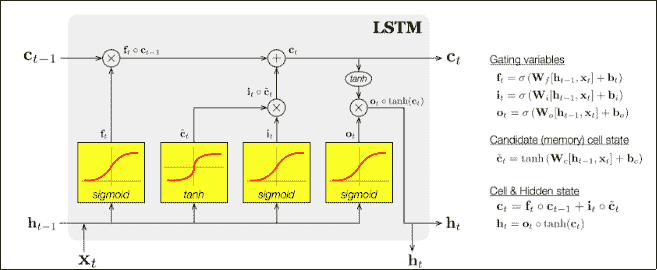
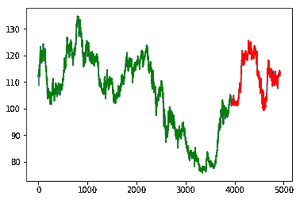
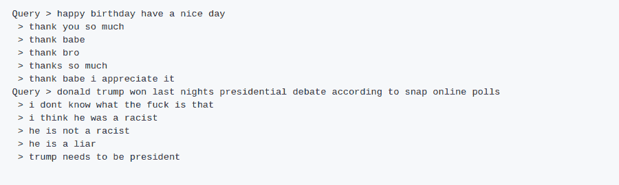

# 深度学习和 LSTM 网络

> 原文：<https://medium.datadriveninvestor.com/in-artificial-intelligence-new-types-of-networks-are-constantly-generated-by-scientists-a032cd7b77d9?source=collection_archive---------7----------------------->

在**人工智能**中，科学家们不断创造出新型网络。**深度学习**已经成为检测不同类型数据中模式的非常有效的方法。今天，**卷积神经网络**和**长短期记忆网络**正在成为预测中的发电站。长短期记忆网络——通常简称为“**lstm**”——是一种特殊的**递归神经网络(RNN)** ，能够学习长期依赖关系。RNNs 背后的思想是利用序列信息。在传统的**神经网络**中，我们假设所有的输入(和输出)都是相互独立的。但是对于许多任务来说，这是一个非常糟糕的想法。如果你想预测一个句子中的下一个单词，你最好知道它前面有哪些单词。rnn 被称为递归的，因为它们对序列的每个元素执行相同的任务，输出依赖于先前的计算。hoch Reiter&schmid Huber(1997)介绍了 LSTM 网络。LSTM 网络具有链状结构，这有助于它长期保存信息。通过**梯度下降**训练的长短期记忆(LSTM)网络解决了传统递归神经网络一般不能解决的难题。下图 1 显示了 LSTM 网络的工作原理。

**Figure 1: LSTM Networks**

**用例**

当你处理顺序数据或者有时间关系的数据时，应该使用一个 **LSTM** 网络。LSTM 网络非常擅长保存长期记忆。或者换句话说，测试样本序列中第 n 个样本的预测会受到之前给定许多时间步长的输入的影响。网络可以通过门控机制存储或释放内存。LSTM 有助于保留可以通过时间和层次反向传播的误差。通过保持一个更恒定的误差，它们允许递归网络在许多时间步上继续学习。LSTMs 包含门控单元中循环网络的正常流之外的信息。信息可以在细胞中存储、写入或读取，就像计算机内存中的数据一样。该单元通过打开和关闭的门来决定存储什么，以及何时允许读取、写入和擦除。LSTM 网络被用在类似于**股票预测**和**自然语言处理中。TensorFlow** 是一个开源的**机器学习**库，允许我们用许多神经网络进行实验。TensorFlow 由**谷歌大脑**团队开发，于 2015 年 11 月发布。它依赖于数据流图的构建，其中节点表示数学运算(ops ),边表示张量(多维数组内部表示为 numpy 数组)。数据流图是在给定设备(CPU 或 GPU)上的 TensorFlow 会话中异步和并行执行的所有计算的汇总。对于今天的例子，我们将使用 TensorFlow python 库。

我们将通过一个例子来展示这一点。让我们以预测特定股票的股价为例。在本例中，我们在外汇交易中使用美元对日元。实际的股票价格用蓝色表示，但是因为我们的人工智能模型预测了训练(绿色)和测试(红色)，所以蓝色并不明显。我们的 LSTM 模型在预测多输入时显示出 96%的准确性。这个库的代码可以在这里找到。下面的图 2 在 X 坐标上显示了天数，在 Y 坐标上显示了股票价格。

**Figure 2: FOREX (USDJPY) Prediction**

另一个例子可以在今天的**聊天机器人**中看到。鉴于其特性，LSTM 网络确实非常适合各种自然语言处理任务。问答是 NLP 研究的另一个大问题，它有自己的复杂和组件异构管道生态系统。我们正在使用 seq2seq [库](https://github.com/tensorlayer/seq2seq-chatbot)展示 LSTM 网络如何与聊天机器人一起使用。序列间模型(seq2seq)由两个 rnn 组成——一个编码器和一个解码器。编码器一个字一个字地读取输入序列，并发出一个上下文(编码器的最终隐藏状态的函数)，该上下文将理想地捕获输入序列的本质(语义摘要)。基于此上下文，解码器生成输出序列，每次一个字，同时在每个时间步长内查看上下文和前一个字。下面的图 3 显示了网络如何回答问题。

**Figure 3: Seq2Seq Model**

**结论**

一个**递归神经网络**是一个深度学习模型，专门用于处理序列。这里，内部状态负责考虑并正确处理连续输入之间存在的依赖性。**长短期记忆网络**是我们用普通**循环神经网络**所能完成的一大步。LSTM 网络有一种方法来消除一些消失梯度的问题，正常的 rnn。**多安 AI** 为全球客户提供**机器学习咨询**。如果您对实施这些网络中的任何一个感兴趣，请随时 [*联系*](http://www.dogan.ai) 我们。