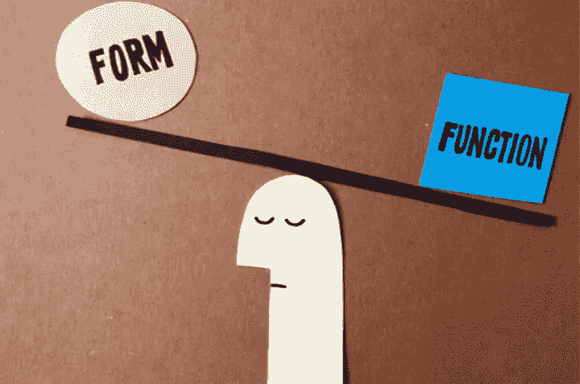

# 为形式辩护

> 原文：<https://medium.datadriveninvestor.com/in-defense-of-form-d0421e94a7ab?source=collection_archive---------34----------------------->

Image by [Christopher David Ryan](https://www.hellocdr.com/)

表单遵循功能。这是我在机械工程最后一个学期的概念设计课上正式学到的一个概念。我很幸运，我的大学不是一个对 STEM(科学、技术、工程和数学)狂热崇拜的地方，就像自所谓的工业革命以来的许多地方一样。虽然我们的课程已经相当过时，主要围绕着石油工业，但我的许多教授都喜欢人文和社会科学，你可以发现他们在水电能源讲座中间展开了关于音乐或绘画的对话。

见鬼，我的概念设计教授是在我毕业典礼上表演的合唱团的一员！

事实上，他是那个可以选择教我们功能比形式更“有效”的层次结构的人，他选择把这两个词写在不同的板上，并在上面开始对话。那时候，我对生活有一种更加*的功能主义*的态度，尽管我并不清楚“形式服从功能”，但我最终表达了这个原则的一种换句话说、更少包含的版本。我无法理解为什么有人会怀疑这是正确的设计方式。

矛盾的是，我一直认为自己是一个作家，在某种程度上，也是一个诗人，从事一种形式似乎是规则的职业。也许我正处于矛盾之中，因为我还年轻，还在学习(我现在仍然年轻，并希望至少再过 60 年)，或者也许我不是，因为我认为写作更像是一种工具性的工艺，你猜对了，**形式跟随功能**。

在这种思维方式下，我在写作中从不太在意形式。当我写一篇文章或任何形式的作品时，我不会停下来考虑它是如何写的，而是为它的目的而写的。如果我写一首诗，我会用自由诗，只关心诗中的信息，完全不考虑韵律。

更糟糕的是，如果我觉得一篇文章正确地传达了我想表达的想法，**我再也不会回来检查或编辑它了**。

这花了一段时间和一些痛苦的认识和范式转变，但现在我也学会了重视形式。你如何呈现某事和你试图呈现什么一样重要。形式也传达了一种信息，一种 *meta-* 信息，这是这个世界与你的作品的第一次接触，也是任何人如何与它互动的决定性因素。形式塑造了功能的身份和特征，并在这样做的过程中成为任何创作的内在部分，而不仅仅是其内容的仆人。缺少其中一个是不完整的。

> “形式和功能是一体的，是一枚硬币的两面。为了增强功能，必须存在或创造适当的形式。”
> 
> — **艾达·波林·罗尔夫**

今天的世界可能看起来节奏太快，渴望进步。随着科学和理性成为那些不惜任何代价渴望目标感的人的新教条，以及 STEM 和 STEM 相关的职业在像、[、加拿大](https://beta.theglobeandmail.com/news/national/as-students-move-away-from-humanities-programs-universities-adapt/article34207300)、[、英国](http://www.sciencecampaign.org.uk/news-media/case-comment/rise-in-stem-popularity-amongst-a-level-students.html)和 STEM 巨人像[印度和中国](https://www.forbes.com/sites/niallmccarthy/2017/02/02/the-countries-with-the-most-stem-graduates-infographic)这样的国家受到广泛欢迎并获得更好的工作机会，功能胜于形式的原则通常是大多数人的标准思维方式。

毕竟，火箭、宇航服和其他将带我们去火星的设备都是在这个原则下制造的，对吗？

不要误解我。我绝对崇拜科学和技术，并像埃隆·马斯克先生本人一样对探索太空感到兴奋。我确实研究了这个被聚合物包裹的世界如此急切需要的主要职业之一。然而，我认为核裂变和核聚变已经向我们表明，在开发新技术时，功能不是我们应该考虑的唯一因素。

**形式事项**。它塑造了我们对事物的感知，以及我们对待生活本身的方式。不仅仅是一项发明能做什么，还有它是如何实现的。不仅仅是我们说了什么和做了什么，而是我们选择如何说和做。我说的不是修饰我们的思想、言语和行为，以符合一些奇怪的美丽标准或容纳他人，我说的是完整地、和谐地生活，并通过我们在这个世界上的所作所为来表达。

健康的艺术和科学(以及生活，两者兼而有之)应该是形式和功能的结合，而不是一个接一个的竞赛。

正如我最喜欢的建筑师之一精辟地指出的:

> “形式服从功能——这一点被误解了。形式和功能应该是一体的，在精神上结合在一起。”
> 
> 弗兰克·劳埃德·赖特