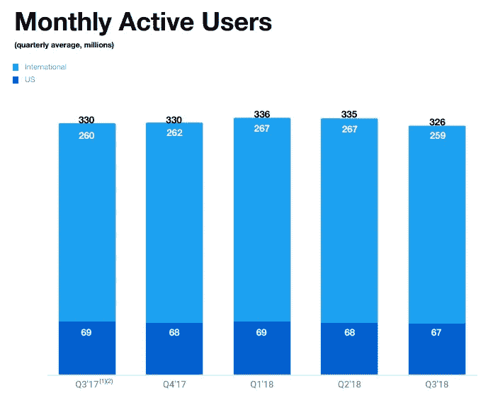
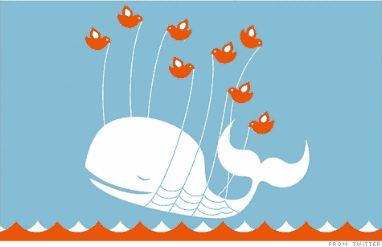

# 为推特辩护

> 原文：<https://medium.datadriveninvestor.com/in-defense-of-twitter-309186a5a393?source=collection_archive---------8----------------------->

## Twitter 是一场灾难，但它可以被拯救

Twitter 的股价今天下跌了 10%以上，因为一名卖空者瞄准了这家被称为“社交媒体的哈维·韦恩斯坦”的社交网络，原因是大赦国际的一份报告中详细描述了辱骂性的推文。

这是本周早些时候糟糕的一天，一个[的小问题浮出水面](https://www.cnbc.com/2018/12/17/twitter-support-form-leaked-data-to-ips-in-china-and-saudi-arabia.html)，与 Twitter 的支持形式有关，这可能是中国和沙特阿拉伯妥协的结果。

**但是让我们诚实地说:虽然这些是方便的“催化剂”(用股市的说法)，但它们不是股票被做空的原因**。一个健壮的平台将能够标记“巨魔”,并确保支持表单的安全。

Twitter 受到威胁的原因是其使用率正在下降。上个季度，全球月活跃用户减少了 400 万，总数为 3.26 亿，与 Instagram 等其他网络相比，这甚至不是一个大的基线数字。

This bird ain’t flyin’. Source: [Twitter Investor Relations](https://investor.twitterinc.com/static-files/4bfbf376-fefd-43cc-901e-aedd6a7f1daf)

虽然有一线希望，比如 Twitter 日活跃用户的持续增长，更好的货币化和收入指标，以及随之而来的盈利能力的到来，**使用率下降的阴影是一个存在的威胁。**因为如果使用率持续下降，公司不仅会失去广告商，侵蚀其收入，还会失去向平台投入内容的人。它会失去声音。它将进入死亡螺旋。

Twitter 将使用率下降归咎于其“改善平台健康”的工作，这是删除虚假/滥用账户的代码。但是，一个更健康的平台应该是一个不断增长的平台，尤其是在一个拥有超过 30 亿互联网用户的世界中，拥有大约 3 亿用户的平台。

那么为什么 Twitter 的使用率在下降呢？随着脸书走下坡路，民粹主义政客将 Twitter 作为他们沟通策略的基石，Twitter 应该有一个时刻了。但是跌跌撞撞的。

为什么？因为产品没有改进。

# 产品问题

很多人都写过关于 Twitter 的文章。事实上，在过去几年中，谷歌上大约有六篇题为“为 Twitter 辩护”的文章。凯西·牛顿(Casey Newton)将 Twitter 模仿成布鲁斯公司——一部错误和无休止的糟糕执行的喜剧。

[我不是推特超级用户](https://twitter.com/BurritoEveryDay)。我绝对不是一个专业的评论员(你可能已经猜到了)。但令我惊讶的是，Twitter 没有抓住当下的时代精神——提供一个脸书的替代品，并真正声称自己在公共话语中的重要作用。

尽管有这些机会，产品仍然是一样的——一个令人困惑的，嘈杂的混乱的字符限制，断章取义的原话。

这里只是几个问题:

*   **势不可挡**。如果你关注的活跃用户超过 30 个，那么你的 feed 就难以管理了。你不可能看到所有要看的东西——那为什么还要尝试呢？滚动感觉没用。
*   令人生畏。我通常没有焦虑的问题——直到我试着在 Twitter 上发帖。像屎一样吓人。你不能编辑你的错别字。如果你说错了什么，你会被撕成碎片。或者，最可怕的是，你根本没有参与到你的推文中…你会有一种深深的失败感。是我的时机吗？我不聪明吗？大家都讨厌我吗？
*   **累死人**。你一直在转换上下文。你正在阅读经济学，现在是特朗普，现在看到一个有趣的笑话，现在回到特朗普，现在试图理解一个迷因。当你可以在 Instagram 上看到漂亮的图片时，为什么要花费这么多精力呢？
*   **很混乱**。我们没有人知道为什么我们会在 Twitter 上看到任何东西——我们已经把注意力转移到不透明的算法上了。「心动」和「转发」有什么区别？我看到很多人发自内心的东西，我看到很多人转发的东西——在我的订阅源和我的通知标签中。如果我们切换回“最近订阅”，最频繁和最嘈杂的推特，通常是品牌，将总是吸引最多的注意力。而回复，尤其是在线程上，更是一塌糊涂。
*   **失控了**。确切地说，脱离了我的控制。我可以选择我关注谁，但我不能选择我看到谁(见上点)。我无法区分我关心的人和我只是稍微感兴趣的人。
*   **是假的**。到处都有*计数*——关注者计数、推文计数、心脏计数——而且通常是假的。[你可以买这些号码](https://www.google.com/search?q=buy+twitter+followers&oq=buy+twitter+followers&aqs=chrome.0.0l6.1993j1j1&sourceid=chrome&ie=UTF-8)。俄罗斯可以让他们立即行动。这些是虚荣心的衡量标准，但它们也向用户表明谁或什么是重要的。在许多情况下，这些数字是被操纵的，或者它们是当 Twitter 是一个不同的产品，有不同的用户群时的痕迹。

面对所有这些问题，或许卖空者有所发现。

# 王牌

Twitter 有问题，但它仍在发展，现在已经盈利，这表明它也有一些强大的资产——最值得注意的是，它是唯一可行的一对多平台。

一对一的交流主要是电子邮件和短信(谢天谢地，这两种方式仍然是跨平台的——狭隘主义！).在群发消息应用和 Slack 的带领下，多对多平台正在激增，但只有当你将 Antifa 与骄傲的男孩们保持在一个独立的渠道时，它们才能发挥作用。

说到一对多的交流，假设脸书处于长期衰落中，*只有 Twitter* 。**最终，我们需要一个一对多的平台**。

我们需要一种方法来直接听到人们在说什么。无论他们是政治家、记者、商业领袖，甚至是卡戴珊。要让这样的平台运转起来，我们需要那些人——那些有想法的人——参与进来。在这方面，似乎没有一个新贵平台有能力取代 Twitter。Instagram 可能对卡戴珊姐妹有用，但其核心仍然是照片和虚荣，而不是想法。乳齿象没有值得影响者投入时间的观众。

具有讽刺意味的是，在我们的超算法社会中，真理、自由和理解的最重要保障是真实的人类声音。

但是巨魔呢？Twitter 有一个问题*，因为*它是有价值的。

而川普(最厉害的巨魔？)会一直用 Twitter。顶级记者和名人也将使用它来提升他们的品牌，并进行实质性的公共对话。Twitter 正变得不仅仅是分享新闻文章的地方；推特就是新闻。

挑战在于让新闻易于理解。

# 拿虫子，晚了

Twitter 可能已经做了外部观察者会建议的所有事情，比如:

*   认识到有两种类型的用户——推特作者和推特读者。在读者中，有经常读者，也有偶尔读者。**为临时读者固定平台**。这是 Twitter 最大的潜在用户群。不要再鼓励用户贡献(通常没有启发性的)内容，而是帮助他们从真正有话要说的人那里消费内容。
*   **决定我们是应该跟随 30 个人，还是 3000 个人**，让产品为那种使用模式工作。如果我们应该跟踪 3000 人，建议我们可以批量跟踪的群体，[像顶级评论员](https://mendoapp.com/group/tech)，并允许我们识别真正重要的人物*—*我们不想错过的人。
*   让我们离开杂草。提供谁发了微博，发了多少微博的仪表盘，这样我们就可以跳到我们关心的人那里。[表面顶部共享链接](http://mendoapp.com)等结构化信息。
*   **想外推**。为什么 Twitter 有字符限制？为什么 Twitter 有“线程”和不连贯的回复，每句话都可以断章取义，每句话都是通过 hearts“投票”的？允许长形式的推文，并对提要进行字符限制的预览，以便可以整体地表达想法。
*   **真的觉得在推特之外。**内容来自许多不同的媒介，Twitter 应该把它们都做好，包括图片、视频和动态内容，比如民意调查...它正在取得进展。但它应该想得更远——例如，Twitter 为什么不做任何人都可以回复(和/或分享)的公共活动？这是许多人仍在使用脸书的唯一原因。
*   **拥抱大人**。青少年将在某个短暂的新平台上；他们不会涌向 Twitter——Twitter 应该专注于为成年人打造一款产品。Twitter 应该减少虚荣心指标，比如不断显示粉丝数量。不要让 Twitter 感觉像是一场中学人气竞赛。同样重要的是，Twitter feed 的工作方式要透明。把用户当成有智慧的人类。
*   **显示我信任的人**。Twitter 上已经有太多我明确追随的人发来的东西了…那么为什么我会看到这么多的骗子和随机的人呢？首先将我关注的人的回复、搜索和标签加入白名单，然后是他们关注的人，并将俄罗斯机器人放在抽屉中。

我相信还有很多更有成效的想法。他们可能在推特上。

# Twitter 能改变吗？

这是一个 200 亿美元的问题(TWTR 目前的市值)。或者可能是 2000 亿美元的问题，如果事情进展顺利(FB 目前市值的 2/3)。

Twitter 上的熊案例是，它多年来没有太大变化，这令人费解。也许有技术或组织债务。也许他们没有合适的人。也许他们害怕破坏他们已经拥有的。

但是，如果 Twitter 继续顽抗，恐惧将会加剧。互联网有一种自我破坏的方式，新的平台可能会出现，或者像脸书(可能通过 Instagram)这样的现有平台可能会侵占 Twitter 的领土。

竞争有一种迫使再发明的方式。

Twitter has been down before.

但我认为 Twitter 会因为另一个原因而改变。在所有的社交网络中，Twitter 拥有一些最聪明、最有思想的社区来讨论重要的想法。Twitter 不仅仅是一句俏皮话；这是一个真正的辩论正在发生，真正的变化正在酝酿的地方。我相信正是这些社区将拯救 Twitter——通过推动公司为他们改进平台，并鼓励它做一些能让他们接触到更广泛受众的事情。

还有一个变化需要发生:Twitter 的故事。为了重新吸引数以百万计的不活跃账户，或者更有可能的是，来自听说过 Twitter、可能还没有尝试过的人的新账户，Twitter 需要改变人们对它的看法。它不仅仅是一个社交网络，在这里你可以和朋友分享你的日常想法；这是一个一对多的交流平台，可以直接听到我们世界中重要的声音。

谁不想站在那个平台上呢？

*披露:我做多 Twitter 股票，今天我买了更多。我还在开发一个连接到 Twitter 的应用程序，以更好地展示他们平台上的顶级内容。这是免费的，你应该试试:*[*【https://mendoapp.com】*](https://mendoapp.com)

如果推特是哈维·韦恩斯坦，那么其他网络是什么？