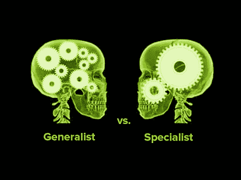

# 赞美多面手

> 原文：<https://medium.datadriveninvestor.com/in-praise-of-generalists-17f04bc4ade1?source=collection_archive---------37----------------------->

A bad representation of how different human brains work.

多面手名声不好。看看人们普遍认为的这句话就知道了:

“什么都懂的杰克什么都不懂。”

哎哟。很痛，不是吗？你可能*认为*你知道很多事情，但实际上你什么都不知道。现在，如果你知道原来的引用实际上是:

*“一个万事通什么都不精通，但往往比精通一门要好。”*

听起来没那么糟了，对吧？对于 17 世纪最初的赞美是如何以及何时变成贬义表达的，仍然有很多不同意见，但是很明显工业革命在其中扮演了重要的角色。

工业革命前所未有地奖励专业化。人们发现，一旦你把任务分成小步骤，人们可以被训练优化每一个步骤，因为他们一遍又一遍地重复。生产效率提高了，因此允许大规模工业化。专业化带来的生活水平的提高使得多面手成为多余的，他们可以完成过程中的每一步，但没有一个人像专业工人那样高效。随着多面手失业，分配给他们的报价也发生了变化。

现在，我认为是时候改变潮流了。为什么？因为机器学习。

机器学习(ML)从根本上说是始于工业革命的专业化趋势的顶点。让我们重温一下我上面写的短短几个句子:

*人们发现，一旦你把任务分成小步骤，人们可以被训练优化每一步，因为他们会一遍又一遍地重复。*

这听起来应该很熟悉。将一项任务分解成定义明确的步骤，并使用大量的训练数据来优化它，这实际上是机器学习的*工作方式*。ML 本质上让(一小部分)人意识到人类只是不够擅长专门化——计算机可以做得更好。

如果我们让[计算机查看来自 1000 类](https://arxiv.org/pdf/1502.01852.pdf)的 120 万张图像，那么它可以比人类更好地识别这些图像。

如果我们让[计算机下 490 万局围棋](https://deepmind.com/research/alphago/)，它可以轻松击败最优秀的人类棋手。

…例子还在继续。然而，ML 社区也发现，做一个多面手真的很难**。**

**有多难？我们还在*[试图](https://arxiv.org/pdf/1810.11910.pdf) 解决如何在不忘记第一个任务的情况下学习第二个任务，目前还没有根本性的突破。然而，对人类来说，我们每天都在学习新的任务，而且记住旧的任务并不困难。***

**我认为，这种差异至少是当前技术的基础。当前机器学习的方式是通过数据(无论是给定的还是自己生成的)进行学习，这是可能的最专业化的学习类型。计算机没有能力也不需要在数据之外概括它的学习，因此人类可以合理适应的任何小变化/新任务都会破坏机器。截至 2018 年，[将图片旋转 15 度](https://arxiv.org/pdf/1712.02779.pdf)足以打破最先进的图像分类器。对此，一个常见的辩护是“我们没有(足够的)旋转图像”。这听起来很合理，直到人们意识到添加数据的过程永远不会结束。小图像呢？偏心图像？部分模糊的图像？黑白图像？动画片？人类可以合理地适应所有这些，而不需要额外的数据。但是机器不能。这就是我们的优势所在。**

**在可预见的未来，ML 将慢慢蚕食高度专业化和重复性的功能——放射学诊断、报税、实时转录等。然而，那些有多个焦点、跨学科、没有明确目标的任务将会保留。因此，我建议采用以下方法进行未来验证:**

1.  **如果你已经在一个专门的职位上，拓展一下。想想还有什么跨学科的技能可以补充你目前的技能。这不仅能让你对冲未来的风险，而且在市场上越来越受欢迎。一位招聘经理告诉我，“我们更喜欢 80%是统计学家+ 80%是计算机科学家的人，而不是统计学家和计算机科学家”。这背后的原因是沟通效率。让专业人员 A 与不同领域的专业人员 B 交谈通常会导致沟通不畅，导致最终产品被误解/管理不当。**
2.  **如果你仍然不知道你应该做什么，思考和探索。走出去，找到一个技能组合(有很多人还没有想到！)你喜欢并认为有协同增效潜力。你探索得越多，你就越能为未来做好准备。[提醒:这句话并不意味着走极端]**

**我真的不在我应该写文章建议人们未来做什么的人生阶段，但我觉得有必要分享这一趋势，我相信很多人仍然幸福地没有意识到。要在有机器学习的世界里生存，我们应该再一次考虑成为多面手。**