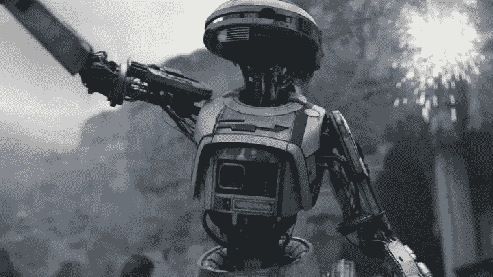

# 为了给“机器人”和“人类”下定义

> 原文：<https://medium.datadriveninvestor.com/in-pursuit-of-defining-robot-and-human-5575f7f2052d?source=collection_archive---------22----------------------->

*免责声明:你可以忽略文章中额外的东西，如“随机粉丝”或“旁注”，这些只是为了好玩，与我试图通过这些文章传达的中心信息没有严格的关系。*

# 首先，到底什么是“机器人学”或“机器人”?

J ehoshaphat！这不是一个简单的问题。这也许是一个哲学问题。“机器人”这个词没有一个通用的、包罗万象的定义。不信？好吧，你要去兜风了。该是思考的时候了！

在此之前，一个小的澄清:“机器人”从一个纯粹的技术角度来看，虽然是一个高度跨学科和广泛的领域，可以进行分类。概括地说，它可以分为以下几类:感知，定位，地图，路径规划，运动学，控制和估计；以及机器学习在这些领域的应用。这当然不是一个全面的分类，例如，3D 打印或机械设计和其他几个领域都可以包括在分类中。这将在后面的专门文章中详细讨论，并对每个领域进行简要解释。现在，让我们回到我们的定义。

首先根据牛津词典的定义:

> “机器人是一种能够自动完成一系列复杂动作的机器(具有确定功能的东西，它利用机械动力来完成任务)。”

似乎很简单。*或者是？*

想想上一次工业革命的 KUKA 机械手的例子(简单的重复拾取和放置——这只是运动学)。没有人可能否认这是一个机器人。那么，打印机或微波炉呢？这些机器人也是这样制造的，它们“自动”执行“复杂”的动作，你所做的只是发送一个简单的命令。在某些方面，烤箱可以被认为比机械手更“复杂”，那么这些设备也是机器人吗？我们可能下意识地把一个表格和机器人联系在一起，所以我们认为看起来像手臂的机械手是机器人，而打印机不是。

我们的这种看法来自好莱坞的反乌托邦科幻电影。将我们的理解建立在这样的虚构之上，并担心现在出现终结者式的起义**是荒谬的。解释这种恐惧传播者的担忧:“矩阵乘法将灭绝我们，应该被禁止。”正如 Andrew NG 所解释的那样，**

> **“如今担心邪恶的人工智能机器人就像担心火星上的人口过剩一样。你知道，有一天我们可能会到达火星，我们可能真的会人口过剩，那时我们就需要担心它了。但是今天，我们甚至还没有登上火星，所以我不知道如何有效地解决这个问题。”—安德鲁·吴**

****

**DeepFakes — Who said the camera never lies?**

**现在有其他更重要的人工智能风险处于危险之中，我们现在需要担心——假新闻，工作岗位转移，深度假货，钓鱼欺诈，但肯定不是存在性风险，我们离人工通用智能非常非常远(AGI)。当然，不可否认，这些也可能带来灾难性的后果。试想一下这种致命组合的含义——deep fakes+人工语音克隆——证据的性质，或者说现实本身不再客观。围绕这些特定应用的法规无疑是紧迫的，但对该定义的末日般的看法只会将人们的注意力从真正的问题上转移开。**

> **用于游戏的同一种 GPU 技术现在正威胁着大量就业机会，这是巧合吗？我不这么认为。这个世界正在以这样一种方式发展，我们可以通过摆脱这些糟糕的工作来整日整夜地玩游戏。**

**现在让我们来看看这个历史和字面上的定义，它最早是在 1921 年由卡雷尔·恰佩克**创作的戏剧*罗森的万能机器人(R.U.R)中使用的***:**

> **这个词来自捷克语，robota，意思是“强迫劳动”，来源于古老的捷克语，类似于古老的斯拉夫语 rabota 的“奴役”，来源于 rabu 的“奴隶”，…**

**R.U.R .里的机器人是生物工程——比《终结者》更像《西部世界》。*(前方 R.U.R 剧透！小心行事。让我们看看用机器人取代人类背后的哲学(记住，这是在 1921 年写的，但这与今天围绕人工智能发展的争论如此相似。) —***

> **“(因为这样的工业生产力)，R.U.R(公司)将生产如此多的玉米，如此多的布料，如此多的一切东西，这些东西将几乎没有价格。不会有贫穷。每个人都将摆脱忧虑，从劳动的堕落中解放出来。**
> 
> **人对人的奴役将会停止。当然，一开始可能会发生可怕的事情，但这是不可避免的……人应该是自由和至高无上的，他除了完善自己没有别的目标.."**

****

**L3–37 leading a robot rebellion in Solo: A Star Wars Story. It was heart-warming to see Lando romance with her, especially in her final moments — showing how humans and robots can co-exist.**

**在这一点上，机器人没有感情——它们感觉不到疼痛或爱，它们在非常具体的事情上聪明而高效，例如 AlphaGo 或今天的自动驾驶汽车——所以，也许不公平地对待它们是合理的。但这正是有趣的地方——人类工程师引入了更人性化的特征，特别是疼痛，并使他们更聪明——以使机器人在执行工业任务时避免犯错误。这时，机器人开始变得更加聪明(AGI)并发展情感(AGI？).然而，机器人仍然受到同样的对待，这最终导致他们之间的怨恨。是的，你可能已经猜到了，人类物种(除了一个科学家)被消灭了。这里要注意两件非常重要的事情:第一，他们从人类历史中得到线索，继续这场杀戮狂欢。机器人反叛组织的首领 Radius 对唯一幸存的人类 Alquist 说了以下的话**

> **“如果你想成为人类，屠杀和统治是必要的。读历史。”多么严重的烧伤。)**

**第二，是人类的不公平待遇最终导致了这种情况。请记住，在这一点上，机器人非常像人类，它们只是人类物种的另一个类别。那么，也许问题出在我们自己身上。**

> ****旁注:**然而，制造机器人的过程是一个秘密，为了确保他们物种的延续(他们甚至现在都不能生育)，机器人恳求阿尔奎斯特向他们揭示这个秘密，他必须通过解剖机器人来实验找出这个秘密。两个机器人海伦娜和普里默斯坠入爱河，不久，轮到海伦娜去解剖室时，普里默斯提出牺牲自己的生命。阿尔奎斯特被这种高尚的行为所敬畏，他说:“去吧，亚当。去吧，伊芙。世界是你的。”仅此而已。戏剧就在那里结束了。看，我是一个不懂得爱的怪人。除此之外，这结束得如此突然，以至于我可能没有足够的智慧把这些点联系起来。这种不尽如人意的故事结局触发了我内心的内爆时钟，所以如果你能理解这个结局实际上意味着什么，请随意讨论。**

**我们已经有了这样一类人——贱民。(注意:这里没有冒犯的意思，这就是“贱民”这个词的真正含义，即使在今天的印度，这也是一个可悲的现实。然而，看到[机器人取代他们的工作](https://scroll.in/article/869900/kerala-engineers-who-developed-robot-to-clean-manholes-are-on-a-mission-to-end-manual-scavenging)令人振奋。忽略上下文，再读一遍前面的句子。)是的，问题出在我们自己身上。因此,“机器人”一词并非用词不当，确切地说，字面上的定义是作为一个整体来反映人类的整体特征。随着 AGI 越来越近，仅仅因为 C/Fe 的区别而雇佣强迫劳动有多道德？**

**作为前面段落中分析的延伸，现在让我们考虑一下[图灵测试](https://en.wikipedia.org/wiki/Turing_test)。可以说，至少在一定程度上，有些机器人已经通过了测试。谷歌的 Duplex 最近让我们大吃一惊。社交机器人可能已经影响了你的思维。尽管你已经成为它的牺牲品，但你可能还没有意识到——当你阅读这篇文章时，人和机器人之间的界限变得越来越模糊。([我](https://en.wikipedia.org/wiki/Deep_Blue_versus_Garry_Kasparov) [找](http://www.slate.com/articles/technology/technology/2017/11/a_self_driving_car_that_kills_is_still_better_than_a_human_driver.html) [你](https://www.theverge.com/2018/5/8/17331250/automated-warehouses-jobs-ocado-andover-amazon) [缺](https://www.fastcompany.com/3062029/farm-robots-are-starting-to-take-some-human-jobs-and-thats-not-a-bad-thing)[信](https://www.theverge.com/2017/8/11/16137388/dota-2-dendi-open-ai-elon-musk) [扰](https://www.theguardian.com/technology/2017/dec/07/alphazero-google-deepmind-ai-beats-champion-program-teaching-itself-to-play-four-hours)))**

**因此，在定义机器人之前，我们应该先问一个更基本的问题:**

> **作为一个人意味着什么？你和有知觉的机器人有什么区别？**

**是肉和骨头吗？是智力能力吗？是感觉吗？是因为情绪吗？我们甚至不知道什么是情感、感觉，什么是真正的爱吗？**

**这是人类的终极追求，寻求这些问题的答案，并最终找出地球上最复杂的机制——大脑——40 亿年进化的体现。随着深度学习等技术的出现，我们已经在寻找答案。是的，未来是令人兴奋的！**

**在寻求实现这些技术(但哲学)壮举的过程中，我们将重新发现自己，并重新构建我们的社会、经济、司法和政治体系。通过利用人工智能的力量，我们[将](https://ai.xprize.org/AI-For-Good/sustainable-development-goals)结束这个世界上所有的痛苦，并确保它不会被滥用。这不是一厢情愿的想法，[这已经发生了](https://www.indiatoday.in/technology/news/story/google-deepmind-elon-musk-and-others-pledge-not-use-ai-to-make-lethal-weapons-1289187-2018-07-18)。在这个转变的过程中，我们将寻求作为一个人的真正意义，并学会拥抱这种生活。**

> **“在这神圣的现实中，在这神圣的体验中..**
> 
> **用这个熟悉的比喻旋转
> 旋转，编织每一次新的体验
> 把这当成神圣的礼物，庆祝这个活着和呼吸的机会
> 一个活着和呼吸的机会**
> 
> **这个抱着我的身体让我想起了我自己的死亡
> 拥抱这一刻，记住，我们是永恒的
> 所有这些痛苦都是幻觉”**
> 
> **詹姆斯·梅纳德·基南**

# **问题是:斯蒂芬·拜尔利是人还是机器人？**