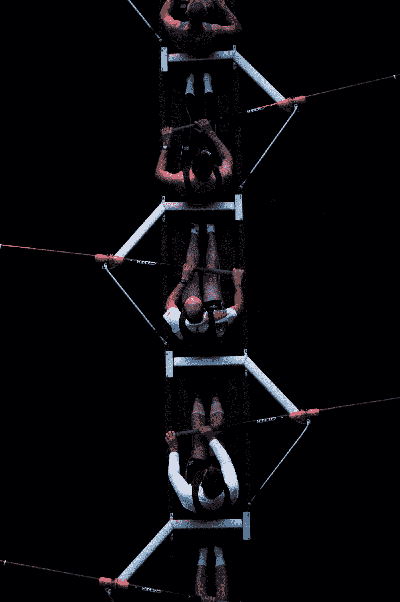

# 寻找团队精神

> 原文：<https://medium.datadriveninvestor.com/in-search-of-a-team-mindset-13751cc49251?source=collection_archive---------3----------------------->

> “走到一起是一个开始。保持在一起就是进步。合作就是成功。” *—* ***亨利·福特***

我们总是处于压力之下，接近最后期限，因为时间是我们最宝贵的资产。

当今世界发展迅速。对我们的要求越来越多。我们再拿一个球，试着用它慢跑。当我们觉得我们不能再应付他们的时候，我们邀请一个朋友加入，创建一个“团队”，用越来越多的球慢跑。直到有一天我们放弃了友谊。

 [## 动荡迫使暴风雨中的平静|数据驱动的投资者

### 自然界中很少有东西是直线行进的，尤其是经济。当投资者和消费者希望平静时…

www.datadriveninvestor.com](https://www.datadriveninvestor.com/2019/03/25/volatility-compels-calm-amid-the-storm/) 

这不是一个团队…这是**社会自杀**。

## 寻找团队精神

团队不是一群人…

Photo by [Shane Rounce](https://unsplash.com/@shanerounce?utm_source=unsplash&utm_medium=referral&utm_content=creditCopyText) on [Unsplash](https://unsplash.com/search/photos/team?utm_source=unsplash&utm_medium=referral&utm_content=creditCopyText)

*   在同一个地方完成分散的任务。
*   成员们互相竞争。
*   没有目标的地方。
*   期限不存在或经常错过的地方。
*   没有交流和互动的地方。
*   那里没有努力、意图和善意。
*   没有错误的地方。
*   在那里人们不关心他人。
*   一家公司。
*   在那里决策被毫无疑问地执行。
*   自我在那里发挥和展示
*   每个成员都有自己的观点和想法
*   那更喜欢“ ***独自工作*** ”
*   哪里有“ ***摇滚明星*** ”那样处理一切

团队是一群人…

Photo by [Josh Calabrese](https://unsplash.com/@joshcala?utm_source=unsplash&utm_medium=referral&utm_content=creditCopyText) on [Unsplash](https://unsplash.com/search/photos/team?utm_source=unsplash&utm_medium=referral&utm_content=creditCopyText)

*   每个成员都为了一个明确的目标而与他人合作
*   每个人都努力与其他团队竞争。
*   目标经常被监督和实现
*   在最后期限前完成。如果由于各种原因无法实现，团队将提出更好的 B 计划来交付成果。
*   人们互相关心。
*   错误得到处理，每个人都从中吸取教训，而不会惩罚在错误方向上走得更远的成员。
*   在那里，自我被放在一边
*   人们被一个单一的愿景所驱使

就像*法沙德阿斯尔说的那样“* ***要快，要第一，但永远不要孤独。没有什么可以取代团队合作的价值。”***

> 在你的工作中，你是团队的一部分，还是仅仅是一个团体的一部分？
> 
> 你在真正的团队中工作过吗？感觉如何？

# 轮到你了

通过这个名为“**Minutes mind，”**的系列文章，我正在帮助你建立一个稳固的心态，写下我对我们日常生活中遇到的不同主题的观点。我坚信，一旦我们能够理解一个主题，我们就可以接受这个想法或者完全拒绝它。这两种方式都在帮助我们成长和发展我们自己看待世界的方式。

***如果你喜欢我的作品，在上面拍手，分享给你的朋友，关注我。***

最终，一切都从我们开始，从我们的思想，我们的自我，甚至我们的故事开始。我们可以选择行动或者[而不是](https://medium.com/@aurelianvictorcotuna/you-have-no-chance-485873b2118a?source=post_page---------------------------)。

如果你的健身教练可以帮助你在健身房健身，我会帮助你获得健康的心态。下面我们连线[媒](https://medium.com/@aurelianvictorcotuna?source=post_page---------------------------)、 [Linkedin](https://www.linkedin.com/in/aurelian-victor-cotuna-a0a0a553/?source=post_page---------------------------) 、 [Twitter](https://twitter.com/@aureliancotuna?source=post_page---------------------------) 分享一些我 **deas**