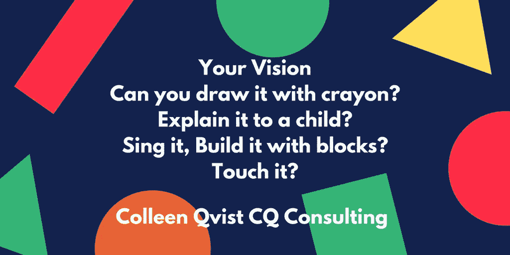
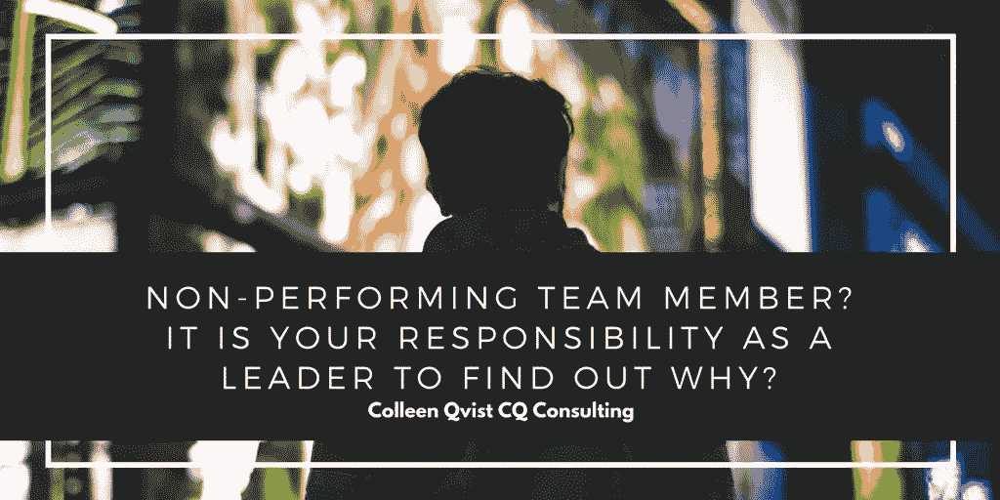

# 在团队合作中，我占优势

> 原文：<https://medium.datadriveninvestor.com/in-teamwork-the-is-have-it-c325c8a7c8fd?source=collection_archive---------2----------------------->

## 一群人一起工作来实现有意义的目标

“Teams are successful when they understand the individuals in the team.” — Colleen Qvist

“单独来说，我们是一滴水。我们是一片海洋。”

在她流畅的描述中，[科琳·奎斯特](https://twitter.com/ColleenQvist)抓住了商业中团队合作的精髓。这位生活教练、商业教练、演讲者和主持人与数字营销专家[班卓·莱坎](https://twitter.com/IamBanjoLekan)一起评估合作如何成就成功。

作为一个团队，每个人都有共同的愿景和目标以及实现它们的愿望。

“团队合作是一群人——或动物——发挥他们的个人优势，朝着对他们所有人都有意义的目标努力，”奎斯特说。“越来越多的人想要‘意义’。”"

 [## 如何管理优秀的团队和你自己

### 将合适的人放在合适的岗位上才能成功

medium.com](https://medium.com/datadriveninvestor/how-to-manage-great-teams-and-yourself-8e00bd56abb6) 

有效的团队建立在对彼此性格和能力的信任之上。自我被留在门口，因为每个人都为了更大的利益而齐心协力。

“这些团队有有效的沟通，”勒坎说。"他们专注于目标，有条理，能带来结果，有良好的领导能力，玩得开心."

奎斯特列举了高效团队的一系列品质:

*   视野清晰
*   热情参与的领导
*   接受不同的优势和角色
*   规划*和*实施
*   信任
*   乐趣
*   许多“我”组成一个*我们*
*   沟通

# 从计划开始

一家初创公司需要专注于其战略计划，包括其使命和愿景。这些必须与了解他们的角色以获得成功的参与者同步，加上企业家的灵活性，以利用每个人的技能。

“创业公司通常很少有人需要身兼数职，”奎斯特说。“他们必须理解主人的眼光。他们是创始人额外的胳膊和腿。

“团队有不同的优势和经验，”她说。“成员可能并不总是被创业公司雇佣。一个团队允许冒险而不是孤独。”

 [## 创业成功靠的是坚持，而不是奇迹

### 网络帮助你创造一个支持的地球村

medium.com](https://medium.com/datadriveninvestor/startups-succeed-through-persistence-not-miracles-e6344a6df414) 

勒坎解释了一切都取决于团队。

“在一个新的组织中，团队的重要性怎么强调都不为过，”他说。“这很明显。

“一个富有创造力和责任心的团队会给你带来成果和更多产出，”勒坎说。"这样，每个创业公司的成长都取决于其团队的效率."

# 变得更强

为了最大化组织中每个团队成员的力量，你需要了解每个人的优势和劣势。

这要从沟通开始。了解每个人的动力。了解他们的天赋和痛点。与他们交谈，倾听他们的需求和愿望。

奎斯特提供了几种最大化优势的方法:

*   在多样性中拥抱“不同”。
*   创造一个允许不同观点和方法存在的环境——包容性。
*   与你的员工交谈，倾听他们的心声——了解他们。
*   创造学习环境——发挥优势。
*   进行有同理心和生殖力的公开交流。它创造了。
*   理解平等不等同。

 [## 良好的一致性将你的价值观放在首位

### 核心价值观需要与员工相关并反映员工

medium.com](https://medium.com/datadriveninvestor/good-alignment-puts-your-values-top-of-mind-88bab188f6d8) 

团队领导应该在招聘过程中阐明公司的愿景，偶尔在大楼里和社交媒体上发帖，最重要的是，实践它。

相信你的愿景，说出它并付诸行动。

奎斯特说:“把它保存在你的人民心中。”“你得到你的视力了吗？你越清晰，越有激情，越有领导能力，越有沟通能力，你的团队就越会看到*哇*并相信它。

“或者，他们看到黑暗和泥泞，”她说。"我们不为泥巴种工作。"

如果你让他们的目光因行话而呆滞，你会很快失去一个团队。

“我不喜欢古板和正统，”奎斯特说。“MBA 语言、商业术语和没人理解的重要文件都放在最下面的抽屉里。这是排除他人的最快方法。

“与其这样，不如把视觉想象成蜡笔画，”她说。“能够不用行话对孩子说。唱吧。用积木搭建。确保你的视觉是活的，有呼吸的，每个人都能触摸到的。”

# 实现愿景

勒坎认可了活生生的事实。

“我喜欢‘领导者应该活在愿景中’，”他说。“团队领导不仅要向团队成员传达品牌的目标，这一点非常重要。他们也应该活出品牌的愿景。非常关键。

“确保每个成员都能背诵品牌的使命和愿景是每个团队领导的*必须*，”勒坎说。“当他们理解了品牌的信息，他们就不会有太多推销品牌的打嗝。”

当个体压倒群体时，这样的分裂就会发生。同时，不要忽视个人。

“在‘我们’中有很多‘我’，”勒坎说。“了解团队中的不同个体，让品牌的累积增长变得清晰和真实。”

团队领导必须与团队成员进行良好的沟通，包括积极倾听和观察。

保持反馈——以及良好的文档记录——将消除意外，并支持领导者需要采取的任何人事行动。

 [## 商务攀登者拥抱他们的夏尔巴人

### 教练让人们和团队更上一层楼

medium.com](https://medium.com/datadriveninvestor/business-climbers-hug-their-sherpas-ab2f431041e) 

“如果你有一个表现不佳的团队成员，找出原因，”奎斯特说。“和会员一起坐下来倾听。

“到地里去，”她说。“是训练缺失吗？*为什么是*？如果没有参与，[辅导和训练](https://medium.com/@JKatzaman/help-others-and-create-your-best-self-e1d994549308) —如果需要，从外部进行。压力水平如何？”

只有作为最后的手段，终止雇用表现不佳者。这是太多领导者失败的地方。

“许多人希望先终止妊娠，”奎斯特说。“当团队相互理解时，他们就是成功的。作为领导，你必须知道事实。”

**关于作者**

吉姆·卡扎曼是[拉戈金融服务公司](http://largofinancialservices.com)的经理，曾在空军和联邦政府的公共事务部门工作。你可以在[推特](https://twitter.com/JKatzaman)、[脸书](https://www.facebook.com/jim.katzaman)和 [LinkedIn](https://www.linkedin.com/in/jim-katzaman-33641b21/) 上和他联系。